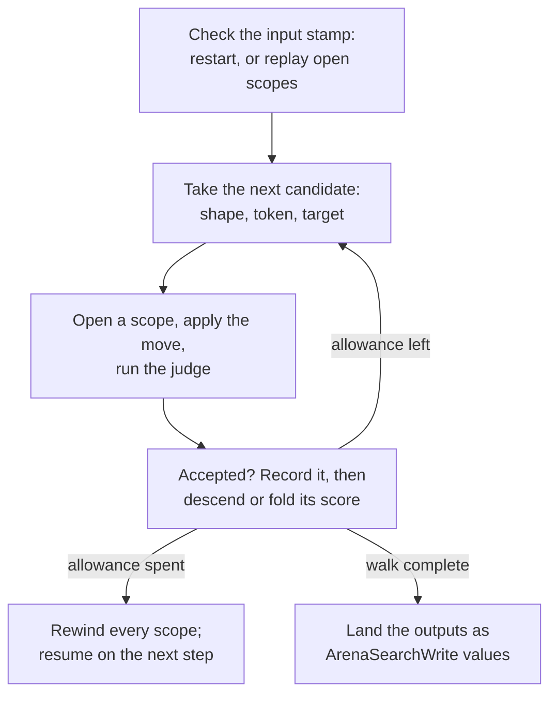

# Search

A **search job** asks your own rules to judge positions that haven't happened
yet. It can list every legal move for every piece, count them, paint the cells
one piece could reach, or pick the move that looks best a few turns ahead. This
article explains how a job walks its candidates, what it produces, how it
compares futures, and how it stays deterministic and within a work budget. It's
for authors who add a `search` section to a world and for host developers who
run `Puck.State.Search` directly.

## A first search job

The running example is a two-piece race around a ring of twelve cells. The
keyed row `pieceCell` says where each piece stands, `turn` says whose move it
is, and the judge rules decide whether a move is legal. The fragment below is a
complete world document that compiles and validates with
`puck compile race-search.puck --validate`.

```puck
schema: "puck.world.definition.v1"
documentId: "race-search"

state {
  lattices [
    ring(name: "track", origin: [0, 0, 0], cellSize: 1, width: 12)
  ]

  world {
    row {
      name: "board"
      kind: "Int"
      domain: cellsOf(topology: track)
    }

    table pieceCell bounds(-1..11) {
      red = 0
      blue = 6
    }

    table lastCell bounds(-1..11) {
      red = 0
      blue = 6
    }

    slot turn = 0 bounds(0..1)
    slot verdict = 0 bounds(0..1)
    slot aiEnabled = 0 bounds(0..1)
    slot aiRevision = 0 bounds(0..1000000)

    table aiBest {
      token = -1
      to = -1
      score = 0
      revision = -1
    }

    row {
      name: "legal"
      kind: "Int"
      domain: keysOf(row: pieceCell)
    }
  }
}

// The judge: a piece may step one to three cells forward, on its own side's turn.
rule "race-judge-red" {
  when pieceCell[red] != lastCell[red]
  mode: Edge
  verdict = (turn == 0) & ((pieceCell[red] - lastCell[red] + 12) % 12 >= 1) & ((pieceCell[red] - lastCell[red] + 12) % 12 <= 3)
  turn = 1 - turn
}

rule "race-judge-blue" {
  when pieceCell[blue] != lastCell[blue]
  mode: Edge
  verdict = (turn == 1) & ((pieceCell[blue] - lastCell[blue] + 12) % 12 >= 1) & ((pieceCell[blue] - lastCell[blue] + 12) % 12 <= 3)
  turn = 1 - turn
}

rule "race-remember" {
  when pieceCell[red] != lastCell[red] or pieceCell[blue] != lastCell[blue]
  mode: Edge
  setState(state: lastCell, key: red, fromState: pieceCell, fromKey: red)
  setState(state: lastCell, key: blue, fromState: pieceCell, fromKey: blue)
}

search {
  jobs [
    {
      name: "raceAI"
      tokens: pieceCell
      board: board
      turn: turn
      verdict: verdict
      enabled: aiEnabled
      revision: aiRevision
      legal: legal
      best: aiBest
      depth: 2
      "score": (turn == 1) ? pieceCell[red] - pieceCell[blue] : pieceCell[blue] - pieceCell[red]
    }
  ]
}
```

While `aiEnabled` is 1, the job works like this:

1. It takes each piece in `pieceCell` in turn and tries moving it to every
   other cell of `board`. That's the default candidate shape, `relocate`.
2. For each try, it writes the move into the arena inside a journal scope, runs
   the judge rules, and reads `verdict` and `turn` back.
3. The move counts as legal when `verdict` reads 1 and `turn` changed. The
   job sets that cell's bit in the piece's `legal` mask.
4. Because `depth` is 2, each legal move is also answered by every legal
   reply, and `score` is read after the reply. The job picks the move whose
   worst-case reply is best for the side that moved.
5. It rewinds every scope, so nothing it tried stays in the arena.
6. When the walk is complete, which may take several ticks, it writes `legal`
   and `aiBest` (`token`, `to`, `score`, and `revision`) as ordinary state
   writes.

The score is read from the perspective of the side that just moved. After red
moves, `turn` is 1, so the expression reads red's lead over blue.

A `.puck` source writes `score` as an expression, like every other expression.
The compiled document stores it the way it stores all of them, as the
program's `{ "instructions": [...] }` list, and a document that carries the
score as text is refused by name when it loads.

## What a candidate is

A **candidate** is one proposed change: a shape, a token, and a target cell or
direction. The walk visits candidates in a fixed order: shape first, in
declared order, then token in the tokens row's own cell order, then target.

Each candidate is a journal scope on the arena, so the job never copies the
position. `ArenaSearchCandidate.Begin` opens the scope, the candidate's move and
the judge's writes land inside it, and `Rewind` restores every column the scope
wrote. A ply below the root is one more scope left open on the same arena, so
the deeper position is the arena itself. Scopes nest and close innermost first.
How a scope records and rewinds its writes is covered in
[The state arena](arena.md#evaluate-a-candidate).

One step of a job walks candidates like this:



A step first decides whether the job's inputs changed. If they did, the job
restarts; if not, it reopens the scopes it held when the last step ended by
applying and judging those candidates again. Then it takes candidates in order,
judges each inside its own scope, and records the accepted ones. A candidate
that leads deeper stays open as the next ply's position; one that's finished is
rewound and its value folded into its parent. When the step's allowance runs
out, every scope is rewound and the cursors are kept for the next step. When the
walk is complete, the job lands its outputs. The sections below describe each of
these parts.

> [!IMPORTANT]
> A candidate is accepted only when the verdict slot reads the plan's `Accept`
> value **and** the turn slot differs from the value it held before the
> candidate. A piece that moved while `turn` stayed put isn't a legal move,
> whatever `verdict` says. Write your judge so an accepted move always hands
> over the turn.

A shape can also discard a candidate before any scope opens: an occupied
landing, an empty cell where a jump needs a piece to jump over, a companion
that would leave the board, or a relocate onto the token's own cell. The walk
charges a small inspection price for each of these and moves on without
running the judge.

## Choose the candidate shapes

A job declares one or more shapes. Without any, it uses `relocate` with
`displace: true`.

| Shape | `.puck` spelling | What one candidate does |
|---|---|---|
| Relocate | `relocate(displace: true)` | Moves the token onto any other cell. With `displace: true` the token standing there leaves the board; with `false` both stay and your judge decides. |
| Drop | `drop()` | Puts a token that is off the board onto an empty cell. It's the only shape that walks off-board tokens. |
| Jump | `jump(over: ["N", "E"], maxHops: 1)` | Steps two cells along a direction, over an occupied cell onto an empty one. The jumped token leaves the board. With `maxHops` above 1, one candidate is a whole chain of 1 to `maxHops` hops that never revisits a cell and evicts nothing. `["any"]` tries every direction the topology declares. |
| Promote | `promote(codes: pieceCode, to: [5, 4])` | Relocates the token, evicting the occupant, and changes its code in the `codes` row to each offered value in turn: one candidate per cell and code. |
| Tandem | `tandem(with: "rookA")` | Relocates the token and moves a fixed companion by the same lattice translation, when the companion's destination is empty. |
| Transfer | `transfer(selector: last, insertFirst: false)` | Moves a token standing at the chosen end of one ordered zone onto another of the job's zones. |

A job runs over either a board or a set of zones:

- A **board job** names `tokens` and `board`. A token whose value isn't a cell
  of the board is off the board. The tokens row's declared `min` must not be a
  cell, so that "off the board" has a value.
- A **zone job** names `zones` instead of `board`: two or more ordered
  `keysOf` rows over the token domain. The zones are the job's cells, the only
  shape is `transfer`, and the job authors its own `turn` and `verdict`.

The shape only proposes a change. Your judge rules decide whether it's legal,
so a geometric move can be tried and rejected without ever becoming a real
move. Field detail for each shape, including which topologies support `tandem`
and the refusals, is in the
[world schema guide](../../../src/Puck.World.Schema/README.md#the-search-sectionwhat-the-board-would-be).

## Read what a job produces

A finished job writes its outputs as ordinary state. Every output row is
optional.

| Output | Row shape | What it receives |
|---|---|---|
| `legal` | Int row keyed by the tokens | One bitmask per token of the cells it may reach. The board or zone set must have at most 64 cells (`BoardMask.MaxCells`). |
| `counts` | Int row keyed by the tokens | How many candidates each token had accepted. Works for any board size. |
| `reach` with `held` | Int board over the job's topology, plus an Int slot | The board is cleared, then painted with 1 at every cell the token named by `held` may reach. `held` holds the token's position in the tokens row. A value out of range paints nothing. Works for any board size. |
| `best` | Keyed Int row with `token`, `to`, `score` (and `revision`) | The chosen move: the token's position in the tokens row, its destination cell, and its score. |

The root walk never prunes and never skips a valid candidate, so `legal`,
`counts`, and `reach` are the same whether or not you ask for a score or a
deeper search.

The runtime lands those outputs as a list of `ArenaSearchWrite` values:
`ArenaSearchWrite.Cell` sets one cell by row ordinal and interned key, and
`ArenaSearchWrite.ClearBoard` clears a whole board row before a sparse repaint.
The runtime never writes the arena itself. The host installs the list through
its own validated mutation path. If that path refuses the writes, the job
narrates the refusal on the `state.search` channel and still counts as done: it
won't search or land again until its inputs change. If the install path throws
instead, the job stays unlanded and hands the same answer over on the next
step.

## Compare futures

Without a score, a job only enumerates. With one, it compares plies. A **ply**
is one move deeper into the future.

| Method | How it chooses | Good for |
|---|---|---|
| Enumeration (no score) | Visits every root candidate and records the accepted ones. | "Which moves are legal?" |
| Negamax with `score` | Two-sided: each reply is negated, so an opponent's gain is the mover's loss. | Two-player, zero-sum games. |
| Negamax with `scores` (max-n) | Each ply maximizes the moving seat's own entry in a per-seat row. | Games with three or more seats. |
| Monte Carlo tree search (`method: MonteCarlo`) | UCB1 selection with seeded playouts; lands the most-visited root move. | Games whose score only means something at the end. |

A score or `scores` row is required when `depth` is above 1, when you author
`best`, or when you choose the MonteCarlo method.

### Negamax

**Negamax** searches to a depth and backs up values, negating at each level
because the value always belongs to the side that just moved. The job uses
**iterative deepening**: it completes a pass at depth 1, then depth 2, and so
on up to `depth`, so the answer in `best` is always from the deepest completed
pass. **Alpha-beta pruning** skips replies that can't change the choice, at
every ply below the root. A position where no candidate is accepted scores
`-SearchCapacity.MateScore` for the side to move.

A scored negamax job keeps a **transposition table**: a cache of values for
positions reached along more than one path. The table has 8,192 entries per job,
cleared on every restart. A position's key folds:

- every row the plan names (tokens, turn, verdict, zones, codes, scores, and
  the chance row) and every row the judge rules read or write, plus the rows
  the score reads;
- the arena's retained key ledger and its byte total, since those decide
  whether a judge can mint a new cell;
- the tick pair, when the job is time-sensitive (see
  [Keep work and progress deterministic](#keep-work-and-progress-deterministic));
- the move ply, the value a judge reads through `$search:ply`.

Two positions that differ only in rows outside that set share a key, since
nothing the job reads can tell them apart. Because the move ply is part of the
key, the same stored position reached at a different depth is a different cache
entry. A chance draw doesn't advance the move ply. Pool rows count too: a rule
that claims or releases a pool instance contributes the pool's live,
generation, and field rows to the judge's dataflow, so a reclaimed slot is a
different position even when its fields hold the same defaults.

### Max-n with per-seat scores

Author `scores` instead of `score` for a game with more than two seats. It's a
keyed Int row with one cell per seat, in the turn row's ordinal order, holding
each seat's current score. Each ply maximizes the moving seat's own entry and
never negates a reply, because one seat's gain isn't assumed to be another's
loss. A max-n job searches the full window without pruning on another seat's
bound and keeps no transposition table. `best.score` holds the root mover's own
value. The Chinese checkers world in `worlds/parlor/` is a shipped example.

### Monte Carlo tree search

`method: MonteCarlo` runs **UCB1** tree search after the root walk has produced its
outputs. UCB1 picks the child with the best balance of average result and how
rarely it's been tried. Each of `iterations` rounds (a world job defaults to
256, and the most is 65,536) does this:

1. Selects down the tree by UCB1, trying any unvisited child first, through
   nodes that may hold no further child.
2. Grows the first node on the path that may still take a child. The node scans
   its own candidates from a start drawn when the node was made, judging them
   one at a time until one is accepted, and keeps that one as its newest child
   in a pool of at most 8,192 nodes. A node holds at most one child more than
   the integer square root of its visits (**progressive widening**), so a
   position with hundreds of candidates grows its children as it is visited.
3. Plays out from the new child by drawing candidates from the job's own
   **SplitMix64** stream (a small, fast, deterministic pseudo-random sequence)
   until no candidate is accepted or the depth cap is reached.
4. Reads the score from the side that just moved and folds it back along the
   path, flipping sign at each level.

One iteration therefore judges a handful of candidates, never a whole board,
and grows at most one node. Once the pool is full, no node grows: selection
still descends, and an iteration that stops at a node with no children plays
out from where it stands. A node whose every candidate was scanned and refused
is a terminal for the side to move.

The job lands the most-visited root move in `best`, with that child's mean
score, the eldest child among equals. Each playout samples one possible future,
so the landed move is the one the iterations favored most, which may not be
the optimal move.

## Account for chance

A **chance node** replaces one ply's move choice with a weighted average over
possible random outcomes. In the backgammon world, two dice are the chance
row:

```puck
chance {
  row: dice
  atDepth: 1
}
```

Every cell of the chance row must carry a `draw` facet naming a `uniformRange`
or `weightedNumeric` generator. The document compiler bakes the cross product
of the cells' domains into a `SearchChancePlan` before the search runs: two
six-sided dice bake 36 outcomes, and the limit is 256
(`SearchCapacity.MaxChanceOutcomes`). The runtime reads that table as data and
never calls a live generator.

- Negamax computes the exact weighted average over every outcome, rounding
  half away from zero. The sum is held in 128 bits, so it can't overflow.
- Tree search samples one outcome per playout from the job's stream.

> [!NOTE]
> `atDepth` means two different things. For negamax it's the absolute ply,
> where 0 is the root: a chance node at 0 replaces the root's own move choice,
> and the job's one pass then searches the plan's whole depth beneath it. For
> tree search it's the 1-based playout ply at which the playout draws instead of
> choosing. Choose the value with the method in mind.

A chance node needs a score, must sit inside the searched depth, and can't be
combined with per-seat `scores`.

## Apply an answer safely

A search writes its answer into state and changes nothing else. Your own rules
read that answer and make the move. Two optional slots help those rules apply
an answer only when it still fits the position.

- **`enabled`** names an Int slot. While it reads 0, the job does no candidate
  work. Setting it back to a nonzero value resumes against the current inputs.
  Disabling a job doesn't erase its previous outputs, so your apply rule must
  check the enable condition too.
- **`revision`** names an Int slot and requires `best` to declare a `revision`
  cell. The job copies the input revision into `best.revision` with the
  completed answer. Increase the revision whenever you accept a new position,
  and apply an answer only while `best.revision` equals the current revision.

The chess world applies its answer this way: `chess-ai-request` fires only when
`aiEnabled` is 1, `aiBest[revision] == aiRevision`, and the physics has settled.

### Finish compound moves with `$search:ply`

A judge rule can read `$search:ply` (spelled `search(ply)` in `.puck`). It
reads 0 on the live host and the candidate's depth on the search host, where
the root's candidates read 1. This lets a judge finish compound moves inside
the candidate: chess moves the rook for castling and removes the pawn taken en
passant only when `search(ply) > 0`, before its legality rules run. Those
writes stay inside the candidate scope and are rewound with it.

Reading `$search:ply` marks a rule volatile, so the rule scheduler never
reuses its closed verdict (see [Rule analysis, scheduling, and work budgets](analysis.md)).

## Keep work and progress deterministic

A search doesn't hold up a tick. Each step spends a bounded amount of work,
suspends, and resumes on a later step, and nothing in it reads wall-clock time.

### Work is priced in units

`SearchWork` prices every indivisible unit of the walk in the same heuristic
work units the rule budget uses, and carries the step's **allowance**.

| Unit | What it covers |
|---|---|
| `Cursor` (1) | A cursor move that inspects no candidate. |
| `Inspect` | A candidate resolved from the position and refused before a scope opens. |
| `Candidate` | A candidate resolved, applied, judged, scored, keyed, and folded. |
| `Outcome` | One chance outcome applied and, at the frontier, scored. |
| `TreeStep` | One tree-search step in its costliest phase. |
| `Restart` | Discarding progress and reading the tokens again. |
| `Replay(scopes)` | Reopening a suspended job's open scopes: `scopes × Candidate`. |

Before running any unit, the walk reserves the costliest one (`SearchWork.Unit`)
and yields when the remaining allowance can't cover it, so a step never
spends past its allowance. A plan's `Nodes` value separately caps how many candidates one step
judges. A restart and a replay come out of the same allowance.

`ArenaSearch.Rebuild` refuses a plan whose allowance can't cover a restart, a
full replay, and one unit (`SearchWork.Minimum`), and names the sum it needs.
Such a job would otherwise stop making progress the first time its scopes ran
that deep.

In Puck.World, the document compiler derives these prices. It takes what
`RuleCapacity.MaxWorkUnitsPerTick` leaves after the rules' own work sheet, subtracts
one fold of every row (the stamp below), and divides the rest equally among
the jobs. A job doesn't borrow another's remainder, and unspent allowance
doesn't carry to the next step. One judge run is priced by the same work sheet
the tick budget uses, over the job's scoped judge rules. `nodes` defaults to
4,096 (`SearchCapacity.MaxNodesPerTick`) and may only lower that.

### Restarts and time

At the start of each step, the runtime folds the content of every row except
the installed jobs' outputs into a **stamp**, together with the arena's key
ledger and byte total. Row versions let it skip the fold when nothing moved,
but the stamp itself is a hash of content. When the stamp differs from the one a
job was computed against, the job restarts. So a write that stores the value a
cell already held, or a scope that was written and rewound, doesn't restart
anything. A job's own landing doesn't restart it, because outputs are excluded.

A job is **time-sensitive** when its judge rules or score read `$tick`
(`IArenaSearchJudge.ReadsTick`), or when any row its position key covers has a
value-over-time trait. A time-sensitive job folds the simulation tick and engine
tick into its stamp and its position keys, and restarts when either changes.
Every other job keeps its progress across ticks, so an ordinary search doesn't
start over when only the clock has advanced.

### Counting what a search did

`ArenaSearch` reports its work through `IWorkCounterSource`, as the source
`state.search`, under the `SearchWorkKinds` kinds: the candidates it judged (`state.search.candidates`),
the tree nodes it grew (`state.search.expansions`), and the playout plies its
playouts kept (`state.search.playout-plies`). The counts are monotonic over the
search's life and are not simulation state: a law reads them as a difference
across the work it measures. `ArenaSearchStatus.TreeNodes` reports how much of
the pool a MonteCarlo job's tree holds.

### Progress is simulation state

A job's cursors, open scopes, deepening pass, transposition table, tree, and
draw-stream position are simulation state. `ArenaSearch.AppendStateHash` folds
them into the state hash, and `ArenaSearch.Capture` and `TryRestore` carry them
through a checkpoint.

An `ArenaSearchCheckpoint` names each open scope by the candidate that opened
it (`ArenaSearchScopeCheckpoint`: shape, token, target). It holds no copy of the
columns the scope wrote. A restore reopens each scope by resolving, applying, and
judging that candidate again. `TryRestore` checks the whole checkpoint against
the installed job set first and refuses it whole, leaving every job untouched,
when a job name, count, or shape doesn't match.

Every scope a step opens is rewound before `Step` returns, so the arena you read
between steps is byte-for-byte what it was before. That holds when a judge, a
score, or the arena throws, too: the step rewinds, and the interrupted job
restarts on its next step.

## What a scoped judge can evaluate

A candidate runs your rules through an `ArenaSearchEffectHost`, an arena host
that advertises no facets. This table shows what that means for common rule
behavior.

| A rule that… | Inside a candidate |
|---|---|
| Reads and writes an existing numeric cell | Works. The arena is the same store the live state lives in. |
| Moves a token that feeds an inverse board | Works. The arena recomputes the two board cells the token left and entered. A membership change rebuilds the boards it feeds. |
| Moves members between ordered zones | Works, against the arena's current membership. |
| Claims or releases a pool instance | Works. The claim is journaled and rewound with the scope. |
| Consumes a generator draw | Runs through the arena host's draw path and is rewound with the scope. The search host is constructed with the live host's site table, so a candidate's draw is the draw the live host would make at the same cursor. Use a chance node when a search should weigh every outcome rather than the one the stream holds next. |
| Reads a host-only operand (a body, a region, quiescence) | Refused at admission. The rule names a facet the search host doesn't serve. |
| Fires a registered effect through a facet | Refused at admission, for the same reason. |
| Fires an irreversible arm that names no facet (it reaches the host through `IEffectHost.Fire`) | Queued and dropped. The host counts it (`DiscardedArms`) and does nothing outward, because the candidate is rewound. |
| Uses `rewindGroup` | Refused at admission. A retained turn needs a settled authoritative turn boundary. |

**Admission** happens once, when a job set is installed through
`ArenaSearch.Rebuild`, and no candidate asks again. `RuleArenaSearchJudge.TryAdmit`
asks `RuleNeeds.Admit` about every judge rule, which refuses the first facet the
host doesn't advertise and names it. A judge that depends on a refused behavior
can't show that a move would succeed on the real host, and admission reports
that when the job is installed instead of partway through a tick.

In Puck.World, the judge rules are chosen before admission.
`WorldSearchCompilation.JudgeRules` keeps every rule that isn't an interaction
or a decision and names no facet, then narrows that set to the rules that can
reach the job:

1. It starts from the rows the job names and the rows its score reads. Reaching
   a derived board also reaches its inverse `tokens` and `codes` rows.
2. It keeps every rule that writes one of those rows (or writes a row it can't
   resolve, which could land anywhere), and adds the rows that rule reads and
   iterates.
3. It repeats until nothing more joins.

A rule outside that closure writes nothing the job can observe, so dropping it
changes no answer. In a world that imports several games, one game's search
pays for that game's rules alone.

## Run a search from C#

A host that isn't Puck.World builds the same pieces by hand. This fragment
assumes a section with an Int keyed row `pieceCell`, Int slots `turn` and
`verdict`, and an Int keyed row `legal` keyed like `pieceCell`, already loaded
into `arena` with a `RuleCompileContext` named `context`. Its one judge rule
accepts every candidate and passes the turn; a real judge checks the move.

```csharp
using Puck.State;
using Puck.State.Rules;

var judgeRule = new Rule(
    Name: CellName.Parse(candidate: "accept"),
    Effects: [
        new ActionEffect.SetState(State: "verdict", Value: 1m),
        new ActionEffect.SetState(State: "turn", Expression: ExpressionProgram.Parse(text: "1 - turn")),
    ]);
var judge = new RuleArenaSearchJudge(
    host: new ArenaSearchEffectHost(arena: arena),
    rules: [RuleCompiler.Compile(rule: judgeRule, context: context)]);

var plan = new SearchPlan(
    Name: "moves", Tokens: "pieceCell", Topology: null, Zones: [], CellCount: 12,
    Turn: "turn", Verdict: "verdict", Off: -1L, Nodes: 64,
    Work: SearchWork.NodeBounded(judge: 1L), Depth: 1, Best: null,
    Shapes: [new SearchShapePlan(Kind: SearchShapeKind.Relocate, Displace: false, Directions: [], CompanionIndex: -1)],
    Legal: "legal");

if (!ArenaSearchPlan.TryResolve(plan: plan, catalog: arena.Catalog, resolved: out var resolved, reason: out var reason)) {
    throw new InvalidOperationException(message: reason);
}

var search = new ArenaSearch(arena: arena);

if (!search.Rebuild(plans: [resolved], judges: [judge], reason: out reason)) {
    throw new InvalidOperationException(message: reason);
}

for (var tick = 1UL; !search.Status(index: 0).Done; tick++) {
    _ = search.Step(tick: tick, engineTick: tick, apply: writes => {
        foreach (var write in writes) {
            if ((write is ArenaSearchWrite.Cell cell) &&
                !arena.TryWrite(rowOrdinal: cell.RowOrdinal, key: cell.Key, operand: cell.Value, write: StateWriteKind.Set, reason: out _)) {
                return false;
            }
        }

        return true;
    });
}
```

The steps are:

1. `SearchPlan` refers to every row by its name. `SearchWork.NodeBounded` prices a
   candidate at one judge run and sets an allowance that never binds, so only
   `Nodes` bounds a step.
2. `ArenaSearchPlan.TryResolve` turns names into catalog ordinals and refuses a
   plan that names an undeclared row or a generated pool storage row. It also
   refuses `scores` beside a score, `scores` with the MonteCarlo method, and a jump or
   tandem shape on a job with no board. Its optional `drawSeed` argument seeds a
   MonteCarlo job's playout stream.
3. `ArenaSearch.Rebuild` checks rows, judge arena, score availability, the
   `best` keys, admission, and the work minimum, then installs the job set.
4. `Step` advances every job. When a job finishes, `apply` receives its writes.
   Return `false` to refuse them. `Status` reports progress for a read-back.

If your live host names draw sites with a site table, construct the
`ArenaSearchEffectHost` with the same table (its `sites` parameter). A judge rule
that draws then draws the same stream the live host would.

A custom judge implements `IArenaSearchJudge` directly: `Judge` writes the
verdict and turn into the open scope, `Score` reads a value from the mover's
perspective, `KeyRows` lists the rows a verdict depends on, `ReadsTick` says
whether it reads the clock, and `TryAdmit` decides admission.

> [!IMPORTANT]
> A judge works only inside the scope the walk opened for it. It must not open
> or close a scope of its own, and it must not act on anything outside the
> arena, because the walk rewinds only what the arena recorded.

## Limitations

- A `legal` mask covers at most 64 cells. Use `counts` or `reach` on larger
  boards.
- A world declares at most 16 jobs. A job has at most 16 shapes and a depth of
  at most 64, a `promote` shape offers at most 16 codes, and a job judges at
  most 4,096 candidates a step.
- Per-seat `scores` can't be combined with the MonteCarlo method or a chance node,
  and max-n doesn't prune.
- The MonteCarlo method can't be combined with jump chains (`maxHops` above 1). Its
  root-move decoder doesn't resolve a chain.
- The MonteCarlo method's exploration term is sized as if scores span roughly ±1,000.
  Scores with far larger magnitudes make selection mostly greedy, and far
  smaller ones make it mostly exploratory.
- A one-ply job, like the chess opponent, doesn't anticipate the reply. Deeper
  searches spend the same allowance over more ticks.
- Any input change restarts a job. A board that keeps settling (a physical piece
  still rolling) restarts the job every tick until it rests.
- Puck.World seeds every MonteCarlo job's playout stream with 0, so every MonteCarlo job
  starts from the same draw sequence. A host calling the library directly can
  pass its own seed to `ArenaSearchPlan.TryResolve`.
- A job whose judge rules price past what the work sheet leaves can't be planned.

For the numeric ceilings (`SearchCapacity`), see the table in
[Limits and capacities](limits.md).

## Key types

| Type | Project | Purpose |
|---|---|---|
| `SearchPlan` | `Puck.State` | One job's plan, with every row referred to by its name. |
| `SearchShapePlan`, `SearchShapeKind` | `Puck.State` | One compiled candidate shape. |
| `SearchChancePlan` | `Puck.State` | A baked chance node, by row name. |
| `SearchWork` | `Puck.State` | Unit prices and a step's allowance. |
| `SearchCapacity` | `Puck.State` | Hard bounds on jobs, depth, nodes, tables, and outcomes. |
| `SearchMethod` | `Puck.State` | Negamax or MonteCarlo. |
| `ArenaSearchPlan`, `ArenaSearchChancePlan` | `Puck.State.Search` | The plan resolved to catalog ordinals. |
| `ArenaSearch` | `Puck.State.Search` | Runs a set of jobs over one arena. |
| `IArenaSearchJudge` | `Puck.State.Search` | What a job asks of its judge. |
| `RuleArenaSearchJudge` | `Puck.State.Search` | A judge that evaluates compiled rules and a score expression. |
| `ArenaSearchEffectHost` | `Puck.State.Search` | The candidate host; queues and drops irreversible arms. |
| `ArenaSearchCandidate` | `Puck.State.Search` | One candidate's journal scope. |
| `ArenaSearchView` | `Puck.State.Search` | The scoped arena, tick pair, and ply a judge call sees. |
| `ArenaSearchWrite` | `Puck.State.Search` | One output write: `Cell` or `ClearBoard`. |
| `ArenaSearchCheckpoint` | `Puck.State.Search` | A job set's progress, scopes named by candidate. |
| `ArenaSearchStatus` | `Puck.State.Search` | One job's progress for a read-back. |
| `SearchWorkKinds` | `Puck.State.Search` | The work counts a search reports: judged candidates, grown nodes, playout plies. |
| `WorldSearchCompilation` | `Puck.World.Schema` | Plans a world's `search` section and scopes its judges. |

## Next steps

- [State in Puck.World](worlds.md): how a world installs a job's answer and
  what `world.search` reports.
- [Rule analysis, scheduling, and work budgets](analysis.md): how a judge run
  is priced and why some rules are volatile.
- [Host and extend the state engine](hosting.md): the host interfaces a judge
  runs through.

## See also

- [Rules and firing](rules.md)
- [The state arena](arena.md)
- [World schema guide: the `search` section](../../../src/Puck.World.Schema/README.md#the-search-sectionwhat-the-board-would-be)
- [State and language decisions](../../decisions/state-and-language.md)
