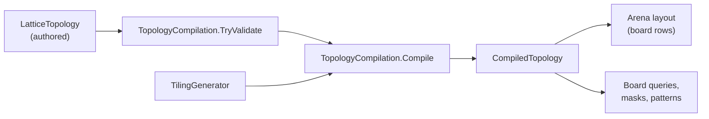

# Topologies and boards

A topology says where the cells of a board are and which cells touch. This
article covers the topology kinds Puck supports, how a topology compiles into
an adjacency table, how a board row stores one value per cell, and the queries
and masks a rule uses to read a board. It's for authors building board games
and host developers who read boards from C#.

## Boards start with a topology

In the running example, the pieces of a small board game stand on an 8×8 grid.
The grid is a **topology**: a discrete space of numbered cells and the
connections between them. A **board row** stores one value per cell of that
topology, and a keyed row such as `pieceCell` stores each piece's cell ordinal
as an ordinary Int.

```puck
state {
  world {
    grid board dimensions(width: 8, depth: 8) empty(0) {
      "0" = 1
      "9" = 2
    }
    table pieceCell capacity(4) bounds(-1..63) {
      rook = 0
      king = 4
    }
  }
}
```

The `grid` declaration creates a grid topology named `board` and an Int row of
the same name over it. Cell keys are decimal ordinals, and a grid numbers its
cells `y * width + x`, so `"9"` is column 1 of row 1. Cells the row doesn't
author read as its `empty` value, here 0. The `pieceCell` row is unrelated
storage that happens to hold cell ordinals; the rule compiler treats
`pieceCell[rook]` as a number until a board query uses it as an origin.

Several rows can share one topology. Occupancy, visibility, and a legal-move
marker can each be a board row over the same grid without copying its geometry.

## Topology kinds

`LatticeTopology` declares a topology. Its case is chosen by the JSON `$type`
(or the `.puck` call name), and each case carries only its own parameters.
Every case also carries a `name`, an `origin` (the minimum corner, in world
units), and a `cellSize`.

| Kind | Cells | Default directions | Point group |
|---|---|---|---|
| `grid` | `width` × `depth`, numbered `y * width + x`. Optional `wrap` and `band`. | `N`, `NE`, `E`, `SE`, `S`, `SW`, `W`, `NW` | 8 elements for a square, 4 for a rectangle |
| `ring` | `width` cells in a cycle; it always wraps. | `forward`, `backward` | The identity |
| `hex` | A hexagonal disk of `radius`, numbered in `HexagonalIndex` order. | `E`, `SE`, `SW`, `W`, `NW`, `NE` | 12 elements |
| `box` | `width` × `layers` × `depth`, numbered `(layer * depth + z) * width + x`, with a `layerHeight`. | The 26 space directions | 48 for a cube, 16 for a square prism, 8 otherwise |
| `graph` | Authored cells, each with an id and a centre. | Authored direction slots | The identity |
| `tiling` | A generated patch of a regular, Archimedean, or Penrose tiling. | One slot per edge normal | The identity |
| `field` | A dense scalar field a host registers and evolves. | None; discrete addressing doesn't apply. | None |

A host registers its `field` case as a further derived record under the same
`$type` discriminator. Only a `field` topology creates physical field storage,
and a `Fixed` row over one compiles into the host's dense field. Puck.World's
field is described in [State in Puck.World](worlds.md). The rest of this
article covers the discrete kinds.

### Wrapping, directions, and element aliases

A grid's `wrap` is a `TopologyWrap`: `None`, `X`, `Y`, or `Both`. A step off a
wrapped edge comes back on the opposite edge. A ring always wraps.

Each discrete kind except `graph` and `tiling` has a default direction
vocabulary. A topology can replace it by authoring `directions`, a list of
`TopologyDirection` steps, each a name and an `(x, y, z)` cell step. The authored
list replaces the default completely: it becomes the topology's only
directions and the only names a rule can use. A rook that moves orthogonally,
for example, gets a 4-connected grid:

```puck
state {
  lattices [
    grid(name: "rookGrid", origin: [0, 0, 0], cellSize: 1, width: 8, depth: 8, directions: [
      { name: "N", x: 0, y: -1 }
      { name: "E", x: 1, y: 0 }
      { name: "S", x: 0, y: 1 }
      { name: "W", x: -1, y: 0 }
    ], elementAliases: [{ name: "rot180", element: "-x-z" }])
  ]
}
```

An authored direction list must follow these rules, and validation refuses it
otherwise:

- It holds 1 to 64 entries, with distinct names and distinct nonzero steps.
- Only a `box` may declare a nonzero `z` (a layer step), and a `ring` refuses a
  nonzero `y` because it has no second axis.
- On a wrapped axis, a step's magnitude must be under that axis's width or
  depth, so the wrap never folds a step onto the wrong cell or back onto itself.
- Every step's negation appears as another entry, so every direction has an
  opposite.

`elementAliases` gives friendlier names to point-group elements, as
`TopologyElementAlias` entries. An alias may be used anywhere an element name is
read. Aliases follow the same 1 to 64 limit, must be distinct, can't reuse a
canonical element name, and must name a real element of the topology's group.

## How a topology compiles

Rules and boards never read an authored `LatticeTopology` directly. They read a
`CompiledTopology`, an immutable table built once. The following diagram shows
where a compiled topology comes from and who uses it.



`TopologyCompilation.TryValidate` checks shape and representation bounds before
any adjacency is allocated. `Compile` builds the table, translating the origin
by an optional anchor offset: a host that places a board on top of another
object's transform passes that offset, and the grid's axes stay aligned with the
world axes whatever the anchor's heading. `Find` compiles by name without an
anchor, and caches the result per authored instance. `Normalize` reduces every
discrete case to one flat tuple (width, depth, layers, wrap, band, layer height,
radius, directions, aliases) so kind-agnostic code doesn't switch over kinds.

A `CompiledTopology` provides:

| Capability | Members | Notes |
|---|---|---|
| Adjacency | `Neighbour(cell, direction)` | A precomputed table; `-1` where no neighbour exists. |
| Opposites | `Opposite(direction)` | Built at compile time by negating each direction's step and finding the match, so declaration order doesn't matter. A `box` lists its planar directions first, then the up-shifted ones, then the down-shifted ones. |
| Directions | `DirectionCount`, `Direction(token)`, `DirectionName(direction)` | Tokens are matched case-sensitively. |
| Symmetry | `ElementCount`, `Element(name)`, `ElementName(element)`, `Image(element, cell)` | Element 0 is always the identity. |
| Centres | `CellCentre(cell)` | Fixed-point world position of a cell's centre. |
| Position to cell | `TryCellOf(position, out cell)` | Grid and box use their rectangular frame, a hex rounds to the nearest lattice point, and a graph or tiling takes the nearest centre within half a `cellSize`. A ring has no position mapping. |
| Translations | `HasTranslations`, `TryTranslation`, `TryOffset` | Grid, ring, hex, and box. A wrapped axis folds the step back. Graphs and tilings have adjacency only. |
| Keys | `Key(cell)`, `TryCell(key, out cell)` | Canonical decimal cell keys. |
| Bit masks | `TryShiftMask(direction, mask, out shifted)`, `TryImageMask(element, mask, out image)` | Carry a whole cell mask through one precomputed table lookup per set bit. The tables exist only for topologies of at most 64 cells. |

Every point-group element is a signed permutation of the topology's axes,
spelled with a sign and a letter per axis, such as `"+x-y+z"`. A grid uses the
letters `xz`, so its eight square elements are `identity`, `-x-z`, `-x+z`,
`+x-z`, `+z+x`, `+z-x`, `-z+x`, and `-z-x`. A hex uses its cube coordinates
`qrs`, and a box uses `xyz`. A symmetry **image** is where a cell lands under one
element: `Image(element, cell)`.

A grid's `band` limits how far above or below the origin a position may be and
still resolve to a cell. The default, 0, accepts any height. A box resolves a
position's height to a layer with `layerHeight`, the way `cellSize` resolves X
and Z.

## Hex cells

A hex topology numbers its cells in `HexagonalIndex` order from
[Deterministic numerics](../maths.md): cell `i` is index `i`, the rings grow
outward from the origin, and consecutive indices are adjacent. A disk of radius
`r` holds `1 + 3r(r + 1)` cells, so the largest radius that fits the 4,096-cell
ceiling is 36.

Its six directions are `HexagonalCoordinate.Direction(0..5)`, counterclockwise
from +q in the Eisenstein basis. With r pointing toward +Z, they read `E`, `SE`,
`SW`, `W`, `NW`, `NE`, the same order `hexNeighbor` counts them. For axial
coordinates (q, r), the cell centre is:

```text
origin + cellSize × (q − r/2, 0, r × √3/2)
```

`TryOffset` steps a hex cell by `(dq, dr)`.

## Authored graphs

A graph supplies its adjacency directly. Use one for a territory map, a star
board, or geometry a tool emits. This fragment declares three regions joined by
a two-way road and a one-way river:

```puck
state {
  lattices [
    graph(name: "regions", origin: [0, 0, 0], cellSize: 1,
      cells: [
        { id: "north", centre [0, 0, 1] }
        { id: "south", centre [0, 0, -1] }
        { id: "east", centre [1, 0, 0] }
      ],
      directions: [
        { name: "road", opposite: "road" }
        { name: "river", opposite: "river" }
      ],
      edges: [
        { from: "north", to: "south", direction: road }
        { from: "north", to: "east", direction: river, oneWay: true }
      ])
  ]
}
```

Here's how a graph works:

1. Cell ordinal `i` is `cells[i]`, and its centre is relative to `origin` in
   world units. Rows and rules address graph cells by ordinal key (`"0"`,
   `"1"`, …); ids exist so edges can name cells.
2. Every direction is a slot, and each names its opposite. A symmetric link
   names itself. Opposites must agree in both directions.
3. An edge fills the `from` cell's slot along `direction`. Unless `oneWay` is
   set, it also fills the `to` cell's slot along the opposite direction. A cell
   with k neighbours therefore needs k distinct directions among its edges.
4. An unfilled slot reads `-1`.

Validation refuses a graph with no cells or more than 4,096, an empty or
repeated id, a centre outside the Q48.16 range, fewer than 1 or more than 64
directions, a missing or asymmetric opposite, an edge naming an undeclared cell
or direction, an edge that joins a cell to itself, and two edges that claim the
same slot, including a slot an edge's implied reverse fills.

`cellSize` is a graph's resolution diameter: a position resolves to the nearest
centre within half a `cellSize`. Graphs have no axial offsets, and their point
group is the identity alone.

## Generated tilings

A `tiling` is a graph that `TilingGenerator` produces at boot from a `family`
and a `radius`. Every tile has edge length 1, scaled by `cellSize`, and the
patch holds every tile whose centre lies within `radius` edge lengths of the
origin.

| `TilingFamily` | Vertex configuration |
|---|---|
| `Triangular` | 3.3.3.3.3.3 |
| `Kagome` | 3.6.3.6 (trihexagonal) |
| `TruncatedSquare` | 4.8.8 |
| `Rhombitrihexagonal` | 3.4.6.4 |
| `TruncatedHexagonal` | 3.12.12 |
| `ElongatedTriangular` | 3.3.3.4.4 |
| `TruncatedTrihexagonal` | 4.6.12 |
| `Penrose` | P3 thick and thin rhombs |

Tiles become cells ordered outward from the origin by distance, then by angle,
so ordinal 0 is the tile at the origin. Two tiles that share a side are
neighbours. Each side's outward normal names a direction slot by its angle in
degrees counterclockwise from +X (`a0`, `a30`, …), and the opposite slot is the
angle plus 180°.

The generator works in doubles, but its coordinates are closed-form and it
merges vertices on a fine quantized grid, so it produces the same graph on
every machine. The result is cached per authored instance. A Penrose patch
grows by Robinson-triangle inflation from a sun of ten triangles, taking at
most `TilingGenerator.MaxPenroseInflations` (9) steps, which covers a radius of
about 76 edge lengths. `TilingGenerator.TryDescribePenrose` reports each Penrose
tile's rhomb kind and the tiles sharing each of its sides; generators build
ribbons and chains from those facts, as [Generators and draw sites](generators.md)
describes.

A tiling needs a radius of at least 1 and must hold no more than 4,096 tiles.
The two snub tilings (3.3.4.3.4 and 3.3.3.3.6) aren't generated.

## Board rows over a topology

A board row is a row whose domain is `cellsOf(topology, empty)`. Its shape is
`Lattice`, it reserves one cell slot per topology cell, and every cell it
doesn't hold reads as its `empty` value. The arena keeps a presence bit per
cell, so an authored cell whose value equals `empty` is still distinct from an
unwritten cell. Board queries that read values need an Int or Bool row, and
`pathCost` needs Int. A `Fixed` row over a `field` topology becomes the host's
dense field; over a discrete topology it's an ordinary board.

This fragment declares a hex terrain board with the general `row` form, which
reaches every topology kind:

```puck
state {
  lattices [
    hex(name: "arena", origin: [0, 0, 0], cellSize: 1, radius: 3)
  ]
  world {
    row {
      name: "terrain"
      kind: "Int"
      domain: cellsOf(topology: arena)
    }
  }
}
```

Two traits tie keyed rows to boards. `valuesFrom` says a keyed row's values are
cells of a topology, and `inverse` derives a board's occupancy from a token row
and a code row. The arena recomputes a derived board whenever either source row
changes. Both are covered in [Row and cell behavior](traits.md). How the arena
stores and hashes lattice cells is in [The state arena](arena.md).

## Query a board

A **board query** asks a bounded question about a board row, such as "which
cell is east of the rook?" or "how large is this group of stones?" In `.puck`, a
query is written `board(operation, row, arguments…)[origin]`. The origin is
the key cell the query starts from: a literal cell ordinal, or a dynamic key
such as `pieceCell[rook]`. `mask`, `canonical`, and `fingerprint` read the whole board
and take no origin.

```puck
rule "board-reads" {
  when coins > 0
  local ahead = board(neighbour, board, E)[pieceCell[rook]]
  local group = board(component, board, 2, 2, 64)[9]
  local liberties = board(boundary, board, 2, 2, 0, 0, 64)[9]
  local attacked = board(attacks, board, 2, 2, "N,E,S,W")[pieceCell[king]]
  local knight = board(offset, board, 1, 2)[pieceCell[rook]]
  result = ahead + group + liberties + attacked + knight
}
```

This fragment assumes the `board` and `pieceCell` rows above, plus Int slots
`coins` and `result`. Each local reads one query:

1. `ahead` is the cell east of the rook, or `-1` at the edge.
2. `group` is the size of the connected group of 2s containing cell 9.
3. `liberties` counts the empty cells (value 0) that border that group.
4. `attacked` is 1 when walking north, east, south, or west from the king
   reaches a 2 before any other occupied cell.
5. `knight` is the cell one column right and two rows down from the rook.

The document stores each query as a `$board:` channel, such as
`$board:component:board:2:2:64`. The complete vocabulary:

| Operation | Arguments | Result |
|---|---|---|
| `neighbour` | direction | The adjacent cell, or `-1` at an edge. |
| `offset` | dx, dz | The cell an arbitrary `(dx, dz)` step away, or `-1`. Grid, ring, hex, and box, where a box stays on the origin's layer; a graph or tiling reads `-1`. |
| `attacks` | min, max, 1–4 directions | 1 when some direction's ray reaches a cell in min..max before any other occupied cell, else 0. A ray stops at the first occupied cell, at an edge, or on returning to its origin. |
| `component` | min, max, maxVisits | The size of the connected in-range component containing the origin; 0 when the origin is out of range; `-2` when the visit budget runs out. |
| `boundary` | min, max, bmin, bmax, maxVisits | The count of distinct cells in bmin..bmax adjacent to that component, on the same terms. |
| `boundaryAt` | min, max, bmin, bmax, maxVisits | The boundary a value placed on the empty origin would have; `-1` when the origin isn't empty. |
| `enclosedAt` | min, max, bmin, bmax, maxVisits | The cells of the adjacent components a value placed on the empty origin would enclose; `-1` when the origin isn't empty. |
| `pathCost` | target, maxCost, maxVisits | The cheapest total entry cost to the target cell; `-1` when unreachable or over `maxCost`; `-2` when the visit budget runs out. |
| `jumpDistance` | target | The fewest non-capturing hops to an empty target; 0 at the source; `-1` when unreachable. |
| `mask` | min, max | A 64-bit set of the cells whose value lies in min..max. At most 64 cells. |
| `canonical` | none | The least 64-bit fingerprint of the board's values over every point-group element. Any size. |
| `fingerprint` | none | The 64-bit fingerprint of the board's values as they stand, through the identity alone. Any size. |

A few details apply across the vocabulary:

- `pathCost` reads the board's values as entry costs, so it needs an Int row. A
  negative value is impassable, and every neighbour, including grid diagonals,
  is a step. The search settles at most `maxVisits` cells, 1 to the cell count.
  A budget refusal (`-2`) is different from proof that no route exists.
- `pathCost` and `jumpDistance` can read a live target instead of a literal
  cell: `board(pathCost, terrain, cell, pieceCell, king, 20, 37)` heads for
  whatever cell `pieceCell[king]` holds.
- A `jumpDistance` hop jumps over one occupied neighbour onto the empty cell
  beyond it in the same direction; a chain may change direction, and the
  mover's own cell counts as vacated.
- `component`, `boundary`, `boundaryAt`, `enclosedAt`, `attacks`, and `mask`
  need an Int or Bool row; the component family's `maxVisits` is 1 to the cell
  count.
- `canonical` gives two boards that are the same up to symmetry the same
  fingerprint. Pushed into a history ring, it lets a pattern detect repeated
  positions up to symmetry.
- `fingerprint` is `canonical`'s term for the identity element, so a mirror
  image of a board reads a different fingerprint and the same canonical form.
  A rule that must tell one exact position from another, such as Go's ko check
  against a history ring, reads `fingerprint`.

A ray's first blocker and its distance, and an n-in-a-row check, are read with
the pattern engine's `match` operand instead of a board query, so the blocking
test can be any authored value range. See [Patterns](patterns.md).

Puck.World adds host channels that also address boards, such as `cellOf`, which
maps a body's position to a cell. Those are listed in [State in Puck.World](worlds.md).

### Board queries from C#

`Puck.State.Topology` holds the query library. `BoardQuery` is the abstract base
with one sealed case per `BoardQueryKind`, each carrying only its own arguments.
`BoardQueries.Evaluate` runs a query over a caller-owned span of cell values;
`ArenaBoards.TryEvaluate` fills that span from an arena row and then calls the
same kernel, so a query answers the same over an arena as over a document row.
`ArenaBoards` refuses a query compiled from a different authored topology than
the row's. `ArenaBoards.TryReadRay` reads the cells of one ray as a word for
the pattern engine. `BoardJumpDistanceQuery` carries its own `Evaluate`.

Each query reports `Visits`, a conservative count of the cells one evaluation
may touch. The work sheet prices queries from it; see
[Rule analysis, scheduling, and work budgets](analysis.md).

## Work with board masks

A **board mask** is a set of cells packed into one Int: bit `c` is cell ordinal
`c`. `board(mask, row, min, max)` builds one from a row's values, and ordinary
Int operators combine masks: `&`, `|`, `^`, `~`, `setBitCount`,
`lowestSetBit`, and the rest of the bit functions in
[Reads and expressions](expressions.md). Three expression functions move a
mask across the topology:

| Function | Result |
|---|---|
| `boardShift(mask, topology, direction)` | Each member moved one step in the direction; a member with no neighbour that way drops. |
| `boardRay(mask, topology, direction)` | The mask united with every repeated shift of it until nothing new appears. On a wrapped topology, each seed's whole cycle. |
| `boardImage(mask, topology, element)` | Each member carried through a point-group element. |

The `writeSet` transform paints a value onto the cells a mask selects, which
closes the loop from a mask back to a board row. A canonical element name that
isn't a bare identifier is written in backquotes, as in
``boardImage(m, board, `-x-z`)``, or through an alias.

A mask holds at most 64 cells because an expression value is one 64-bit word,
and a cell set is one expression value. `BoardMask.MaxCells` records that
ceiling; it's a consequence of the representation, and there's no multi-word
set type in the expression language. `board(mask, …)`, the three mask functions,
and `writeSet` from a mask all refuse a topology of more than 64 cells.

### Board masks and board rows

Masks and whole board rows do the same set algebra at different scales.

| | Board mask | Board row |
|---|---|---|
| Size | At most 64 cells | Any topology, up to 4,096 cells |
| Lives in | An expression value, for one evaluation | The arena, as persistent state |
| Holds | Membership only | A value per cell |
| Combine with | Int operators and `boardShift`/`boardRay`/`boardImage` | The `boardCombine` transform |
| Writes back through | `writeSet` | `boardCombine`'s own target row |

`boardCombine` treats a cell as a member of a source board when its value
differs from that board's `empty` value. Its operations are `copy`, `fill`,
`clear`, `and`, `or`, `xor`, `andNot`, `not`, `shift` (along a direction), and
`image` (through an element). Every operation except `copy` writes the declared
member value to each resulting member and the target's `empty` value
everywhere else. It computes membership and doesn't add cell values. `copy`
preserves every source value. The member value must be one the target row
admits and must differ from the target's `empty`. The transform itself is described in [State transforms](transforms.md).

## Declare a named cell set

A document can name a set of positions with a `set` declaration, using the same
operators a pattern uses. The atoms are `all`, `none`, and three sources whose
range selects members: `board(row, low..high)` over a board's cells,
`zone(row, low..high)` over a pile's positions, and `family(name, low..high)`
over a family's member rows. `|` is union, `&` intersection, and `~`
complement.

```puck
set contested: board(board, 1..2) & ~board(board, 2..2)
```

Every source in one expression must agree on the element count, because
complement is relative to it. A `CellSet` is as wide as that element count, up
to 4,096 positions, and stores its first 256 positions inline. The world
validator checks that every declared set's sources exist and that no set shares
its name with a `state.world` row.

### Read a declared set

The two transforms that take a set of positions read a declared set by its
name: `boardCombine` in `left` and `right`, and `writeSet` in `set`. Each time
the transform runs, it works out the set's members from each source cell's live
value at that tick, at the width of the board it writes. A `zone` or `family`
member that advances or cycles counts by the value it reads now, the same value
a rule condition reading that cell sees.

```puck
set contested: board(stones, 1..2) & ~board(stones, 2..2)

rule "mark" {
  mode: Level
  transform boardCombine(row: marked, operation: Copy, left: contested)
  transform writeSet(row: canvas, set: contested, value: 7)
}
```

- In `boardCombine`, a set reads like a board whose members hold the
  transform's `value` and whose other cells hold the written board's `empty`
  value. `Copy` paints the set, and every other operation reads its
  membership, so a set combines with a board the way two boards do.
- In `writeSet`, a set writes `value` into each of its members and leaves every
  other cell alone. It works on a board of any size, and it takes no `setKey`.
- A name that is neither a row nor a declared set, or a set given a `setKey`,
  is refused when the rule compiles. A set whose sources cover a different
  number of positions than the board has is refused each time the transform
  runs: `boardCombine` refuses with `BoardCombineOperands` and `writeSet` with
  `WriteSetSource`, and the reason names the set.
- A rule condition can't read a set directly, because an expression value is
  one 64-bit word. Write the set into a board row with `boardCombine` and read
  that row. A search job doesn't take a set as input; its `legal` and `reach`
  rows are outputs.

C# code can evaluate a set against an arena itself with
`CellSetLowering.TryLower`, passing the `ArenaTime` its sources are read at.

## Limitations

- A discrete topology holds at most `TopologyCompilation.MaxCells` (4,096)
  cells, with 1 to 4,096 cells along each axis. A world document declares at
  most 64 topologies (`TopologyCompilation.MaxTopologies`), and Puck.World
  allows at most one physical field among them.
- A hex radius is at most 36, derived from the cell ceiling.
- Masks, `boardShift`, `boardRay`, `boardImage`, and `writeSet` from a mask
  work only on topologies of at most 64 cells. Use `boardCombine` or a declared
  set beyond that.
- Graphs and tilings have no axes. `offset` reads `-1` on them, and their
  point group is the identity.
- `attacks` walks 1 to 4 directions; path and component queries settle at most
  one visit per cell.
- Snub tilings aren't generated, and a Penrose patch stops after 9 inflation
  steps.
- `cellSize` must quantize to a positive Q48.16 value and the origin must fit
  Q48.16. A box's `layerHeight` must be positive, and a grid's `band` can't be
  negative.

## Key types

| Type | Project | Purpose |
|---|---|---|
| `LatticeTopology` | Puck.State | The authored topology union: grid, ring, hex, box, graph, tiling. |
| `TopologyKind`, `TopologyWrap` | Puck.State | The topology's kind and a grid's wrapped axes. |
| `TopologyDirection`, `TopologyElementAlias` | Puck.State | An authored direction step and an element alias. |
| `GraphCell`, `GraphDirection`, `GraphEdge` | Puck.State | A graph's cells, direction slots, and edges. |
| `TopologyCompilation` | Puck.State | Validates, normalizes, compiles, and finds topologies. |
| `CompiledTopology` | Puck.State | The immutable adjacency, symmetry, and geometry table. |
| `TilingGenerator`, `TilingFamily`, `PenroseTiles` | Puck.State | Generates tilings and describes Penrose tiles. |
| `BoardMask` | Puck.State | The 64-cell mask ceiling. |
| `CellSet`, `CellSetExpression`, `CellSetRow` | Puck.State | Named cell sets and their algebra. |
| `BoardQuery`, `BoardQueryKind` | Puck.State.Topology | The board query cases. |
| `BoardQueries` | Puck.State.Topology | The query kernel over a span of cell values. |
| `BoardJumpDistanceQuery` | Puck.State.Topology | The jump-distance query and its search. |
| `BoardCombination` | Puck.State.Topology | Validates and computes `boardCombine`. |
| `ArenaBoards` | Puck.State.Topology | Runs board queries and ray reads against an arena. |

## Next steps

- [Patterns](patterns.md): match rays and piles against a regular language.
- [State transforms](transforms.md): `boardCombine`, `writeSet`, `setRay`, and
  `pushRay`.
- [Reads and expressions](expressions.md): combine query results in a rule.

## See also

- [The state arena](arena.md)
- [Row and cell behavior](traits.md)
- [World schema: discrete boards, cards, and turns](../../../src/Puck.World.Schema/README.md#discrete-boards-cards-and-turns)
