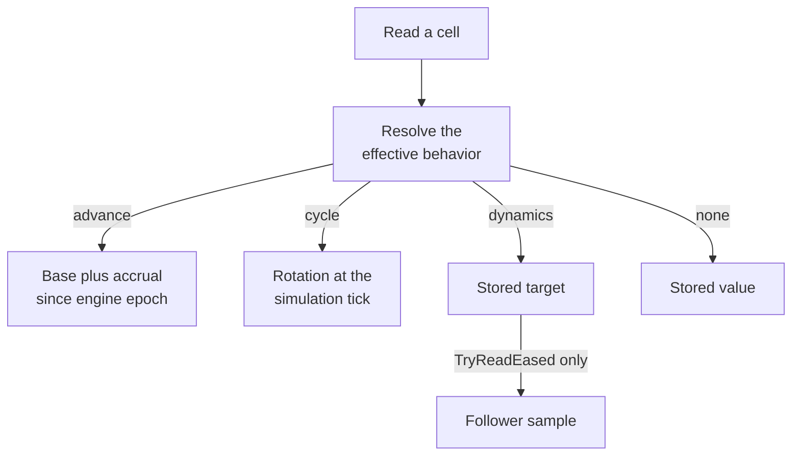

# Row and cell behavior

A row's kind and domain say what it stores and how you address it. **Traits**
add behavior on top: a range a value must stay inside, a value that grows on its
own between writes, a smoothed reading for presentation, a rule about who can see
a cell. This article covers every trait a row or cell can carry, how each one
changes reads and writes, and which traits can be combined. It assumes you've
read [Rows, cells, and values](data-model.md).

## Traits at a glance

| You want to | Trait | Applies to |
|---|---|---|
| Keep a number inside a range | `Min`, `Max`, `Overflow` | `Int` and `Fixed` rows and record fields |
| Cap a table's size, or drop its oldest entry | `Capacity`, `Evicts` | Keyed rows |
| Let a value accumulate between writes | `StateAdvance` | `Int` and `Fixed` rows, cells, and record fields |
| Smooth a value for display | `StateDynamics` | `Int` and `Fixed` rows and cells |
| Turn a value through a repeating cycle | `StateCycle` | `Int` and `Fixed` rows and cells |
| Draw a value from authored randomness | `Draw` | Slots; see [Generators and draw sites](generators.md) |
| Limit who can read a row or cell | `StateVisibility` | Any row or cell |
| Remember what an observer has seen | `StateKnowledge` | Token-keyed rows, or boards |
| Reject a stale turn submission | `StatePhase`, `PhaseGuard` | `Int` rows |
| Derive a board from token positions | `ValuesFrom`, `StateInverse` | `Int` token rows and `cellsOf` boards |

## Keep a value inside a range

In the running example, `coins` can't go below zero or above 99:

```puck
slot coins = 3 bounds(0..99)
table vitals bounds(0..100, overflow: Saturate) {
  health = 100
  mana = 50
}
```

`bounds(minimum..maximum)` lowers to the row's `Min` and `Max`. Either side is
optional: `bounds(0..)` sets a floor with no ceiling, and `bounds(..10)` sets a
ceiling with no floor. When both are present, the minimum must be less than the
maximum. Only `Int` and `Fixed` rows carry a range.

`Overflow` decides what happens when a write would leave the range:

- **`Refuse`** (the default) refuses the write and reports why. A silent clamp
  could hide an authoring mistake, so refusal is the default.
- **`Saturate`** clamps the result to the bound it crossed.

With `coins` at 98, a rule that adds 5 is refused, and the rule's firing rewinds.
If `coins` declared `overflow: Saturate`, the same write would store 99.

### How a write is decided

Every path that writes a number decides through one method,
`StateRow.TryAdmitWrite`: the rule evaluator, the mutation pipeline, ring pushes,
board combines, write sets, the evaluator's no-op test, and the rule compiler's
constant checks. Because they share one decision, they always agree. The method
works like this:

1. It computes the exact result (the replacement for a set, or current plus
   operand for an add) in 128-bit arithmetic, so a 64-bit overflow is detected
   instead of wrapping.
2. If the result is outside the envelope, `Refuse` rejects it with "would leave
   the row's declared envelope", or "would overflow 64-bit storage" when the
   exact result doesn't fit a `long`. A row with no declared range still refuses
   a 64-bit overflow.
3. Under `Saturate`, the result is clamped to the crossed bound, or to
   `long.MinValue` or `long.MaxValue` on a side with no declared bound.
4. If the row names an enum, the stored value (clamped or not) must be one of the
   enum's members, or the write is refused.

The decision depends only on the stored value, the operand, and the envelope, so
replaying the same operand always lands on the same stored value.

`StateRow.ClampToEnvelope` is a separate method that clamps computed reads, such
as an accumulating value's live reading. Writes never use it.

## Cap a table and evict the oldest entry

A keyed row's `Capacity` is a hard ceiling. A write that would add a key past it
is refused. Declare `evicts` to turn the ceiling into a rolling window:

```puck
table log capacity(3) evicts {
  first = 1
}
```

With `Evicts`, a write that adds a new key to a full row succeeds and removes the
row's oldest surviving cell. Eviction is first-in, first-out by insertion
position: a new key is appended, the cell at position zero is dropped, and
rewriting an existing key updates it in place without making it newer. Eviction
is a pure function of the row's cells, so replay evicts the same key. `Evicts`
requires a declared `Capacity`; a slot has no bound to evict against.

## Accumulate a value over time

An **advance** makes a value grow or shrink on its own between writes: health
regeneration, a mana pool, a day clock. You give it a rate per second:

```puck
slot mana = 10 advance(perSecond: 60)
slot stamina = 5 bounds(0..10) advance(perSecond: 0.25)
slot torch = 100 bounds(0..) advance(perSecond: -3)
```

The rate is an exact fraction, stored as `PerSecondNumerator` and
`PerSecondDenominator` (`0.25` becomes 1/4). A fractional rate also makes the
row `Fixed`. A negative rate drains the value and is the exact mirror of the
positive rate, so decay and regeneration at the same magnitude stay symmetric. A
zero numerator is legal and inert, and a denominator of zero or less is refused.

Nothing is written each tick. The stored cell is a **base**, and every read
computes the current value from the base, the rate, and the time elapsed since the
cell's **epoch**. Because the computation is exact rational arithmetic, a
fractional rate accumulates without rounding drift.

### Worked example

Here's how reads and writes interact for `mana`, which stores 10 and advances by
60 per second:

1. At engine tick 0, the stored base is 10 and a read returns 10.
2. One second later, at engine tick 50,400, a read returns 70. The stored base is
   still 10.
3. A rule adds 3 at engine tick 50,400. The add starts from what a reader sees,
   70, so the cell stores a new base of 73 and moves its epoch to engine tick
   50,400.
4. Another second later, a read returns 133.

The same steps in C#, against an arena:

```csharp
using Puck.State;

var mana = new StateRow(
    Name: CellName.Parse(candidate: "mana"),
    Kind: CellKind.Int,
    Advance: new StateAdvance(PerSecondNumerator: 60L, PerSecondDenominator: 1L),
    Cells: [new StateCell(Key: StateRow.SlotKey, Value: CellValue.Int(value: 10L))]);
var section = new StateSection(Rows: [mana]);
var catalog = StateCatalog.Compile(section: section);
var arena = new StateArena(catalog: catalog, section: section, time: ArenaTime.Origin);

catalog.TryResolve(lane: StateLane.Document, name: "mana", handle: out var handle);
catalog.Keys.TryResolve(name: StateRow.SlotKey, key: out var slot);

var oneSecond = ArenaTime.At(tick: 60UL, engineTick: 50_400UL);

arena.TryReadLive(rowOrdinal: handle.Ordinal, key: slot, time: oneSecond, value: out var live);
Console.WriteLine(live.AsInt);    // 70
arena.TryRead(rowOrdinal: handle.Ordinal, key: slot, value: out var stored);
Console.WriteLine(stored.AsInt);  // 10: the base

arena.TryWriteLive(rowOrdinal: handle.Ordinal, key: slot, operand: 3L,
    write: StateWriteKind.Add, time: oneSecond, reason: out _);
arena.TryRead(rowOrdinal: handle.Ordinal, key: slot, value: out stored);
Console.WriteLine(stored.AsInt);  // 73: the new base, epoch at engine tick 50,400
```

`TryReadLive` and `TryWriteLive` apply the trait. `TryRead` and `TryWrite`
address the stored base directly, which is why readers and writers of timed cells
go through the live methods. A rule's gate, a rule's `set` or `+=`, and every
reduction use the live forms, so an add always lands on the value a reader sees.

### Engine ticks and simulation ticks

An advance is measured in **engine ticks**, a fixed clock of 50,400 ticks per
second (`FixedTickConversion.TicksPerSecond`). It isn't measured in simulation
ticks, which run at the world's `simulation.rateHz`. As a result, changing the
simulation rate while the world runs moves no epoch and skews no accumulation. A
world authored with `simulation.rateHz: 0` never steps, so its engine tick never
advances either. An advance is still legal there; it reads the base its last
write left.

### Ranges and advancing values

A declared `Min` or `Max` clamps the computed value on every read, and never
rewrites the stored base or its epoch. `stamina` above reads 10 once it has
accumulated that far, however long it keeps running. A value that must wrap
around, such as an angle, belongs in a cycle.

## Smooth a value for presentation

A **dynamics** trait gives a cell a smoothed reading for display. The stored
value stays the truth, and an eased read follows it with second-order motion.
Use it for a coin counter that glides toward its new total or a gauge that
settles with a little overshoot. The trait names a row in the world's `dynamics`
section, which holds a frequency (`f`), a damping ratio (`zeta`), and an initial
response (`r`):

```puck
dynamics [
  { name: "coinGlow" f: 2 zeta: 0.7 r: 0 }
]

state {
  world {
    row {
      name: "coinDisplay"
      kind: "Fixed"
      dynamics { row: "coinGlow" }
      value: "0"
    }
  }
}
```

The two readings are separate on purpose:

- **Stored truth.** Every simulation read uses the stored value, the **target**.
  That includes rule gates, a write's operand, effect sources, reductions,
  search judges, disclosures, and the state hash. The arena's live read never
  eases.
- **Eased reading.** `StateReader.TryReadEased` computes the follower's current
  position. It reads a document's exported rows instead of the arena, and it's
  the read a presentation binding such as a HUD readout, a look, or a gait driver
  takes.

Every presentation binding token, `state.<row>` or `state.<row>.<key>`, reads the
eased value by default; a trailing `.$target` facet reads the stored truth. A
HUD gauge, a camera operand, a marker, a render or theme color, the binding
bar's cells, an overlay predicate, and a body's look lanes, gait drivers and
scale all resolve through the client's state mirror (`WorldStateMirror`), which
reads each bound cell once per tick and
only while it can change: when a delivery names its row as moved, or while its
dynamics follower hasn't come to rest or its advance or cycle trait is running.
Between ticks a frame presents an easing or advancing value interpolated at the
frame's fraction between the previous tick's sample and the current one, and a
plain or cycling value steps. An offscreen capture shows the value at the tick
it's armed for.

The follower is closed form, so nothing runs per tick. Its state lives in the
cell's clock: the position `Y0` and velocity `V0` at `EpochTick`, in raw Q48.16
bits. A write rebases the follower at the write's tick. It keeps chasing from
where it was and gets a velocity kick for the target's jump, so a retune never
jumps. A dynamics cell that has no clock yet reads its own stored value as the
follower's position, at rest.

Dynamics uses simulation ticks. An eased read at a simulation rate of zero or
below returns the stored truth. The `dynamics` row ranges are: frequency above
zero and at most 100 Hz, damping from 0 to 16, and response from -4 to 4.

## Turn a value through a cycle

A **cycle** makes a cell's reading a pure function of the simulation tick: a dial
that ticks round, a day-night phase, a tempo. Nothing accumulates, so a given
tick produces the same bits on a replay, after a reconnect, or on a fresh read.

```puck
row {
  name: "dial"
  kind: "Int"
  cycle { output: "Step" ticksPerStep: 6 }
  value: 0
}
```

A cycle advances one step every `TicksPerStep` simulation ticks from the cell's
`EpochTick`. The step is a generator of the symmetry lattice's reflection group,
applied `Power` times. With no `Word`, the generator is the lattice's own
thirty-step cycle; a `Word` of one to eight mirror nodes defines another. The
generator's order is the loop's length in steps: a word of order twelve is a
twelve-position dial. `Power` must be nonzero and smaller in magnitude than the
order.

`Output` chooses what the cell reads:

| Output | Reads | Cell kind |
|---|---|---|
| `Step` | The step count, `0` to `order - 1`. | `Int` |
| `Turns` | The fraction of one turn. | `Fixed` |
| `Cos`, `Sin` | The unit rotation's cosine or sine. | `Fixed` |
| `Node` | The lattice node the orbit has reached, `0` to `239`. | `Int` |
| `Ring` | The ring (`0` to `7`) the current node lies on. | `Int` |
| `ProjectionX`, `ProjectionY` | The current node's projected coordinates. | `Fixed` |

The stored value is the **phase**. For the rotation outputs, it's a number of
steps added to the rotation's own count; for the lattice outputs, it's the node
the walk starts from. A write sets the phase and leaves the clock alone, so a
rule's `+=` turns the cycle by whole steps. A declared range clamps the computed
reading, as it does for an advance.

## How a timed cell is read

The three time traits share one read path. The reader first resolves which trait
governs the cell, then computes the value from the stored number and the clock
that trait uses:



An advance reads the engine clock and a cycle reads the simulation clock; both
clamp the result to the row's range. A dynamics cell reads its stored target
everywhere except `StateReader.TryReadEased`, which samples the follower for
presentation. A cell with no behavior reads what it stores. The next section
explains how the effective behavior is resolved.

## Row defaults and cell overrides

A row's `Advance`, `Dynamics`, or `Cycle` is the **default** behavior of every
cell it carries, including a key a later write mints. A cell can replace that
default with a trait of its own, or opt out entirely:

```puck
table income capacity(4) advance(perSecond: 1) {
  farm = 0
  mine = 0 advance(perSecond: 3)
  shrine = 0 behavior(none)
}
```

Here `farm` inherits one per second, `mine` replaces the default with three per
second, and `shrine` doesn't accumulate. `EffectiveBehavior.Resolve` makes that
decision, and every consumer calls it: readers, the validator, rebasing, JSON
conversion, and save capture. It resolves in this order:

1. A cell whose key is `$value` (a slot's cell) always takes the row's default.
2. A cell with `Behavior = StateCellBehavior.None` has no behavior.
3. A cell's own `Advance`, `Dynamics`, or `Cycle` replaces the row's default
   wholesale.
4. Otherwise the cell takes the row's default, or no behavior if the row
   declares none.

A cell can declare at most one of the three traits, and a cell that opts out
can't declare any. Neither an override nor an opt-out is legal on a slot's cell,
because a slot has no separate default to override. A key that doesn't exist yet
resolves the same way as an existing cell with no override.

Declaring a behavior on a row doesn't create any cells. A row with a trait and no
authored value gains its first cell from the first write, like any other row.

### Cell clocks

A cell's timing state lives on the cell, in its `StateCellClock`, so a key minted
later starts its own clock from the tick it was created. The clock holds:

| Field | Clock | Read by |
|---|---|---|
| `EpochTick` | Simulation ticks | Dynamics and cycle |
| `EpochEngineTick` | Engine ticks | Advance |
| `Y0`, `V0` | Follower position and velocity, raw Q48.16 | Dynamics |
| `SubstepTicks` | Ticks accumulated toward the next step | Cycle |

The two epochs are independent coordinates, and neither is ever converted from
the other. Both must be zero or greater. A cell with no clock is settled at tick
zero. For a slot written with the `value` shorthand, the clock is written as a
row-level `clock` beside `value`.

### Re-authoring settles cells

When a new declaration of a row changes its default or a cell's own behavior, the
arena **settles** every affected cell at the change tick so that nothing a reader
was watching jumps. The rule depends on the new behavior:

| New behavior | What happens |
|---|---|
| Advance | Rebases: the value the old behavior was reporting becomes the new base, and both epochs move to the change tick. |
| Dynamics | Entering from another behavior rests the target on the carried value. Retuning an existing follower keeps its target. Either way the clock carries the sampled position with a retarget velocity kick. |
| Cycle | Resettles only when the effective cycle itself changed: a new key, a switch into a cycle, or a changed parameter. It carries the old rotation's part-step. A rewrite under an unchanged cycle leaves the clock alone. |
| None | A cell that already had no behavior keeps the declared value. One that has switched off freezes at the value the old behavior was reporting, with its clock at the change tick. |

A declaration carries a cell's *stored* value, which for a timed cell is a base or
a phase rather than what a reader sees. So restating the same stored value isn't
a write. Changing a row's default rate leaves a cell with its own rate
accumulating without interruption.

A cycling cell is the only case where the carried value depends on the
destination. Settling into another cycle carries the phase. Settling into any
other behavior, including none, stores the value the rotation was displaying.

## Which traits combine

Some traits exclude each other because a cell can only have one source of truth
for how its value changes:

| Combination | Allowed? | Why |
|---|---|---|
| Advance with draw, dynamics, or cycle | No | A cell's value can come from at most one of these. |
| Dynamics with draw or cycle | No | Same reason. |
| Cycle with draw | No | Same reason. |
| Range or overflow on `Bool`, `Text`, or `Vector` | No | Only numbers have a range. |
| Advance, dynamics, or cycle on `Bool`, `Text`, or `Vector` | No | Only `Int` and `Fixed` values change over time. |
| `Evicts` without `Capacity` | No | There's no bound to evict against. |
| Any time trait on a ring | No | A push is the only way a ring changes. |
| Any time trait on a board or a field row | No | A board cell is a plain value a transform paints; a field row's cells are the lattice's. |
| A row-level time trait on a token-keyed row | No | Each token's cell declares its own trait instead. |
| `Enum` on a non-`Int` row | No | An enum names integers. |
| Cell `behavior(none)` beside the cell's own trait | No | Opting out and overriding contradict each other. |

The JSON reader refuses the time-trait pairs, and Puck.World's validator refuses
the rest when a document loads. [Vectors and embedding spaces](vectors.md) lists
what a vector row admits.

## Control what observers learn

A **visibility** policy decides what a reader learns about a row or cell. It
doesn't grant permission to change anything; admission and rules decide that.

```puck
row {
  name: "hand"
  kind: "Bool"
  capacity: 3
  domain: keysOf(ordered: true, row: cards)
  visibility {
    readers [ "seat1" ]
    readersFrom: "audience1"
    hidden: "Placeholder"
  }
}
```

A `StateVisibility` has three parts:

- **`Readers`**: the principal tokens allowed to read. No visibility at all means
  public. An empty list keeps the row at the authority only.
- **`ReadersFrom`**: a keyed `Text` row whose cell values are further reader
  tokens. A rule widens the audience by writing a token (a showdown reveals a
  hand) and narrows it by clearing one. Declaring either list keeps the row
  private.
- **`Hidden`**: what an allowed reader of the row learns about cells it can't
  read. `Omit` leaves no trace, `Count` reports how many were hidden, and
  `Placeholder` shows each hidden cell in pile order as an anonymous entry, like a
  card back.

A row policy and a cell policy intersect: a reader must pass both. A row or cell
can list at most 32 readers of up to 256 characters each. The policy filters
what Puck.World discloses to ordinary peers and what a non-operator's console
reads, including the placements a deal draws from the row; a peer admitted at the `replica` tier receives the whole document, hidden
cells included.
[State in Puck.World](worlds.md) describes the disclosure tiers.

### Remember what was seen

A **knowledge** row remembers what an observer has learned about each token. It
names three rows: a `Source` property keyed by token (such as each piece's rank),
a `Mask` board of `Bool` cells (true where the observer can currently see), and a
`Positions` row giving each token's cell on the mask's topology.

```puck
row {
  name: "redKnows"
  kind: "Int"
  capacity: 3
  domain: keysOf(row: pieces)
  knowledge {
    source: "pieceRank"
    mask: "seen"
    positions: "pieceCell"
  }
  visibility {
    readers [ "seat1" ]
  }
}
```

The `observe` transform refreshes it. Every remembered token first drops to not
visible; then each token whose position is a visible mask cell takes the source's
live value at that tick and a fresh `StateObservation` stamp (the tick and
`Visible`). A position or source cell that advances or cycles is read at the
firing's time, exactly as a rule condition reads it. A remembered cell of a
token-keyed knowledge row may carry its own time trait; `observe` writes it
through `TryWriteLive`, so it reads the observed value at the firing's time and
changes from there.
Because the row is keyed by token, moving a revealed piece keeps what was learned
about it, and hiding its new cell clears `Visible` without discarding the
remembered value. Omitting `Positions` selects the direct board projection:
source, mask, and knowledge share one topology, and observations are keyed by
cell. Only the authority runs `observe`.

## Reject a stale submission

A **phase** turns an `Int` row into a guarded submission stamp. The row holds a
generation, `StatePhase.Sequence`, that only the mutation pipeline advances.

```puck
row {
  name: "turnGuard"
  kind: "Int"
  phase { sequence: 0 }
}
```

A submission carries a `PhaseGuard` naming the row and the generation it
observed. It's admitted only if that generation is current, and when it
succeeds the generation advances by one. Another submission still carrying the
old generation is then stale. A row that declares `phaseOf: "turnGuard"` requires
that guard on any external gameplay transform that writes it.

The guard checks only whether a submission still refers to the current
generation. Who may act, in what order, and under what deadline are ordinary rows
your rules maintain. A world that wants several moves per turn leaves those rows
unguarded and puts `phaseOf` on the row that ends the turn.

## Derive a board from token positions

Two traits let one row's values name locations and another row derive a board
from them:

- **`ValuesFrom`** on an `Int` `keysOf` row says its values are cell ordinals of a
  topology. `pieceCell` declares `valuesFrom: "board"`.
- **`Inverse`** on a `cellsOf` row declares the board derived from a `Tokens` row
  and a `Codes` row keyed the same way.

```puck
row {
  name: "occupancy"
  kind: "Int"
  domain: cellsOf(topology: board)
  inverse {
    tokens: "pieceCell"
    codes: "pieceCode"
  }
}
```

Each board cell reads the code of the *last* token, in the tokens row's cell
order, whose position names it. Two tokens on one cell isn't an error. A token
whose value names no cell of the topology is off the board, and a cell no token
names reads the board's empty value. The arena recomputes the board from the
current tokens and codes on every write to either row and on every load, so you
write positions once and never keep a second copy.

The board itself is never written directly. Its admitted values must contain the
codes row's, and its empty value must be admitted by its own range and enum; the
arena refuses the declaration otherwise. The board can be an `Int` or `Bool` row.

## Limitations

- **Advance clamps only on read.** A range never rewrites an advancing cell's
  base, so the stored base can sit outside the range while reads stay inside it.
- **Dynamics is presentation only.** Simulation code can't read the eased value.
- **Cycles and dynamics count simulation ticks.** Changing the simulation rate
  changes how fast they move in real time. An advance counts engine ticks, so a
  rate change doesn't skew it.
- **One time trait per cell.** A cell can't both accumulate and ease.
- **Phase guards don't model turn order.** They reject stale submissions only.
- **Visibility is a read policy.** It never authorizes a write.

## Key types

| Type | Project | Purpose |
|---|---|---|
| `StateOverflow` | Puck.State | Refuse or saturate a write outside the range. |
| `StateAdvance` | Puck.State | Exact per-second accumulation over engine ticks. |
| `StateDynamics`, `DynamicsRow`, `DynamicsLimits` | Puck.State | Second-order easing for presentation reads. |
| `StateCycle`, `CycleOutput` | Puck.State | Tick-indexed rotation and what it reads. |
| `StateCellBehavior`, `StateCellClock` | Puck.State | A cell's opt-out and its timing state. |
| `EffectiveBehavior` | Puck.State | Resolves which trait governs a cell. |
| `StateVisibility`, `HiddenCells` | Puck.State | Who can read a row or cell, and what hidden cells reveal. |
| `StateKnowledge`, `StateObservation` | Puck.State | A remembered observation layer and its stamps. |
| `StatePhase`, `PhaseGuard` | Puck.State | A guarded submission generation. |
| `StateInverse` | Puck.State | A board derived from token positions. |
| `StateReader` | Puck.State | Computes reads over exported rows, including eased reads. |

## Next steps

- [Records, pools, and handles](records-and-pools.md): the same ranges and
  advance traits on typed record fields.
- [Rules and firing](rules.md): how a refused write rewinds a firing.
- [The state arena](arena.md): live reads, journaling, and hashing.

## See also

- [Generators and draw sites](generators.md)
- [Vectors and embedding spaces](vectors.md)
- [World schema: the state document](../../../src/Puck.World.Schema/README.md)
