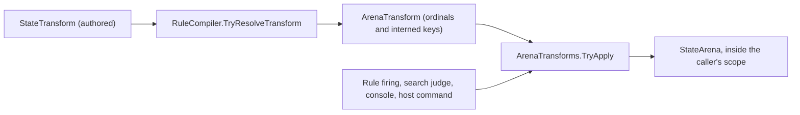

# State transforms

An ordinary effect changes one cell. A **state transform** is one effect that
makes a structured change whose parts must agree: moving tokens between piles,
reordering a pile, or rewriting a board. This article describes every transform,
how it resolves and applies, and how it behaves inside a rule's firing. It's for
world authors writing `transform` statements and for host developers who apply
transforms from C#.

## One implementation for every caller

Here's a rule that deals three cards from `deck` to `hand` and then sorts the
hand by suit and rank:

```puck
rule dealThree {
  when count(deck) >= 3
  mode: Edge
  deal 3 deck to hand
  transform sort(row: hand, by: [{ row: cardSuit } { row: cardRank, descending: true }])
}
```

This fragment assumes a token-domain row `cards`, two ordered piles `deck` and
`hand` over it with an authored `capacity(4)`, and two Int attribute rows
`cardSuit` and `cardRank` declared with `domain: keysOf(row: cards)`.

Each transform is a case of `StateTransform`, and each case is implemented
once. A rule firing, a search judge, the console, and a host command all reach
that implementation by the same path:



`RuleCompiler.TryResolveTransform` resolves every row, key, board cell,
direction, pattern, and admitted value once, so no name is read while the
transform runs. The result is an `ArenaTransform`. `ArenaTransforms.TryApply`
runs the kernel for that case against an `ArenaTransformContext` (the arena, the
clocks, and the draw context). A rule's `transformState` effect compiles through
the same resolution; the parts a firing resolves fresh (a dynamic key, a live
zone end, a bound pool token) travel beside it in an `ArenaTransformBinding`.

A host that runs rules serves `IArenaTransformHost` so that `transformState` can
fire. `ArenaEffectHost` implements it by calling `ArenaTransforms.TryApply`.
When the host doesn't implement it, the evaluator refuses every transform as
`RuleEffectRefusal.MutationRejected` with the detail "this host applies no state
transform", and the firing rewinds.

### Apply a transform from C#

This fragment assumes a compiled `RuleCompileContext` named `context`, the
`StateArena` it describes, and an `ArenaEffectHost` named `host` over it. The
state declares a pile `deck` and a redrawable Int draw site `shuffleStream`.

```csharp
if (!RuleCompiler.TryResolveTransform(
        transform: new StateTransform.Shuffle(Row: "deck", Draw: "shuffleStream"),
        context: context,
        resolved: out var shuffle,
        reason: out var reason))
{
    Console.WriteLine(reason);
    return;
}

var mark = arena.BeginScope();

if (host.TryTransform(
        transform: shuffle,
        binding: ArenaTransformBinding.None,
        moved: out var moved,
        refusal: out var refusal))
{
    arena.Commit(mark: mark);
}
else
{
    arena.Rewind(mark: mark);
    Console.WriteLine($"{refusal.Code}: {refusal.Reason}");
}
```

### Join the caller's journal scope

A transform writes inside whatever journal scope its caller has open. The scalar
kernels open no scope of their own. When one refuses, it may already have written
part of its change, and the caller's rewind removes it. Inside a rule, that
caller is the firing, so a refused transform rewinds the whole firing like any
other refused effect (or only its savepoint, inside a `transaction`). A random
selection advances its draw site's cursor through the same scope, so the draw is
consumed only when the scope commits.

A transform is priced when it compiles, from the rows it addresses and nothing
else in the document. The price is a fixed door of 512 units plus what the
kernel does at its widest operand: the scratch it leases, the cells it visits,
the pattern steps it takes, and the journal entries its writes record,
including every board derived from a row it writes. A sort grows with the
square of its row's capacity, a board transform with the topology's cells, a
`pushRay` with its board and its pool. A random `transfer` or a `shuffle` seeks
its draw site once and then pays one generator step a sample (a keyed sample on
a secret site); the site's seed is folded when the host is built, so neither the
instance identity nor the site's name enters the price. Author a `capacity` on piles and
tables you sort or shuffle so the price reflects the row you mean. [Rule
analysis, scheduling, and work budgets](analysis.md) explains the budget.

## The scalar transforms

There are ten authored scalar transforms. `sort` resolves to one of two
kernels, so the arena applies eleven. Appending to a history ring is not a
transform: it's the `pushState` effect, spelled `push row = value` (see
[Rules and firing](rules.md)).

| Transform | `.puck` spelling | Use it to |
|---|---|---|
| `transfer` | `transform transfer(…)`, `draw a to b`, `deal n a to b` | Move tokens between ordered piles, keeping their identity. |
| `shuffle` | `shuffle row with site` | Reorder a keyed row or ordered pile randomly, from a stream draw. |
| `sort` | `transform sort(row:, by:)` | Reorder stably by numeric keys. |
| `arrange` | `transform arrange(row:, from:, fromKey:)` | Reorder a pile into the arrangement a rank names. |
| `writeSet` | `transform writeSet(…)` | Write one value into the board cells a 64-bit mask or a declared set selects. |
| `boardCombine` | `transform boardCombine(…)` | Rewrite a board from set operations over boards and declared sets. |
| `setRay` | `transform setRay(…)` | Write over the longest run a pattern accepts along a ray. |
| `clearEnclosed` | `transform clearEnclosed(…)` | Clear groups of cells that have no empty neighbor. |
| `pushRay` | `transform pushRay(…)` | Move a pool token and the tokens ahead of it one cell. |
| `observe` | `transform observe(row:)` | Refresh a knowledge row from what is visible. |

## Move tokens with transfer

A **transfer** moves tokens from one ordered pile to another over the same token
domain. The tokens keep their keys, so a card is the same card wherever it goes.

```puck
rule dealRandom {
  when count(deck) > 0
  mode: Edge
  transform transfer(from: deck, to: hand, selector: Random, draw: shuffleStream)
}

rule playPicked {
  when coins > 0
  mode: Edge
  transform transfer(from: hand, to: deck, selector: Key, key: cell(picked, card), insertFirst: true)
}
```

The `selector` (a `ZoneSelector`) chooses the tokens:

| Selector | Takes | Arguments |
|---|---|---|
| `First` | The first token. `draw a to b` and `deal n a to b` are this selector. | none |
| `Last` | The last token. | none |
| `Key` | The token with a given key. | `key` |
| `Slice` | The keyed token and every token after it, as one run in order. A solitaire column hands over its run this way. | `key` |
| `Random` | A token chosen by a draw. | `draw`: a redrawable Int `StreamDraw` site |

- `count` moves 1 to 4,096 tokens in one transfer, each selected afresh from
  what remains. `Key` and `Slice` move one selection, so their count is 1.
- `insertFirst: true` puts the tokens at the head of the destination instead of
  the tail. A slice keeps its order either way.
- A transfer onto its own pile is a reorder: the token moves to the chosen end
  and every other token keeps its relative order. A slice onto its own pile with
  `insertFirst` rotates the run to the front; without it, nothing moves.
- A random transfer samples its site once per token and maps each sample onto
  the remaining count with a multiply-high map. After the last token, the site's
  own cell records the last sample.
- `from` and `to` may be live zones (`$zones[…]`), and `key` may be a dynamic
  key such as `cell(picked, card)` or `zone(hand, first)`. Both resolve when the
  firing reaches the transfer.

A transfer refuses when its ends aren't two ordered piles over one token domain
or a live end selects no row (`TransferEndsMismatched`), when its selector
arguments or count don't match (`TransferSelectorArguments`), when the source
holds too few tokens (`TransferSourceShort`), when the destination has no room
(`TransferDestinationFull`), when the source doesn't hold the selected token
(`TransferTokenAbsent`), when the arena refuses the member move
(`TransferRejected`), or when the draw site isn't usable (`TransferDrawSite`).

## Reorder with shuffle, sort, and arrange

A reorder addresses a row whose order is its own: a keyed row or an ordered
pile. A board's positions are topology cells and a ring's positions are slots,
so naming either is refused where the transform is authored. Every reorder
reaches the arena as one permutation.

### shuffle

```puck
rule shuffleDeck {
  mode: Edge
  shuffle deck with shuffleStream
}
```

`shuffle` runs one Fisher-Yates pass over the row using samples from a
redrawable Int `StreamDraw` site. Position *i*, walking down from the last,
swaps with a pick from `[0, i]` made by the same multiply-high map a random
transfer uses. A row of *n* members consumes *n* − 1 samples, so a replay that
starts the site at the same cursor reproduces the permutation. A row with fewer
than two members consumes nothing. The site's cell records the last sample, and
the shuffle reports movement even when the permutation is the identity.

### sort

`sort` orders a row stably by the numeric keys in `by`, each with its own
direction. Ties keep their original order. It has two forms, and the compiler
picks the kernel from the form:

| Form | Example | Kernel |
|---|---|---|
| Own values | `transform sort(row: scores, by: [{ row: scores, descending: true }])` | `SortKeyed`: the sole key is the target, which must be a keyed or ordered `Int` or `Fixed` row. |
| Attributes | `transform sort(row: hand, by: [{ row: cardSuit } { row: cardRank, descending: true }])` | `SortZone`: the target is an ordered pile and every key is a distinct numeric row keyed over the pile's token domain. |

In the attribute form, the first key decides and later keys break ties. A token
that an attribute row doesn't carry sorts as zero under that key. An own-value
key must stand alone. Both forms sort by each cell's live value at the firing's
tick, so a key cell that advances or cycles sorts by what a rule condition would
read from it then, not by its stored base.

### arrange

`arrange` reorders an ordered pile of at most 20 tokens into the arrangement at
a Lehmer rank read from an `Int` cell. It's the inverse of
`$reduce:arrangementRank`: rank 0 is the token domain's own order, and a rank at
or beyond *k*! (for *k* tokens) refuses. Every token in the pile must be
declared by its domain.

```puck
rule arrangeHand {
  mode: Edge
  transform arrange(row: hand, from: game, fromKey: arrangement)
}
```

The rank cell is the row's slot cell, or a literal key of a keyed row. The
packed permutation functions in expressions have their own 16-element limit; see
[Reads and expressions](expressions.md).

### shuffle versus arrange

Both permute a pile, and they aren't interchangeable. `shuffle` consumes draws
and advances a site's cursor, and it works on any keyed row or ordered pile of
any size. `arrange` is deterministic: the same rank always gives the same order,
it consumes nothing, and it stops at 20 tokens.

## Rewrite a board

These transforms write a board row: a row over a topology's cells. The cell and
board model is in [Topologies and boards](topologies.md).

### writeSet

`writeSet` writes one value into every board cell whose bit is set in a mask
read from an `Int` cell. It serves a board of at most 64 cells, because a mask is
one 64-bit expression value. A bit past the topology's cell count is skipped.

```puck
rule paintMask {
  mode: Edge
  transform writeSet(row: highlight, set: game, setKey: mask, value: 1)
}
```

`setKey` is the mask's cell: omit it for a slot row, give a literal key for a
keyed row, or give a dynamic key. The value must be one the board admits, and a
`Bool` board takes only 0 or 1.

`set` can also name a declared cell set instead of an `Int` row. Then
`writeSet` writes the value into each of the set's members on a board of any
size, leaves every other cell unchanged, and takes no `setKey`. [Read a declared
set](topologies.md#read-a-declared-set) covers the rules.

### boardCombine

`boardCombine` rewrites a board from one or two sources over the same
topology, cell by cell, in one mutation. It's the tool for boards wider than a
64-bit mask. A source is a board row or a declared cell set, named in `left` or
`right`.

```puck
rule copyBoard {
  mode: Edge
  transform boardCombine(row: highlight, operation: Copy, left: board)
}
```

| Operation | Needs | Result |
|---|---|---|
| `Copy` | `left` | Every cell of `left`, value for value, including its empty value. |
| `Fill`, `Clear` | nothing | Every cell a member, or no cell a member. |
| `And`, `Or`, `Xor`, `AndNot` | `left`, `right` | Membership algebra over the two boards. |
| `Not` | `left` | Every cell that isn't a member of `left`. |
| `Shift` | `left`, `direction` | Each member moved one step along the direction; a member with no neighbor that way drops. |
| `Image` | `left`, `element` | Each member carried through a point-group element. |

Except for `Copy`, a cell is a **member** when its value differs from its
board's empty value; the result writes `value` (default 1) to members and the
board's empty value elsewhere. No values are added together; the operations
work on membership only. `value` can't be the target's empty value. A declared
set reads like a board holding `value` at its members and the target's empty
value everywhere else, so `Copy` paints the set; see [Read a declared
set](topologies.md#read-a-declared-set).
[Topologies and boards](topologies.md) covers membership and point-group
elements.

### setRay

`setRay` walks outward from an origin cell along one direction, excluding the
origin, and stops at the edge or when a wrapped topology returns to the origin.
It writes `value` over the longest prefix of that word an `Int` pattern accepts.

```puck
rule capture {
  mode: Edge
  transform setRay(row: board, from: 5, direction: E, pattern: capture, value: 1)
}
```

An empty accepted prefix refuses (`SetRayEmptyPrefix`). Write the pattern so a
run must end with the symbol that closes it, for example one or more opposing
discs followed by one of your own. A run that reaches the edge without that
symbol then accepts nothing, and the move refuses. The origin can be a literal
cell of the topology or a dynamic key. See [Patterns](patterns.md) for the
pattern language.

### clearEnclosed

`clearEnclosed` finds every group of cells whose values lie in the inclusive
range `lower..upper` beside the origin cell, and clears each group that has no
empty neighboring cell by writing the board's empty value over it. It's the
write-side twin of the `$board:enclosedAt` query, applied after a placement
lands.

```puck
transform clearEnclosed(row: board, from: cell(moveCell, $value), lower: 2, upper: 2)
```

The board must be an `Int` board, and the range can't contain its empty value.
The origin can be a literal cell or a dynamic key.

## Move pool tokens along a ray with pushRay

`pushRay` moves one live pool instance and the tokens ahead of it one topology
cell, like a block pushed down a row. It starts from an instance bound by a pool
iteration or claim:

```puck
transform pushRay(pool: pieces, cell: cell, value: kind, from: mover.cell, topology: board, direction: E, pattern: pushable, pushPattern: push, stopPattern: stop, empty: 0)
```

- `cell` is the `Int` field holding each token's topology cell, and its bounds
  must admit every cell of the topology. `value` is the `Int` field whose value
  is each token's pattern symbol.
- `from` must be the bound instance's own `cell` field.
- `pushPattern` selects occupants that join the moving run; `stopPattern`
  selects occupants that block it, even when `pushPattern` also selects them.
  Other occupants are passable and stay in place, so a destination can be
  shared.
- The first cell with no selected push occupant ends the run. The whole word
  (the mover, the pushed tokens in ascending pool-slot order within each cell,
  then the terminator's passable occupants, or `empty` for an empty cell) must
  match `pattern`.

Reaching an edge or a cycle, meeting a stop occupant, or a word the pattern
rejects refuses the move (`PushRayBlocked`), and no token moves. Pools and
bindings are covered in [Records, pools, and handles](records-and-pools.md).

## Refresh knowledge with observe

`observe` refreshes a **knowledge row**, a row that records what one side of a
hidden-information game has seen. It takes the knowledge row's name and nothing
else, because the row's `knowledge` facet already names its `source`, its
visibility `mask`, and its optional `positions` row:

```puck
transform observe(row: redKnows)
```

The transform reads the source rows, which are hidden information, so it runs
where they live; in Puck.World that is the authority. It refuses with
`ObserveBoard` when the row isn't a knowledge row, and with `ObserveSources`
when its source or mask doesn't fit the knowledge row's topology. What a refresh copies, how visibility is stamped, and how
knowledge follows a piece that moves are described in [Row and cell
behavior](traits.md#remember-what-was-seen).

## What a transform may write

A transform writes what it reads into the rows it writes: a sort's order spells
its keys, a mean spells the members its filter kept, and an arrangement spells
its rank. So the compiler refuses a transform that writes a row some reader may
see while a row it reads, or a declared cell of that row, withholds from that
reader. The refusal is `TransformWidensAudience`, and it names both rows and
their audiences.

Each audience comes from the declarations alone
(`StateVisibility.Encloses`). A public row encloses every audience, and a
restricted row never encloses a public one. A restricted row encloses a
restricted audience when it lists every reader the audience lists and the
audience admits no live reader row other than its own `readersFrom`. The
reads are the rows `StateTransform.Subjects` lists as read. A dynamic key and a
live zone end aren't subjects, so the check doesn't cover them. `observe` reads
its knowledge row's declared source and mask, which aren't subjects either,
because refreshing what a side has seen is what the knowledge row declares.

A rule compiles its transforms through this check, so an authored rule is
refused at validation. A submitted transform goes through the same resolution,
so it's refused when it composes, whatever grants its principal holds. An
observe grant decides whether the actor may read a row. It doesn't decide
whether the written row's audience may.

A transform never declassifies a value. When a game means to show a hidden
value, a rule writes it through its own `setState`. Word spy is an example: its
`nearest` picks the clue word into a row only the spymasters read, and the rule
that announces the clue's number copies the word into the public row.

## Dynamic keys in transforms

A transform may carry one dynamic key, compiled to `TransformStateEffect.KeyRef`
and resolved when the firing reaches the transform:

| Transform | Field that accepts a dynamic key |
|---|---|
| `transfer` | `key` |
| `setRay` | `from` |
| `clearEnclosed` | `from` |
| `writeSet` | `setKey` |

A literal is resolved once at compile time, and a dynamic key is resolved per
firing, so a rule gated on the held token can paint a board from
`legal[cell(held, token)]` after clearing it. A dynamic key that names no cell,
such as an empty pile's endpoint, refuses the transform. `arrange`'s `fromKey`
takes a literal only. Live zone ends (`$zones[…]` for a transfer's `from` and
`to`) resolve the same way; see [Rules and firing](rules.md).

## Refusals

A scalar transform refuses with a `TransformRefusal`, tagged under the
`state.transform` refusal catalog. Each group of members belongs to one
transform:

| Transform | Refusals |
|---|---|
| any | `RowUnaddressable` |
| `transfer` | `TransferEndsMismatched`, `TransferSelectorArguments`, `TransferSourceShort`, `TransferDestinationFull`, `TransferTokenAbsent`, `TransferRejected`, `TransferDrawSite` |
| `setRay` | `SetRayAddressing`, `SetRayEmptyPrefix`, `SetRayValueInadmissible` |
| `shuffle` | `ShuffleRowShape`, `ShuffleDrawSite` |
| `sort` | `SortZoneShape`, `SortZoneAttribute`, `SortKeyedShape` |
| `writeSet` | `WriteSetBoard`, `WriteSetSource`, `WriteSetValueInadmissible` |
| `boardCombine` | `BoardCombineBoard`, `BoardCombineOperands` |
| `arrange` | `ArrangeShape`, `ArrangeRankSource`, `ArrangeRankRange` |
| `pushRay` | `PushRayBlocked`, `PushRayAddressing` |
| `clearEnclosed` | `ClearEnclosedBoard`, `ClearEnclosedOrigin`, `ClearEnclosedRange` |
| `observe` | `ObserveBoard`, `ObserveSources` |

Most shape problems are caught earlier. The compiler refuses a transform whose
rows, patterns, directions, or values can't work, reporting
`EffectKindInadmissible` and naming the transform, or `TransformWidensAudience`
for a transform that would show a row to readers it withholds from (see
[What a transform may write](#what-a-transform-may-write)). The runtime refusals above
cover what only the live state can decide, such as an empty source pile or a
full destination. Inside a rule, a runtime refusal is recorded in the
evaluator's ledger and rewinds the firing.

## Transforms in a search judge

A search judge evaluates rules against a candidate position inside a scope it
always rewinds. `ArenaSearchEffectHost`, the library's judge host, derives from
`ArenaEffectHost`, so every scalar and vector transform applies inside the
candidate's scope and rewinds with it. A draw a transform consumes rewinds too.
A custom host serves whichever transforms its own `IArenaTransformHost`
implementation handles. [Search](search.md) describes judges and what they
refuse.

## Vector transforms

Four more transforms, `mix`, `mean`, `nearest`, and `remember`, compute over
vector rows; they're described in [Vectors and embedding spaces](vectors.md).
They share the resolution path above. Each opens its own scope, nested inside
the caller's, and reports the catalogued `RuleRefusal` and `RuleEffectRefusal`
codes of `Puck.State` instead of `TransformRefusal`.

## Limitations

- **One transform, one effect.** A transform is a single effect in a firing, and
  its refusal rewinds the firing. To let a transform fail without failing the
  rule, put it in a `transaction` with an `onFailure`.
- **Bounded shapes.** A transfer moves at most 4,096 tokens, `arrange` handles at
  most 20 tokens, and `writeSet` handles boards of at most 64 cells.
- **No custom transforms.** `StateTransform` is a closed set. A document project
  extends rules with its own effect arms instead; see [Host and extend the state
  engine](hosting.md).
- **One dynamic key.** Each transform carries at most one dynamic key.

## Key types

| Type | Project | Purpose |
|---|---|---|
| `StateTransform`, `ZoneSelector`, `SortKey`, `BoardCombineOp` | `Puck.State` | The authored transform and its options. |
| `ArenaTransform`, `ArenaTransformBinding` | `Puck.State.Rules` | The resolved transform, and the parts a firing resolves fresh. |
| `ArenaTransforms`, `ArenaTransformContext` | `Puck.State.Rules` | The kernels and what they run against. |
| `IArenaTransformHost` | `Puck.State.Rules` | What a host serves so a rule's transform can fire. |
| `TransformStateEffect` | `Puck.State.Rules` | A compiled `transformState` effect. |
| `TransformRefusal` | `Puck.State.Rules` | The runtime refusals of the scalar transforms. |
| `StateTransferCapacity` | `Puck.State` | The transfer count ceiling. |

## Next steps

- [Rules and firing](rules.md): see how a transform's refusal interacts with the
  rest of a firing.
- [Generators and draw sites](generators.md): declare the stream draw a shuffle
  or random transfer consumes.
- [Topologies and boards](topologies.md): understand the boards that `writeSet`,
  `boardCombine`, `setRay`, and `clearEnclosed` rewrite.
