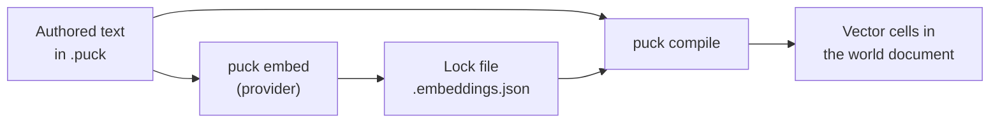

# Vectors and embedding spaces

A **vector** row stores meaning as numbers. An embedding model turns a sentence
such as "Bandits ambushed the caravan" into a list of numbers, and sentences with
similar meanings get similar lists. Puck stores those lists as exact integer
vectors, so rules can ask which memory is closest to the current situation, blend
a faction's mood toward an event, or pick the line of dialogue that best fits the
moment, all deterministically. This article covers embedding spaces, how vectors
are stored and compared, the vector transforms, and how authored text becomes
vectors through `puck embed`. It assumes you know [rows and cells](data-model.md).

## Declare a space and vector rows

A caravan guard in the running example remembers what has happened and reacts to
it:

```puck
state {
  spaces {
    space lore { model: "puck-fixture" revision: "1" dimensions: 256 }
  }

  world {
    table events space(lore) {
      ambush = "Bandits ambushed the caravan on the north road"
      gift = "A stranger shared bread and water with the guards"
    }
    table memories capacity(16) evicts space(lore)
    table stance capacity(4) space(lore) {
      guards = "Wary but fair"
    }
    slot situation = "Travellers approach the gate at dusk" space(lore)

    table lines embeds(lineVectors) {
      warn = "Stay close to the wagons tonight."
      thank = "Your kindness will not be forgotten."
    }
    slot reply = ""
  }
}
```

This fragment declares:

1. `lore`, an **embedding space**. It names the model that produces the vectors,
   the model's revision, and the number of components in each vector.
2. Four vector rows. The `space(lore)` modifier makes each row a `Vector` row in
   that space. Each authored string is replaced at compile time by its vector,
   which `puck embed` has recorded in a lock file beside the source.
3. `lines`, a `Text` table with `embeds(lineVectors)`. It keeps its text, and the
   compiler adds a companion vector row, `lineVectors`, with the same keys.
4. `reply`, a text slot a rule fills with the key of the best line.

A space's name must be a valid row name of at most 128 characters, its model and
revision are non-empty strings of at most 128 characters, and its dimension count
is from 8 to 1,024. A section can declare up to 64 spaces. When a section declares
a single space, a vector row that names no space belongs to it.

The model, revision, and dimension count together are the space's
`EmbeddingIdentity`, which `StateSpace.Identity` carries. It's the one identity
that a world's spaces, the embedding lock, `puck embed`, and a host's embedding
providers compare, and two identities are the same space only when all three
fields are equal. `EmbeddingIdentity.TryValidate` refuses each field that's
outside its limit and names the field in the refusal.
Two spaces have the same identity when their `Identity` values are equal; their
names don't take part. A document spells a space flat, with `model`,
`revision`, and `dimensions` beside `name`, through the serializer modifier
`StateSpace.ExtendJson`. The lock files each embedded text under
`EmbeddingText.Hash`: the content pin of the text's UTF-8 bytes.

## How vectors are stored

A vector is a `StateVector`: an immutable array of signed 8-bit components,
normalized so its length is 127. A model's floating-point output is quantized
once, when it's embedded, and from then on every operation is exact integer
arithmetic. That's what makes vector state reproducible on every machine and
backend.

`StateVector.TryCreate` admits a vector only when:

- It has 8 to 1,024 components.
- No component is -128, so every component lies in -127 to 127.
- It isn't all zeros.
- Its length, rounded down to a whole number, is within a small tolerance of
  127. The tolerance grows with the square root of the dimension count: it's 9
  at 256 dimensions and 17 at 1,024.

Every vector that reaches a cell passes this check, whether it came from a
document, a transform, or a host. In JSON a vector cell is an unpadded base64url
string of its components.

## Compare vectors

Three expression functions compare two vectors of the same space:

| Function | Returns | Meaning |
|---|---|---|
| `similarity(a, b)` | `Fixed` | Cosine similarity from -1 to 1. |
| `dot(a, b)` | `Int` | The exact integer sum of component products. |
| `identical(a, b)` | `Int` | 1 when every component matches, 0 otherwise. |

An operand is a vector cell (`stance[guards]`), a vector slot (`situation`), an
`embed("…")` literal resolved through the lock file, or a `vector("…")` literal
holding a base64url payload. Comparing vectors from different spaces is refused
with `VectorSpaceMismatch`, and a non-vector operand with
`VectorOperandNotVector`. If an operand names a cell that doesn't exist, the
result is absent, like any other absent read.

```puck
rule "turn-hostile" {
  mode: Edge
  when similarity(stance[guards], embed("danger and betrayal")) > 0.55
  hostile = 1
}

rule "measure" {
  when dot(stance[guards], situation) > 12000 : Int
  hostile = 0
}
```

These rules assume an Int slot `hostile` beside the rows above. A gate
comparison between two expressions computes in `Fixed` unless it carries a kind
suffix. `dot` and `identical` return `Int`, so a comparison against either one
ends with `: Int`. Without the suffix, the compiler refuses the gate because an
Int value sits where a Fixed one is required.
[Rules and firing](rules.md#the-authored-model) describes the suffix.

### Similarity and dot

`similarity` divides the dot product by the product of both vectors' actual
lengths, so it's the true cosine of the two stored vectors, computed exactly and
rounded half to even into Q48.16. Two identical vectors score `1.0`,
perpendicular vectors score `0.0`, and opposite vectors score `-1.0`.

`dot` skips the division. Because stored vectors all have length close to 127,
two identical vectors have a dot product near 127 × 127 = 16,129, and `dot`
ranks candidates in nearly the same order as similarity. It's also cheaper: a
similarity costs about three passes over the components and a dot product one.

## Transform vectors

Four transforms read and write vector rows inside a rule, and an ordinary
assignment copies a vector:

```puck
rule "remember-ambush" {
  mode: Edge
  when caravanAttacked == 1
  transform remember(into: memories, key: ambush, from: events[ambush], unlessWithin: 0.9)
  situation = events[ambush]
  transform mix(into: stance[guards], terms: [
    { from: stance[guards], weight: 3 }
    { from: events[ambush], weight: 1 }
  ])
  transform nearest(from: memories, query: situation, into: recalled, k: 3, threshold: 0.5)
  transform nearest(from: lineVectors, query: situation, into: reply, k: 1)
}
```

When the caravan is attacked, the guard stores the ambush in memory (unless an
almost identical memory is already there), sets the current situation to the
ambush, shifts its stance a quarter of the way toward it, recalls the three
memories closest to the situation, and picks the line that best fits. The rule
also assumes an Int slot `caravanAttacked` and `recalled`, a keyed `Fixed` table
with a capacity of 3.

| Transform | Parameters | What it does |
|---|---|---|
| `nearest` | `from`, `query`, `into`, `k`, and optionally `threshold`, `where`, `exclude`, `farthest` | Ranks a keyed vector table against a query and writes the best matches. |
| `mix` | `into`, `terms: [{ from, weight }, …]` | Writes the weighted sum of vectors, renormalized. |
| `remember` | `into`, `key`, `from`, `unlessWithin` | Stores a vector unless the table already holds a near duplicate. |
| `mean` | `from`, `into`, and optionally `where` | Writes the renormalized average of a table's vectors. |
| copy | `into = from` | Copies one vector into a vector cell unchanged. |

### nearest

`nearest` scores every cell of a keyed vector table (`from`) against a query
vector and keeps the top `k`. What it writes depends on the destination:

| Destination | Writes | Score |
|---|---|---|
| A keyed `Int` table with a capacity | Up to `k` cells, each the key of a match holding its score. | Dot product |
| A keyed `Fixed` table with a capacity | Up to `k` cells, each the key of a match holding its score. | Cosine similarity |
| A `Text` slot | The winning key's name. `k` must be 1. | Cosine similarity |

`k` ranges from 1 to the destination's capacity, and never more than 256. A keyed
destination is replaced whole: its old cells are removed first, so it names only
this ranking's matches. Each score is admitted through the destination row's own
range, and a score the row can't hold refuses the transform. The optional
parameters narrow the ranking:

- **`threshold`** drops candidates scoring below it (or above it, with
  `farthest`). It's an integer for an `Int` destination and a decimal otherwise.
- **`where`** names a keyed `Bool` row; only keys where it's true are ranked.
- **`exclude`** skips one key, such as the item you're finding neighbors for.
- **`farthest: true`** ranks lowest scores first, which finds the least similar
  candidates.

Equal scores are ordered by key, in ordinal order.

### mix

`mix` multiplies each term by its integer weight, adds them component by
component, and renormalizes the sum to length 127. A mix takes 1 to 32 terms, and
each weight is a nonzero integer from -1,000 to 1,000. A negative weight pushes
the result away from that term. If the terms cancel to zero, the transform is
refused with `VectorMixZero`. Renormalization uses exact integer arithmetic, so
repeated mixes over a long run neither drift in length nor collapse toward zero.

### remember

`remember` stores `from` under `key` in a keyed vector table with a declared
capacity, unless some *other* cell of the table already has a cosine similarity
of at least `unlessWithin` with it. The threshold is a decimal from 0 to 1. A
skipped near duplicate is a success that writes nothing: the table already
remembers that direction. A new key is subject to the table's capacity, and with
`evicts` it drops the oldest memory. An existing key is rewritten in place.

### mean

`mean` averages the vectors of a keyed table, optionally only those whose key is
true in a `where` row, and writes the renormalized result into one vector cell. A
mean with no admitted candidates, or whose sum is zero, is refused with
`VectorMeanEmpty`.

### Guarantees

A vector transform either completes or changes nothing. It opens a journal
scope before its first write and rewinds that scope on any refusal, and the
refusal then rewinds the firing, as [Rules and firing](rules.md) describes.
Every vector a transform writes passes `StateVector.TryCreate` first, the same
check a document's vectors pass. Scoring, normalization, and ranking all come
from `VectorTransforms`, which builds on the signed-byte kernels in
`Puck.Maths`, so a host that calls those kernels gets the same numbers a rule
does.

The compiler checks that every operand belongs to the destination's space. At
runtime the arena checks dimensions and refuses a mismatch with
`VectorSpaceMismatch`.

## Pair text with vectors

`embeds(companion)` on a `Text` table asks the compiler to create a companion
vector row with the same keys. Each authored text is embedded through the lock
file, and the companion copies the table's `capacity`, `evicts`, and
`visibility`. A second argument names the space when more than one is declared.

The pairing turns similarity back into text. `nearest` ranks the companion
`lineVectors` against the situation and writes the winning key, such as `warn`,
into the `reply` slot. That key names the matching cell in both `lines` and
`lineVectors`, so the game reads the line without embedding anything at runtime.

## Lock embeddings with puck embed

Embedding happens offline, before the world runs. `puck embed` finds every
authored text that needs a vector, meaning each `embed("…")` literal and each
string in a vector table or slot, and writes the vectors to a **lock file** beside
the root source: `lore.world.puck` gets `lore.world.embeddings.json`.



Only `puck embed` talks to a provider. `puck compile` combines the source with
the lock file and writes the vectors into the compiled document, where rules read
them like any other cells.

```text
puck embed worlds/caravan/lore.world.puck
puck compile worlds/caravan/lore.world.puck --validate -o lore.world.json
```

The lock file groups entries by space. Each entry is keyed by the SHA-256 hash of
its text and holds the text and its base64url vector. The file is written
deterministically, only when its bytes change, and `puck embed` prunes entries
that no authored text uses. You commit it with the source.

`puck compile` reads vectors from the lock and never calls a model. It refuses a
text with no lock entry ("No embedding lock entry … run puck embed"), and a space
whose model, revision, or dimensions differ from the lock's ("Embedding space
'lore' in lock is stale; run puck embed").

`puck embed` options:

| Option | Effect |
|---|---|
| `--check` | Verifies that every text is locked and fresh without contacting a provider. Use it in CI. |
| `--provider fixture` | Uses the offline fixture provider. It's the default for the `puck-fixture` model. |
| `--provider openai-compatible --endpoint <url>` | Calls an Azure OpenAI endpoint, authenticating with Azure identity. |
| `--omit-dimensions` | Leaves the dimension count out of embedding requests. |
| `--batch-size <n>`, `--timeout-seconds <n>` | Tune requests: 1 to 2,048 texts per batch (default 64), and a timeout in seconds (default 60). |

`puck embed probe <path> <text>` ranks the locked vectors against a query text by
similarity and dot product, which helps you choose thresholds. The
`world.state.similar` console verb does the same against a running world.

> [!NOTE]
> The `puck-fixture` model produces deterministic pseudo-random vectors from a
> hash of the text. They're reproducible and good for tests, but their
> similarities carry no meaning. Use a real model when a world depends on meaning.

### Recover from a model change

Changing a space's model or revision changes every vector's coordinates, so the
lock goes stale and the world won't compile until you re-embed. Run `puck embed`
again: it re-embeds every authored text under the new model and rewrites the lock.
The authored text is the source of truth, so no vector needs editing by hand.
`puck decompile --embeddings <file>` maps vectors in a compiled document back to
their text through a lock file.

## What a vector row can carry

A vector row is a slot or a keyed table (`keys` domain). It admits `capacity`,
`evicts`, `visibility`, and `space`. Puck.World's validator and the `.puck`
compiler refuse everything else on a vector row: `min`, `max`, `overflow`,
`advance`, `dynamics`, `cycle`, `draw`, `valuesFrom`, `inverse`, `phase`,
`phaseOf`, `gatesDrive`, `field`, and any other domain. Rules can write a vector
cell only with an assignment or a transform; `+=`, `schedule`, and `push` are
refused with `VectorEffectNotAdmitted`. A HUD can't bind to a vector row.

A vector transform writes what its sources and filters hold, so it can't write a
row that a wider audience reads than the rows it reads: a `mean` filtered by a
hidden mask lands in a row with the mask's audience or is refused with
`TransformWidensAudience`. See
[What a transform may write](transforms.md#what-a-transform-may-write). A remote
client handed a vector row through its projection also receives that row's space
declaration, so the row loads as a vector row of that space.

Storage is bounded. A row's capacity times its space's dimensions must not exceed
65,536 bytes; a keyed row without a capacity counts as 128 cells, so at 1,024
dimensions it needs a capacity of 64 or less. All vector rows in a section
together must not exceed 4 MiB.

A record field can be a vector too (`mood: Vector space(lore)`).
[Records, pools, and handles](records-and-pools.md) describes how hosts read and
write it.

## Common designs

These are the designs vector rows are most often used for. Each one combines
the reads and transforms described above.

| Design | How to build it |
|---|---|
| A character remembers and recalls what matters in the moment | `remember` events into an evicting table unless a near duplicate exists; `nearest` recalls the memories closest to the current situation. |
| Factions, moods, or relationships drift | `mix` for fast drift, or `mean` over an evicting history table for slow drift. Gate behavior on a `similarity` threshold. |
| Move away from an idea, contrast, or analogy | `mix` with negative weights. |
| Items, recipes, or hints find their kin | `nearest` over a catalog, with `where` to restrict candidates and `exclude` to skip the item itself. |
| Dialogue that fits the moment | A `Text` table declared `embeds(vectorRow)`; `nearest` writes the best key into a `Text` slot. |
| A character understands a player | A chat table doubles as a runtime embedding request table in Puck.World; its vectors feed `nearest`. |
| Semantic word games | Score guesses with `similarity`, and use `farthest` to find the coldest. |
| A check against an inline concept | Compare `similarity(stance[guards], embed("danger"))` with a threshold in a gate. |
| An agent with world memory | An agent writes a vector or a text note, and reads back what `nearest` recalled. |

A search `Score` program can read `dot` and `similarity` too. A rule trace
records each local and each gate conjunct's compared values, including any
similarity, which helps when you tune a threshold.

## Limitations

The simulation never runs an embedding model. That keeps every tick deterministic
and offline, and it's why several capabilities are absent on purpose:

- **No inference in the engine.** The tick, the compiler, the linter, the
  formatter, and the language server never produce vectors. Only `puck embed` and
  an operator-approved Puck.World host service do.
- **No in-process models.** Nothing runs a model inside Puck. The providers that
  ship are the fixture and Azure OpenAI.
- **No API keys.** Every remote provider authenticates with identity.
- **Vectors only.** A provider returns vectors, never generated text.
- **No approximate index.** `nearest`, `remember`, and `mean` scan every cell of
  their table, and their cost grows with its capacity.
- **Vectors stay out of general expressions.** No binding, component read, or
  arithmetic reaches a vector, and `dot`, `similarity`, and `identical` are the
  only functions over vectors. There's no distance or norm function.
- **Addons and cartridges can't write vectors.** The addon mutation decoder
  refuses a vector cell, and the cartridge vocabulary has no vector kind.
- **Authored text is embedded at compile time only.** Text that a rule writes at
  runtime isn't embedded unless a Puck.World embedding connection is configured
  for its table.

## Key types

| Type | Project | Purpose |
|---|---|---|
| `StateSpace` | Puck.State | One embedding space: model, revision, and dimensions. |
| `StateVector` | Puck.State | An admitted, normalized signed-byte vector. |
| `VectorTransforms` | Puck.State | The exact kernels for mix, mean, nearest, and remember. |
| `StateTransform.Nearest`, `.Mix`, `.Mean`, `.Remember` | Puck.State | The authored transform records. |
| `ArenaVectorTransforms` | Puck.State.Vectors | The transforms as journaled operations over a `StateArena`. |
| `VectorColumn` | Puck.State.Vectors | The typed view over one row's vector column. |
| `VectorTransformRefusal` | Puck.State.Vectors | A refused transform's code and reason. |

## Next steps

- [Rules and firing](rules.md): how a transform's refusal rewinds the firing.
- [State transforms](transforms.md): the other transforms that share the
  transform statement.
- [State in Puck.World](worlds.md): runtime embedding connections.

## See also

- [The Puck CLI reference](../cli.md)
- [World vocabulary: space and table](../world-vocabulary.md)
- [Reads and expressions](expressions.md)
