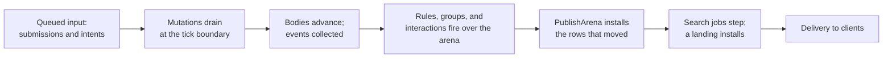

# State in Puck.World

Puck.World is the largest host of the state engine. A world document declares
its state and rules, the authoritative server evaluates them over an arena
every tick, and clients receive what changed. This article follows that path
end to end: how a world declares state, which world-only facts and effects the
server registers, how a rule's write reaches everyone else, how search and the
console fit in, and how you verify a change. It's for world authors who want to
know what their `state` section does at run time, and for developers working
in `Puck.World.Server` and `Puck.World.Schema`.

## How a tick moves state

A tick takes input, runs the rules over the arena, publishes what moved into
the installed document, and delivers it to clients.



1. Console commands, addon writes, and peer submissions queue in the ordered
   domain and drain in order at the start of the step. Each one runs through
   the ordinary mutation pipeline: admission, composition, whole-document
   validation, capacity checks, and the journal.
2. Bodies advance and the step collects this tick's events, so a rule that
   reads a region's occupancy sees the settled positions.
3. `WorldRuleHost.EvaluateWorldRules` evaluates the ungrouped rules in document
   order, then the rule groups, then the interactions, all over the server's
   `StateArena`. Each firing is its own journal scope.
4. `WorldServer.PublishArena` installs the rows whose version moved into the
   installed document and settles every consumer that keeps a copy.
5. The search jobs advance over the settled position. A finished job's outputs
   install through the same mutation pipeline as a console write.
6. A tick that moved anything delivers once to the connected clients.

The rest of the article explains each of those steps.

## Declare state in a world

A world's `state` section is where rows, topologies, records, and pools live.
The fragment below is a complete world that compiles and validates. It carries
the running example: an Int slot `coins`, a keyed row `pieceCell` over a board
topology, an ordered pile `hand`, and a `units` pool whose record has an `hp`
field.

```puck
schema: "puck.world.definition.v1"
documentId: "parlor-state"

state {
  lattices [
    grid(name: "table", origin: [0, 0, 0], cellSize: 1, width: 4, depth: 4, wrap: None)
  ]

  record Unit {
    hp: Int bounds(0..20) = 10
  }
  pool units of Unit capacity(4) = [{ hp: 10 }]

  world {
    slot coins = 3 bounds(0..99)

    row {
      name: "board"
      kind: "Int"
      domain: cellsOf(topology: table)
    }

    table pieceCell bounds(-1..15) {
      knight = 0
      rook = 5
    }

    table cards capacity(3) {
      ace = 0
      king = 1
      queen = 2
    }

    pile hand of cards capacity(3) {
      ace
      king
    }
  }
}

rule "pay-for-a-card" {
  when coins >= 3
  mode: Edge
  coins = coins - 3
}
```

`.puck` compiles to the world's JSON document, which is the wire form every
shipped world stores. The declaration forms (`slot`, `table`, `pile`, `grid`,
`row`, `record`, `pool`) and every field they accept are described in the
[world schema guide](../../../src/Puck.World.Schema/README.md#the-state-documentgenre-neutral-game-state-one-cell-substrate)
and the generated [world vocabulary](../world-vocabulary.md). What the rows
mean is covered by [Rows, cells, and values](data-model.md) and
[Records, pools, and handles](records-and-pools.md).

### Lanes

The state section has three **lanes**, and each row belongs to one of them:

| Lane | Declared in | Holds |
|---|---|---|
| Document | `state.world` | The world's own rows. They're addressable by name (`state:<name>`) and mutable through `world.row.set` and `world.state.cell.set`. |
| Participant | `state.body` | Per-body counters and timers, compiled into each body's bounded arrays. They're ephemeral: they belong to the body. |
| Identity | `state.identity` | Per-body counters and timers synchronized with the owned identity's own document, so they persist with the player. |

The participant and identity lanes together may declare at most 128 slots
(`StateCapacity.MaxBodySlots`), because the server allocates fixed arrays of
that length for every body. The catalog records each row's lane, and a
processor resolves `(lane, name)` once to a handle.

### World rows and rules

`WorldStateRow` is the engine's `StateRow` plus the traits only a world reads:

- `gatesDrive` marks a keyed row whose cell for each body (keyed by the body's
  0-based entity index) is checked every tick before that body's drive or
  action intents are admitted. A nonzero cell refuses them until it reads zero
  again.
- `field` marks a row over the physical field topology, served by the physics
  host (see [Rows the server owns](#rows-the-server-owns)).
- `verdict` and `witness` mark the rows a `.puck` `test` block lowers to. Only a
  rule's own effect may write them.

`WorldRule` is the engine's `Rule` plus an optional `decision`. Both wrappers
forward the base record's constructor fields, so a world row or rule carries
everything the engine's own type does and the engine evaluates it the same way.

## The world's registered families

Puck.World extends the rule compiler the way any host does (see
[Host and extend the state engine](hosting.md)):

- **`WorldFactsVocabulary.Instance`** is the `RuleVocabulary` every world
  compile shares. Its operand family answers the reserved world channels:
  `$population`, `$physics:quiescent`, `$region:`, `$influence:`, `$machine:`,
  `$argmax:`, `$argmin:`, `$distance:`, `$los:`, `$upright:`, `$fact:`,
  `$identity:`, `$nav:`, `$parked:`, `$link:`, `$channel:`, `$nearest:`,
  `$clock:`, and `$board:cellOf:`. Its key family answers `$pair:`. Its effect arms cover body motion and
  impulses (`setVerticalVelocity`, `scaleVerticalVelocity`, `planarImpulse`,
  `applyRigidImpulse`), `startTimer`, `designate`, `emitCue`,
  `pose` and `poseCell`, `paintField`, placement and HUD panel upserts and
  removals, `setIdentityFact`, and `save`. The four body-motion effects —
  `setVerticalVelocity`, `scaleVerticalVelocity`, `planarImpulse` and
  `designate` — are one operation in a kit's action and in a rule: a kit's
  action acts on its own body, and a rule names the body with `key`
  (`WorldBodyEffects` is the one check both scopes lower through). Its predicate arms `held`, `now`,
  `recently`, and `timerElapsed` belong to body programs; a rule that uses one
  is refused with `RuleRefusal.PredicateKindInadmissible`.
- **`WorldFactsCompileContext`** is the derived compile context. It carries the
  world definition, resolves body references, anchors topologies in a
  placement's frame, and prices reads that scan the population at its capacity.
- **`IWorldFacts`** is the facet. Every world operand derives from
  `OperandFact<IWorldFacts>` and every world effect from
  `EffectFact<IWorldFacts>`, so a rule that reads a body names `IWorldFacts` in
  its needs.
- **`CompiledWorldFactsRule`** extends `CompiledRule` with a decision or an
  interaction, and overrides `CollectReads`, `CollectWrites`, and
  `CostBreakdown` so every analysis sees them.

`WorldJsonVocabulary.Extend` installs the registered arms, and the
`WorldFieldTopology` case of `LatticeTopology`, into the document serializer.

## The rule host

`WorldRuleHost` is the server's rule host. It implements `IStateReader`,
`IEffectHost`, `IArenaTransformHost`, `IArenaUndoHost`, `IRuleOwner`,
`IRuleRefusalSink`, and `IWorldFacts`, and it holds one `RuleEvaluator`, a latch
for rules, and a separate latch for interactions.

Every compiled rule, group trigger, and decision is admitted against this host
once, when the rules are installed. Nothing on the tick path asks again. As an
`IRuleOwner`, the host claims interactions and decisions and runs each
evaluation back through `RuleEvaluator.EvaluateOnce`, binding pool carriers into
lexical instance registers for the duration. As an `IRuleRefusalSink`, it
narrates the first refusal of each category on the `world.rule` channel;
`world.rule.failures` reads the exact running counts.

## Where a rule's write lands

During rule evaluation, every state effect writes the arena inside its own
firing's journal scope, and every rule reads through the same arena. One
firing is committed on success and rewound on the first refusal. Effects that
leave the arena come in two kinds:

- A **transactional arm** (`EffectNeeds.Transactional`), such as a placement or
  HUD panel upsert or removal, composes with the firing's other document rows
  into one `WorldMutation.Batch`. `WorldDocument.TryPrepareMutation` runs every
  gate that can refuse it while the firing can still rewind, and
  `InstallPrepared` installs it after the commit and refuses nothing.
- A **delivered arm** (`EffectNeeds.Irreversible` alone), such as a cue, a pose,
  a body motion, a rigid impulse, a field paint, or a save, is preflighted before
  the commit and fired after it. A failed delivery is counted and undoes
  nothing.

The firing sequence and each arm's promise are explained in
[Rules and firing](rules.md).

### Publication

Nothing outside the arena sees a rule's write until the rules finish.
`WorldServer.ProposePublication` composes what a publication would install: it
reads back only the rows whose version moved since the document and the arena
last agreed, plus rows an open scope has written, and keeps every other
installed row. Document values that read a moved row (a placement's position
bound to `state.spot`, for example) are re-resolved. `PublishArena` adopts that
proposal, marks state delivery pending, and calls
`WorldDocument.ReconcileStateConsumers`.

`ReconcileStateConsumers` is the same routine a value mutation ends in. It
brings every consumer that keeps its own copy of a state value up to date: the
grant table's drive gates, the field lattice's input, each body's scale, and
the cell-driven inhabit counts. A new consumer belongs there too, so it doesn't
depend on where a value came from. For the reasoning, see decision D4a in
[State and the authoring language: decisions](../../decisions/state-and-language.md).

Row versions also drive the rule scheduler: a rule whose read rows haven't
moved keeps its closed verdict (see
[Rule analysis, scheduling, and work budgets](analysis.md)).

### Delivery to clients

A tick that moved anything delivers once. A value-only change delivers through
`DeliverState`; a change to a row's shape delivers through `DeliverDefinition`.
What a peer receives depends on the **disclosure tier** its admission entry
grants:

| Tier | What the peer receives |
|---|---|
| `replica` | The world document verbatim, `state` included. |
| `presentation` (the default) | A projection document with no `state` section. Every `state.<row>` binding is resolved to its value by the authority, and state observations are composed per recipient through `WorldStateDisclosure`, so a hidden cell or zone isn't sent to a reader its visibility doesn't admit. A placement dealt from a hidden cell crosses as the deal would deal it from the reader's own rows: the template's own prototype for a hidden variant, nothing for a hidden dealt cell. A placement whose `respond` conditions read a hidden cell shows the first entry that holds over what the reader may read (its own cells and the field lattice), or its authored prototype. The observations become plain state rows in the document a remote client rebuilds. |
| `frames` | No document at all. |

The [world schema guide](../../../src/Puck.World.Schema/README.md#the-egress-documentswhat-leaves-an-authority)
owns the projection's exact member list.

## Rows the server owns

A row carrying the physical `field` trait is **host-owned**: the arena holds its
descriptor and no cells, the physics field lattice serves its values through
`IWorldFacts.TryReadHostOwnedCell` and `TryReadHostOwnedSlot`, and no rule
writes it. Puck.World derives the mark when it builds the state section; it has
no wire form.

Because the arena stores nothing for these rows, the arena's hash skips them.
The server folds them into the world hash as a separate component,
`HostOwnedRows`, through the field lattice's own `AppendStateHash`, and the
state export writes them under `fields`.

## Records, pools, and carriers

A world keeps its pool declarations and their snapshots in `state`. The rows a
pool generates are runtime storage: they're never authored, named by a rule, or
serialized as ordinary rows.

### Carriers

An interaction binds a pool instance to a body through `properties.carriers`.
A carrier names a pool, an enum field of its record, and one binding per enum
member: a named single-inhabitant placement, a zero-based local seat, or neither
for an explicitly detached instance. The validator enforces these rules:

- Every enum member has one binding. A missing or duplicate binding is refused,
  and so is a binding that names both a placement and a seat.
- The field is an enum field with no advance trait.
- A seat is one of the world's local seats, and a placement declares a single
  inhabitant.
- A pool that takes part in a body interaction has one carrier declaration.

The paddleball world carries its ball and paddles this way:

```puck
properties {
  names []
  carriers [
    { pool: paddleballBalls, field: body, bindings [{ member: Detached }, { member: Ball, placement: paddleballBall }] }
    { pool: paddleballPaddles, field: body, bindings [{ member: Detached }, { member: East, placement: paddleballPaddleEast }, { member: West, placement: paddleballPaddleWest }] }
  ]
}
```

This fragment assumes the `paddleballBalls` and `paddleballPaddles` pools and their enum
fields from `src/Puck.World/Assets/worlds/games/paddleball.puck`.

The field and mapping compile once, and live reads use ordinals. A placement
binding follows the population's current body assignment, so a physical body
index never enters pool state. Several instances may share one body; each is a
separate interaction participant with its own evaluation budget. Interaction
geometry uses the carried bodies, while `left.field` and `right.field` address
the instances' records. Releasing an instance removes its carrier, and
reclaiming the slot resolves the new lifetime's own field value.

### Owned identity records

An owned identity can carry typed records with it. `identity.records` selects
pools that travel with the identity:

```puck
identity {
  id: "traveller"
  name: "Traveller"
  color: "#FFFFFF"
  moveSpeedState: moveSpeed
  turnSpeedState: turnSpeed
  records [purse]
}

state {
  record Purse {
    gold: Int bounds(0..999) = 0
  }
  pool purse of Purse capacity(1) = [{ gold: 0 }]

  world {
    slot moveSpeed = 4.5
    slot turnSpeed = 3.5
  }
}
```

This compiles as a complete world document. Each selected pool must have
capacity one with slot zero live, and it can't be selected twice.

`WorldIdentity.TryReadRecord(record, field, out value)` reads a typed field, and
`TryWriteRecord(record, field, value, out reason)` writes one after checking its
kind and bounds. A refused write leaves the identity's document unchanged. A
successful write updates the owned document, which the persistence service
saves.

When the identity travels to another authority or is checkpointed, it carries
only the selected pools and the record, enum, and vector-space declarations they
depend on. None of the world's other rows travel, so unselected state stays
private to the world that owns it.

## Search in a world

A world's `search` section declares jobs (`WorldSearchSection`,
`WorldSearchRow`, and the `WorldSearchShape` cases). `WorldSearchCompilation`
turns each row into a `SearchPlan`: it reads the document's placements and
topologies to fill in what a row leaves implicit (a job over a tabletop board
takes its `turn`, `verdict`, and accepting value from the board binding), prices
the job, compiles its score, and scopes its judge with `JudgeRules`. The search
runtime and what a job produces are covered in [Search](search.md).

`WorldServer` rebuilds its `ArenaSearch` with the rules on every install. Each
job's judge is a `RuleArenaSearchJudge` over an `ArenaSearchEffectHost` on the
server's own arena, admitted at install. Jobs step right after the rules and the
board enforcement pass, so a job judges the position this tick's rules settled.

When a job lands, the server translates its `ArenaSearchWrite`s into ordinary
mutations under the `World` principal. `ArenaSearchWrite.Cell` becomes a
`WorldMutation.UpsertStateCell`, and `ArenaSearchWrite.ClearBoard` becomes a
board-clear state transform. Several writes fold into one `WorldMutation.Batch`.
They install through the same validated pipeline as a console write and deliver
with the same tick.

### The chess opponent

The chess world (`worlds/parlor/chess.puck`) keeps two-player play as its
default. Its `aiSide` slot chooses a computer opponent from the console:

```text
world.state.cell.set aiSide $value 1
```

Use `0` for an opponent playing White, `1` for Black, or `-1` to turn it off.
Here's how the opponent plays:

1. `chess-ai-enable` sets `aiEnabled` only when it's the opponent's turn, the
   game has started, the physics is quiescent, the board has settled with no
   collisions, the last move was judged legal (or nothing moved), and the game
   hasn't reached the move-count or repetition draw limit.
2. `chess-ai-revision` bumps `aiRevision` whenever the settled position
   changes.
3. The `chessAI` job searches one ply. Its judge is the game's own legality
   rules; `chess-ai-evaluate` scores material, central occupation, and pawn
   progress only when `search(ply) > 0`.
4. `chess-ai-request` accepts the answer only when `aiBest[revision]` equals
   `aiRevision`, then the apply rules move the physical pieces with `poseCell`.
   Castling moves both pieces, en passant removes the right pawn, captured
   pieces are placed beside the board, and a promotion becomes a queen.

The opponent is a basic one. It searches one ply, so it doesn't anticipate the
reply, and it never considers underpromotion. A promoted pawn keeps its pawn
model; `pieceCode` carries its new queen identity.

## Read and change state from the console

Every verb below is an ordinary console command, so it's subject to the acting
principal's grants and can be scripted through stdin.

| Verb | What it does |
|---|---|
| `world.state [row] [key]` | Reads the live state section as the caller's visibility shows it: every row, one row and its cells, or one cell. A row naming an enum prints each value by its member's name. |
| `world.state.cell.set <row> <key> <value> [add]` | Upserts one cell of a declared row. A slot's key is `$value`. On a text row, everything after the key is the text. On a row naming an enum, the value may be a member's name. |
| `world.state.cell.remove <row> <key>` | Removes one cell from a declared row. |
| `world.state.transform <transform-json>` | Applies one atomic state transform, checking edit authority over every row it touches. |
| `world.state.act <phase-row> <sequence> <transform-json>` | Submits a phase-guarded state operation, refusing stale, ineligible, ready, or expired actions. |
| `world.state.observe` | Reads the state observations the calling principal may see. Hidden cells and identities are omitted. |
| `world.observe <principal>` | Composes the observations a named principal would see. The console may name anyone, to inspect another seat's disclosure; any other caller may name only itself. |
| `world.state.similar <row> <key> <table> [top]` | Ranks the cells of a vector row by similarity to a query vector, through the caller's visibility. |
| `world.state.hash [capture\|pose\|world\|authoritative]` | Reads a live deterministic state hash for one scope (see below). |
| `world.row.set state <row-json>` | Declares or re-declares a whole row. `world.row.remove` removes one. |
| `world.generate <row> [key ...]` | Redraws a draw site. |
| `player.state.cell.set <player> <row> <key> <value> [add]` | Upserts a cell at the authority where the player's body currently lives. |
| `player.state.cell.toggle <row> <key> <a> <b> [...]` | Cycles a cell through authored values for the acting seat. |
| `identity.facts [player]`, `identity.fact.set <key> <value> [player]` | Reads or writes the integer facts an owned identity carries. |
| `world.search` | Lists every search job's progress. |
| `world.rule.trace <rule> [evaluations]` | Captures a rule's next evaluations, from 1 to 256, and reads them back. |
| `world.rule.hazards [top]`, `world.budget.rules [top \| --why <rule>]`, `world.rule.failures` | Read the analyses described in [Rule analysis, scheduling, and work budgets](analysis.md) and the refusal counts. |
| `world.tables`, `world.patterns`, `world.topologies`, `world.topology`, `world.match` | Echo tables, compiled patterns, and topologies, and walk one word through a pattern. |
| `world.undo [n]` | Undoes the last applied mutations by replaying the journal minus its tail. |

Read-backs land on stdout; refusals, mutation echoes and host log lines land on
stderr.

Every verb reads state as its caller may see it. The console reads the whole
document. A seat's own console, a bound input, an addon or a peer reads through
its visibility: `world.state`, `world.row state`, `world.tabletop` and
`world.hud.template` show only the cells the caller may read, and a direct read of
a withheld cell is refused by name, the same way whether the cell is withheld or
absent. `world.match` refuses a row anything is withheld from. The evaluation
diagnostics (`world.rule.trace`, `world.rule.failures`, `world.search`,
`world.decisions`, `world.responses`, `world.rules`, `world.verdicts`) print values
the rules computed, so they answer the console alone. The local HUD is not filtered:
it draws the one shared screen, and the world's author chooses what it shows. The
[World guide](../../../src/Puck.World/README.md) covers running a world and
scripting it through stdin.

## Hashes, checkpoints, and replay

`world.state.hash` reads one of four scopes:

| Scope | Covers |
|---|---|
| `capture` (default) | The population digest, then every authored `state.world` cell's live value and clock. It matches the hash in capture manifests. |
| `pose` | Every active body's pose, rigid residue, and carry relationship. |
| `world` | The arena's contents, the host-owned rows, the state declaration, and the topologies. |
| `authoritative` | Everything in `world` and `pose`, plus the rule and interaction latches, rule-group progress, decisions, board enforcement, body and identity action state, navigation, flock perception, and search progress. |

The authoritative scope is built from a fixed, ordered list of named components
(`WorldStateHashComposition`), so what a hash covers changes only by a
deliberate edit to that list. Rule scheduling caches are never part of any hash.

A checkpoint carries the same state, and search progress rides along through
`ArenaSearch.Capture`. The replay tape records submissions and the rate history
and reproduces the authoritative trajectory. A matching replay proves the hashed
authoritative state; the document, the grant table, and the HUD are outside that
hash. The world-level rules for transfer,
determinism, and replay are in [Worlds and federation](../../architecture/worlds.md),
and the tape format is in the
[server guide](../../../src/Puck.World.Server/README.md#deterministic-replay-worldreplaytapecs-worldreplaytapedrivecs-worldreplaysnapshotcs).

## Verify world state behavior

Verify a change to world state behavior by running the real `Puck.World`
executable. Three kinds of committed evidence do that: the canaries under
`tests/Puck.World.Canaries/`, which drive the executable through stdin and
check its output; the shipped-world state baselines, which record each game's
canonical state export after a fixed input sequence; and `.puck` `test` blocks,
which `puck test` runs as scheduled worlds with verdict rows.
[Verify state changes](testing.md) explains when to use each one and how to
run it.

## Limitations

- A reader outside the rule loop (a body, a field, the console, a search job)
  sees a rule's write only after publication.
- A delivered arm can't be rolled back with its firing.
- A search judge can't read world-only facts, so a rule that needs one is left
  out of the judge or refuses the job.
- Only capacity-one pools can be identity records, and an identity carries only
  the pools it selects.
- A `presentation` peer never receives the `state` section itself, only resolved
  values and the observations its visibility admits.

## Key types

| Type | Project | Purpose |
|---|---|---|
| `WorldStateSection`, `WorldStateRow` | `Puck.World.Schema` | The world's state section and its row type. |
| `WorldRule` | `Puck.World.Schema` | A world rule, with an optional decision. |
| `WorldFactsVocabulary`, `WorldFactsCompileContext`, `IWorldFacts` | `Puck.World.Schema` | The registered world families, compile context, and facet. |
| `CompiledWorldFactsRule` | `Puck.World.Schema` | A compiled rule carrying a decision or interaction. |
| `WorldPoolBodyCarrier`, `WorldPoolBodyBinding` | `Puck.World.Schema` | A pool's enum-to-body mapping. |
| `WorldIdentity`, `WorldIdentityRecords` | `Puck.World.Schema` | An owned identity and its selected records. |
| `WorldSearchSection`, `WorldSearchRow`, `WorldSearchShape`, `WorldSearchCompilation` | `Puck.World.Schema` | The `search` section and its planner. |
| `WorldStateDisclosure`, `WorldProjection` | `Puck.World.Schema` | What a peer below the replica tier may see. |
| `WorldRuleHost` | `Puck.World.Server` | The server's rule host. |
| `WorldServer` | `Puck.World.Server` | The tick, the arena, publication, and search. |
| `WorldStateHashComposition` | `Puck.World.Server` | The named, ordered hash components. |
| `WorldStateExport` | `Puck.World.Server` | The canonical state export used by baselines and schedules. |

## Next steps

- [Search](search.md): what a world's search jobs can do.
- [Rules and firing](rules.md): the firing sequence the world host takes part in.
- [Host and extend the state engine](hosting.md): the interfaces `WorldRuleHost`
  implements.

## See also

- [World schema guide](../../../src/Puck.World.Schema/README.md)
- [Server guide: rule effects land on the arena](../../../src/Puck.World.Server/README.md#rule-effects-land-on-the-arena-worldrulehostcs-worldserverarenacs-worldrulehostarmscs)
- [Worlds and federation](../../architecture/worlds.md)
- [Capture and recording pipeline](../recording.md), for video capture of a
  running world, which is separate from the replay tape
