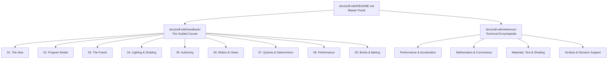

# Signed Distance Fields (SDF) Architecture

Welcome to the **Puck Signed Distance Field (SDF) Knowledge Vault**.

Puck renders its 3D world not through traditional polygonal meshes or rasterized triangles, but through **interpreted signed-distance field programs evaluated directly on the GPU**. Every object, mountain, plaza, and avatar is defined as a mathematical distance field, composed through constructive solid geometry (CSG), marched via sphere tracing, and shaded across a 5-pass compute pipeline holding bit-for-bit cross-platform determinism.

---

## Dual Reading Tracks

This vault is organized into two complementary tracks:

### Track 1: The Guided Course ([`handbook/`](handbook/README.md))
A 9-chapter sequential book written to be read front-to-back by human contributors, students, and engineers seeking a deep mental model of the engine:

| Chapter | Core Subject |
|---|---|
| **[1. The Idea](handbook/01-the-idea.md)** | Distance fields, CSG composition, sphere tracing, and interpreted scene data vs. compiled shaders. |
| **[2. The Program Model](handbook/02-the-program-model.md)** | Bytecode streams, running accumulator, Lipschitz step clamping, and instruction set architecture (ISA). |
| **[3. The Frame](handbook/03-the-frame.md)** | 5 GPU compute passes, primary march, ray generation, tile culling masks, and frame rings. |
| **[4. Lighting & Shading](handbook/04-lighting-and-shading.md)** | Analytic normal calculation, cone-traced penumbra shadows, multi-tap AO, and CRT screens as light emitters. |
| **[5. Authoring](handbook/05-authoring.md)** | Scene construction with `SdfProgramBuilder`, coordinate spaces, smooth minimums (`smin`), and authoring pitfalls. |
| **[6. Motion & Views](handbook/06-motion-and-views.md)** | Presentation anchors, 6 camera rigs, `ViewStack` hypervisor, view transitions, and diegetic screens. |
| **[7. Queries & Determinism](handbook/07-queries-and-determinism.md)** | `IWorldQuery`, exact fixed-point evaluation, distance probes, raycasts, and derived surface gravity. |
| **[8. Performance](handbook/08-performance.md)** | Cost modeling, occupancy, view-bound vs beam-bound bottlenecks, and measurement hygiene. |
| **[9. Bricks & Baking](handbook/09-bricks-and-baking.md)** | The one sanctioned cache: sampled 3D distance bricks, the $\sqrt{3}$ march-safety rule, and invalidation lifecycles. |

---

### Track 2: The Technical Encyclopedia ([`reference/`](reference/README.md))
Encyclopedic articles, formal proofs, and empirical verdicts for graphics engineers looking up contract facts:

- **[Performance & Raymarching Acceleration](reference/README.md#performance--raymarching-acceleration)**:
  - [Marching Acceleration](reference/marching-acceleration.md) — Over-relaxation and step bounding.
  - [Hierarchical & Instance Acceleration](reference/hierarchical-and-instance-acceleration.md) — Cone prepasses, uniform grids, and BVHs.
  - [Tape Pruning & Inclusion](reference/tape-pruning-and-inclusion.md) — Interval evaluation and region specialization.
  - [LOD & Bounds](reference/lod-and-bounds.md) — Proxy nodes and segment-level bounds.
  - [March-Loop Scheduling](reference/march-loop-scheduling.md) — Wavefront scheduling and persistent threads.
- **[Correctness, Mathematics & Norms](reference/README.md#correctness-mathematics--norms)**:
  - [Lipschitz & Field Correctness](reference/lipschitz-and-field-correctness.md) — Metric preservation and operation norms.
  - [Gradients & Normals](reference/gradients-and-normals.md) — Analytic forward-mode vs finite-difference normals.
  - [Antialiasing & Filtering](reference/antialiasing-and-filtering.md) — Coverage estimation and beam footprints.
- **[Materials, Shading & Content Primitives](reference/README.md#materials-shading--content-primitives)**:
  - [Shading, AO & Shadows](reference/shading-ao-shadows.md) — Multi-tap ambient occlusion and penumbra estimation.
  - [Materials & Primitives](reference/materials-and-primitives.md) — Smooth polynomial blending and lifted primitives.
  - [Text & Glyphs](reference/text-and-glyphs.md) — Marchable 3D typography and MSDF atlases.
- **[Decision Support & Proofs](reference/README.md#decision-support--verdicts)**:
  - [Technique Verdict Index](reference/verdict-index.md) — Applicability matrix across all evaluated SDF techniques.
  - [Negative Results & Rejections](reference/negative-results-and-rejections.md) — Documented architectural non-goals and triggers.

---

## Standing Engine Constraints & GPU Parity

All SDF shader implementations and simulation evaluators conform to these non-negotiable rules:

1. **Interpreter Dual-Contract**: The C# simulation evaluator (`Puck.SdfVm`) and HLSL presentation shaders (`Puck.Shaders`) form one packed, bit-exact contract.
2. **Conservative Cull Bounds**: Any segment or instance skipped during raymarching must be mathematically conservative; culling paths must evaluate bit-identical distances when active.
3. **Step Scaling (`stepScale`)**: The `map()` function applies the scene's global `stepScale`. Any system comparing distances against world-space metrics must account for this scaling factor.
4. **Cross-Backend GPU Parity**: Presentation shaders hold strict cross-backend parity between Vulkan and Direct3D 12. Parity is verified on-demand via `puck parity` (`tests/Puck.Parity/parity.world.json`), testing three verdicts per capture: content gate, exact `stateHash`, and per-tile pixel tolerances.
5. **Authoritative Representation**: The analytic instruction stream and authored carve lists are authoritative. `SampledRegion` bricks are bounded, invalidatable render caches—never the simulation or persistence representation.
