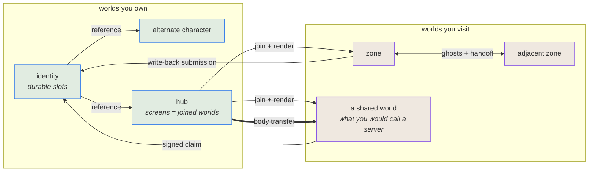

# Puck

Puck is a **notation** — a closed, versioned vocabulary in which a world, the machines inside it, its cameras, its bodies, their appearances, the cartridges they run, and the authority to change any of it are all rows in a document, moved by verbs — together with an interpreter that runs that document deterministically on two GPU backends, and a game whose job is to prove the notation expressive enough to be worth having.

That framing is the whole point. Puck is not a renderer with a scene format bolted on. The document is the primary artifact; the C# is an implementation of it. When you want the world to do something new, you do not reach for a new type — you reach for a new row, or a new verb over rows that already exist.

**This document says what Puck IS — the notation, the discipline, and the world model. It deliberately carries no status.** For what is built and what is next, read [the campaign](campaign.md), which names the check behind every claim it makes. Read the code for implementation detail.

## The layers

**GPU backends.** Two, at parity: Vulkan (SPIR-V) and Direct3D 12 (DXIL). One HLSL source tree per kernel compiles to both, so the same engine renders the same scene on either API. Backend selection is a boot-time categorical choice, not a live lever — swapping compute APIs means rebuilding the render graph.

Parity between the backends is deliberately *relaxed* by default. Floating-point codegen differs between DXC's two outputs in ways that are benign and well understood; the default envelope shrugs at those, and an opt-in strict posture applies calibrated per-family thresholds backed by measured evidence. Parity numbers are drift tripwires, not acceptance criteria. A backend disagreement that clears the envelope is not a success to celebrate; a threshold that is met is not a proof of correctness.

**The SDF VM.** Everything visible is a signed-distance program — words and instances, never a mesh graph. Rendering is compute-shader sphere tracing: mask, beam, cull-args, views, composite. Hardware ray-query exists only as a parity probe against the primary march, never as the shipped path.

The VM is deliberately incurious about what it draws. A diegetic screen samples an opaque image handle; the VM has no idea whether that handle came from an emulator, a camera feed, a window capture, or another world entirely. That incuriosity is what makes hosting work.

**The world document.** `puck.world.def.v1` is what the running game boots from: one closed mutation vocabulary of whole-row upserts and whole-section replacements addressed by stable id, and one thick validator that runs over the *entire* composed candidate document — never a partial section check — before anything swaps in. Applied mutations append to a journal; the journal *is* the undo engine, replaying base-plus-history through the identical apply path rather than restoring stored snapshots. Saving compacts the journal against a new baseline, folding live session state back into its own section homes.

**The game.** `Puck.World` is the live composition root and the only thing you run. It is server-authoritative — the server owns the definition, the entity table and the journal; the client interpolates snapshots and submits intents, and never simulates. Local seats share a screen through data-driven layouts. Editing, sculpting, inhabitation, audio, cabinets and the console all live here.

## The discipline: refuse to grow a noun

The recurring engineering move in Puck is declining to add a type. Novelty goes into data.

The clearest instance: **there is no NPC and no player character.** The discriminator that classified agency was removed. What exists is a body, and a `Drive` grant over that body which is either claimed or unclaimed. A seat claims it, or a console script does, or a WASM addon does, or a deterministic wander producer fills the vacuum. The authorization table became the ontology — four principal kinds (seat, console, addon, peer) and five capabilities (Drive, Observe, Control, Mutate, Edit) over a subject taxonomy, arbitrating everything, with local play seeded permissive so nothing feels gated until someone chooses to narrow trust. That count moved once, from four to five, to model reading — never for a feature, which still earns a section or a subject. A sixth, `Present`, was declared and then deleted without ever gating a draw path.

The same idea sharpens once more at the trust boundary: for principals outside it the table is *materialized as handles they hold* rather than rows someone looks up, so an addon cannot name a subject it was not handed. Refusing to grow a noun, applied to who may say one.

The move recurs everywhere. A camera is an *anchor* (where it rides) and a *rig* (how it frames) — two orthogonal axes, no combinatorial camera classes. A screen is a slot with a producer, and adding an engine means implementing a machine contract, not touching the VM. A creature inhabiting a placement is the same body a player would drive, wearing a creation stamp.

Every enum carries an admission rule. Adding an opcode has a ritual that differs depending on whether it is an isometry. Adding an addon pad id is an ABI-version event. The vocabulary is closed on purpose, and opening it is a deliberate act rather than a convenience.

## Determinism, precisely

Determinism pins the *mapping*, not the values. Same document plus same input yields bit-identical simulation state on every run, machine and backend, at a fixed code version. It is emphatically not output stability across versions: a deliberate correction to math is *expected* to change hashes, and the gates are self-referential so they pin no historical value. Simulation state carries no wall clock, no RNG, no float — fixed-point throughout, input arriving as per-tick command snapshots.

Presentation floats freely. Render scale, upscaling sharpness, interpolation, pacing and artistic choices sit outside the contract. Audio mixes in fixed point end to end and hashes reproducibly; the WASM addon substrate pins its runtime to an exact version because fuel is charged at basic-block granularity and a silent bump would move the exhaustion tick.

## Honesty as the tiebreaker

When principles collide in this repository, honesty wins. Puck does not present a capability it does not have, a number it did not measure, or a state it is not in.

This shows up as engineering, not as sentiment. Authoring acts are checked against a render envelope probed at boot; a placement that would exceed it is rejected loudly with the ceiling named, never silently clamped and never crashed. A budget gate whose ceiling is a catastrophic-regression tripwire says so rather than posing as a calibrated budget. The audio device stack plays silent and retries rather than pretending. When an engine cannot do something, it fails with the actual reason rather than a generic error.

There is a real gap between what is designed and what is landed, and Puck names it where a reader will hit it rather than blurring it. **What Puck deliberately does NOT keep is a per-capability status register.** One existed, asserted coverage nothing checked, and was deleted; a document consulted precisely to decide whether something is safe must not claim a verification it cannot back. Ask the code, or run the game.

## What Puck is not

**Not a general-purpose game engine, and not competing to be one.** No asset import pipeline, no material graph, no mesh rendering. The primitive is a distance field, and content is a program over it.

**Not backwards-compatible.** Nothing outside this repository consumes Puck. Renaming, reshaping and deleting are free, done in one change across every internal caller. No compat aliases, no deprecation ceremonies, no migration shims, no read-side tolerance for retired data shapes. Data migrates once and the old path is deleted.

**Not configured by environment variables.** Durable configuration is a document field; live operations are console verbs. The console is the control plane, driven both by an on-screen panel and by process stdin with results on stdout, so an agent or a scripted proof can drive the entire engine over a pipe.

**Not a menu of flags.** Every capability is reachable from inside one running session — a diegetic act, a pad chord, or a console verb — with no restart. Headless proofs are reflections of in-session capabilities, never separate products. Where a built capability has no in-session surface, that is a debt and is named as one.

**Not gated by tests for game work.** The game is verified by running it. Game features do not get validation flags or engine-gate stages.

**Decided against:** cross-backend document-level composition (a run cannot assemble a live Vulkan world with a live Direct3D world; the validator rejects it at preflight), pixel-perfect parity as a default posture, and per-copy audio emission on repeated placements in v1.

## Where this is going

*Everything in this section is intent, not present state. The [campaign](campaign.md) is what is actually sequenced.*

**The demonstration.** The destination is one unbroken session in which a person talks about Puck, plays it, edits it, generates content inside it, and captures the video of itself — and walks away with a replay tape that reproduces the run somewhere else. Every piece of that has a seam today and several have working implementations; none of it is stitched into a single continuous take.

**The creative loop.** From inside the hub you will sculpt a creature, animate it, bake it into a cartridge, and place it in a dungeon. The sculpt workbench, the timeline, the IK rig and the cartridge forge all exist; none is yet hosted in the running game. Boot loads into the hub, and later a diegetic moment is meant to hand you the editor, which stays always-on for developers and agents.

**The recursion.** A world will contain a screen that shows another world — genuinely simulated and rendered, not a camera trick. The engine already has the piece that does this. The questions it decides — whether a nested world gets a full server or a reduced one, how its tick relates to the host's, what it costs to draw — are open and unsurveyed. Puck already ships one weaker form: a screen inside the world showing a live capture of the very window it lives in, kept from exploding by a structural self-reference rule rather than by careful authoring.

**The horizon beyond that** is unfixed on purpose. Puck is a deliberately dumb terminal *beneath* engines. Where it ends up — a studio, a console, a substrate someone else builds on — is left open, and the notation is designed so that answer can arrive later without a rewrite.

## The world model

Federation, presence and scale rest on one thesis, six invariants, and a small set of relationships. Taken as given rather than built here: transport security, and two P-256 pairs minted for every identity by the platform that issues it — one for signing, one for sealing. A key's id names its issuer, its subject, its algorithm and the SHA-256 of its public key, so key material is content-addressed exactly as pinned creations and cartridges already are. Minting is part of onboarding rather than atomic with the identity, so an identity can briefly exist before its pairs do; nothing below needs that window to be zero, because an identity without keys cannot carry a claim and a claim that cannot verify is refused — the window fails closed like everything else.

### The thesis

**There is one kind of thing: a world.** A zone is a world. A player's identity is a world. An
alternate character is another world. A hub is a world. A game is a world. Nothing else is a first
class noun.

Everything else is a **relationship between worlds**, and every relationship is a document field, a
capability, or a submission — never a subsystem. (The words are defined below; if any of them are
unfamiliar, read that section first.)

| Relationship | What it means | Where it lives |
|---|---|---|
| **Ownership** | you hold authority over a document | identity, derived from the hosting platform's stable per-user id |
| **Joining** | you have the document, a snapshot, and the stream; you can see it | session admission |
| **Embodiment** | you have a *body* in it — strictly separate from joining | population entry |
| **Reference** | a world names another definition/address without asserting reachability | document row |
| **Destination** | a world selects a scoped identity/generation over one reference | document row |
| **Carriage** | a world signs a claim another world carries | issuer-signed slot |
| **Transfer** | a body moves from one world's authority to another's | submission |
| **Display** | a surface shows what a camera produces, in this world or a joined one | placement facet |

**Frames obey the same discipline.** A camera produces, a surface consumes, the pairing is data, and
the two are duals rather than one thing. But a surface is not its own noun — it is a placement
carrying a display facet, like solidity or emission. Within a world, placements and cameras are the
content nouns; a screen is something a placement *does*.

The single most useful consequence: **showing a world is joining it.** A screen displaying another
world is not a preview mechanism — you have joined that world and are rendering it. Stepping through
the screen is not joining; it is *acquiring a body*. There is no spectator mode, because a session
without embodiment already is one.

**What you are given when you join is the authority's choice**, and that is a grant decision like any
other: a full replica where the world has nothing to hide, a redacted projection where it does,
frames where even that is too much. One relationship, three fidelities — not three mechanisms.

### The words

Client and server are approximations here rather than definitions. They are per-machine labels for
what is really a per-world, per-moment role: one machine is the truth for your identity world and a
follower of four others in the same instant.

| Term | Means |
|---|---|
| **World** | a document and the simulation it defines — instantiated when something needs to run it, and durable when nothing does |
| **Instance** | a running copy of a world's simulation on some machine |
| **Authority** | the one instance of a world whose results are the truth |
| **Replica** | any other instance of it, ticking the same inputs, whose results are not |
| **Host** | the machine or process running instances |
| **Participant** | someone joined to a world; *embodied* if they hold a body in it |

An authority and a replica run **identical code**. A replica is not a thinner client — it is the same
simulation from the same taped inputs, differing only in whether its answers are the truth. That is
what determinism buys, and it is why a command-streamed screen, a prediction, a spectator and a
foreign engine drawing this simulation are all one mechanism rather than four.

If you already know the usual words, keep using them — each breaks in one specific place:

| You would say | Here it is | Where the analogy breaks |
|---|---|---|
| server | a host running an authority others accept | any world can be one, and nothing marks it as such |
| dedicated server | a host whose authorities have no embodied participant | otherwise identical to any other host |
| listen / player-hosted server | a host that is both an authority and embodied | the ordinary case, not a lesser one |
| client | a host running replicas, usually embodied | a replica runs the *same* simulation, not a thin viewer |
| zone, shard, realm | a world | — |
| dungeon instance | another world booted from the same document | needs no instancing system |
| character, alt | a world you own | — |
| account | the set of worlds you own | there is no tier above them |
| spectator | a participant joined but not embodied | not a mode |
| item, inventory | durable slots on a world you own | the engine never learns what an item is |

The engine words this model leans on:

| Word | Means |
|---|---|
| **tick** | one fixed simulation step; everything deterministic is counted in ticks, never seconds |
| **taped** | recorded on the replay tape, so the same inputs reproduce the same state exactly |
| **submission** | a tick-stamped request into a world — intent, a command, a document change |
| **slot** | a named value on a body or a world; *durable* ones persist for a participant |
| **placement** | an instance of authored geometry positioned in a world |
| **facet** | an optional property a placement carries — solid, emitting, a region, a display |
| **grant** | permission for a principal to act on a subject; deny by default |
| **domain** | an issuing authority — *is* its root key's fingerprint, never a name |

### The invariants

Everything below rests on six rules. A design that breaks one is wrong, not clever.

1. **Exactly one world simulates a given body at a time.** Authority is never shared, never
   overlapped, never negotiated mid-tick.
2. **Foreign and nondeterministic state enters at one boundary**, tick-stamped and taped — never a
   mid-tick read of another document, of storage, or of a clock.
3. **The engine ships mechanisms; the game supplies names.** No `health`, no `lootTable`, no `quest`,
   no `aggro` in the schema. A level is a durable counter someone called a level.
4. **Never two mechanisms for one decision.** Two sources for one value compose by a stated rule.
5. **Meaning is bilateral.** The engine never adjudicates trust. It carries proof and enforces
   capabilities; whether a claim *counts* is the receiving world's policy.
6. **A world authorises its own inhabitants; the grant table gates outsiders.** An entity driven by
   an authored intent program has no principal, so entity-to-entity effects are authorised by what
   the world's own programs declare. Grants keep gating peers, addons and the console. Neither
   mechanism reaches into the other's half.



### A portal is a composition

Portal is a game-facing name, not an engine primitive:

```text
destination selection
+ joined-world display (optional)
+ embodiment transfer (optional)
+ trigger, geometry and presentation
= portal
```

Display without transfer is a television, spectator surface or scrying view. Transfer without
display is a blind transition, respawn or concealed doorway. Destination resolution without either
serves matchmaking and scripts. A conventional visible portal composes both consumers over one
resolution. Camera and surface remain producer and consumer; traveler selection remains a transfer
concern. Neither belongs in destination selection.

The product intent behind it is simple: the frames in `play` show the live `dive`, `kart` and
`jump` worlds, and crossing a frame enters the same world that was visible through it. The reusable
model is broader because a television, scrying surface, scripted transition, matchmaker and portal
all need destination/session resolution even when they do not share presentation or transfer.

### Adjacency and crossing

Portals are intentional authored travel furniture. Continuous topology is authored independently,
through reciprocal `adjacencies` rows: each names a global persisted destination, the neighbour's
counterpart row, and an invisible rectangular boundary, and the validator fetches the neighbour
document and refuses by name an unreachable destination, a missing reverse edge, mismatched extents,
or a non-reciprocal frame. When two edge neighbours independently converge on the same fourth
authority, the compiler derives that corner peer and validation proves both two-hop reciprocal paths
— observation and interaction interest, never a diagonal ownership edge.

Authors declare physical and interaction envelopes; they never guess a transport strip. The compiler
derives one symmetric overlap depth from both bodies' reach, interaction/targeting reach, and two
slower-side delivery periods of closing speed, rounding outward — so weapon reach reaches topology
at author time rather than in production.

Ownership changes at the far side of a derived deadband, never at the authored plane, so an arrival
starts that far inside its new writer and the reciprocal pair closes. The deadband is derived from
whichever envelope the boundary's own geometry closes against — a wall against two body reaches plus
contact skin, a floor or ceiling against one authority step of the vertical descent envelope plus
contact skin, which is centimetre-scale and leaves ascent headroom intact. Neither is authored: a
safety margin a world could set is a safety margin a world could set wrong. The floor case's
separating property is that the deadband is larger than any descent nobody commanded and smaller
than any descent somebody did, so a body settling onto ground just past a seam stays put while a
body flown back down still crosses.

Crossing maps a traveler through the pair's one isometry, which carries the exact in-plane point its
swept segment crossed onto the counterpart's corresponding point — a property of the map, not of a
seam plumbed beside the traveler — so an off-center crossing lands where it should and contiguous
terrain reads as one continuous surface.
The depth past the threshold carries through unchanged: a deliberate continuity property. Scanning
is swept per actual step, so a high-speed body cannot tunnel through a face between samples, and a
body crossing several faces in one step resolves to exactly one winner. The neighbour arrives over
the session-mirror observation plane — wire-shaped delivered data, never a reach into a sibling
instance's live objects.

### Reference, destination and session are different facts

`WorldReference` is the authored naming/address layer. It asserts naming intent, not durable
identity, existence, reachability or authority; a document path is a local bootstrap locator, not a
remote address. The reference/resolver boundary answers which durable definition or authority is
meant without pretending path spelling is identity.

`WorldDestination` layers scoped selection over exactly one reference:

```text
WorldDestination
  name
  reference                 # names exactly one WorldReference
  durability                # ephemeral | persisted
  scope                     # user | group | global
  groupSelector             # required iff scope=group; $type union below
  generation policy         # target-resolved; never a source-host counter

WorldGroupSelector
  {$type: named,  group: <group-id>}
  {$type: tagged, tag: <tag>}
```

It never repeats `WorldReference.Document`. Several destinations may select one definition
differently: a fresh group dungeon, a persisted user workshop and a shared global zone can all point
at the same reference. Future group-selection forms widen `WorldGroupSelector` with another `$type`
arm rather than adding parallel optional fields. Destinations are boot-authored document data;
making them live-editable is a complete mutation-axis addition, never an accidental consequence of
the row existing.

`ResolvedWorldSession` is target-issued runtime state, never authored:

```text
ResolvedWorldSession
  destination id
  durable world id
  current authority/session id and epoch
  unembodied session authority
  resolved scope key
  target-issued generation id
  destination presentation clock
```

Locality is absent from authored selection. A resolver may reach an in-process authority, start or
hydrate one locally, or connect to a remote authority. A durable world id is opaque, target-issued
and namespaced by the target authority domain. For a persisted world it remains stable across
suspend, hydration, restart and migration. A locator, process-local instance name and source-host
counter are resolution evidence at most; none is durable identity.

### Resolve once; consume with separate lifetimes

Display and crossing share one resolver-owned identity. They independently acquire it; a
transfer-only portal has no display object to own a session. Resolving an ephemeral destination once
for display and again for transfer could show dungeon A and enter dungeon B.

```text
Resolve(destination, verified claims) -> ResolvedWorldSession

ResolvedWorldSession.Observe(projection request) -> ObserveLease
ResolvedWorldSession.PrepareEntry(cohort)          -> EntryReservation
EntryReservation.Commit()                         -> embodied participants
```

The consumers do not share one disposable lease. An observation lease is reference-counted and
disposable. An entry reservation is transactional, survives display teardown, and supports abort
and target-clock timeout. Closing a view cannot cancel a transfer already preparing; a failed
transfer cannot leak an observation or population slot.

### Durability, scope and generation

`ephemeral|persisted` describes world identity:

- **Ephemeral** creates a target-issued generation that is not recovered after its lifecycle ends.
- **Persisted** names durable simulation state that may unload, hydrate or move between hosts. It
  does not mean “retain this process object.”

`user|group|global` chooses the scoped identity/generation:

- **User** resolves locally to the entering seat's owned-identity world—the identity is the user. An
  anonymous seat refuses by name rather than minting an identity. Federated, the equivalent key is
  the authenticated platform user id.
- **Group / named** (`{$type:named, group:<group-id>}`) assigns the destination to exactly one
  authored group. Every traveler must prove membership in that group.
- **Group / tagged** (`{$type:tagged, tag:<tag>}`) selects the traveler's unique verified membership
  claim carrying the authored tag. Group rows/claims therefore gain a taggable member. Zero matching
  memberships and multiple matching memberships are distinct named refusals; the engine never picks
  one silently.
- **Global** selects the destination's shared key.

Scope is not permission. A global destination can remain private; a user destination can refuse its
user. Seat indices, peer indices and unqualified local group strings are not portable scope keys.
One entry reservation addresses one resolved scope key. A multi-user party entering a user-scoped
destination therefore receives a named scope-mismatch refusal. A named-group party proceeds only
when every member proves that named group. A tagged-group party proceeds only when each member's
unique tagged claim resolves to the same issuer-qualified group key. The engine does not silently
choose the triggering seat's user world or split one allegedly atomic cohort across worlds.

For an ephemeral destination, passive observation neither mints a new generation on every lookup nor
keeps a completed generation alive forever:

1. the target issues a candidate on first scoped resolution;
2. display and entry reservations address that candidate;
3. first committed entry claims it, and later entries in the scope join it;
4. target-authored completion/abandonment policy makes it terminal once no entry reservation or
   embodied participant remains;
5. observers may retain its terminal projection, while the next resolve receives a new generation.

An explicit reset ends a generation through the same target decision. Releasing an observation lease
alone never advances it.

### Authored per-world time

Each world declares its simulation rate in the document (`simulation.rateHz`); the compiler derives
every step-dependent value and refuses an invalid declaration. Rate is an integer hertz value. Zero
is valid and means a static world that does not advance. Every nonzero rate must divide
`FixedTickConversion.TicksPerSecond` (50400) exactly, so one simulation step is an integral number of
engine ticks. There is no conventional-rate enum or whitelist: 45 Hz and 90 Hz are required rates,
and every other positive divisor is equally expressible.

The divisibility rule stops at the engine-time boundary. A consumer whose own clock does not divide
evenly by the world rate carries its remainder across steps; it never constrains the authored rate to
make its own division convenient. Audio's historical `FramesPerSimStep = 200` is exactly such a
leaked 240 Hz shortcut: continuous audio stepping uses a remainder-carry accumulator so 90 Hz emits
the exact long-run 533, 533, 534, … frame sequence rather than rounding or refusing the rate. The
same rule applies to every derived subsystem.

Authors express motion, acceleration, durations and other time quantities in seconds (`u/s`,
`u/s²`), never as per-tick values or raw tick counts. The compiler owns discretization against each
world's rate. Physics/interactivity floors and other compiler-derived bands bind only while a world
ticks; rate zero has no step and therefore no active per-step floor.

Pause/resume is a live authority/operator lever over the authored rate. `world.rate pause` makes the
effective rate zero without overwriting the declared rate; `world.rate resume` restores that exact
declared rate. This live pause is deliberately not persisted: it is an operational hold, and keeping
the declaration intact makes resume lossless. Durable stopped state uses the document mechanism by
writing `simulation.rateHz = 0`, so save/reload remains stopped. A nonzero document rate write is a
durable live rate change and atomically recompiles every rate-derived table before the new step width
takes effect.

Pause is never view-driven. Closing, hiding or throttling a portal view releases presentation work
but cannot pause an embodied destination. Only the destination authority/operator can pause it.
`world.rate` reads back declared rate, effective rate, paused state, step width (or `stopped`), and
the compiler-derived admissible band/floors with their named constraints; derivation is queryable,
not only a validator refusal.

Every live world owns its scheduling accumulator, deadline, step ordinal and elapsed engine time.
Changing step width preserves monotonic step ordinal and elapsed engine time; it never recomputes an
ordinal as `elapsedTicks / stepTicks`. A rate-zero world remains resident and observable but receives
no simulation steps until its effective rate becomes nonzero.

Rate zero also gives reconnect parking an honest non-numeric forever state. A parked body's
`ParkedRemainingTicks` is `null` when no simulation tick can expire it, `world.parked` reads that as
`remaining=never deadline=never`, and the reserved `$parked:` rule fact compares as positive
infinity: equal to another forever fact, greater than every finite value, and never less than or
equal to one. Copying a forever fact into a numeric state cell does not fire because there is no
representable value to store. No `int.MaxValue` or other finite sentinel participates in comparison,
copy, deadline or persistence arithmetic.

### Joining, authority and admission

An unembodied joined session is the ordinary shape behind a portal display. The target chooses a full
replica, redacted state projection or frames. Body-indexed principals cannot represent that
participant: admission must materialize a non-body, session-scoped principal or capability handle
before projection. Its epoch, revocation, budget and grant lifetime end with the session; embodiment
may add concrete body authority without turning observation into a body.

Crossing asks for embodiment. Successful target admission allocates a population entry and produces
concrete `Drive/body:<allocated-id>` authority. Do not add `Enter`: the capability vocabulary is the
settled five verbs.

A destination declaration grants nothing. Resolution is bilateral:

```text
source-authored destination
+ verified source/user/group claims
+ target-authored admission and disclosure policy
= materialized session capabilities
```

`VerifiedClaims` is evidence normalized by the local or remote authentication boundary, never ids
asserted by a serialized request. Remote evidence carries issuer-qualified authority, document, user
and group identities plus audience, expiry, replay protection or channel binding, and membership
proof. The target reads its own durable policy before any participant authority exists.

Admission policy needs explicit algebra. Predicates within one selector are conjunctive;
alternatives are explicit alternatives. Acceptance derives the session's capabilities and resource
limits together: permitted durability/scope combinations, capacity, quotas, generation rate,
projection fidelity and backpressure. These are not fields forced into a per-tick grant budget and
not a second trust list that can disagree with grants.

### Observation and display

An observation feed provides:

- disposable subscriptions;
- a retained, non-consuming primer containing at least live definition/projection metadata and the
  current snapshot;
- ordered revisions plus authority/session epoch;
- per-sink exception isolation with detach-on-fault;
- bounded queues and backpressure;
- redaction and fidelity enforcement at every projection/read door, including queries;
- the destination presentation clock and step width.

A joined-world projection renders the destination from the destination's own delivered snapshots and
its own measured clock, never through the host's presentation clock — independently scheduled or
remote worlds do not share a presentation coordinate. A nested screen inside a projected destination
binds dark: the explicit depth-one policy.

User/group-scoped destinations make images viewer-dependent. One image per screen index cannot show
different destinations to split-screen viewers; per-viewport bindings or distinct render passes are
required.

### Transfer, determinism and replay

Entry is one transaction over an already-resolved session:

```text
resolve
-> authenticate and prepare the complete cohort
-> reserve destination capacity
-> commit an idempotent handoff
-> acknowledge arrival
-> release source embodiment
```

The reservation carries transfer id, source/destination epochs, cohort, a deadline in the target
authority's monotonic elapsed engine ticks, and retry state. Expiry happens at a target tick boundary
and enters its ordered domain; it never reads wall clock or compares raw tick ordinals from worlds
with different rates. Abort restores each body's original pose/state, not merely source spawn. The
source releases authority only after destination acknowledgement.

Resolution and transfer are ordered authority events, not untaped host side effects. Generation ids
issue from a counter in the target resolver's ordered domain, recorded before they are exposed — a
pure function of event order. Wall time, UUIDs and discovery order never decide identity. A
remote-issued id enters the source as a verified foreign value at a named tape boundary.

Each authority tape records the initial authored rate and every ordered rate write, pause and resume
that changes which steps occur. Replay drives from the tape's recorded rate history and refuses a
definition/rate disagreement by name before stepping. A missing or mismatched rate must never fall
through into a plausible-looking ordinary determinism `MISMATCH`. Rate and rate changes are part of
the simulation input contract, not an out-of-band launcher setting.

### Federated transfer, ruled

**Remote is the interface; colocation is an optimization underneath it, never a second path.** A
transfer is implemented remote-first and short-circuits its transport when both instances happen to
share a process. Building the local path first is what binds transfer authority to a host, which is
the defect to avoid rather than the shape to extend.

**Reserve then commit, on the primitive that already carries market escrow and exactly-once effect
settlement** — one mechanism, three customers. The reservation is a **lease the destination is bound
by**, not a hint the source may withdraw: "on failure the body stays at the source" holds only before
commit, since a destination that commits with a lost acknowledgement would otherwise duplicate the
body. The destination may not commit after the lease deadline and the source may not resurrect before
it, so the deadline partitions every history into exactly-one-authority outcomes. The deadline is
denominated in the source's own ticks and converted across rates by the exact 50400 bridge.

**Policy is authorable; the guarantee is not.** Hold duration, queue-or-refuse, party all-or-nothing
and per-border capacity are document fields. Atomicity is not: a field that could break "the body
exists in exactly one authority at every instant" is a defect with a schema entry.

**A reservation attests more than the destination's face existing** — reciprocal topology, envelope
and frame compatibility, and the crossing record — so a lying destination cannot admit a traveller at
the wrong size. It rides the trust tiers rather than adding a second trust list.

**A vanished source needs no reaper at the destination.** The body is the source's until commit, so
transfer durability is the source journal's durability, and a reservation held for a source that dies
expires at its deadline with capacity released. What dies with a host is in-world body state only:
identity and its attested facts — items, currency, achievements — live on the identity document, so a
player loses position rather than possessions.

**No unembodied session principal at transfer.** Admission assigns the connection's body index, so
principal and body arrive together; during a transfer the source authority holds the lease, and the
traveller's identity travels as attested data inside the reservation rather than as an actor at the
destination. Spectating needs no new kind either — it is an `Observe` grant without `Drive` over an
admitted body. *This ruling holds only while a spectator or a queued traveller may consume population
capacity; wanting either to be free of a slot reopens it.*

**Projection is the crossing record plus the tape's per-tick records**, and the two record kinds stay
distinct: a definition revision is delivered once, and per-tick records name the revision they were
produced against. Folding them ships the neighbour's geometry every tick.

### Scale, honestly

**A "server" is a role, not a type.** Any world with the capacity, the acceptance of others, and
claims others honour is one; the trust tiers are social rather than structural. Players hosting their
own authoritative worlds is a goal, so nothing here stops a group agreeing to author a home world for
two hundred and fifty six bodies and holding a war in it.

**What limits scale is the machine, not the schema.** Authoring capacity does not grant the cycles to
tick it. And a world that over-commits fails in the fairest way available: it falls behind as ONE
tick, so everyone in it falls behind identically — shared adversity arriving structurally rather than
by design, which is the same reason input holds exist. A cluster's authority is chosen at formation
and never re-evaluated, so a latecomer who does not accept it cannot join.

**What sharding does not buy.** At a genuine melee — everyone within interaction range of everyone —
co-location puts the whole cluster under one authority, so four zones around a junction distribute
nothing at exactly the place with the most contention. That follows from concentrating a connected
interaction graph under one authority, which is this model's rule rather than a law: distributed
lockstep, ordered cross-owner effects and transactional interaction resolution all keep one authority
per body without simulating twice. They are slower and more complex, which is why they were not
chosen — not impossible. Clusters also grow by *transitive closure* of the interaction graph, so a
chain of engagements can sweep in players beyond the visible fight. Both are why bounding the
cluster, reserving headroom and co-hosting neighbours are work rather than polish — and why the
authoring guidance is not "put a world wherever people fight", which is reactive topology, but "do
not run an authority boundary through a place designed to be contested".

### Signed carriage

*Issuer-signed slots* and *an authored trust list* both rest on one mechanism: a signed envelope
whose design rationale, normative wire specification, and reference implementation all live with the
project that implements them — [src/Puck.Carriage](../src/Puck.Carriage/README.md). What this model
keeps is the seam: the engine carries proof and enforces capabilities, while whether a claim *counts*
stays the receiving world's policy (invariant 5); minting is randomised and happens outside the tick,
while verification is offline, far too slow for a tick, and therefore happens at the admission
boundary with the verdict tick-stamped and taped as state like any other (invariant 2).

### What already falls out

Compositions, not features. Listed so nobody builds an engine concept for them.

- **A library, a shelf, a rental desk, a trading post.** Durable slots, targeted effects, regions and
  write-back. The engine stays ignorant of what an item is.
- **Cross-game avatars.** A creation is hash-pinned content and an identity is a world; wearing your
  own appearance elsewhere is a per-slot read grant, and a body can collide as the shape it is
  wearing, so it is physical rather than cosmetic. The visited world clamps what it accepts, so
  "bring your own" and "everyone wears our art" are the same switch at different settings.
- **Cross-designer conventions.** Slot, part and register names are chosen by games, so a cooperating
  group interoperates with no engine involvement. Declared envelopes let a visited world *normalize* a
  foreign value rather than merely clamp it — the difference between conventions that survive contact
  and conventions that corrupt state quietly.
- **A fidelity ladder for hub screens.** A distant cabinet shows a loop, approaching escalates it to a
  live session. Regions and their enter/exit events already express it.
- **Possession.** A mind-control skill, a remote vehicle, a camera drone: a targeted effect plus
  routing. The engine never learns what possession is.
- **Loadout presets.** A named set of slot values and something that applies them — authored data plus
  a batch of writes.
- **Audio for a multi-viewer.** Authored mixing. A diegetic room gives a spatial mix for free; a
  screen-space quad has no natural answer and should not be given an invented one.

### Ruled out

Recorded so they are not re-proposed. A refusal earns a row only if someone would plausibly propose it
*and* the invariants do not already say no. A *principled* refusal violates an invariant and does not
expire; a *contingent* one was bound by a missing primitive and carries the condition that reopens it,
or it silently outlives its own reason.

#### Authority and presence

| Rejected | Why |
|---|---|
| **Overlapping simulation at borders** | reintroduces the authority ambiguity every other rule exists to prevent |
| **An engine trust ladder** ("never migrate authority downward") | trust is bilateral and known; replaced by an acceptance capability |
| **Any other rule for choosing a cluster's authority** | defender-authoritative was offered for a variant not chosen, and where a defender already visits a server world the two coincide anyway; majority-anchor re-evaluates as people join and cascades re-migration. Acceptance plus a deterministic tie-break already decides this, and a third mechanism for it would contradict one of them |
| **Co-locating on the first effect** | puts the migration on the first swing, the most latency-sensitive moment in the game; preemptive binding moves it to walking |

#### The document

| Rejected | Why |
|---|---|
| **The ENGINE learning item semantics** | it never needs to; carrying, trading and lending are compositions (see above). This once read as a refusal of *carryable* things, which was a missing primitive recorded as a decision — the magazine is the direct way to say a fixture has several configurations, never a limit on what authors can build |
| **A separate per-player container document** | a second document family for durable state; profile-as-world subsumes it |
| **An account tier above worlds** | the set of worlds you own already is the account; arrangement is authoring |
| **Classifying addons cooperative / adversarial** | unenforceable self-declaration, and the grant table already decides what an addon may do |
| **Unifying magazines with draws via typed element sets** | *Superseded.* The contingency ("reopens if a second typed set appears") landed: the GENERATOR row — weighted alternatives, each naming the context it moves into — is that second typed set. Draws DID absorb into it: a flat weighted draw is a degenerate one-context generator sampling a real `Pcg32XshRr` stream whose position lives in the document. Magazines did NOT: a magazine advances through `screen.select` — a player/gesture-driven screen OPERATION carrying real side effects (auto-insert boot, the save-time fold-back into `Selected`) — while a draw site advances its own cursor under a seeked PRNG. The shared shape is real; folding them would put screen-op state under a sampler that knows nothing about booting a cart |

#### Destinations, sessions and portals

| Rejected | Why |
|---|---|
| **Portal as a rendering subsystem** | display, transfer and destination are independently useful relationships |
| **Destination encoded as a grant** | grants decide authority; they do not carry routing, durability, scope or generation selection |
| **A destination row repeating `WorldReference.Document`** | two mechanisms would decide identity and eventually disagree |
| **Resolving separately for display and transfer** | an ephemeral preview and crossing could select different generations |
| **One shared disposable observation/entry lease** | display teardown could cancel transfer, while entry lifetime could leak rendering resources |
| **Source-host fresh counters as federated identity** | they collide after restart and cannot coordinate remote or multi-source resolution |
| **Persisted meaning retained in memory** | durable identity must survive unload, hydration and host migration |
| **Global meaning public** | scope selects shared identity; target admission still decides authority |
| **Local seat/group ids as federated identity** | they are authority-local and unauthenticated |
| **`Enter` as a sixth capability** | the five-verb vocabulary is settled; pre-allocation needs enforceable subject/admission semantics under it |
| **Socket connection meaning join** | compatibility, authenticated session authority and projection permission are different facts |
| **Host interpolation for destination views** | independently scheduled or remote worlds do not share a presentation coordinate |

#### Rendering, content and the wire

| Rejected | Why |
|---|---|
| **Merging cameras with screens** | they are producer and consumer, not one thing; the real duplication is that a screen is a placement |
| **A foreign engine as a render backend** | a whole engine behind the renderer seam means two loops competing for the frame and a scene-graph conversion of every world — a content problem wearing a backend costume. This engine's place is *beneath* a foreign host, through the client wire, not inside one |
| **Video as the default screen source** | *Contingent.* Submissions are smaller, allow a free camera, and render natively. Video remains correct wherever hidden information forbids handing over the tape |
| **Embedding ROMs in the world file** | creations are embedded because they are small and authored in-engine; a cartridge is large and externally produced, so an address plus a hash gives verifiability and travel without the weight |

#### Trust and carriage

Carriage's rejected shapes live with the project:
[src/Puck.Carriage/README.md, "Ruled out"](../src/Puck.Carriage/README.md#ruled-out).
