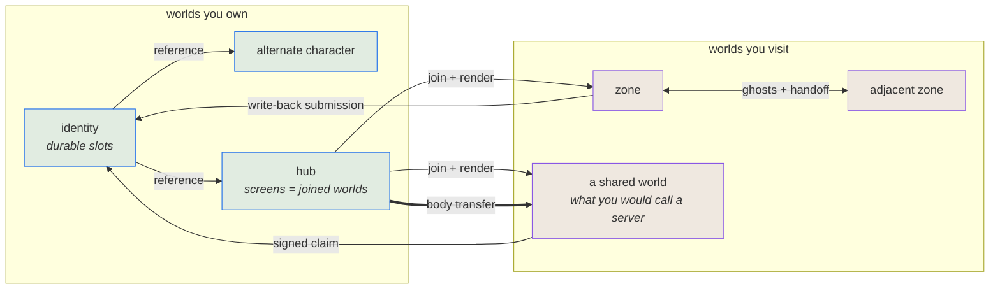

# The world model

**Puck's plan of record for federation, presence and scale.** It states the model, what remains to
build, and what has been ruled out. It does not describe code — read the code for that.

**Where this stands.** Complete and running: a deterministic simulation, one versioned document
model, a grant table, durable state slots, effects that target another entity, generation and world rules,
target designation, and a player identity that is itself a world — with cloud sync built: one blob
per owned world under `puck/worlds/` in the per-user container, pushed and pulled ETag-guarded with
refusals surfaced rather than merged — proven end to end against the real platform endpoint on
2026-08-05: a whole-catalog push, a second machine pulling the same container and adopting all four
worlds at the same tokens, and a stale writer refused with the remedy named and recovering after a
pull. **Discovering a world the pulling catalog has never heard of is the one half that proof did
not cover**, and it is not a detail: a container LIST cannot pass the platform edge at all, so
discovery rides a separately authored direct-to-account endpoint (`storage.discoveryEndpoint`)
against the account's own layout, and only hermetic verification stands behind it. An edge-shaped
endpoint without one refuses discovery BY NAME rather than reporting an empty cloud.

Partial, and named here because the difference matters: **latency equalisation** applies a hold but
nothing measures round-trip time and the measured value is taken from the intent that benefits from
it. **Cross-document write-back** performs the happy path — an in-process call with no operation id,
no precondition, no owner version, and non-atomic persistence. **The client seam** carries render
poses, not simulation state, so it is a presentation boundary and not yet a replication one.

Those gaps are in the engine, not in the model. Each appears below as work. None of them is a reason
to want less.

Taken as given rather than built here: transport security, and two P-256 pairs minted for every
identity by the platform that issues it — one for signing, one for sealing. A key's id names its
issuer, its subject, its algorithm and the SHA-256 of its public key, so key material is
content-addressed exactly as pinned creations and cartridges already are. Minting is part of
onboarding rather than atomic with the identity, so an identity can briefly exist before its pairs
do; nothing below needs that window to be zero, because an identity without keys cannot carry a
claim and a claim that cannot verify is refused — the window fails closed like everything else.
*Signed carriage* below says what the engine does with that and what it deliberately does not.

## The thesis

**There is one kind of thing: a world.** A zone is a world. A player's identity is a world. An
alternate character is another world. A hub is a world. A game is a world. Nothing else is a first
class noun.

Everything else is a **relationship between worlds**, and every relationship is a document field, a
capability, or a submission — never a subsystem. (The words are defined in the next section; if any
of them are unfamiliar, read that first.)

| Relationship | What it means | Where it lives |
|---|---|---|
| **Ownership** | you hold authority over a document | identity, derived from the hosting platform's stable per-user id |
| **Joining** | you have the document, a snapshot, and the stream; you can see it | session admission |
| **Embodiment** | you have a *body* in it — strictly separate from joining | population entry |
| **Reference** | a world names another; a portal is a reference with a rendered preview | document row |
| **Carriage** | a world signs a claim another world carries | issuer-signed slot |
| **Transfer** | a body moves from one world's authority to another's | submission |
| **Display** | a surface shows what a camera produces, in this world or a joined one | placement facet |

**Frames obey the same discipline.** A camera produces, a surface consumes, the pairing is data, and
the two are duals rather than one thing. But a surface is not its own noun — it is a placement
carrying a display facet, like solidity or emission. Within a world, placements and cameras are the
content nouns; a screen is something a placement *does*.

The single most useful consequence: **showing a world is joining it.** A screen displaying another
world is not a preview mechanism — you have joined that world and are rendering it. Stepping through
the screen is not joining; it is *acquiring a body*. There is no spectator mode, because a session
without embodiment already is one.

**What you are given when you join is the authority's choice**, and that is a grant decision like any
other: a full replica where the world has nothing to hide, a redacted projection where it does,
frames where even that is too much. One relationship, three fidelities — not three mechanisms.

## The words

Client and server are approximations here rather than definitions. They are per-machine labels for
what is really a per-world, per-moment role: one machine is the truth for your identity world and a
follower of four others in the same instant. The precise words are below, and a translation table
follows them — you do not have to abandon the familiar ones.

| Term | Means |
|---|---|
| **World** | a document and the simulation it defines — instantiated when something needs to run it, and durable when nothing does |
| **Instance** | a running copy of a world's simulation on some machine |
| **Authority** | the one instance of a world whose results are the truth |
| **Replica** | any other instance of it, ticking the same inputs, whose results are not |
| **Host** | the machine or process running instances |
| **Participant** | someone joined to a world; *embodied* if they hold a body in it |

An authority and a replica run **identical code**. A replica is not a thinner client — it is the same
simulation from the same taped inputs, differing only in whether its answers are the truth. That is
what determinism buys, and it is why a command-streamed screen, a prediction, a spectator and a
foreign engine drawing this simulation are all one mechanism rather than four.

### If you already know the usual words

Keep using them. Each breaks in one specific place, and this is what they translate to.

| You would say | Here it is | Where the analogy breaks |
|---|---|---|
| server | a host running an authority others accept | any world can be one, and nothing marks it as such |
| dedicated server | a host whose authorities have no embodied participant | otherwise identical to any other host |
| listen / player-hosted server | a host that is both an authority and embodied | the ordinary case, not a lesser one |
| client | a host running replicas, usually embodied | a replica runs the *same* simulation, not a thin viewer |
| zone, shard, realm | a world | — |
| dungeon instance | another world booted from the same document | needs no instancing system |
| character, alt | a world you own | — |
| account | the set of worlds you own | there is no tier above them |
| spectator | a participant joined but not embodied | not a mode |
| item, inventory | durable slots on a world you own | the engine never learns what an item is |

### The engine words this document leans on

| Word | Means |
|---|---|
| **tick** | one fixed simulation step; everything deterministic is counted in ticks, never seconds |
| **taped** | recorded on the replay tape, so the same inputs reproduce the same state exactly |
| **submission** | a tick-stamped request into a world — intent, a command, a document change |
| **slot** | a named value on a body or a world; *durable* ones persist for a participant |
| **placement** | an instance of authored geometry positioned in a world |
| **facet** | an optional property a placement carries — solid, emitting, a region, a display |
| **grant** | permission for a principal to act on a subject; deny by default |
| **domain** | an issuing authority — *is* its root key's fingerprint, never a name |

## The invariants

Everything below rests on six rules. A design that breaks one is wrong, not clever.

1. **Exactly one world simulates a given body at a time.** Authority is never shared, never
   overlapped, never negotiated mid-tick.
2. **Foreign and nondeterministic state enters at one boundary**, tick-stamped and taped — never a
   mid-tick read of another document, of storage, or of a clock.
3. **The engine ships mechanisms; the game supplies names.** No `health`, no `lootTable`, no `quest`,
   no `aggro` in the schema. A level is a durable counter someone called a level.
4. **Never two mechanisms for one decision.** Two sources for one value compose by a stated rule.
5. **Meaning is bilateral.** The engine never adjudicates trust. It carries proof and enforces
   capabilities; whether a claim *counts* is the receiving world's policy.
6. **A world authorises its own inhabitants; the grant table gates outsiders.** An entity driven by an authored intent program has no principal, so entity-to-entity effects are authorised by what the world's own
   programs declare. Grants keep gating peers, addons and the console. Neither mechanism reaches into
   the other's half.

## What remains

Split by whether anything stands in the way. The unblocked set is ordered by leverage; the gated set
follows its dependency chains. A gate naming another row means finish that first; a gate marked
*shipped* is already built; anything else is a described prerequisite rather than a row.

### Unblocked

| Work | What it enables |
|---|---|
| **Multi-world ticking in one process** | *definitional* once showing is joining, and it gates the whole presence column. N instances now tick in one process — the boot world plus any number started by console verb, each with its own server, population and owned-world store, all folded into the one fixed-step call, and each document validated against its own declared vocabulary. What remains is that only the BOOT instance is wired to anything: the client, the seats, the editor, the replay tape, the socket door and every mutating verb resolve that one server from the container, so an instance beside it can only tick and be read back. Flattening that needs a per-instance service scope; input ownership and the tick context are still singular, and scheduling is still one rate for all |
| **Extensions as a keyed registry** | a host registers implementations by key and the document wires them; the schema stops growing per machine, per renderer, per backend. The primitive exists as of 2026-08-05 — `Puck.World.Data.WorldExtensionRegistry<TExtension>`, plus the `WorldExtensionVocabularyHook` seam that lets a validator check a key against the host's registered set without Data seeing the concrete assemblies — and carries exactly ONE consumer: `WorldMachineHost`'s screen-machine engines, where an unregistered engine key now refuses at load by name instead of booting and faulting the slot. One consumer is not the row: the schema stops growing only once renderers and backends select this way too, so this stays open, and every row gated on it below stays gated |
| **Sinks become first-class** | the main viewport, split-screen quadrants, recordings and network streams are all sinks; only world-space screens are authorable today |
| **Screen row collapses into a placement facet** | removes the second way to make a screen, and a geometry block duplicating a transform plus a box |
| **Spatial partitioning for proximity** | 256-body junctions. Sensing really is a capacity-wide scan per sensing producer, but nothing establishes it as the dominant cost — machines, addons, contact sampling, output fan-out and N-world scheduling are equally unmeasured. Ordering here is a guess until something measures |
| **Ranking separate from filtering** | "nearest to crosshair" versus "nearest in space" as a feel choice |

### Gated

| Work | What it enables | Gated by |
|---|---|---|
| **Extensions validate their own configuration** | the document carries a configuration bag and the validator asks the registered extension, through the seam `BindingVocabularyHook` already uses. Without real validation this is the opaque string with punctuation | extension registry |
| **Cartridges become pinned content, not paths** | a document naming a local file does not travel, and the document is what travels. The hash is already computed at apply time and merely uncarried, but a hash verifies bytes that arrived — it does not locate, authorise, fetch or retain them. The transport tier already exists as platform: one blob surface behind the global entry with an anonymous, edge-cached public namespace and a SAS-gated per-user private one — so availability is a choice of namespace per address, not new infrastructure. What remains is wiring the store to the machine host and the failure policy | extension registry |
| **Renderers become extensions** | drop-in renderers; the document declares what it needs and is refused if the selected one cannot meet it, as contact requirements replaced the provider enum | extension registry |
| **Renderer ceilings leave the world document** | instance, dynamic-instance and view ceilings belong to a renderer, not a world | renderers as extensions |
| **Screen identity becomes a string id** | removes an index-as-identity and the reserved band that exists to stop it colliding | screen/placement collapse |
| **Screen links stop addressing by index** | cable order names screens by integer and must move with screen identity | screen identity |
| **Camera binding as an authored mode** | a fixed camera is a TV; a camera derived from the viewer's eye is a window, so portals stop being a separate feature | screen/placement collapse |
| **Magazine becomes a selectable set** | tested against the generator row (2026-08-05) and it RESISTS, for a stated reason. A magazine's ordered entries and its cursor are structurally what a degenerate one-context stochastic SOURCE already is, but the advance regimes are not the same thing: a magazine advances through `screen.select <index> [next\|prev\|<entry>]` — a player/gesture-driven screen OPERATION, which always names the screen it acts on, applied synchronously through the `ScreenOp` submission kind, carrying real side effects (auto-insert boot, the save-time fold-back into `Selected`). A draw SITE advances its own `drawCursor` inside the document under a seeked PRNG. The shared shape is real; folding them would put screen-op state under a sampler that knows nothing about booting a cart | screen/placement collapse |
| **Render extent moves from camera to sink** | resolution belongs to what you draw *to*, not what you draw *from* | sinks first-class |
| **View / sink compositor** | one mechanism for split-screen, multi-viewer and diegetic screens | sinks first-class, multi-world ticking |
| **World as a screen source** (submissions, not frames) | free camera per screen, native resolution, hub previews | multi-world ticking |
| **A specified client wire** | the SAME boundary as a command-streamed screen: document, snapshot, submissions. A foreign host rendering this engine and a cabinet rendering a remote world differ only in whose renderer draws. The seam exists (`IServerLink`/`IClientSink`, loopback and TCP); the format is internal and nothing outside .NET speaks it | world as a screen source |
| **Authority as a committed handover** | the invariant says exactly one authority per body; nothing yet makes that true under failure. Needs transfer ids, epochs or leases, fencing against a stale authority, a durable commit record, retry that is idempotent, and a rule for an authority that dies holding a cluster — today reassignment is forbidden, which strands every body it held. This is the protocol under every transfer, and the invariant is a wish until it exists | client wire |
| **Replication: what a replica actually needs** | a snapshot today carries render poses, appearance and continuity — not timers, velocities, action state, addon or machine state, or grants. A replica needs full simulation state, a catch-up path, resynchronisation when it diverges, a downstream codec, and agreement on versions. This is a system, not a field, and the wire row understates it without this | client wire |
| **Body transfer between worlds** | one body leaves an authority and another acquires it: the mechanism under portals, character switching and every zone crossing | client wire |
| **Write-back that survives a retry** | an operation id so a repeated Add adds once, a precondition or owner version so a delayed Set cannot overwrite newer state, atomic persistence so a torn write cannot destroy an owner document, and a receipt the visitor can actually observe | shipped: write-back (happy path) |
| **Portal entry** | hubs, visiting, character switching. A deliberate threshold, so a visible transition is the point rather than a flaw | body transfer |
| **Authenticating the game wire** | the blob path already has TLS and per-tenant ABAC routing, but the game's own socket is separate: it compares a client value against a compile-time protocol constant and admits the connection as a peer holding Control over everything. That is a version handshake. The credentials to fix it exist, so this is wiring rather than invention — but until it is wired, federation cannot cross a machine boundary | shipped: platform identity |
| **Issuer-signed slots** | tamper-evident carriage of what another world entrusted you with: a slot that declares an issuer is one you hold but may not write. See *Signed carriage* below | shipped: platform identity |
| **An authored trust list** | which issuers a world accepts, and what each may reach. See *Signed carriage* below | issuer-signed slots |
| **Authored tick rate per world** | MMO-scale zones, where one world need not pay a fighting game's step | multi-world ticking, and a cross-world time model: once rates differ, "tick-stamped" stops being a shared coordinate and transfers, holds and timers need conversion |
| **Seamless crossing** (overlap band, ghosts, authority handoff) | continuous space across zones; the expensive cousin of portal entry | body transfer, authored tick rate |
| **The range chain, validator-derived** | overlap band >= co-location range >= interaction range + closing margin. A world declares its interaction range and top speed, the engine derives the band and refuses a border too narrow to hold it, so weapon reach reaches terrain layout at author time rather than in production | seamless crossing |
| **Proximity co-location + interaction flag** | correct PvP across an authority boundary: interacting entities resolve under one authority, never two. Candidacy is proximity between entities the DOCUMENT declares interaction-capable — the same flag as targetability, not a second one — so a peaceful NPC or a player with PvP off never co-locates and a quiet border costs nothing. Binding is PREEMPTIVE: migration lands while people walk, never on the first effect, which is the most latency-sensitive moment there is — and which is also why neither party gains from striking first, since the migration is already done before anyone swings. Direction is settled by acceptance and the deterministic tie-break, not by who is defending | seamless crossing |
| **Occlusion-aware candidacy, derived** | terrain barriers become a real performance lever instead of decoration: entities behind cover do not co-locate, so a wall shrinks the cluster. NOT an authored flag — a flag can silently become a lie the day someone authors an ability that reaches through cover, and two entities interacting under different authorities is split-brain. Derived instead from whether every interaction the world declares respects occlusion, refused by name at load when one does not. At a border the union of both worlds' interactions governs | co-location |
| **View holds, for parity** | input holds equalise when players *act*, not what they *see*: the authority reads the current tick while a guest reads state a round trip old, and fresher information is an advantage at equal action delay. Parity needs the authority's view held too — presentation-side, so it never touches the tape | latency equalisation, which needs a real RTT source first — a self-reported hold raises every equalised participant's |
| **Transfer stability** | asymmetric hysteresis so a player standing on a line does not thrash authority, and a deterministic tie-break so a junction never has two owners or none. One rule covers drift, joins and departures | co-location |
| **Co-location acceptance** | a STANDING declaration in a body's own document — which authorities it will submit to — evaluated automatically, never a prompt and never per interaction. Asymmetric: exactly one party becomes the guest, and only the guest's policy is consulted, because the authority is already in its own world. On a shared world it never fires, since everyone is already under one authority; it engages only where two players each running their own authority meet. Candidates are tried in the deterministic tie-break order until one is accepted by whoever would be the guest under it, so a fight that some assignment would have allowed does not fail because the first assignment sat the wrong party in the guest seat. Both policies can therefore decide something across candidates, even though exactly one is consulted per candidate. Refusal fails closed, like a world that is full. This is also the whole protection in direct play, where whoever resolves the cluster has the ordinary advantage of being the truth: the remedy is consent, not fairness — an owner tuning their own world is gameplay | co-location |
| **Adjacency as scheduling affinity** | neighbouring worlds want the same host machine, and neighbours around a junction want it most: co-hosted, a handoff is a process-local transfer and the shared-tick problem largely evaporates. The partitioner should treat adjacency as a hint rather than hashing worlds independently | multi-world ticking |
| **Tick health as an observable fact** | a world that cannot keep up should say so, so it can author its own response — shed simulated population, widen its step, refuse admission — rather than silently degrading. The same shape as contention facts, and the honest counterpart to letting authors commit to whatever capacity they like | authored tick rate |
| **Junction headroom** | a world beside a contested border must not author itself to capacity with residents, or co-location fails exactly when the fight starts. The reservation belongs in what the document declares | co-location |
| **Contention facts + authored responses** | occupancy, cluster pressure and refusal as observable facts, so a world authors its own degradation instead of the engine inventing one. A REFUSAL MUST CARRY A CONSEQUENCE: a body that declines a cluster's authority cannot be touched, but can still do everything the world never modelled as an interaction — stand on the objective, carry the flag. Unless a contested region can refuse entry or eject, declining becomes the dominant strategy | co-location |
| **Contact-counterpart / region-occupant targets** | area effects and retaliation on contact. Effect-source observability records who applied an effect, which is not the same thing: the contact seam solves one body against world geometry and returns a standing flag, exposing no counterpart at all. Body-to-body contact must exist first | a body-to-body contact seam |
| **Threat tables** | accumulated aggro | a keyed-table primitive; slots are scalars |
| **Native AOT for the game** | shipping shape | replacing reflection-based JSON and built-in COM interop |

**A "server" is a role, not a type.** Any world with the capacity, the acceptance of others, and
claims others honour is one; the trust tiers are social rather than structural. Players hosting their
own authoritative worlds is a goal, so nothing here stops a group agreeing to author a home world for
two hundred and fifty six bodies and holding a war in it.

**What limits scale is the machine, not the schema.** Authoring capacity does not grant the cycles to
tick it. And a world that over-commits fails in the fairest way available: it falls behind as ONE
tick, so everyone in it falls behind identically — shared adversity arriving structurally rather than
by design, which is the same reason input holds exist. A cluster's authority is still chosen at formation
and never re-evaluated, so a latecomer who does not accept it cannot join.

**What sharding does not buy.** At a genuine melee — everyone within interaction range of everyone —
co-location puts the whole cluster under one authority, so four zones around a junction distribute
nothing at exactly the place with the most contention. That follows from concentrating a connected interaction graph under
one authority, which is this plan's rule rather than a law: distributed lockstep, ordered cross-owner
effects and transactional interaction resolution all keep one authority per body without simulating
twice. They are slower and more complex, which is why they were not chosen — not impossible. Clusters also grow by
*transitive closure* of the interaction graph, so a chain of engagements can sweep in players beyond
the visible fight. Both are why bounding the cluster, reserving headroom and co-hosting neighbours are
work rather than polish — and why the authoring guidance is not "put a world wherever people fight",
which is reactive topology, but "do not run an authority boundary through a place designed to be
contested".

**Unmeasured and deliberately so:** contact sampling budgets, the compound-collider volume ceiling,
mirrored stamps doubling instance-grid contribution, per-tick input-hold bookkeeping, and N
simulations per host. Measurement waits until the model stops moving.

## Signed carriage

*Issuer-signed slots* and *an authored trust list* both rest on this, and it is one mechanism rather
than several. It is also where invariant 5 becomes concrete: the engine carries proof and enforces
capabilities, while whether a claim *counts* stays the receiving world's policy.

**An id is domain, subject, algorithm, key** — and the domain *is* its root key's fingerprint, so
identity needs no registry and cannot be squatted: taking another's requires its private half. The
platform is not a tier under this, only a domain with many users, while a self-hoster is a domain with
one. The id names the algorithm rather than the role because the algorithm implies the role while the
reverse does not, and because two signing algorithms would otherwise collide at one path.
Verification needs no fetch: a claim travels with the bindings leading to it, so a verifier walks from
a pinned id down to the key that signed using only what arrived. Every id contains its key's hash, so
each hop is self-certifying against the one above it. A claim that arrives without its chain is
refused rather than resolved — going to look for the rest is the online dependency this whole design
exists to remove, re-entering by a side door.

A root is the base case of that shape: no domain above it and no subject, only its own fingerprint. It
is provisioned once per domain and **never escrowed** — the property that makes identity-by-fingerprint
survivable is that a root stays cold, which a key held online cannot be.

**Everything signed uses one envelope.** A canonical context header is always part of the signing
input — domain, subject, algorithm, purpose, validity window, and optionally an audience and a
sequence — and only the payload differs. This is the associated-data half of AEAD applied to
signatures: bind the context, not just the content, so a signature cannot be lifted into a situation
it was never minted for. The purpose field stops a binding signature being replayed as a claim; the
algorithm field stops a sealing key being accepted where a signing key belongs; the domain field
stops one trusted root signing for another's subjects. A key binding is not a separate artifact under
this — it is the envelope with `purpose: key-binding` and a key id as its payload. **One envelope
means one verify path**, which is the whole reason to do it this way rather than adding a field per
problem as each appears.

**The algorithm is always taken from the pinned key, never from the envelope.** A verifier that lets
the message choose is how JOSE deployments died — `alg: none`, and RS256 verified as HS256 against
the public key. The field is there to be *checked against* the pin, never to select behaviour.

The envelope is a **specification, implemented on each side** rather than a shared library. The byte
layout is all that must agree, and disagreement fails loudly because signatures stop verifying. Trust
evaluation is deliberately not shared: each side trusts different things. The serialisation is
CBOR — ratified by the owner on 2026-08-05, after both independent implementations had committed to it.
Reach is what decided it: CBOR lets a third party reach for a library instead of a spec, at the price of a
package reference (`System.Formats.Cbor` is Microsoft-authored but arrives inbox only through the ASP.NET
Core shared framework) and of closing by hand every degree of freedom it offers, because a signature is
over bytes and one model must have exactly one encoding. The fixed layout — which keeps parsing away from
unauthenticated bytes and gets canonicality for free, since every field is fixed-width or minimally
length-prefixed — stays shelved but alive in the specification's closing section, implemented and
harness-covered. The field list is identical either way. Claims are ephemeral and constrain nothing.
[The wire specification](signed-carriage-wire.md) is the normative text both independent implementations
are written against and conform to.

Sealed carriage is the same envelope with the payload encrypted and the header as associated data —
literal AEAD, and the reason two keypairs are provisioned rather than one. The agreement is *ephemeral to
static*, so sealing proves nothing about who sealed: anyone holding the recipient's public sealing key can
produce a payload that opens cleanly. Sealed carriage is confidentiality only, and where the recipient
needs to know who sent it, the sealed payload rides inside an ordinary signed envelope and the signature
is what names the sender.

**Audience is the authored trade.** Binding one determines whether replay costs anything:

| | Audience | Replay *elsewhere* | Replay *at the audience* |
|---|---|---|---|
| **Directed** — valid at one world | bound | free; the signature simply fails anywhere else | a sequence, or accepted |
| **Bearer** — travels anywhere | absent | a durable sequence high-water mark | the same mark |

Portability and statelessness are exclusive, so the author picks. Same-world replay needs the
sequence either way; binding an audience shrinks the problem rather than deleting it. **Audience and
sequence are therefore independent fields, not alternatives:** only a bearer claim *requires* a sequence,
but a directed claim may carry one, and a verifier checks and advances the mark whenever a claim carries
one at all. A directed claim without a sequence is replayable at its own audience, which is an authored
choice — correct for a claim whose effect is idempotent, wrong for one that is not.

The mark is durable keyed state — one sequence per issuer-and-subject pair — so bearer claims are gated
on the same keyed-table primitive threat tables want, slots being scalars today. It is written at
admission through the ordered submission domain like any other durable write, which is what keeps it
tick-stamped and taped rather than a mid-tick read of storage. **Retention is coupled to the window,
and the coupling is load-bearing:** a mark must outlive the receiver's acceptance window for its pair,
or evicting it reopens replay for a claim that is still valid. That coupling is also what bounds the
table, since a mark whose claims can no longer be accepted can be dropped.

**A trust entry pins an id** and says whether that key signs directly or may *vouch* for others, plus
which slots it reaches. A vouching entry is a domain, so trusting a domain and pinning a key are one
act.

**A chain is at most two hops, because one cannot hold.** A root vouching for every subject directly
would sign once per signup forever, and a key that signs continuously is warm — so depth one costs
the cold root at exactly the domain with the most to lose. Instead a root vouches for an *issuing*
key and the issuing key vouches for subjects: the root signs approximately never, while the warm key
is replaceable without touching anything anyone pinned. A domain with one user still mints both hops —
and a root that vouches for *itself* as the issuing key is refused, being depth one in a two-hop costume,
back to signing per subject. A chain therefore has exactly two admissible lengths: **two** bindings under a
trusted domain root, and **zero** when the trust entry pins one subject's own key directly, which vouches
for nothing and so has nothing to walk. One is a broken chain; three is an unbounded one.
What stays refused is the *unbounded* chain — path discovery, cross-certification, a verifier that
follows wherever a claim points. Two is a number a verifier hard-codes, not an engine it runs.

An empty list honours no foreign claim, deny by default like every other capability. **The
engine compiles in no root.** A shipped game ships its publisher's; a blank template ships none. Every
world verifies against its own list, so admission negotiates nothing.

**Validity is authored at both ends.** The issuer sets a window when it mints; a verifying world sets
the maximum age it will accept, and the tighter of the two governs. Neither can loosen the other — an
author cannot reach past what was signed, and an issuer cannot force a world to honour something
stale. The window is not the only lever, and conflating them oversizes it: removing an issuer from the
trust list revokes its standing at once and for everything it ever signed, while the window governs
only how long a claim from a *still-trusted* issuer stays good. The list revokes an issuer, the window
expires a claim — so neither should be sized to do the other's job. Within its own scope the window is
the whole story, which makes it the longest a compromised subject key stays honoured. The cost of shortening it is easy to miss: verifying is offline but re-attesting is online,
so a tight window quietly makes long offline play impossible. A world wanting that sets a permissive
ceiling; a high-stakes world sets a tight one; both read the same signed binding.

A short window is only affordable because **re-attestation is routine**: the issuer re-signs the same
binding with a fresh window, and its natural trigger is every authenticated session start — the one
moment the subject is provably online anyway — so the window need only cover the longest stretch
*between* logins, not the life of a key. Re-attestation cannot shorten retroactively: an earlier
binding stays good until its own window ends, which is what keeps replaying one pointless and is
exactly why the window bounds a compromise. It is the issuer's operation, not the engine's, and today
it does not exist — the platform mints pairs and signs nothing — so it is named here as the piece of
the window model most likely to be discovered late.

**What remains ours.** Issuance is not. Where a domain issues for its users the private half is
escrowed: it is sealed under a per-key random password, and the wrapped password travels *with* the
ciphertext, so what the domain actually holds is the ring that unwraps it rather than any password.
An identity cannot sign without the domain, and the secret that must never leak is that ring. That
splits the halves in the direction this plan needs: **issuing a claim is online, verifying one is
local**, and the issuer is by definition the party who is online. It also bounds what a signature
proves — that a domain issued this for an identity, which is the trust already assumed, and not that
a person personally did. Nothing here should be built on the stronger reading. The engine consumes a
PKI rather than operating one. Signing
is randomised, so minting happens outside the tick and a claim enters taped like any foreign value;
verifying is deterministic but far too slow for 240 Hz, so it happens at admission and on a schedule
with the verdict held. Beyond that: re-verification across a session, since checking once at join
honours a claim past its expiry — and expiry is a wall-clock event, so by invariant 2 it enters at the
boundary tick-stamped and taped, never as a mid-tick read of a clock. A verdict is state like any
other. Beyond that again, a decision about what a world *does* on revocation rather than only
detecting it.

## What already falls out

Compositions, not features. Listed so nobody builds an engine concept for them.

- **A library, a shelf, a rental desk, a trading post.** Durable slots, targeted effects, regions and
  write-back. The engine stays ignorant of what an item is.
- **Cross-game avatars.** A creation is hash-pinned content and an identity is a world; wearing your
  own appearance elsewhere is a per-slot read grant, and a body can collide as the shape it is
  wearing, so it is physical rather than cosmetic. The visited world clamps what it accepts, so "bring your own" and "everyone
  wears our art" are the same switch at different settings.
- **Cross-designer conventions.** Slot, part and register names are chosen by games, so a cooperating
  group interoperates with no engine involvement. Declared envelopes let a visited world *normalize* a
  foreign value rather than merely clamp it — the difference between conventions that survive contact
  and conventions that corrupt state quietly.
- **A fidelity ladder for hub screens.** A distant cabinet shows a loop, approaching escalates it to a
  live session. Regions and their enter/exit events already express it.
- **Possession.** A mind-control skill, a remote vehicle, a camera drone: a targeted effect plus
  routing. The engine never learns what possession is.
- **Loadout presets.** A named set of slot values and something that applies them — authored data plus
  a batch of writes.
- **Audio for a multi-viewer.** Authored mixing. A diegetic room gives a spatial mix for free; a
  screen-space quad has no natural answer and should not be given an invented one.

## Ruled out

Recorded so they are not re-proposed. A refusal earns a row only if someone would plausibly propose it
*and* the invariants do not already say no. A *principled* refusal violates an invariant and does not
expire; a *contingent* one was bound by a missing primitive and carries the condition that reopens it,
or it silently outlives its own reason.

### Authority and presence

| Rejected | Why |
|---|---|
| **Overlapping simulation at borders** | reintroduces the authority ambiguity every other rule exists to prevent |
| **An engine trust ladder** ("never migrate authority downward") | trust is bilateral and known; replaced by an acceptance capability |
| **Any other rule for choosing a cluster's authority** | defender-authoritative was offered for a variant not chosen, and where a defender already visits a server world the two coincide anyway; majority-anchor re-evaluates as people join and cascades re-migration. Acceptance plus a deterministic tie-break already decides this, and a third mechanism for it would contradict one of them |
| **Co-locating on the first effect** | puts the migration on the first swing, the most latency-sensitive moment in the game; preemptive binding moves it to walking |

### The document

| Rejected | Why |
|---|---|
| **The ENGINE learning item semantics** | it never needs to; carrying, trading and lending are compositions (see above). This once read as a refusal of *carryable* things, which was a missing primitive recorded as a decision — the magazine is the direct way to say a fixture has several configurations, never a limit on what authors can build |
| **A separate per-player container document** | a second document family for durable state; profile-as-world subsumes it |
| **An account tier above worlds** | the set of worlds you own already is the account; arrangement is authoring |
| **Classifying addons cooperative / adversarial** | unenforceable self-declaration, and the grant table already decides what an addon may do |
| **Unifying magazines with draws via typed element sets** | *Superseded, 2026-08-05.* The contingency ("reopens if a second typed set appears") landed: the GENERATOR row — weighted alternatives, each naming the context it moves into — is that second typed set, built to carry name and dialogue generators, Markov chains and card deals. Draws DID absorb into it: `WorldDraw`/`WorldSet`/`WorldDrawRuntime` and the `world.draw` verb are deleted, a flat weighted draw is now a degenerate one-context generator, and it samples a real `Pcg32XshRr` stream whose position lives in the document rather than the retired low-discrepancy sequence in server-side runtime state. Magazines did NOT — see the "Magazine becomes a selectable set" row above for the reason |

### Rendering, content and the wire

| Rejected | Why |
|---|---|
| **Merging cameras with screens** | they are producer and consumer, not one thing; the real duplication is that a screen is a placement |
| **A foreign engine as a render backend** | a whole engine behind the renderer seam means two loops competing for the frame and a scene-graph conversion of every world — a content problem wearing a backend costume. This engine's place is *beneath* a foreign host, through the client wire, not inside one |
| **Video as the default screen source** | *Contingent.* Submissions are smaller, allow a free camera, and render natively. Video remains correct wherever hidden information forbids handing over the tape |
| **Embedding ROMs in the world file** | creations are embedded because they are small and authored in-engine; a cartridge is large and externally produced, so an address plus a hash gives verifiability and travel without the weight |

### Trust and carriage

| Rejected | Why |
|---|---|
| **Consulting the issuer at verification time** | whether to ask if a claim still holds or to fetch the key that checks it, both restore the online dependency the signature exists to remove: a world must verify while the issuer is unreachable, asleep or gone. Offline decoupling is the requirement, and it is what makes a signature load-bearing rather than an optimisation. A public key is not anonymously readable as provisioned either, so carrying it inline against a pinned id needs no fetch and no exposure |
| **Trusting a domain's label** | a friendly name is display only. Two domains can carry the same label and only the fingerprint separates them; a label that decides anything is a name pretending to be a key |
| **Peer-minted claims** | a claim minted by its own subject attests only that they said so. Where a domain issues for its users the private half never leaves it, so a peer cannot mint one and gains nothing by wanting to |
| **Carrying mutable balances signed** | a signature pins a value at a moment; balances stay owned by their issuer and change by write-back |

## The open questions

Two, and each changes a design rather than a detail.

- **Whether trust is just grants.** A trust entry names a principal, a subject scope and a capability
  set, deny by default — grant-table work, and an issuer *is* a principal. The discriminator is
  ordering: grants are authority-scoped and runtime, while trust must be document-scoped and readable
  before any authority exists, because it is what admits the connection. If that resolves, the two are
  one mechanism and a concept disappears. It is decidable once the admission path is written, and not
  before, so it is recorded here rather than guessed at.

- **In-flight state at transfer.** Timers mid-cooldown, retained targets, engaged routes, active input
  holds, accumulated intent-program state. The rule to apply — rather than a table to maintain — is *drop and
  re-derive what the engine can recompute; carry what the player can perceive*.
