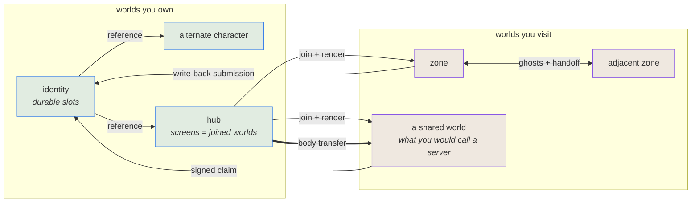

# The world model

**Puck's plan of record for federation, presence and scale.** It states the model, the current
implementation boundary where sequencing depends on it, what remains to build, and what has been
ruled out. Read the code for implementation detail.

**Where this stands.** Complete and running: a deterministic simulation, one versioned document
model, a grant table, durable state slots, effects that target another entity, generation and world rules,
target designation, and a player identity that is itself a world — with cloud sync built: one blob
per owned world under `puck/worlds/` in the per-user container, pushed and pulled ETag-guarded with
refusals surfaced rather than merged — proven end to end against the real platform endpoint on
2026-08-05: a whole-catalog push, a second machine pulling the same container and adopting all four
worlds at the same tokens, and a stale writer refused with the remedy named and recovering after a
pull. **Discovering a world the pulling catalog has never heard of is the one half that proof did
not cover**, and it is not a detail: a container LIST cannot pass the platform edge at all, so
discovery rides a separately authored direct-to-account endpoint (`storage.discoveryEndpoint`)
against the account's own layout, and only hermetic verification stands behind it. An edge-shaped
endpoint without one refuses discovery BY NAME rather than reporting an empty cloud.

Partial, and named here because the difference matters: **latency equalisation** applies a hold but
nothing measures round-trip time and the measured value is taken from the intent that benefits from
it. **Cross-document write-back** performs the happy path — an in-process call with no operation id,
no precondition, no owner version, and non-atomic persistence. **The client seam** carries render
poses, not simulation state, so it is a presentation boundary and not yet a replication one.

Those gaps are in the engine, not in the model. Each appears below as work. None of them is a reason
to want less.

Taken as given rather than built here: transport security, and two P-256 pairs minted for every
identity by the platform that issues it — one for signing, one for sealing. A key's id names its
issuer, its subject, its algorithm and the SHA-256 of its public key, so key material is
content-addressed exactly as pinned creations and cartridges already are. Minting is part of
onboarding rather than atomic with the identity, so an identity can briefly exist before its pairs
do; nothing below needs that window to be zero, because an identity without keys cannot carry a
claim and a claim that cannot verify is refused — the window fails closed like everything else.
*Signed carriage* below says what the engine does with that and what it deliberately does not.

## The thesis

**There is one kind of thing: a world.** A zone is a world. A player's identity is a world. An
alternate character is another world. A hub is a world. A game is a world. Nothing else is a first
class noun.

Everything else is a **relationship between worlds**, and every relationship is a document field, a
capability, or a submission — never a subsystem. (The words are defined in the next section; if any
of them are unfamiliar, read that first.)

| Relationship | What it means | Where it lives |
|---|---|---|
| **Ownership** | you hold authority over a document | identity, derived from the hosting platform's stable per-user id |
| **Joining** | you have the document, a snapshot, and the stream; you can see it | session admission |
| **Embodiment** | you have a *body* in it — strictly separate from joining | population entry |
| **Reference** | a world names another definition/address without asserting reachability | document row |
| **Destination** | a world selects a scoped identity/generation over one reference | document row |
| **Carriage** | a world signs a claim another world carries | issuer-signed slot |
| **Transfer** | a body moves from one world's authority to another's | submission |
| **Display** | a surface shows what a camera produces, in this world or a joined one | placement facet |

**Frames obey the same discipline.** A camera produces, a surface consumes, the pairing is data, and
the two are duals rather than one thing. But a surface is not its own noun — it is a placement
carrying a display facet, like solidity or emission. Within a world, placements and cameras are the
content nouns; a screen is something a placement *does*.

The single most useful consequence: **showing a world is joining it.** A screen displaying another
world is not a preview mechanism — you have joined that world and are rendering it. Stepping through
the screen is not joining; it is *acquiring a body*. There is no spectator mode, because a session
without embodiment already is one.

**What you are given when you join is the authority's choice**, and that is a grant decision like any
other: a full replica where the world has nothing to hide, a redacted projection where it does,
frames where even that is too much. One relationship, three fidelities — not three mechanisms.

## Destinations, sessions and portals

The immediate product target is simple: the frames in `play` show the live `dive`, `kart` and `jump`
worlds, and crossing a frame enters the same world that was visible through it. That local vertical
slice is now running; what remains open is named below. The reusable model is broader because a
television, scrying surface, scripted transition, matchmaker and portal all need destination/session
resolution even when they do not share presentation or transfer.

### Where portal work stands

- `references` rows give a name to a verbatim local document path. They assert naming intent, not
  durable identity, existence, reachability or authority. The host canonicalizes the locator once
  (`WorldInstanceHost.CanonicalDocumentIdentity`) and that canonical identity — with the row's
  durability and scope key — is the resolver's cache identity, so alias spellings of one document
  share a generation and an ephemeral and a persisted row never share one.
- Placement faces independently carry screen and portal facts. The three `play` frames author the
  joined-session screen-source arm for `dive`, `kart` and `jump`; each resolves through
  `WorldSessionResolver`, so display and crossing address the same resolver-owned destination,
  scope and generation identity. The projection renders the destination's live-definition placement
  geometry AND its embodied snapshot entries (avatars move in the frame) through its
  selected/default camera; definition revisions re-upload the composed program the frame they are
  reported. A destination-clock interpolation ease and per-viewport user/group-scoped images remain
  open, and a nested screen inside a projected destination binds dark (the explicit depth-one
  policy).
- Crossing is one transaction: whole-party capacity and `Drive/body` standing are reserved before
  any member detaches, co-entering seats coalesce under one deterministic transfer id, and
  commit-or-abort is atomic — a refused member aborts the whole group back to exact source state.
  Abort restoration is field-audited in `WorldBody.TransferState` (motion program, intent source,
  press staging, rate-accumulator remainders, action registers, scripted tape, designations), with
  the residuals named in its classification table rather than implied closed: durable-input staging
  is captured but not independently driven in the law suite, and `WorldEngagement` is a separate
  unaudited subsystem.
- A portal facet's `arrival` (`spawn` | `mapped`) landed: `mapped`, paired with a `counterpart`
  placement/face in the destination document, lands a traveler at the pose its source-SEAM offset
  maps to through the pair's isometry (captured velocity rotated the same way) instead of the
  destination's ordinary seat spawn point — the positional-continuity half of a seamless border.
  The anchor on both sides is the FACE's own derived frame's SEAM point — the exact in-plane
  coordinate (`SeamU`/`SeamV`) the traveler's swept segment crossed, converted back to world space
  by `WorldFaceFrame.PointAt`, and its MIRRORED image applied to the counterpart's own frame on the
  destination side (`WorldPortalArrivalMath.CounterpartSeam`: the isometry's 180° flip reverses the
  horizontal face axis, so `SeamU` changes sign while `SeamV` does not — reciprocal faces' right
  axes point opposite ways along one shared border, and reusing the coordinate unmirrored selects
  the mirror point; never a fresh sample) — never the frame's
  own center (`Origin`), so a traveler leaves from the exact point it crossed and lands at the
  corresponding point on its counterpart, including when either face's shape sits off its placement
  root or carries its own rotation. Anchoring on the center alone is harmless for a picture-frame
  portal and wrong for contiguous terrain, where an off-center crossing must land at its exact
  counterpart for the ground to read as one continuous surface.
- Continuous topology is authored independently of portals through reciprocal `adjacencies` rows.
  Each row names a global persisted destination, the neighbour's counterpart row, an invisible
  rectangular boundary (`center`, exact-cardinal outward yaw, width, height), and the only supported
  unavailable policy, `closed`. The validator fetches the neighbour document and refuses by name an
  unreachable destination, a missing reverse edge, mismatched extents, or a non-reciprocal frame.
  When two edge neighbours independently converge on the same fourth authority, the compiler also
  derives that corner peer: the source must declare a global persisted destination/reference for
  the peer, and validation proves both two-hop reciprocal paths. This adds observation and
  interaction interest, never a diagonal ownership edge.
  Authors declare physical and interaction envelopes; they do not guess a transport strip. The
  compiler derives one symmetric overlap depth from both bodies' reach, interaction/targeting reach,
  and two slower-side delivery periods of closing speed, rounding outward.
  A vertical ownership face transfers at the far side of its derived hysteresis and expands its
  horizontal span by that same distance. This is what closes the square where two perpendicular
  faces meet: a diagonal crossing always belongs to at least one edge instead of escaping between
  two offset but unexpanded rectangles. The authored vertical aperture does not expand.
- One delivered neighbour mirror feeds every adjacency consumer: selected solid placements are
  mapped through the reciprocal frame for contact and rendering, active remote bodies are rendered
  from the same tick records, and each body carries a durable `(authority, index, generation)`
  address for future targeting. Crossing the outward half-space automatically performs a mapped
  ownership transfer for local humans, already-transferred humans, and autonomous bodies. The
  reservation carries the body's `Live`, `Idle`, or named producer source; a destination that cannot
  embody that producer refuses before detach. Only `Live` travelers acquire credential forwarding
  and a camera/input route. At a four-way corner, all three remote authorities' geometry and
  addressable bodies are projected; an already-outside arrival carries the same already-evaluated
  source-step cursor through the next edge without evaluating actions or motion again. Its exact
  engine-time interval and consumed-through watermark prevent an independently scheduled destination
  from advancing an overlapping body step; destination terrain is swept before another owner is
  selected, and an eight-face work ceiling clamps pathological trajectories inside the last confirmed
  owner. A missing authority enforces `closed` by placing the body one fixed
  unit inside and clearing its velocity. Portal facets remain authored travel doors and do not
  participate in this topology.
- The neighbour arrives over the session-mirror observation plane — wire-shaped delivered data,
  never a reach into a sibling instance's live objects. Its delivery timing remains an UNTAPED
  cross-authority input until the neighbour tape lands. Geometry is bounded to the first eight
  relevant solid placements in document order per edge; collision and rendering consume that one
  shared selection, and reaching the bound emits a named diagnostic.
- One derivation serves every consumer. `WorldFaceCatalog` walks (placements × declared creation
  faces) once per document revision and produces a `WorldFaceFrame` — origin, a complete orthonormal
  right/up/normal triad, half-extents — entirely in fixed point: yaw through the integer `SinCos`
  path, shape orientation through `FixedQuaternion.FromQuaternion`, sizes from the named shape's
  authored scale under the placement's scale. All three axes come from the one composed rotation:
  the renderer rebuilds its slab's normal as `Cross(right, up)`, so pinning up to world `+Y` while
  taking the other two from the shape would put the drawn screen and the walked slab on planes that
  disagree by the shape's pitch. The trigger scan, the arrival isometry, the rendered screen slab,
  and the `world.faces` census all read those rows; rendering converts a finished frame to single
  precision at one boundary and layers its own policy (proud epsilon, interior fraction) on top.
  Geometry is derived before any screen slot is allocated, so slot pressure can darken a face but
  never remove a door — and the reserved screen band itself is boot-frozen: a live
  `authoring.derivedFaceScreens` raise past what the binder registered at boot is refused by name,
  in the same family as the boot-allocated population capacity.
- Each authored portal face carries its own independent trigger, sized from that frame: width and
  height are the face's own, and depth is the greater of the face's half-depth and a derived
  crossing floor (the document's declared speed ceiling over one simulation step, plus the contact
  skin) — no hand-picked extent survives. The band is one-sided along the face normal, so a door
  fires from the side it faces. Scanning runs after every actual step of the instance being scanned
  and clips the previous→current segment (Liang-Barsky, no `Sqrt`), so a high-speed body cannot
  tunnel through a face between samples; the swept answer carries the earliest crossing parameter
  and its seam coordinates, and a body crossing several faces in one step resolves to exactly one
  winner (earliest parameter, then stable face identity). A portal facet is refused by name on a
  placement whose pose is live (attached, inhabited, animated), on a face whose shape kind has no
  aperture mapping (only a planar rectangular aperture can be walked through today), and on a face
  whose derived frame carries pitch or roll — the mapped-arrival isometry is a rotation about world
  up alone and cannot map such a frame, so a tilted door is an honest wall until it generalizes.
- Multiple local worlds run on per-instance schedules, and an observed destination has a host-owned
  session mirror/emitter/view graph with a disposable output lease; a capacity fault retires the
  view's engine while its last image keeps serving, and rebuilds at current capacity next frame.
  Only the boot world still owns the complete client, editor, replay, machine and network
  composition.
- One `WorldSeatAuthorityRouter` now publishes each local seat's complete authority claim—endpoint,
  generation-addressed entity, and epoch—with CAS. Input, camera, rendering, HUD, audio, bindings, and read-backs all
  consume that same immutable claim. A stale forwarding callback cannot overwrite a newer handoff.
  `WorldAuthorityEndpoint` abstracts local, federated, relayed, and direct-player worlds behind the
  same observation and submission capabilities; no consumer branches on hosting topology. A committed
  route answer carries the final writer's address, tick, exact pose, complete appearance image, and definition. The endpoint seeds that
  complete epoch before the route CAS becomes visible, so presentation and input cannot observe an owner
  change without the state needed to follow it. An onward transfer restarts observation on the first source
  snapshot that no longer contains that generation, rather than polling after the camera has lost its body.
- A transferred seat's device state crosses federation on one authenticated, persistent request/ack lane per
  source authority. The destination latches the latest state under the transfer principal and reapplies it on
  every one of its own ticks; a faster destination therefore cannot manufacture stick releases between slower
  source samples. A bounded latest-value table coalesces superseded samples without blocking the source simulation,
  acknowledged repeats become a one-second liveness heartbeat, and a route epoch change invalidates the
  acknowledgement so the current state is seeded immediately at the new writer. An intentional route change closes
  the older stream with a distinct handoff frame: it releases the old local latch without forwarding a synthetic
  neutral that could race the new lane's held state. An unannounced disconnect still forwards neutral through the
  committed chain, so disconnect cannot leave a body moving. Socket ingress arriving in the detach-to-route-publication
  interval retains and briefly retries its state instead of manufacturing a control-lane outage. There is no
  one-request intent compatibility path.
- There is no traveler-specific render system. `WorldContinuum` maps the routed body's pose back into
  the boot presentation frame, and the ordinary authored seat rig resolves once against that pose.
  `WorldAdjacencySceneEmitter` composes direct neighbours and compiler-derived corner peers into the
  same scene, so avatars, terrain, HUD positions, spatial audio, and the camera share the transform.
  Camera clearance may shorten the authored boom along that same ray, but it never changes its azimuth
  or elevation; only the seat's explicit look input steers the camera.
  Portals remain intentional authored composition surfaces; invisible adjacency boundaries allocate
  no screen, offscreen view, periscope camera, or reserved placement slot.
- An entity's implicit procedural catalog rig belongs to the occupant, not the authority-local population slot.
  Reservation, ordered replay, the immediate route seed, ordinary snapshots, observation mirrors, and adjacency
  images all carry that rig. Crossing into a slot with another index is therefore presentation-inert. Authors retain
  control through the ordinary look table: an explicit catalog or creation look deliberately overrides the carried
  implicit rig while that world assigns it; omitting such a rule preserves the traveler by default.
- Adjacency entity images are frozen at the beginning of an authority tick through a coherent
  seqlock copy. Collision and rendering read that pinned record even if a newer socket delivery lands
  mid-step. Rendering interpolates each neighbour against that neighbour's own authored step and delivery clock;
  avatar gait advances from interpolated distance under the ordinary authored look amplitude, so crossing does
  not switch a traveler to raw snapshot motion or a permanently zero animation phase. Dynamic-body solidity is an
  authored kit choice, `bodyContact: "Overlap" | "Solid"`, defaulting to `Overlap`; depenetration occurs only when
  both bodies opt into `Solid`, while observation, targeting, and interactions remain independent of that choice.
  The local solver uses a deterministic sweep-and-prune broadphase and publishes potential, narrowphase, and resolved
  pair counts through `world.contacts`. Cross-authority body contact uses durable `WorldEntityAddress` pairs: a stable pair hash
  chooses exactly one owner as responder for the lifetime of those generations, preventing both
  double-yield and host-scheduling bias while preserving the one-writer rule.
- TCP carries authenticated requests, submissions, definitions, and snapshot observation. Its hello
  proves BOTH protocol compatibility and identity (2026-08-09):
  a version check, then a challenge-response over a signed-carriage claim verified against the
  document's own authored `admission` trust list, mapping the verified identity to its OWN authored
  grants rather than admitting every connection as `Control`/`all`. A traveller handed over by an
  authenticated federation authority crosses the same section through a keyless `federatedAuthority`
  row, so no ingress mints authority the destination document did not author. What the hello still
  does NOT prove is destination/session resolution, an unembodied session authority, or projection
  authorization — a verified peer is still admitted straight to a population body; see
  "Authenticating the game wire" below and Campaign 2 item 2.

These are implementation gaps. They do not change the model below.

### A portal is a composition

Portal is a game-facing name, not an engine primitive:

```text
destination selection
+ joined-world display (optional)
+ embodiment transfer (optional)
+ trigger, geometry and presentation
= portal
```

Display without transfer is a television, spectator surface or scrying view. Transfer without
display is a blind transition, respawn or concealed doorway. Destination resolution without either
serves matchmaking and scripts. A conventional visible portal composes both consumers over one
resolution. Camera and surface remain producer and consumer; traveler selection remains a transfer
concern. Neither belongs in destination selection.

### Reference, destination and session are different facts

`WorldReference` remains the authored naming/address layer, but does not yet supply durable identity.
Today it carries only `name + document path`; that path is a local bootstrap locator, not a remote
address. The final reference/resolver boundary answers which durable definition or authority is
meant without pretending path spelling is identity.

`WorldDestination` layers scoped selection over exactly one reference:

```text
WorldDestination
  name
  reference                 # names exactly one WorldReference
  durability                # ephemeral | persisted
  scope                     # user | group | global
  groupSelector             # required iff scope=group; $type union below
  generation policy         # target-resolved; never a source-host counter

WorldGroupSelector
  {$type: named,  group: <group-id>}
  {$type: tagged, tag: <tag>}
```

It never repeats `WorldReference.Document`. Several destinations may select one definition
differently: a fresh group dungeon, a persisted user workshop and a shared global zone can all point
at the same reference.

That is the final row shape, not the first landing wave. The destination-row wave lands without
`scope`/`groupSelector`; the resolver wave adds both now that their semantics are settled. Future
group-selection forms widen `WorldGroupSelector` with another `$type` arm rather than adding parallel
optional fields.

Destinations initially inherit the authoring posture of references and portal facets: boot-authored
document data, with no live mutation arm, `WorldSection` axis or grant subject. Their landing change
also ships `world.destinations` read-back. Making them live-editable later is a complete mutation-axis
addition, not an accidental consequence of introducing the row.

`ResolvedWorldSession` is target-issued runtime state, never authored:

```text
ResolvedWorldSession
  destination id
  durable world id
  current authority/session id and epoch
  unembodied session authority
  resolved scope key
  target-issued generation id
  destination presentation clock
```

Locality is absent from authored selection. A resolver may reach an in-process authority, start or
hydrate one locally, or connect to a remote authority. A durable world id is opaque, target-issued
and namespaced by the target authority domain. For a persisted world it remains stable across
suspend, hydration, restart and migration. A locator, process-local instance name and source-host
counter are resolution evidence at most; none is durable identity.

### Resolve once; consume with separate lifetimes

Display and crossing share one resolver-owned identity. They independently acquire it; a
transfer-only portal has no display object to own a session. Resolving an ephemeral destination once
for display and again for transfer could show dungeon A and enter dungeon B.

```text
Resolve(destination, verified claims) -> ResolvedWorldSession

ResolvedWorldSession.Observe(projection request) -> ObserveLease
ResolvedWorldSession.PrepareEntry(cohort)          -> EntryReservation
EntryReservation.Commit()                         -> embodied participants
```

The consumers do not share one disposable lease. An observation lease is reference-counted and
disposable. An entry reservation is transactional, survives display teardown, and supports abort
and target-clock timeout. Closing a view cannot cancel a transfer already preparing; a failed
transfer cannot leak an observation or population slot.

### Durability, scope and generation

`ephemeral|persisted` describes world identity:

- **Ephemeral** creates a target-issued generation that is not recovered after its lifecycle ends.
- **Persisted** names durable simulation state that may unload, hydrate or move between hosts. It
  does not mean “retain this process object.”

`user|group|global` chooses the scoped identity/generation:

- **User** resolves locally to the entering seat's owned-identity world—the identity is the user. An
  anonymous seat refuses by name rather than minting an identity. In the federated campaign, the
  equivalent key is the authenticated platform user id.
- **Group / named** (`{$type:named, group:<group-id>}`) assigns the destination to exactly one
  authored group. Every traveler must prove membership in that group.
- **Group / tagged** (`{$type:tagged, tag:<tag>}`) selects the traveler's unique verified membership
  claim carrying the authored tag. Group rows/claims therefore gain a taggable member. Zero matching
  memberships and multiple matching memberships are distinct named refusals; the engine never picks
  one silently.
- **Global** selects the destination's shared key.

Scope is not permission. A global destination can remain private; a user destination can refuse its
user. Seat indices, peer indices and unqualified local group strings are not portable scope keys.
One entry reservation addresses one resolved scope key. A multi-user party entering a user-scoped
destination therefore receives a named scope-mismatch refusal. A named-group party proceeds only
when every member proves that named group. A tagged-group party proceeds only when each member's
unique tagged claim resolves to the same issuer-qualified group key. The engine does not silently
choose the triggering seat's user world or split one allegedly atomic cohort across worlds.

For an ephemeral destination, passive observation neither mints a new generation on every lookup nor
keeps a completed generation alive forever:

1. the target issues a candidate on first scoped resolution;
2. display and entry reservations address that candidate;
3. first committed entry claims it, and later entries in the scope join it;
4. target-authored completion/abandonment policy makes it terminal once no entry reservation or
   embodied participant remains;
5. observers may retain its terminal projection, while the next resolve receives a new generation.

An explicit reset ends a generation through the same target decision. Releasing an observation lease
alone never advances it.

### Authored per-world time

Each world declares its simulation rate in the document (`simulation.rateHz`); the compiler derives
every step-dependent value and refuses an invalid declaration. Rate is an integer hertz value. Zero
is valid and means a static world that does not advance. Every nonzero rate must divide
`FixedTickConversion.TicksPerSecond` (50400) exactly, so one simulation step is an integral number of
engine ticks. There is no conventional-rate enum or whitelist: 45 Hz and 90 Hz are required rates,
and every other positive divisor is equally expressible.

The divisibility rule stops at the engine-time boundary. A consumer whose own clock does not divide
evenly by the world rate carries its remainder across steps; it never constrains the authored rate to
make its own division convenient. Audio's historical `FramesPerSimStep = 200` is exactly such a
leaked 240 Hz shortcut: continuous audio stepping uses a remainder-carry accumulator so 90 Hz emits
the exact long-run 533, 533, 534, … frame sequence rather than rounding or refusing the rate. The
same rule applies to every derived subsystem.

Authors express motion, acceleration, durations and other time quantities in seconds (`u/s`,
`u/s²`), never as per-tick values or raw tick counts. The compiler owns discretization against each
world's rate. A repository sweep replaces existing content calibrated directly to 240 Hz with those
seconds-based forms. Physics/interactivity floors and other compiler-derived bands bind only while a
world ticks; rate zero has no step and therefore no active per-step floor.

Pause/resume is a live authority/operator lever over the authored rate. `world.rate pause` makes the
effective rate zero without overwriting the declared rate; `world.rate resume` restores that exact
declared rate. This live pause is deliberately not persisted: it is an operational hold, and keeping
the declaration intact makes resume lossless. Durable stopped state uses the document mechanism by
writing `simulation.rateHz = 0`, so save/reload remains stopped. A nonzero document rate write is a
durable live rate change and atomically recompiles every rate-derived table before the new step width
takes effect.

Pause is never view-driven. Closing, hiding or throttling a portal view releases presentation work
but cannot pause an embodied destination. Only the destination authority/operator can pause it.
`world.rate` reads back declared rate, effective rate, paused state, step width (or `stopped`), and the
compiler-derived admissible band/floors with their named constraints; derivation is queryable, not
only a validator refusal.

Every live world owns its scheduling accumulator, deadline, step ordinal and elapsed engine time.
Changing step width preserves monotonic step ordinal and elapsed engine time; it never recomputes an
ordinal as `elapsedTicks / stepTicks`. A rate-zero world remains resident and observable but receives
no simulation steps until its effective rate becomes nonzero.

Rate zero also gives reconnect parking an honest non-numeric forever state. A parked body's
`ParkedRemainingTicks` is `null` when no simulation tick can expire it, `world.parked` reads that as
`remaining=never deadline=never`, and the reserved `$parked:` rule fact compares as positive
infinity: equal to another forever fact, greater than every finite value, and never less than or
equal to one. Copying a forever fact into a numeric state cell does not fire because there is no
representable value to store. No `int.MaxValue` or other finite sentinel participates in comparison,
copy, deadline or persistence arithmetic.

### Joining, authority and admission

An unembodied joined session is the ordinary shape behind a portal display. The target chooses a full
replica, redacted state projection or frames. Current principals cannot represent that participant:
`Peer` is body-indexed, `Group` does not act, and `Document` cannot hold live grants. Admission must
materialize a non-body, session-scoped principal or capability handle before projection. Its epoch,
revocation, budget and grant lifetime end with the session; embodiment may add concrete body
authority without turning observation into a body.

Crossing asks for embodiment. Successful target admission allocates a population entry and produces
concrete `Drive/body:<allocated-id>` authority. Do not add `Enter`: the capability vocabulary is the
settled five verbs. Current behavior does not solve pre-allocation, however. Local `Join` requires a
preexisting concrete `Drive/body:<slot>` hold. The remote door definitely bypasses it:
`TryAdmitPeerConnection` activates a peer body through `TryAdmitRemotePeer`, then mints `Control/all`;
it never submits `SessionRequest.Join` or checks `Drive/body`. Target policy needs enforceable
existing-verb subject/template or mechanically derived admission-hold semantics before allocation.

A destination declaration grants nothing. Resolution is bilateral:

```text
source-authored destination
+ verified source/user/group claims
+ target-authored admission and disclosure policy
= materialized session capabilities
```

`VerifiedClaims` is evidence normalized by the local or remote authentication boundary, never ids
asserted by a serialized request. Remote evidence carries issuer-qualified authority, document, user
and group identities plus audience, expiry, replay protection or channel binding, and membership
proof. Target-authored cross-document state grants are the shipped precedent: the target reads its
own durable policy before any participant authority exists. Document principals remain absent from
the live grant table.

Admission policy needs explicit algebra. Predicates within one selector are conjunctive; alternatives
are explicit alternatives, not the current principal-plus-local-group fallback. Acceptance derives
the session's capabilities and resource limits together: permitted durability/scope combinations,
capacity, quotas, generation rate, projection fidelity and backpressure. These are not fields forced
into today's per-tick grant budget and not a second trust list that can disagree with grants.

### Observation and display

An observation feed provides:

- disposable subscriptions;
- a retained, non-consuming primer containing at least live definition/projection metadata and the
  current snapshot;
- ordered revisions plus authority/session epoch;
- per-sink exception isolation with detach-on-fault;
- bounded queues and backpressure;
- redaction and fidelity enforcement at every projection/read door, including queries;
- the destination presentation clock and step width.

The local typed lane now returns a disposable, tick-thread-confined subscription lease. A newly
attached sink receives the live definition followed by a non-consuming current-state primer stamped
with the last completed tick and its step width; the primer peeks body continuity rather than stealing
the one-shot hint from the next ordinary broadcast. A sink that throws during its primer or any later
delivery is named, isolated and detached without unwinding the authority tick. Fan-out remains
synchronous, with no bounded queue or backpressure, and redaction/fidelity enforcement at projection
and query doors remains open before remote portal observation can use the feed.

The authored screen-source union now has a joined-session arm across union metadata, validation,
boot/live binding, mutation/read-back decoding and generated schema. A local global-scoped binding
resolves through the same `WorldSessionResolver` identity as crossing, finds or starts that instance,
and attaches a disposable observation lease to its output hub. The primer supplies the live
definition plus an honestly stamped, non-consuming continuity snapshot. Definition revisions rebuild
the session emitter's static placement program; the selected/default destination camera renders into
a budgeted `WorldSessionView`, which retains its last completed image. Replacing or removing the
source owns the paired view/lease release lifecycle, while GPU, view and refresh budgets remain
shared.

That is the landed joined-world projection: the mirror projects embodied bodies from the
destination's delivered snapshots — avatars appear, move and leave in the frame — never through the
host's presentation clock (`WorldSessionView` captures with its own measured produced-frame interval,
never the host's per-frame delta).
Poses currently stage at snapshot boundaries; a destination-clock interpolation ease remains open,
as does anything beyond the explicit depth-one screen policy (a nested screen inside a projected
destination binds dark). The last complete image survives view throttling and capacity faults.

User/group-scoped destinations make images viewer-dependent. The current one-image-per-screen-index
binding cannot show different destinations to split-screen viewers; per-viewport bindings or distinct
render passes are required.

### Transfer, determinism and replay

Entry is one transaction over an already-resolved session:

```text
resolve
-> authenticate and prepare the complete cohort
-> reserve destination capacity
-> commit an idempotent handoff
-> acknowledge arrival
-> release source embodiment
```

The reservation carries transfer id, source/destination epochs, cohort, a deadline in the target
authority's monotonic elapsed engine ticks, and retry state. Expiry happens at a target tick boundary
and enters its ordered domain; it never reads wall clock or compares raw tick ordinals from worlds
with different rates. Abort restores each body's original pose/state, not merely source spawn. The
source releases authority only after destination acknowledgement.

Resolution and transfer are ordered authority events, not untaped host side effects. A local adapter
issues generation ids from a counter in the target resolver's ordered domain and records issuance
before exposing them. It remains a pure function of event order like today's
`MintFreshInstanceName`; wall time, UUIDs and discovery order never decide identity. A remote-issued
id enters the source as a verified foreign value at a named tape boundary.

The replay tape currently covers only the boot instance — a boot-side departure is a taped event
(a departed body stops integrating in the shadow world), but a destination-side arrival is not, so
`replay.verify` has no defined crossing meaning. Local portal completion requires recorded streams
for each participating authority,
correlated resolve/prepare/commit/abort events, and a verifier result that cannot silently mint a
different generation. Remote/unavailable target semantics remain part of the federated campaign.

Each authority tape records the initial authored rate and every ordered rate write, pause and resume
that changes which steps occur. Replay drives from the tape's recorded rate history and refuses a
definition/rate disagreement by name before stepping. A missing or mismatched rate must never fall
through into a plausible-looking ordinary determinism `MISMATCH`. Rate and rate changes are part of
the simulation input contract, not an out-of-band launcher setting.

### Delivery: two campaigns

Ordering lives inside two campaigns rather than six feature phases. Verification posture is running
`Puck.World`, plus an in-process law in `tests/Puck.World.Tests` only where a contract genuinely
needs one. This work creates no persisted runner artifacts.

#### Campaign 1 — local portal end to end

Authored per-world time is part of this campaign, not a follow-up optimization. Each live destination
must advance—or remain stopped—on its own authority-owned schedule before joined rendering and
transfer can claim to preserve world identity honestly.

The campaign is underway. The following remains the dependency order, annotated with what is
landed versus in flight/open rather than presented as six fresh phases:

1. **Landed — destination authoring.** Boot-authored destination rows sit over references with
   `world.destinations` read-back; durability/process-local instance selection is gone from the portal
   facet across all five shipped documents and the old schema/validator/read path is deleted. The
   portal retains only its destination relation and `body|party` transfer choice; there is no
   compatibility path.
2. **Landed — authored per-world time.** Zero and positive divisors of 50400, per-instance
   accumulators, live pause/resume, durable rate zero, administrative drains, replay rate
   stamping/refusals and `world.rate` read-back are present, with exact rate-transition ordering and
   remainder carry for uneven consumer clocks (the audio path carries its own remainder
   accumulator). Rate independence is proven live: dive's authored thrust pin integrates to the same
   displacement bit-for-bit across a 1 Hz–240 Hz spread. Derived-band read-back and a long-run
   remainder-drift demonstration remain open against the completion bar.
3. **Landed locally — resolver and scope.** The transport-neutral resolver owns generation/session
   identity; destination `user|group|global` scope, named/tagged group selectors, taggable membership,
   anonymous-user refusal and cohort scope coherence are present. Display and transfer consume this
   same resolver identity. Collision, failed-generation and lifecycle hardening belong to the
   current local fix work, not a second resolver design.
4. **Landed except scoped viewports — observation/display.** Disposable subscriptions,
   live-definition plus continuity primer, per-sink exception isolation, the joined-session source,
   the global-scoped projection and embodied avatar projection are present, and `play` no longer
   uses test patterns. Per-viewport user/group-scoped bindings remain open, as do bounded
   queues/backpressure, projection/query redaction, and a destination-clock interpolation ease.
5. **Landed except multi-authority replay — hardened crossing.** Cohort freezing/re-verification,
   trigger and arrival geometry derived from the drawn face (one fixed-point `WorldFaceCatalog`
   derivation per revision, shared with rendering), per-instance-step swept scanning with its
   regression law, one-winner-per-body crossing authority, whole-party reservation, coalesced
   deterministic transfer ids, and idempotent commit-or-abort with field-audited exact restoration
   are present (residuals named in `TransferState`'s own classification table). The local
   multi-authority tape contract is the open boundary: boot departures are taped, but a
   destination-side arrival is not yet replayable. A mapped arrival anchors laterally on the swept
   crossing's own seam (`WorldFaceCrossing.SeamU`/`SeamV`, converted to world space by
   `WorldFaceFrame.PointAt`) on both sides of the pair, not the face's center, so an off-center
   crossing lands at its counterpart's corresponding point rather than mirrored across it. The depth
   component — how far past the threshold a body was captured — carries through unchanged: a
   deliberate continuity property, not an error, so a traveler lands as far past the destination
   seam as it had already walked past the source one. Self-retrigger cannot happen: the swept
   region's own direction gate (`WorldFaceRegion.SweepBox`'s `entersFromFront`) fires only on a
   decreasing approach, and the arrival's 180° flip turns continued forward motion into an
   increasing departure from the counterpart's own threshold, so walking straight through after
   arrival moves away from the door rather than back through it — proven empirically in both
   directions, including with an off-center crossing.

Local completion means, in one uninterrupted run:

- `play` shows live `dive`, `kart` and `jump`, and crossing reports the same durable/scoped/generation
  identity that was displayed;
- every destination advances on its own authored clock, including required 45 Hz and 90 Hz worlds;
- rate zero remains resident and observable without advancing; live pause/resume restores the exact
  declared nonzero rate, while a document-authored zero survives save/reload;
- fresh group entry shares one generation, while persisted global entry reaches one durable identity;
- an unembodied observer renders, and closing/throttling its view does not stop embodied simulation;
- failed transfer leaves the complete cohort in the source at its exact original state;
- recording and verifying a local crossing reproduces generation, rate history and outcome;
- every admission, capacity, identity, lifecycle and projection refusal is named;
- pausing or changing one destination's authored rate affects only that view;
- `world.rate` reports declared/effective rate, pause state, step width and derived band, and uneven
  consumer clocks accumulate remainders without long-run drift;
- two split-screen users can resolve different user-scoped images on one authored surface.

#### Campaign 2 — remote and federated

Federated authentication and committed cross-host handoff are now exercised by the Four Corners
proof. Unembodied session authority and the broader federation policy algebra remain open; world
continuum presentation deliberately has no separate remote-projection subsystem.

1. Authenticate issuer-qualified authority/document/user/group claims and create an unembodied session
   authority before projection. Implement the target-document admission/capability door and its policy
   algebra, including the chosen `Observe` world/session subject. **Partial (2026-08-09):** the
   target-document admission door is implemented and live for the TCP wire and for authority transfer
   — a `Puck.World.Data.Protocol.WorldAdmissionDoor` challenge-response verifies a signed carriage
   claim against the document's authored `admission` trust list (`Puck.Carriage`'s
   `TrustList`/`CarriageVerifier`), a transfer arrival matches the authenticated source-authority
   namespace against the same section, and both map to that entry's own authored `WorldGrant`
   templates through one server entry that accepts no other shape. Still open: issuer-qualified
   GROUP/document claims (only per-identity domain/subject and per-authority namespace entries exist
   today), and the unembodied session authority this item's own second sentence names —
   there is still no session principal for observation without embodiment, only the existing
   `Peer`/body-indexed one.
2. TCP's hello now proves protocol compatibility THEN authentication (landed, item 1 above) — the
   REMAINING order (destination/session resolution, unembodied session authority, projection
   authorization, and only then optional body reservation/allocation) is still open: a verified peer is
   admitted straight to a population body exactly as before identity existed, with no destination
   resolved and nothing observed. Carry ordered definition/snapshot/submission or frame
   projections with reconnect primers, redaction and backpressure. Local and TCP adapters share the
   same session contract and refusal vocabulary.
3. Carry entry reservations and idempotent handoff tokens over the authenticated wire. Fence stale
   authorities with epochs/leases and durable commit records. Hydrate, suspend and migrate persisted
   worlds without changing identity; reap ephemeral authorities from embodiment/reservation lifecycle,
   not passive portal views. Extend replay semantics to remote or unavailable targets.

Federated completion means an observe-only remote session renders with no body, unauthorized sources
receive no projection or query results, reconnect reconstructs current state without consuming
another sink's continuity, lost acknowledgements never duplicate/lose a body, persisted identity
survives restart/migration, and completed ephemeral state cannot reopen after a source restart.

## The local auction house — LANDED 2026-08-09

A single-authority trade venue over the existing durable-state fact vocabulary — an item and a
currency are each a keyed `state` row addressed by a holder's principal index, never a second
inventory system. `WorldMarketSection` (`market`) is OPTIONAL, the same null-is-empty pattern as
`groups`/`water`: a document authoring none carries `null`, which is exactly today's no-market
behavior, and every `market.*` verb refuses by name against it. Among the shipped worlds, only
`play` authors one. The section carries `Formats` (which of `english`/`buyout` it admits, both when
unauthored), `FeeBasisPoints` (house fee on a settled sale, credited to `FeeReserve`, never
destroyed), `MinDurationSeconds`/`MaxDurationSeconds`, `AdmissionTiers` (per-tier names plus an
attestation flag — validated and round-tripped, locally inert until a federated authority reads it),
the live `Listings` ledger, `NextListingId`, and `RetentionSeconds`.

Six mutation kinds (`WorldSection.Market`, ordinals 65–70, gated `Mutate`/`section:market`):
`CreateMarketListing` (65), `PlaceMarketBid` (66), `BuyoutMarketListing` (67),
`CancelMarketListing` (68), `SettleMarketListing` (69), `PruneMarketListings` (70). The first four
each carry an explicit trade-party token (seller/bidder/buyer/canceler) alongside the acting
`Principal`, the same checked-authority/trade-party split `world.group.join` rides — the acting
principal must equal the named party or be Console/World. `SettleMarketListing` and
`PruneMarketListings` are never reachable from a submitter: both fire under `WorldPrincipal.World`
from `WorldServer`'s own per-tick market pass — a listing past its `DeadlineTick` settles (a
standing English bid) or expires (no bid), and a terminal row (`Settled`/`Cancelled`/`Expired`)
standing at least `RetentionSeconds` past its own `ResolvedTick` is archived by the retention sweep,
with no operator action needed for either.

Console surface: `market.list <seller> <itemRow> <quantity> <currencyRow> <english|buyout>
<startPrice> <buyoutPrice> <durationSeconds>`, `market.bid <bidder> <listingId> <amount>`,
`market.buyout <buyer> <listingId>`, `market.cancel <canceler> <listingId>` (all Simulation-routed,
buffered and applied at the tick boundary), and the read-back `world.market [listingId]` (config plus
the live listing ledger, or one listing when filtered).

## The words

Client and server are approximations here rather than definitions. They are per-machine labels for
what is really a per-world, per-moment role: one machine is the truth for your identity world and a
follower of four others in the same instant. The precise words are below, and a translation table
follows them — you do not have to abandon the familiar ones.

| Term | Means |
|---|---|
| **World** | a document and the simulation it defines — instantiated when something needs to run it, and durable when nothing does |
| **Instance** | a running copy of a world's simulation on some machine |
| **Authority** | the one instance of a world whose results are the truth |
| **Replica** | any other instance of it, ticking the same inputs, whose results are not |
| **Host** | the machine or process running instances |
| **Participant** | someone joined to a world; *embodied* if they hold a body in it |

An authority and a replica run **identical code**. A replica is not a thinner client — it is the same
simulation from the same taped inputs, differing only in whether its answers are the truth. That is
what determinism buys, and it is why a command-streamed screen, a prediction, a spectator and a
foreign engine drawing this simulation are all one mechanism rather than four.

### If you already know the usual words

Keep using them. Each breaks in one specific place, and this is what they translate to.

| You would say | Here it is | Where the analogy breaks |
|---|---|---|
| server | a host running an authority others accept | any world can be one, and nothing marks it as such |
| dedicated server | a host whose authorities have no embodied participant | otherwise identical to any other host |
| listen / player-hosted server | a host that is both an authority and embodied | the ordinary case, not a lesser one |
| client | a host running replicas, usually embodied | a replica runs the *same* simulation, not a thin viewer |
| zone, shard, realm | a world | — |
| dungeon instance | another world booted from the same document | needs no instancing system |
| character, alt | a world you own | — |
| account | the set of worlds you own | there is no tier above them |
| spectator | a participant joined but not embodied | not a mode |
| item, inventory | durable slots on a world you own | the engine never learns what an item is |

### The engine words this document leans on

| Word | Means |
|---|---|
| **tick** | one fixed simulation step; everything deterministic is counted in ticks, never seconds |
| **taped** | recorded on the replay tape, so the same inputs reproduce the same state exactly |
| **submission** | a tick-stamped request into a world — intent, a command, a document change |
| **slot** | a named value on a body or a world; *durable* ones persist for a participant |
| **placement** | an instance of authored geometry positioned in a world |
| **facet** | an optional property a placement carries — solid, emitting, a region, a display |
| **grant** | permission for a principal to act on a subject; deny by default |
| **domain** | an issuing authority — *is* its root key's fingerprint, never a name |

## The invariants

Everything below rests on six rules. A design that breaks one is wrong, not clever.

1. **Exactly one world simulates a given body at a time.** Authority is never shared, never
   overlapped, never negotiated mid-tick.
2. **Foreign and nondeterministic state enters at one boundary**, tick-stamped and taped — never a
   mid-tick read of another document, of storage, or of a clock.
3. **The engine ships mechanisms; the game supplies names.** No `health`, no `lootTable`, no `quest`,
   no `aggro` in the schema. A level is a durable counter someone called a level.
4. **Never two mechanisms for one decision.** Two sources for one value compose by a stated rule.
5. **Meaning is bilateral.** The engine never adjudicates trust. It carries proof and enforces
   capabilities; whether a claim *counts* is the receiving world's policy.
6. **A world authorises its own inhabitants; the grant table gates outsiders.** An entity driven by an authored intent program has no principal, so entity-to-entity effects are authorised by what the world's own
   programs declare. Grants keep gating peers, addons and the console. Neither mechanism reaches into
   the other's half.



## What remains

Split by whether anything stands in the way. The unblocked set is ordered by leverage; the gated set
follows its dependency chains. A gate naming another row means finish that first; a gate marked
*shipped* is already built; anything else is a described prerequisite rather than a row.

### Unblocked

| Work | What it enables |
|---|---|
| **Multi-world composition in one process** | N instances run in one process, each with its own server, population, local-seat table, owned-world store and authored schedule; same-process portal entry already transfers bodies between them. A host-owned joined-session screen source now observes global-scoped destinations through a static-placement projection with shared resolver identity and a disposable lease. What remains is exact rate-transition hardening, embodied projection, per-viewport scoped binding, multi-authority replay, and machine/network/full-client composition per joined session; the boot client, editor, replay tape and socket door remain root-singleton wiring |
| **Extensions as a keyed registry** | a host registers implementations by key and the document wires them; the schema stops growing per machine, per renderer, per backend. The primitive exists as of 2026-08-05 — `Puck.World.Data.WorldExtensionRegistry<TExtension>`, plus the `WorldExtensionVocabularyHook` seam that lets a validator check a key against the host's registered set without Data seeing the concrete assemblies — and carries exactly ONE consumer: `WorldMachineHost`'s screen-machine engines, where an unregistered engine key now refuses at load by name instead of booting and faulting the slot. One consumer is not the row: the schema stops growing only once renderers and backends select this way too, so this stays open, and every row gated on it below stays gated |
| **Sinks become first-class** | the main viewport, split-screen quadrants, recordings and network streams are all sinks; only world-space screens are authorable today |
| **Screen row collapses into a placement facet** | removes the second way to make a screen, and a geometry block duplicating a transform plus a box |
| **Spatial partitioning for proximity** | 256-body junctions. Sensing really is a capacity-wide scan per sensing producer, but nothing establishes it as the dominant cost — machines, addons, contact sampling, output fan-out and N-world scheduling are equally unmeasured. Ordering here is a guess until something measures |
| **Ranking separate from filtering** | "nearest to crosshair" versus "nearest in space" as a feel choice |

### Gated

| Work | What it enables | Gated by |
|---|---|---|
| **Extensions validate their own configuration** | the document carries a configuration bag and the validator asks the registered extension, through the seam `BindingVocabularyHook` already uses. Without real validation this is the opaque string with punctuation | extension registry |
| **Cartridges become pinned content, not paths** | a document naming a local file does not travel, and the document is what travels. The hash is already computed at apply time and merely uncarried, but a hash verifies bytes that arrived — it does not locate, authorise, fetch or retain them. The transport tier already exists as platform: one blob surface behind the global entry with an anonymous, edge-cached public namespace and a SAS-gated per-user private one — so availability is a choice of namespace per address, not new infrastructure. What remains is wiring the store to the machine host and the failure policy | extension registry |
| **Renderers become extensions** | drop-in renderers; the document declares what it needs and is refused if the selected one cannot meet it, as contact requirements replaced the provider enum | extension registry |
| **Renderer ceilings leave the world document** | instance, dynamic-instance and view ceilings belong to a renderer, not a world | renderers as extensions |
| **Screen identity becomes a string id** | removes an index-as-identity and the reserved band that exists to stop it colliding | screen/placement collapse |
| **Screen links stop addressing by index** | cable order names screens by integer and must move with screen identity | screen identity |
| **Camera binding as an authored mode** | a fixed camera is a TV; a camera derived from the viewer's eye is a window, so portals stop being a separate feature | screen/placement collapse |
| **Magazine becomes a selectable set** | tested against the generator row (2026-08-05) and it RESISTS, for a stated reason. A magazine's ordered entries and its cursor are structurally what a degenerate one-context stochastic SOURCE already is, but the advance regimes are not the same thing: a magazine advances through `screen.select <index> [next\|prev\|<entry>]` — a player/gesture-driven screen OPERATION, which always names the screen it acts on, applied synchronously through the `ScreenOp` submission kind, carrying real side effects (auto-insert boot, the save-time fold-back into `Selected`). A draw SITE advances its own `drawCursor` inside the document under a seeked PRNG. The shared shape is real; folding them would put screen-op state under a sampler that knows nothing about booting a cart | screen/placement collapse |
| **Render extent moves from camera to sink** | resolution belongs to what you draw *to*, not what you draw *from* | sinks first-class |
| **View / sink compositor** | one mechanism for split-screen, multi-viewer and diegetic screens | sinks first-class, multi-world composition |
| **World as a screen source** (authority-selected projection) | the local global-scoped session arm and embodied live projection (placements plus moving avatars) are shipped. What remains is target-selected full state, redacted state or frames, per-viewport scope, admission and disclosure enforcement | multi-world composition |
| **A specified client wire** | the SAME boundary as a command-streamed screen: document, snapshot, submissions. A foreign host rendering this engine and a cabinet rendering a remote world differ only in whose renderer draws. The seam exists (`IServerLink`/`IClientSink`, loopback and TCP); the format is internal and nothing outside .NET speaks it | world as a screen source |
| **Cross-host authority failure hardening** | FED3 now carries authenticated, source-scoped reserve/commit/abort/status operations with tick-denominated leases, exact replay checks, lost-ack status recovery, and one live owner after acknowledged commit. What remains is durable recovery/fencing when an authority dies mid-transaction rather than merely becoming unavailable and closing the seam | replication, durable authority epochs |
| **Replication: what a replica actually needs** | a snapshot today carries render poses, appearance and continuity — not timers, velocities, action state, addon or machine state, or grants. A replica needs full simulation state, a catch-up path, resynchronisation when it diverges, a downstream codec, and agreement on versions. This is a system, not a field, and the wire row understates it without this | client wire |
| **Cross-host body transfer — LANDED 2026-08-11** | the same reservation/commit path runs locally or over FED3; human credentials forward over multi-hop transfers, presentation/input follows the resolved route, and autonomous entities preserve their authored intent source without becoming human peers. `four-corners-sharded/run.ps1` proves five distinct authorities (four ground worlds and the floating island), horizontal and vertical human handoffs, autonomous handoffs, cross-host contact, diagonal observation, retained controls/camera routing, and one complete four-ground-world traveler circuit | shipped: authenticated federation door, destination admission, per-world clocks |
| **Write-back that survives a retry** | an operation id so a repeated Add adds once, a precondition or owner version so a delayed Set cannot overwrite newer state, atomic persistence so a torn write cannot destroy an owner document, and a receipt the visitor can actually observe | shipped: write-back (happy path) |
| **Portal display and hardened local entry** | destination/session authoring, resolver-shared preview/crossing identity (keyed by durability, scope and canonical document), disposable observation leases, face-derived swept scanning with its regression law, whole-party reservation, coalesced idempotent transfer ids, and commit-or-abort with field-audited exact rollback are running, with live embodied destination images in `play`. Per-viewport scoped images and destination-side replay remain open | local portal campaign above |
| **Authenticating the game wire** — LANDED 2026-08-09 | the blob path already has TLS and per-tenant ABAC routing; the game's own socket now authenticates too. `WorldHelloDoor` still checks protocol-version compatibility first, with its own refusal spelling; a second door, `WorldAdmissionDoor` (`Puck.World.Data`), then runs a challenge-response over `Puck.Carriage`'s signed-carriage envelopes — the server mints a fresh nonce, the peer signs it with its identity's signing key, the server verifies the claim (and, for a vouching root, its two-hop chain) against the world document's own authored `admission` trust-list section — and maps the verified identity to that entry's own authored `WorldGrant` templates, never a blanket `Control`/`all`. An unauthenticated, wrong-key, or unlisted identity is refused by name, distinctly from a version mismatch. This closes the identity half of "federation cannot cross a machine boundary" — the remaining half (destination/session resolution, an unembodied session authority, projection authorization, replication) is Campaign 2 items 1-2 above and the rows below | shipped: platform identity (unembodied session authority, destination/session resolution) |
| **Issuer-signed slots** | tamper-evident carriage of what another world entrusted you with: a slot that declares an issuer is one you hold but may not write. See *Signed carriage* below | shipped: platform identity |
| **An authored trust list** | which issuers a world accepts, and what each may reach. See *Signed carriage* below | issuer-signed slots |
| **Per-world time completion** | document-authored integer Hz, independent scheduling, live authority pause/resume, durable zero, replay rate stamping/refusal, `world.rate` read-back, exact rate-transition ordering and remainder carry for uneven consumers are running; rate-zero reconnect parking represents forever as null/positive infinity rather than a numeric sentinel, and rate independence is proven live across a 1–240 Hz spread. What remains is derived-band read-back and a long-run remainder-drift demonstration | local portal campaign above |
| **Seamless crossing — LANDED 2026-08-11** | reciprocal invisible adjacency rectangles compile into one overlap/contact/render projection; all three remote authorities appear at a four-way corner, bodies have generation-addressed ghost identities, and outward sweeps hand authority to the mapped counterpart. Portals remain intentional travel furniture and are not involved | shipped: cross-host body transfer, per-world clocks |
| **The range chain, validator-derived** | overlap depth >= body reach + interaction/targeting reach + two slower-side delivery periods of closing speed. Both worlds declare their envelopes; the compiler derives one symmetric band, so weapon reach reaches topology at author time rather than in production | seamless crossing |
| **Proximity co-location + interaction flag** | correct PvP across an authority boundary: interacting entities resolve under one authority, never two. Candidacy is proximity between entities the DOCUMENT declares interaction-capable — the same flag as targetability, not a second one — so a peaceful NPC or a player with PvP off never co-locates and a quiet border costs nothing. Binding is PREEMPTIVE: migration lands while people walk, never on the first effect, which is the most latency-sensitive moment there is — and which is also why neither party gains from striking first, since the migration is already done before anyone swings. Direction is settled by acceptance and the deterministic tie-break, not by who is defending | seamless crossing |
| **Occlusion-aware candidacy, derived** | terrain barriers become a real performance lever instead of decoration: entities behind cover do not co-locate, so a wall shrinks the cluster. NOT an authored flag — a flag can silently become a lie the day someone authors an ability that reaches through cover, and two entities interacting under different authorities is split-brain. Derived instead from whether every interaction the world declares respects occlusion, refused by name at load when one does not. At a border the union of both worlds' interactions governs | co-location |
| **View holds, for parity** | input holds equalise when players *act*, not what they *see*: the authority reads the current tick while a guest reads state a round trip old, and fresher information is an advantage at equal action delay. Parity needs the authority's view held too — presentation-side, so it never touches the tape | latency equalisation, which needs a real RTT source first — a self-reported hold raises every equalised participant's |
| **Transfer stability** | asymmetric hysteresis so a player standing on a line does not thrash authority, and a deterministic tie-break so a junction never has two owners or none. One rule covers drift, joins and departures | co-location |
| **Co-location acceptance** | a STANDING declaration in a body's own document — which authorities it will submit to — evaluated automatically, never a prompt and never per interaction. Asymmetric: exactly one party becomes the guest, and only the guest's policy is consulted, because the authority is already in its own world. On a shared world it never fires, since everyone is already under one authority; it engages only where two players each running their own authority meet. Candidates are tried in the deterministic tie-break order until one is accepted by whoever would be the guest under it, so a fight that some assignment would have allowed does not fail because the first assignment sat the wrong party in the guest seat. Both policies can therefore decide something across candidates, even though exactly one is consulted per candidate. Refusal fails closed, like a world that is full. This is also the whole protection in direct play, where whoever resolves the cluster has the ordinary advantage of being the truth: the remedy is consent, not fairness — an owner tuning their own world is gameplay | co-location |
| **Adjacency as scheduling affinity** | neighbouring worlds want the same host machine, and neighbours around a junction want it most: co-hosted, a handoff is a process-local transfer and the shared-tick problem largely evaporates. The partitioner should treat adjacency as a hint rather than hashing worlds independently | multi-world composition |
| **Tick health as an observable fact** | a world that cannot keep up should say so, so it can author its own response — shed simulated population, widen its step, refuse admission — rather than silently degrading. The same shape as contention facts, and the honest counterpart to letting authors commit to whatever capacity they like | per-world time completion |
| **Junction headroom** | a world beside a contested border must not author itself to capacity with residents, or co-location fails exactly when the fight starts. The reservation belongs in what the document declares | co-location |
| **Contention facts + authored responses** | occupancy, cluster pressure and refusal as observable facts, so a world authors its own degradation instead of the engine inventing one. A REFUSAL MUST CARRY A CONSEQUENCE: a body that declines a cluster's authority cannot be touched, but can still do everything the world never modelled as an interaction — stand on the objective, carry the flag. Unless a contested region can refuse entry or eject, declining becomes the dominant strategy | co-location |
| **Contact-counterpart / region-occupant targets** | area effects and retaliation on contact. Effect-source observability records who applied an effect, which is not the same thing: the contact seam solves one body against world geometry and returns a standing flag, exposing no counterpart at all. Body-to-body contact must exist first | a body-to-body contact seam |
| **Threat tables** | accumulated aggro | a keyed-table primitive; slots are scalars |
| **Native AOT for the game** | shipping shape | replacing reflection-based JSON and built-in COM interop |

**A "server" is a role, not a type.** Any world with the capacity, the acceptance of others, and
claims others honour is one; the trust tiers are social rather than structural. Players hosting their
own authoritative worlds is a goal, so nothing here stops a group agreeing to author a home world for
two hundred and fifty six bodies and holding a war in it.

**What limits scale is the machine, not the schema.** Authoring capacity does not grant the cycles to
tick it. And a world that over-commits fails in the fairest way available: it falls behind as ONE
tick, so everyone in it falls behind identically — shared adversity arriving structurally rather than
by design, which is the same reason input holds exist. A cluster's authority is still chosen at formation
and never re-evaluated, so a latecomer who does not accept it cannot join.

**What sharding does not buy.** At a genuine melee — everyone within interaction range of everyone —
co-location puts the whole cluster under one authority, so four zones around a junction distribute
nothing at exactly the place with the most contention. That follows from concentrating a connected interaction graph under
one authority, which is this plan's rule rather than a law: distributed lockstep, ordered cross-owner
effects and transactional interaction resolution all keep one authority per body without simulating
twice. They are slower and more complex, which is why they were not chosen — not impossible. Clusters also grow by
*transitive closure* of the interaction graph, so a chain of engagements can sweep in players beyond
the visible fight. Both are why bounding the cluster, reserving headroom and co-hosting neighbours are
work rather than polish — and why the authoring guidance is not "put a world wherever people fight",
which is reactive topology, but "do not run an authority boundary through a place designed to be
contested".

**Unmeasured and deliberately so:** contact sampling budgets, the compound-collider volume ceiling,
mirrored stamps doubling instance-grid contribution, per-tick input-hold bookkeeping, and N
simulations per host. Measurement waits until the model stops moving.

## Signed carriage

*Issuer-signed slots* and *an authored trust list* both rest on this, and it is one mechanism rather
than several. It is also where invariant 5 becomes concrete: the engine carries proof and enforces
capabilities, while whether a claim *counts* stays the receiving world's policy.

**An id is domain, subject, algorithm, key** — and the domain *is* its root key's fingerprint, so
identity needs no registry and cannot be squatted: taking another's requires its private half. The
platform is not a tier under this, only a domain with many users, while a self-hoster is a domain with
one. The id names the algorithm rather than the role because the algorithm implies the role while the
reverse does not, and because two signing algorithms would otherwise collide at one path.
Verification needs no fetch: a claim travels with the bindings leading to it, so a verifier walks from
a pinned id down to the key that signed using only what arrived. Every id contains its key's hash, so
each hop is self-certifying against the one above it. A claim that arrives without its chain is
refused rather than resolved — going to look for the rest is the online dependency this whole design
exists to remove, re-entering by a side door.

A root is the base case of that shape: no domain above it and no subject, only its own fingerprint. It
is provisioned once per domain and **never escrowed** — the property that makes identity-by-fingerprint
survivable is that a root stays cold, which a key held online cannot be.

**Everything signed uses one envelope.** A canonical context header is always part of the signing
input — domain, subject, algorithm, purpose, validity window, and optionally an audience and a
sequence — and only the payload differs. This is the associated-data half of AEAD applied to
signatures: bind the context, not just the content, so a signature cannot be lifted into a situation
it was never minted for. The purpose field stops a binding signature being replayed as a claim; the
algorithm field stops a sealing key being accepted where a signing key belongs; the domain field
stops one trusted root signing for another's subjects. A key binding is not a separate artifact under
this — it is the envelope with `purpose: key-binding` and a key id as its payload. **One envelope
means one verify path**, which is the whole reason to do it this way rather than adding a field per
problem as each appears.

**The algorithm is always taken from the pinned key, never from the envelope.** A verifier that lets
the message choose is how JOSE deployments died — `alg: none`, and RS256 verified as HS256 against
the public key. The field is there to be *checked against* the pin, never to select behaviour.

The envelope is a **specification, implemented on each side** rather than a shared library. The byte
layout is all that must agree, and disagreement fails loudly because signatures stop verifying. Trust
evaluation is deliberately not shared: each side trusts different things. The serialisation is
CBOR — ratified by the owner on 2026-08-05, after both independent implementations had committed to it.
Reach is what decided it: CBOR lets a third party reach for a library instead of a spec, at the price of a
package reference (`System.Formats.Cbor` is Microsoft-authored but arrives inbox only through the ASP.NET
Core shared framework) and of closing by hand every degree of freedom it offers, because a signature is
over bytes and one model must have exactly one encoding. The fixed layout — which keeps parsing away from
unauthenticated bytes and gets canonicality for free, since every field is fixed-width or minimally
length-prefixed — stays shelved but alive in the specification's closing section, implemented and
harness-covered. The field list is identical either way. Claims are ephemeral and constrain nothing.
[The wire specification](signed-carriage-wire.md) is the normative text both independent implementations
are written against and conform to.

Sealed carriage is the same envelope with the payload encrypted and the header as associated data —
literal AEAD, and the reason two keypairs are provisioned rather than one. The agreement is *ephemeral to
static*, so sealing proves nothing about who sealed: anyone holding the recipient's public sealing key can
produce a payload that opens cleanly. Sealed carriage is confidentiality only, and where the recipient
needs to know who sent it, the sealed payload rides inside an ordinary signed envelope and the signature
is what names the sender.

**Audience is the authored trade.** Binding one determines whether replay costs anything:

| | Audience | Replay *elsewhere* | Replay *at the audience* |
|---|---|---|---|
| **Directed** — valid at one world | bound | free; the signature simply fails anywhere else | a sequence, or accepted |
| **Bearer** — travels anywhere | absent | a durable sequence high-water mark | the same mark |

Portability and statelessness are exclusive, so the author picks. Same-world replay needs the
sequence either way; binding an audience shrinks the problem rather than deleting it. **Audience and
sequence are therefore independent fields, not alternatives:** only a bearer claim *requires* a sequence,
but a directed claim may carry one, and a verifier checks and advances the mark whenever a claim carries
one at all. A directed claim without a sequence is replayable at its own audience, which is an authored
choice — correct for a claim whose effect is idempotent, wrong for one that is not.

The mark is durable keyed state — one sequence per issuer-and-subject pair — so bearer claims are gated
on the same keyed-table primitive threat tables want, slots being scalars today. It is written at
admission through the ordered submission domain like any other durable write, which is what keeps it
tick-stamped and taped rather than a mid-tick read of storage. **Retention is coupled to the window,
and the coupling is load-bearing:** a mark must outlive the receiver's acceptance window for its pair,
or evicting it reopens replay for a claim that is still valid. That coupling is also what bounds the
table, since a mark whose claims can no longer be accepted can be dropped.

**A trust entry pins an id** and says whether that key signs directly or may *vouch* for others, plus
which slots it reaches. A vouching entry is a domain, so trusting a domain and pinning a key are one
act.

**A chain is at most two hops, because one cannot hold.** A root vouching for every subject directly
would sign once per signup forever, and a key that signs continuously is warm — so depth one costs
the cold root at exactly the domain with the most to lose. Instead a root vouches for an *issuing*
key and the issuing key vouches for subjects: the root signs approximately never, while the warm key
is replaceable without touching anything anyone pinned. A domain with one user still mints both hops —
and a root that vouches for *itself* as the issuing key is refused, being depth one in a two-hop costume,
back to signing per subject. A chain therefore has exactly two admissible lengths: **two** bindings under a
trusted domain root, and **zero** when the trust entry pins one subject's own key directly, which vouches
for nothing and so has nothing to walk. One is a broken chain; three is an unbounded one.
What stays refused is the *unbounded* chain — path discovery, cross-certification, a verifier that
follows wherever a claim points. Two is a number a verifier hard-codes, not an engine it runs.

An empty list honours no foreign claim, deny by default like every other capability. **The
engine compiles in no root.** A shipped game ships its publisher's; a blank template ships none. Every
world verifies against its own list, so admission negotiates nothing.

**Validity is authored at both ends.** The issuer sets a window when it mints; a verifying world sets
the maximum age it will accept, and the tighter of the two governs. Neither can loosen the other — an
author cannot reach past what was signed, and an issuer cannot force a world to honour something
stale. The window is not the only lever, and conflating them oversizes it: removing an issuer from the
trust list revokes its standing at once and for everything it ever signed, while the window governs
only how long a claim from a *still-trusted* issuer stays good. The list revokes an issuer, the window
expires a claim — so neither should be sized to do the other's job. Within its own scope the window is
the whole story, which makes it the longest a compromised subject key stays honoured. The cost of shortening it is easy to miss: verifying is offline but re-attesting is online,
so a tight window quietly makes long offline play impossible. A world wanting that sets a permissive
ceiling; a high-stakes world sets a tight one; both read the same signed binding.

A short window is only affordable because **re-attestation is routine**: the issuer re-signs the same
binding with a fresh window, and its natural trigger is every authenticated session start — the one
moment the subject is provably online anyway — so the window need only cover the longest stretch
*between* logins, not the life of a key. Re-attestation cannot shorten retroactively: an earlier
binding stays good until its own window ends, which is what keeps replaying one pointless and is
exactly why the window bounds a compromise. It is the issuer's operation, not the engine's, and today
it does not exist — the platform mints pairs and signs nothing — so it is named here as the piece of
the window model most likely to be discovered late.

**What remains ours.** Issuance is not. Where a domain issues for its users the private half is
escrowed: it is sealed under a per-key random password, and the wrapped password travels *with* the
ciphertext, so what the domain actually holds is the ring that unwraps it rather than any password.
An identity cannot sign without the domain, and the secret that must never leak is that ring. That
splits the halves in the direction this plan needs: **issuing a claim is online, verifying one is
local**, and the issuer is by definition the party who is online. It also bounds what a signature
proves — that a domain issued this for an identity, which is the trust already assumed, and not that
a person personally did. Nothing here should be built on the stronger reading. The engine consumes a
PKI rather than operating one. Signing
is randomised, so minting happens outside the tick and a claim enters taped like any foreign value;
verifying is deterministic but far too slow for 240 Hz, so it happens at admission and on a schedule
with the verdict held. Beyond that: re-verification across a session, since checking once at join
honours a claim past its expiry — and expiry is a wall-clock event, so by invariant 2 it enters at the
boundary tick-stamped and taped, never as a mid-tick read of a clock. A verdict is state like any
other. Beyond that again, a decision about what a world *does* on revocation rather than only
detecting it.

## What already falls out

Compositions, not features. Listed so nobody builds an engine concept for them.

- **A library, a shelf, a rental desk, a trading post.** Durable slots, targeted effects, regions and
  write-back. The engine stays ignorant of what an item is.
- **Cross-game avatars.** A creation is hash-pinned content and an identity is a world; wearing your
  own appearance elsewhere is a per-slot read grant, and a body can collide as the shape it is
  wearing, so it is physical rather than cosmetic. The visited world clamps what it accepts, so "bring your own" and "everyone
  wears our art" are the same switch at different settings.
- **Cross-designer conventions.** Slot, part and register names are chosen by games, so a cooperating
  group interoperates with no engine involvement. Declared envelopes let a visited world *normalize* a
  foreign value rather than merely clamp it — the difference between conventions that survive contact
  and conventions that corrupt state quietly.
- **A fidelity ladder for hub screens.** A distant cabinet shows a loop, approaching escalates it to a
  live session. Regions and their enter/exit events already express it.
- **Possession.** A mind-control skill, a remote vehicle, a camera drone: a targeted effect plus
  routing. The engine never learns what possession is.
- **Loadout presets.** A named set of slot values and something that applies them — authored data plus
  a batch of writes.
- **Audio for a multi-viewer.** Authored mixing. A diegetic room gives a spatial mix for free; a
  screen-space quad has no natural answer and should not be given an invented one.

## Ruled out

Recorded so they are not re-proposed. A refusal earns a row only if someone would plausibly propose it
*and* the invariants do not already say no. A *principled* refusal violates an invariant and does not
expire; a *contingent* one was bound by a missing primitive and carries the condition that reopens it,
or it silently outlives its own reason.

### Authority and presence

| Rejected | Why |
|---|---|
| **Overlapping simulation at borders** | reintroduces the authority ambiguity every other rule exists to prevent |
| **An engine trust ladder** ("never migrate authority downward") | trust is bilateral and known; replaced by an acceptance capability |
| **Any other rule for choosing a cluster's authority** | defender-authoritative was offered for a variant not chosen, and where a defender already visits a server world the two coincide anyway; majority-anchor re-evaluates as people join and cascades re-migration. Acceptance plus a deterministic tie-break already decides this, and a third mechanism for it would contradict one of them |
| **Co-locating on the first effect** | puts the migration on the first swing, the most latency-sensitive moment in the game; preemptive binding moves it to walking |

### The document

| Rejected | Why |
|---|---|
| **The ENGINE learning item semantics** | it never needs to; carrying, trading and lending are compositions (see above). This once read as a refusal of *carryable* things, which was a missing primitive recorded as a decision — the magazine is the direct way to say a fixture has several configurations, never a limit on what authors can build |
| **A separate per-player container document** | a second document family for durable state; profile-as-world subsumes it |
| **An account tier above worlds** | the set of worlds you own already is the account; arrangement is authoring |
| **Classifying addons cooperative / adversarial** | unenforceable self-declaration, and the grant table already decides what an addon may do |
| **Unifying magazines with draws via typed element sets** | *Superseded, 2026-08-05.* The contingency ("reopens if a second typed set appears") landed: the GENERATOR row — weighted alternatives, each naming the context it moves into — is that second typed set, built to carry name and dialogue generators, Markov chains and card deals. Draws DID absorb into it: `WorldDraw`/`WorldSet`/`WorldDrawRuntime` and the `world.draw` verb are deleted, a flat weighted draw is now a degenerate one-context generator, and it samples a real `Pcg32XshRr` stream whose position lives in the document rather than the retired low-discrepancy sequence in server-side runtime state. Magazines did NOT — see the "Magazine becomes a selectable set" row above for the reason |

### Destinations, sessions and portals

| Rejected | Why |
|---|---|
| **Portal as a rendering subsystem** | display, transfer and destination are independently useful relationships |
| **Destination encoded as a grant** | grants decide authority; they do not carry routing, durability, scope or generation selection |
| **A destination row repeating `WorldReference.Document`** | two mechanisms would decide identity and eventually disagree |
| **Resolving separately for display and transfer** | an ephemeral preview and crossing could select different generations |
| **One shared disposable observation/entry lease** | display teardown could cancel transfer, while entry lifetime could leak rendering resources |
| **Source-host fresh counters as federated identity** | they collide after restart and cannot coordinate remote or multi-source resolution |
| **Persisted meaning retained in memory** | durable identity must survive unload, hydration and host migration |
| **Global meaning public** | scope selects shared identity; target admission still decides authority |
| **Local seat/group ids as federated identity** | they are authority-local and unauthenticated |
| **`Enter` as a sixth capability** | the five-verb vocabulary is settled; pre-allocation needs enforceable subject/admission semantics under it |
| **Socket connection meaning join** | compatibility, authenticated session authority and projection permission are different facts |
| **Host interpolation for destination views** | independently scheduled or remote worlds do not share a presentation coordinate |

### Rendering, content and the wire

| Rejected | Why |
|---|---|
| **Merging cameras with screens** | they are producer and consumer, not one thing; the real duplication is that a screen is a placement |
| **A foreign engine as a render backend** | a whole engine behind the renderer seam means two loops competing for the frame and a scene-graph conversion of every world — a content problem wearing a backend costume. This engine's place is *beneath* a foreign host, through the client wire, not inside one |
| **Video as the default screen source** | *Contingent.* Submissions are smaller, allow a free camera, and render natively. Video remains correct wherever hidden information forbids handing over the tape |
| **Embedding ROMs in the world file** | creations are embedded because they are small and authored in-engine; a cartridge is large and externally produced, so an address plus a hash gives verifiability and travel without the weight |

### Trust and carriage

| Rejected | Why |
|---|---|
| **Consulting the issuer at verification time** | whether to ask if a claim still holds or to fetch the key that checks it, both restore the online dependency the signature exists to remove: a world must verify while the issuer is unreachable, asleep or gone. Offline decoupling is the requirement, and it is what makes a signature load-bearing rather than an optimisation. A public key is not anonymously readable as provisioned either, so carrying it inline against a pinned id needs no fetch and no exposure |
| **Trusting a domain's label** | a friendly name is display only. Two domains can carry the same label and only the fingerprint separates them; a label that decides anything is a name pretending to be a key |
| **Peer-minted claims** | a claim minted by its own subject attests only that they said so. Where a domain issues for its users the private half never leaves it, so a peer cannot mint one and gains nothing by wanting to |
| **Carrying mutable balances signed** | a signature pins a value at a moment; balances stay owned by their issuer and change by write-back |

## Federated transfer, ruled

**Remote is the interface; colocation is an optimization underneath it, never a second path.** A
transfer is implemented remote-first and short-circuits its transport when both instances happen to
share a process. Building the local path first is what binds transfer authority to a host, which is the
defect to avoid rather than the shape to extend.

**Reserve then commit, on the primitive that already carries market escrow and exactly-once effect
settlement** — one mechanism, three customers. The reservation is a **lease the destination is bound
by**, not a hint the source may withdraw: "on failure the body stays at the source" holds only before
commit, since a destination that commits with a lost acknowledgement would otherwise duplicate the body.
The destination may not commit after the lease deadline and the source may not resurrect before it, so
the deadline partitions every history into exactly-one-authority outcomes. The deadline is denominated
in the source's own ticks and converted across rates by the exact 50400 bridge.

**Policy is authorable; the guarantee is not.** Hold duration, queue-or-refuse, party all-or-nothing and
per-border capacity are document fields. Atomicity is not: a field that could break "the body exists in
exactly one authority at every instant" is a defect with a schema entry.

**A reservation attests more than the destination's face existing** — reciprocal topology, envelope and
frame compatibility, and the crossing record — so a lying destination cannot admit a traveller at the
wrong size. It rides the trust tiers rather than adding a second trust list.

**A vanished source needs no reaper at the destination.** The body is the source's until commit, so
transfer durability is the source journal's durability, and a reservation held for a source that dies
expires at its deadline with capacity released. What dies with a host is in-world body state only:
identity and its attested facts — items, currency, achievements — live on the identity document, so a
player loses position rather than possessions.

**No unembodied session principal.** Admission assigns the connection's body index, so principal and
body arrive together; during a transfer the source authority holds the lease, and the traveller's
identity travels as attested data inside the reservation rather than as an actor at the destination.
Spectating needs no new kind either — it is an `Observe` grant without `Drive` over an admitted body.
*This ruling holds only while a spectator or a queued traveller may consume population capacity; wanting
either to be free of a slot reopens it.*

**Projection is the crossing record plus the tape's per-tick records**, and the two record kinds stay
distinct: a definition revision is delivered once, and per-tick records name the revision they were
produced against. Folding them ships the neighbour's geometry every tick.

## The open questions

Each changes a design rather than a detail. Portal decisions are keyed to the two campaigns above so
they cannot be mistaken for optional polish.

### Before the local portal campaign can cross its named boundary

- **Pre-allocation embodiment subject.** Define the capability-shaped target policy that authorizes a
  future body while preserving `Drive/body` as the resulting concrete hold.
- **Multi-world replay.** Define tape ownership and verification for target-issued generations and
  prepare/commit/abort across the participating local authorities.
- **Ephemeral terminal policy.** Define how a target authors completion, abandonment,
  target-elapsed-time timeout and explicit reset without making observation leases authoritative.

### Before the federated campaign can cross its named boundary

- **Federated group proof.** Define issuer-qualified group ids and authenticated membership/tag
  carriage for the settled named/tagged selectors; current local `Group` principals are not remote
  proof.
- **Admission policy and whether trust is just grants.** A target entry names verified claim
  predicates, subject scope, derived capabilities and resource constraints. Predicates within one
  selector are conjunctive and alternatives are explicit, but attenuation when several match remains
  unsettled. The representation question is ordering: grants are authority-scoped/runtime, while
  admission must be document-scoped and readable before any authority exists. Resolve that without a
  second trust list that can disagree with grants.
- **Remote replay.** Extend the local transfer-id/tape contract to remote or unavailable targets and
  define what `replay.verify` can honestly claim without re-contacting them.

### Other transfer question

- **In-flight state at transfer.** Timers mid-cooldown, retained targets, engaged routes, active input
  holds, accumulated intent-program state. The rule to apply — rather than a table to maintain — is *drop and
  re-derive what the engine can recompute; carry what the player can perceive*.
