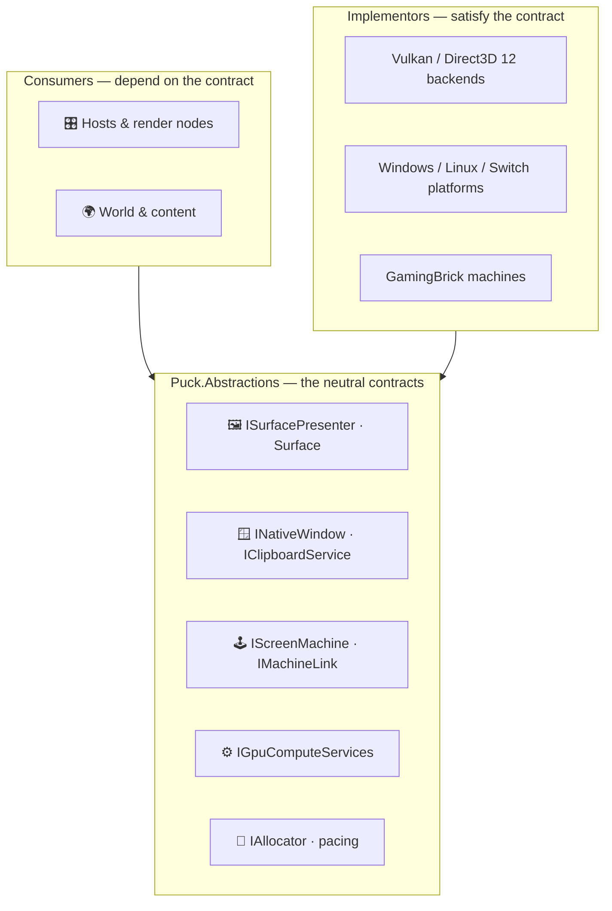

# Puck.Abstractions

Puck.Abstractions is the engine's neutral contract layer: the backend- and
platform-agnostic interfaces and small value types that everything else in the
engine is written against. A render node asks for a *surface presenter*, not for
Vulkan or Direct3D 12; a host drives an *`IScreenMachine`*, not a specific
emulator; a component allocates through an *`IAllocator`*, not through a
particular platform heap. The concrete implementations live in the backend,
platform, and content projects; this project is only the shape they agree on.

It sits at the bottom of the dependency graph and **depends on nothing else in
the engine**, so every other project can reference it without pulling in a
backend or a host. That is the whole point: the seam is what lets a Vulkan and a
Direct3D 12 backend, a Windows and a Linux window, or a real machine and a
headless stand-in be swapped without touching the code that drives them.

## ✨ Key features

- *One seam per capability:* presentation, windowing, screen-machines, GPU
  compute, capture, recording, lamp arrays, allocation, and pacing each get a
  small, explicit contract instead of a concrete dependency.
- *Backend- and platform-neutral:* no GPU API types, no OS handles in the public
  surface — those stay inside the backend and platform projects that implement
  these interfaces.
- *Leaf of the dependency graph:* references nothing else in the engine, so it
  can be shared everywhere without creating a cycle or dragging in a backend.
- *Value types carry no behavior:* the records and enums here (surface formats,
  present modes, lamp colors, pad state) are plain data the contracts exchange.
- *Determinism-friendly by construction:* the screen-machine and pacing seams
  are shaped around whole-tick, host-owned advancement rather than wall-clock
  callbacks.

## 📐 The contract seam

Shared code depends *down* onto a contract; a backend, platform, or host
implements it *up*. Nothing in this project reaches sideways to another engine
project.



## 📦 What each group contracts

| Group | Primary contracts | Implemented by |
|---|---|---|
| **Presentation** | `ISurfacePresenter`, `Surface`, `SurfaceFormat`, `PresentMode`, `PresentationOptions`, present-timing and device-lost feedback | the GPU backends and their presentation projects |
| **Windowing** | `INativeWindow`, `INativeWindowFactory`, `IClipboardService`, per-platform `NativeSurfaceBinding` (Win32, Wayland, Xcb, Vi) | `Puck.Platform` |
| **Machines** | `IScreenMachine`, `IScreenMachineEngine`, `IMachineLink`, `ITimeTravelMachine`, `IReconfigurableMachine`, `MachinePadState` | the GamingBrick emulators and other hosted machines |
| **Gpu** | `IGpuComputeServices` | the GPU backends |
| **Capture / Recording** | `IFrameCaptureSource`, `ICaptureSink`, `IVideoEncoder`, `IAudioCaptureSource`, `RecordedPacket` | `Puck.Platform` and `Puck.Recording` |
| **Lighting** | `ILampArrayDevice`, `LampColor`, `LampInfo`, `LampPurposes` | `Puck.Platform` |
| **Memory / Pacing** | `IAllocator`, `IPrecisionWaiter`, `IDisplayTimingInfo` | `Puck.Platform` |

## 🧩 Depending on a contract

Consumers take the interface and stay ignorant of the implementation. A render
node that needs to present a frame asks for an `ISurfacePresenter`; whichever
backend the host composed in satisfies it.

```csharp
using Puck.Abstractions.Presentation;

// The render node holds the neutral seam, never a backend type.
public sealed class RenderNode(ISurfacePresenter presenter)
{
    public void Present(Surface surface) =>
        presenter.Present(surface: surface);
}
```

The composition root — `Puck.Launcher` or `Puck.World` — is the one place that
chooses the concrete `ISurfacePresenter`, `INativeWindowFactory`, and machine
implementations and hands them to the code that only knows the contracts.

## 📋 Where the implementations live

- **GPU backends** — `Puck.Vulkan`, `Puck.DirectX` and their `*.Presentation`
  projects implement `ISurfacePresenter` and `IGpuComputeServices`.
- **Platform** — `Puck.Platform` implements windowing, clipboard, capture, lamp
  arrays, allocation, and pacing against the current OS.
- **Machines** — `Puck.HumbleGamingBrick` and `Puck.AdvancedGamingBrick`
  implement the screen-machine contracts; `Puck.Hosting` drives them.

## 🗺️ Where to go next

- [`Puck.Hosting`](../Puck.Hosting/README.md) — the fixed-step host boundary that
  drives these contracts each tick.
- [docs/project-map.md](../../docs/project-map.md) — the full dependency layering
  and the architecture gate that keeps this project a leaf.
