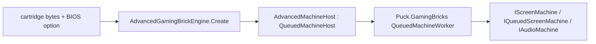

# Puck.AdvancedGamingBrick

Puck.AdvancedGamingBrick is the native ARM7TDMI machine costumed as AGB
hardware: CPU (ARM and Thumb instruction sets), PPU, APU, DMA, timers,
interrupts, cartridge, and link cable. It shares no CPU core with the SM83
compatibility machine in `Puck.HumbleGamingBrick` — only the master-clock and
link abstractions are shared where the hardware itself shares them. Snapshot,
fork, and queued off-thread hosting come from `Puck.GamingBricks`; this
project supplies only the AGB hardware itself.

## ✨ Key features

- *A complete machine from one DI scope:* `AdvancedGamingBrickMachine` binds
  the CPU, bus, PPU, APU, timers, DMA, interrupt controller, serial
  controller, and cartridge from one scope, so a machine never shares
  stateful peripherals with another and a snapshot can capture it completely.
- *Direct boot or BIOS boot:* a cartridge can start at
  `AdvancedGamingBrickMachine.CartridgeEntryPoint` (0x08000000) with the CPU's
  registers seeded to their post-BIOS state, or execute the real boot
  sequence against a caller-supplied `IBios` image through the lower-level
  machine API. The screen-machine host always direct-boots; its default BIOS
  is a zeroed stub.
- *Cartridge detection with a documented override table:*
  `AgbCartridge` scans the ROM for save-type strings; `AgbGameOverrides`
  corrects the known-broken minority (anti-piracy decoy strings,
  EEPROM-backed carts that bait with an SRAM string) by the 4-character game
  code, and also keys GPIO sensor presence (rumble, solar, tilt) off the same
  code.
- *A deterministic, instruction-atomic link cable:* `AgbLinkSession` connects
  two to four machines and steps whichever is furthest behind its own
  cumulative target, one instruction at a time, ties to the lowest index — a
  state-free rule, so a linked run replays identically. `Suspend`/`Resume`
  give a credit-preserving reconnect that requires every console to be
  transfer-idle first.
- *Queued, backpressured hosting:* `AdvancedMachineHost` (the
  `IScreenMachineEngine` adapter, engine id `advanced-gaming-brick`) forwards
  the neutral machine surface to `Puck.GamingBricks`'s `QueuedMachineWorker`.

## 📐 Hosting



`AdvancedGamingBrickEngine` (`Id = "advanced-gaming-brick"`) is the
`IScreenMachineEngine` implementation a host resolves by id. Its options
string selects the BIOS: no option or `direct` boots against a zeroed
replacement image at the cartridge entry point, and `bios=<path>` loads an
exact `ReplacementBios.ImageSize`-byte (16 KiB) image from disk for BIOS calls
during cartridge execution. Both host options direct-boot the cartridge.

## 🚀 Quick start

```csharp
using Puck.Abstractions.Machines;
using Puck.AdvancedGamingBrick;

IScreenMachineEngine engine = new AdvancedGamingBrickEngine();

IScreenMachine machine = engine.Create(
    options: "direct",              // or "bios=<path>" for a real dumped BIOS
    contentBytes: cartridgeRom,      // the cartridge ROM image
    savePath: "save.sav",            // battery-save path, or null for in-memory only
    audioSampleRate: 48_000
);
```

`AgbMachineFactory.Create` is the lower-level path `AdvancedMachineHost`
itself builds on: it takes an `AgbMachineConfiguration` (BIOS + ROM bytes)
and an optional composition callback for pre-registering a decorating or
test-only subsystem — a tracing bus, a flat test bus — before the standard
`TryAddScoped` registrations defer to it.

## 📋 Core types

| Area | Types | Role |
|---|---|---|
| Machine | `AdvancedGamingBrickMachine`, `AgbMachineConfiguration`, `AgbMachineFactory`, `AdvancedGamingBrickServiceRegistration` | The composition root and per-machine startup configuration. |
| CPU | `Arm7Tdmi`, `Arm7Tdmi.Alu`, `Arm7Tdmi.Arm`, `Arm7Tdmi.Thumb`, `IArmCpu`, `ArmDisassembler`, `CpuMode`, `ShiftType` | The ARM7TDMI core, both instruction sets, and its disassembler. |
| Bus | `AgbBus`, `IAgbBus`, `BusAccessType`, `AgbScheduler` | The cycle-scheduled system bus every subsystem reads and writes through. |
| Video/audio | `AgbPpu`, `IAgbPpu`, `AgbApu`, `IAgbApu`, `ApuPulseChannel`, `ApuWaveChannel`, `ApuNoiseChannel` | The PPU and four-channel APU. |
| Timing/interrupts | `AgbTimerController`, `IAgbTimerController`, `AgbInterruptController`, `IAgbInterruptController`, `InterruptSource`, `AgbDmaController`, `IAgbDmaController` | Timers, the interrupt controller, and DMA. |
| Cartridge | `AgbCartridge`, `CartridgeBackup`, `AgbGameOverride`, `AgbGameOverrides` | ROM signature scanning and header game-code overrides for save/RTC/GPIO detection. |
| BIOS | `IBios`, `ReplacementBios`, `AgbBiosProfile` | The BIOS image contract, owned image storage, and content-hash BIOS identification. |
| Link | `AgbLinkCable`, `AgbLinkSession`, `AgbLinkResumeToken`, `IAgbLink`, `NullAgbLink`, `AgbSerialController`, `IAgbSerialController` | The deterministic, instruction-atomic multi-machine link cable. |
| Hosting | `AdvancedMachineHost`, `AdvancedGamingBrickEngine`, `AdvancedGamingBrickCore`, `AdvancedPad`, `AdvancedGamingBrickLookahead` | The `IScreenMachineEngine` adapter over `Puck.GamingBricks`'s queued-host substrate. |

## 🧪 Verification

`Puck.AdvancedGamingBrick.Post` is the gate — there is no separate unit-test
project for this core:

```powershell
dotnet run --project src/Puck.AdvancedGamingBrick.Post -c Release
```

Tier A covers CPU/bus smoke vectors, determinism, state round trip, fork
determinism, save round trip, queued-host backpressure, throughput, and
zero-alloc-per-frame with no external assets; Tier B adds conformance
CPU/save/misc suites, an ARM fuzz corpus, render hashes, and an accuracy
suite (`--roms`/`PUCK_AGB_TESTROMS`, `--games`); see the battery's own README
for tier C and every diagnostic switch. `Puck.GamingBricks.Tests` exercises
the shared serialization/fork/queued-host substrate this core builds on.

## 📦 Packaging

`ByteTerrace.Puck.AdvancedGamingBrick` depends on `Puck.Abstractions` (the
`IScreenMachineEngine`/`IScreenMachine` contracts it implements),
`Puck.GamingBricks` (snapshot, fork, and queued-host substrate), and
`Puck.Maths` (fixed-point and hashing primitives). `Puck.World.Schema` and
everything layered above it depend on this package for the native AGB
machine.
