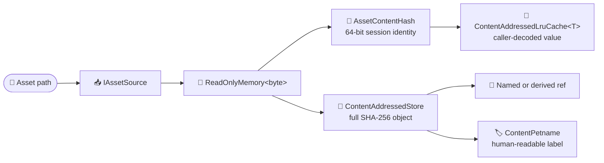

# Puck.Assets

Puck.Assets gives asset pipelines a small place to agree on bytes and identity
before format-specific code takes over. An **asset source** turns a path into a
complete byte payload. A compact content hash identifies that payload during a
process, and a bounded cache lets a loader reuse the decoded object when the
same bytes appear again under the same or a different path.

The library also carries the persistent form of the same idea. A
`ContentAddressedStore` writes immutable objects under their full SHA-256
digest, while named **refs**—small text files that point to an object—give
people and tools stable names for content that may change. `ContentPetname`
turns a hash into a short label such as `Willow-Lantern-Nine` when raw hex would
be awkward to read aloud.

The one decoder the library does carry is PNG: `PngEncoder` and `PngDecoder`
round-trip 8-bit RGBA stills and APNG animations for capture frames and baked
font atlases. Beyond that, nothing here decodes a font, shader, or document,
and Puck.Assets does not mount archives, layer sources, or normalize paths. It
supplies the byte and identity layer; each other consumer owns the meaning of
its own bytes.

`dotnet pack` produces `ByteTerrace.Puck.Assets`; the first NuGet.org release
has not been published yet. The package targets .NET 10 and depends only on
the `System.IO.Hashing` package (CRC-32 for the PNG codec); it has no project
dependencies.

This README is the human entry point. The
[generated API reference](../../docs/api) owns complete member signatures,
parameters, return values, and exceptions.

## ✨ Key features

- *Source-independent loading:* `IAssetSource` lets a loader consume a path
  without knowing whether the bytes came from the local file system, an
  archive, an embedded resource, or another source.
- *Identity by content:* `AssetContentHash` gives equal payloads the same small
  key even when their paths differ.
- *Bounded reuse:* `ContentAddressedLruCache<TValue>` retains recently used
  decoded values and evicts the least recently used value at a fixed capacity.
- *Persistent deduplication:* `ContentAddressedStore` writes one immutable
  object for each full SHA-256 digest and avoids rewriting bytes already held.
- *Stable names and derivations:* named refs point to stored objects, while
  derived refs remember the output produced from a particular input hash.
- *Readable diagnostics:* `ContentPetname` maps a hash to a deterministic
  three-word label for logs and operator-facing output.
- *A minimal PNG/APNG codec:* `PngEncoder` and `PngDecoder` write and read
  8-bit RGBA stills and full-frame APNG animations — just enough to round-trip
  the files Puck itself writes and bakes, not a general image library.
- *A small dependency surface:* the package depends on nothing beyond the
  .NET base class library and `System.IO.Hashing`, and does not perform
  dependency-injection wiring.

## 📐 How bytes move through the library

The in-process path and the persistent path begin with the same bytes but use
different identities. A process-lifetime cache wants a small, cheap key; a
store that may accumulate objects for years keeps the complete digest.



The cache never decodes a value itself. Its `valueFactory` belongs to the
consumer, so a shader loader can cache bytecode while a font loader caches a
font atlas without adding either format to this package.

## 🚀 Quick start

This example reads a UTF-8 asset from disk, hashes its bytes, and decodes it
only on a cache miss:

```csharp
using System.Text;
using Puck.Assets;

var source = new FileSystemAssetSource();
var decodedText = new ContentAddressedLruCache<string>(capacity: 128);

var bytes = source.Read(path: "assets/dialogue/intro.txt");
var hash = AssetContentHash.Compute(content: bytes.Span);

var text = decodedText.GetOrAdd(
    hash: hash,
    valueFactory: () => Encoding.UTF8.GetString(bytes.Span));

Console.WriteLine($"{hash}: {text}");
```

When the bytes must survive the process, put them in a persistent store and
give the object a ref:

```csharp
using Puck.Assets;

var store = new ContentAddressedStore(
    root: Path.Combine(Path.GetTempPath(), "puck-objects"));

var objectHash = store.Put(content: bytes.Span);

store.SetRef(
    category: "dialogue",
    name: "intro",
    hash: objectHash);

if (
    store.TryResolveRef(category: "dialogue", name: "intro", hash: out var resolvedHash) &&
    store.TryGet(hash: resolvedHash, content: out var storedBytes)
) {
    Console.WriteLine($"{ContentPetname.From(hashHex: resolvedHash)}: {storedBytes.Length} bytes");
}
```

`Put` returns a canonical `sha256/{64 lowercase hex characters}` address.
Writing identical bytes again returns the same address and keeps the existing
object.

## 📥 Supplying bytes

`IAssetSource` is deliberately small:

```csharp
bool Exists(string path);
ReadOnlyMemory<byte> Read(string path);
```

`Read` returns the complete payload. The interface is synchronous, so it is a
good boundary for local assets that a loader needs in full before decoding.
Implementations for remote or streamed data should usually perform that work
outside the loading hot path and expose the resulting local bytes through this
contract.

Paths are opaque. An asset source receives exactly the string the caller
supplies; joining a base directory, choosing search roots, and normalizing
separators are caller responsibilities. `FileSystemAssetSource` follows this
rule by passing the path directly to `System.IO.File`.

Both `FileSystemAssetSource` methods reject a null, empty, or whitespace path.
`Exists` reports whether a file is present, while `Read` returns its bytes or
lets the file-system exception describe why it could not be read.

## 🔎 Choosing a content identity

Puck.Assets has two SHA-256 representations because they solve different
problems:

| Representation | Text form | Use it for |
|---|---|---|
| `AssetContentHash` | `sha256-64/{16 lowercase hex characters}` | Compact in-memory identities, cache keys, and diagnostics within a running process. |
| `ContentAddressedStore` address | `sha256/{64 lowercase hex characters}` | Persistent objects, named refs, derived artifacts, and interchange between runs. |

`AssetContentHash.Compute` hashes the payload and stores the first eight digest
bytes in a `ulong`. The 64-bit result is intentionally compact: it is suitable
for deduplication and caching, but collisions become plausible around 2³²
distinct payloads. It is not an authentication or tamper-evidence mechanism.

The persistent store keeps all 256 bits. That makes accidental collisions
negligible for a store that grows over time, but the digest alone still does
not say who supplied the bytes. When authenticity matters, the expected digest
must arrive through a trusted or signed channel.

## 🧠 Caching decoded values

`ContentAddressedLruCache<TValue>` maps `AssetContentHash` values to whatever a
consumer produced from the bytes. Reading, adding, or replacing an entry marks
it most recently used. When the cache exceeds its fixed capacity, it removes
the least recently used entry.

| Member | Behavior |
|---|---|
| `GetOrAdd(hash, valueFactory)` | Returns an existing value or invokes the factory, stores its result, and returns it. |
| `TryGet(hash, out value)` | Reports a hit and refreshes that entry's recency. |
| `Set(hash, value)` | Adds or replaces a value and evicts from the oldest end when necessary. |
| `Clear()` | Removes every entry. |
| `Capacity` / `Count` | Report the fixed limit and current number of entries. |

The optional eviction callback runs whenever a value leaves the cache: capacity
eviction, replacement under an existing hash, and `Clear` all use the same
path. It is the natural place to dispose native handles or return pooled
buffers. The cache is not thread-safe; a caller that shares one instance across
threads must synchronize access.

## 💾 Persisting objects and refs

A `ContentAddressedStore` creates three directories beneath its root:

```text
objects/sha256/ab/ab…   immutable object bytes, fanned out by the first two hex digits
refs/<category>/<name>  a one-line sha256/<hex> pointer
tmp/                    write staging before an object or ref is promoted
```

Object writes are staged in `tmp/` and moved into place. If another writer has
already stored the same object, the duplicate temporary file is discarded.
Objects are never overwritten because their address is derived from their
bytes.

Refs provide mutable names over those immutable objects. `SetRef` replaces a
ref atomically, `TryResolveRef` reads it, and `ListRefs` returns the names in a
category in ordinal sort order. A category may itself contain path segments,
which is how the derived-cache helpers use `derived/<kind>`.

`SetDerived(kind, inputHash, outputHash)` records the output produced from one
input. `TryResolveDerived` performs the inverse lookup, allowing a build tool
to skip work while the input content remains unchanged.

## 🏷️ Naming content for people

`ContentPetname.From` turns the leading bytes of a hexadecimal hash into three
words selected from fixed lists:

```csharp
string label = ContentPetname.From(
    hashHex: "sha256/00112233445566778899aabbccddeeff00112233445566778899aabbccddeeff");

// "Willow-Bucket-Three"
```

The same hash always gets the same label on every machine and build. A petname
is only a compact aid for conversation and logs: many hashes share one, so it
must always remain paired with the real content hash when identity matters.

## 🖼️ PNG stills and animations

`PngEncoder.Write` takes tightly packed 8-bit RGBA pixels (row-major, no row
padding) and writes them as color-type-6 PNG: no row filtering, zlib-compressed
scanlines. `PngEncoder.WriteAnimation` writes the same pixel shape as an APNG —
`acTL`/`fcTL`/`fdAT`, every frame full-size at a uniform delay, looped
`playCount` times (0 loops forever).

`PngDecoder.Decode` reads 8-bit, non-interlaced PNGs back to tightly packed
RGBA: color types 0 (grayscale), 2 (RGB), 4 (grayscale + alpha), and 6 (RGBA),
all five standard scanline filters, every chunk CRC-checked, `tRNS`
transparent-color metadata applied, and unknown critical chunks refused.
`PngDecoder.DecodeAnimation` reads an APNG's frames the same way; a
non-animated PNG decodes as one zero-delay frame. Only full-size,
source-blended APNG frames are supported — sub-rectangle and `over`-blended
frames are refused.

This is a minimal codec pair, not a general image library: just enough to
round-trip the files Puck itself writes and bakes, including `Puck.Text`'s
font atlas artifacts (`FontAtlasArtifactWriter` / `FontAtlasImageDataLoader`)
and `Puck.Recording`'s capture stills (`CaptureSink`).

## 📋 Core types

This table is the conceptual map. The
[generated API reference](../../docs/api) owns the complete member-by-member
surface.

| Type | Role |
|---|---|
| `IAssetSource` | Supplies complete byte payloads by opaque path. |
| `FileSystemAssetSource` | Reads an `IAssetSource` from the local file system. |
| `AssetContentHash` | Holds the compact 64-bit SHA-256-derived identity used for process-lifetime caching. |
| `ContentAddressedLruCache<TValue>` | Retains a fixed number of decoded values by content identity. |
| `ContentAddressedStore` | Persists immutable objects under full SHA-256 addresses and manages named and derived refs. |
| `ContentPetname` | Produces a deterministic three-word label from a hexadecimal content hash. |
| `PngEncoder` / `PngDecoder` | Write and read 8-bit RGBA PNG stills and full-frame APNG animations. |
| `PngImage` / `PngAnimation` / `PngAnimationFrame` | The decoded still and animation shapes `PngDecoder` returns. |

## 📌 Design notes

- **Bytes stay mostly untyped.** Beyond the PNG codec, decoders, serializers,
  GPU uploaders, and format validation belong to consumers.
- **Paths stay with the caller.** There is no virtual file system, mount table,
  fallback search, or normalization policy in this package.
- **The two hash widths are deliberate.** A process cache uses the compact
  `AssetContentHash`; durable storage uses the full digest returned by
  `ContentAddressedStore`.
- **Cache eviction is synchronous.** The callback runs on the thread that
  caused the removal, so it should perform bounded cleanup.
- **Storage operations are local and synchronous.** The object store is a
  file-system building block, not a remote object-store client.
- **Atomic files do not make a transaction.** Object promotion and individual
  ref replacement are atomic, but a caller coordinating several refs or other
  state must supply its own transaction boundary.

## 🧪 Verification

```powershell
dotnet test tests/Puck.Assets.Tests/Puck.Assets.Tests.csproj
```

`PngCodecLawTests` builds hand-crafted chunk streams to exercise the decoder's
chunk and CRC handling directly, alongside encode/decode round-trips for both
stills and animations.

## 🧪 Building the package

```text
dotnet build src/Puck.Assets/Puck.Assets.csproj -c Release
dotnet pack src/Puck.Assets/Puck.Assets.csproj -c Release
```

The package includes this README, the repository's licensing files, symbols,
and XML API documentation through the shared packaging policy.
