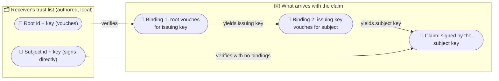
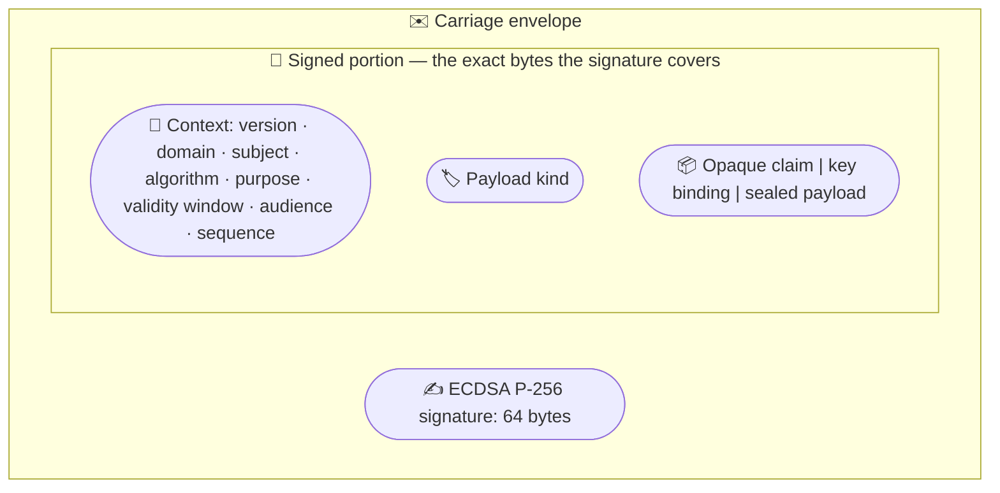

# Puck.Carriage

Puck.Carriage carries signed claims that can be verified without contacting the
issuer. A **carriage envelope** says “this identity made this claim” and carries
the exact signed bytes, the signature, and—when the receiver trusts a domain
rather than one person—the key-binding chain needed to reach a key the receiver
has already pinned. A **pin** is an identity and public key the receiver chose
out of band. If a required chain does not arrive with the claim, verification
refuses it instead of fetching anything.

Inside this repository, `Puck.World`, `Puck.World.Data`, and
`Puck.World.Server` reference the library. The world admission path verifies a
connecting peer’s claim against trust entries authored in the world document.
`dotnet pack` produces `ByteTerrace.Puck.Carriage`; the package depends on
.NET cryptography and
[`System.Formats.Cbor`](https://www.nuget.org/packages/System.Formats.Cbor).

This README is the human entry point. The
[generated API reference](../../docs/api) owns complete member signatures,
parameters, return values, and exceptions. The closing
[envelope contract](#signed-carriage--envelope-contract-v1) is the normative
wire specification.

## ✨ Key features

- *Offline verification:* the claim and its key bindings travel together, so
  verification needs no external directory, certificate service, or issuer
  connection.
- *Key-bound identities:* an identity includes the domain root’s SHA-256
  fingerprint—a fixed-size value derived from the public key—and the current
  key’s hash. Trust therefore rests on pinned key material rather than a claimed
  display name.
- *One envelope and one verification path:* claims and key bindings use the same
  signed shape. A reserved purpose and payload kind distinguish their roles.
- *Deny by default:* an empty trust list honours nothing, reach is explicitly
  scoped, and malformed, non-canonical, oversized, or expired input is refused.
- *Deterministic wire format:* the decoder requires one canonical CBOR encoding
  for each model—CBOR is a compact binary data format, and canonical means
  there is only one permitted byte representation. Signatures are checked
  against the bytes that arrived.
- *Replay-safe handoff:* a sequenced claim produces a replay-commit requirement
  that the receiver must store atomically with the state change requested by
  the claim.
- *Optional confidentiality:* the receiver may enable the
  `sealed-carriage-v1` extension, which uses ECDH P-256 for key agreement,
  HKDF-SHA256 for key derivation, and AES-256-GCM for authenticated encryption.

## 📐 How a claim verifies

The receiver authors a trust list outside the message. Carriage accepts two
trust shapes: a directly pinned subject key needs no bindings, while a pinned
domain root needs exactly two—root to issuing key, then issuing key to subject:



A binding and a claim use the same envelope. Under the mandatory base profile,
the signature is a 64-byte ECDSA P-256 signature over the exact encoded
`signed-portion`: the context header, payload kind, and payload.



## 🚀 Quick start

The issuing side provisions keys, creates the two bindings, and signs a claim:

```csharp
using System.Security.Cryptography;
using Puck.Carriage;

var codec = new CborCarriageCodec();
var now = DateTimeOffset.UtcNow;

// Keep the root key offline when practical. The issuing key performs routine
// domain work, and each subject has its own signing key.
using var rootKey = ECDsa.Create(curve: ECCurve.NamedCurves.nistP256);
using var issuingKey = ECDsa.Create(curve: ECCurve.NamedCurves.nistP256);
using var userKey = ECDsa.Create(curve: ECCurve.NamedCurves.nistP256);

// SubjectPublicKeyInfo (SPKI) is the standard encoded public-key container.
var rootSpki = rootKey.ExportSubjectPublicKeyInfo();
var issuingSpki = issuingKey.ExportSubjectPublicKeyInfo();
var userSpki = userKey.ExportSubjectPublicKeyInfo();

var rootId = KeyId.ForRoot(
    subjectPublicKeyInfo: rootSpki,
    algorithm: CarriageAlgorithms.EcdsaP256Sha256);
var issuingId = KeyId.ForIssuing(
    domain: rootId.Domain,
    subjectPublicKeyInfo: issuingSpki,
    algorithm: CarriageAlgorithms.EcdsaP256Sha256);
var userId = KeyId.ForSubject(
    domain: rootId.Domain,
    subject: "user-1234",
    subjectPublicKeyInfo: userSpki,
    algorithm: CarriageAlgorithms.EcdsaP256Sha256);

var bindingOne = CarriageSigner.SignKeyBinding(
    codec: codec,
    domain: rootId.Domain,
    signerKey: rootKey,
    signerAlgorithm: CarriageAlgorithms.EcdsaP256Sha256,
    targetId: issuingId,
    targetSubjectPublicKeyInfo: issuingSpki,
    notBefore: now.AddDays(-1).ToUnixTimeSeconds(),
    notAfter: now.AddDays(365).ToUnixTimeSeconds());

var bindingTwo = CarriageSigner.SignKeyBinding(
    codec: codec,
    domain: rootId.Domain,
    signerKey: issuingKey,
    signerAlgorithm: CarriageAlgorithms.EcdsaP256Sha256,
    targetId: userId,
    targetSubjectPublicKeyInfo: userSpki,
    notBefore: now.AddDays(-1).ToUnixTimeSeconds(),
    notAfter: now.AddDays(30).ToUnixTimeSeconds());

var claim = CarriageSigner.SignClaim(
    codec: codec,
    domain: rootId.Domain,
    subject: "user-1234",
    signerKey: userKey,
    signerAlgorithm: CarriageAlgorithms.EcdsaP256Sha256,
    purpose: "example.join",
    notBefore: now.AddMinutes(-5).ToUnixTimeSeconds(),
    notAfter: now.AddHours(1).ToUnixTimeSeconds(),
    audience: "world:example",
    sequence: null,
    claimBytes: "hello"u8.ToArray());

var wire = codec.EncodeEnvelope(envelope: claim);
```

The receiving side pins the root once, then verifies what arrives:

```csharp
// Authored out of band: pin the root and name the slots its claims may reach.
var trustList = new TrustList(
    entries: [
        new TrustListEntry(
            PinnedId: rootId,
            PublicKeySubjectPublicKeyInfo: rootSpki,
            Mode: CarriageTrustMode.Vouches,
            Reach: new HashSet<string>(comparer: StringComparer.Ordinal) { "join" },
            MaximumAge: TimeSpan.FromHours(4)),
    ],
    defaultMaximumAge: null);

var received = CarriageConformanceProfile.Base.DecodeEnvelope(
    codec: codec,
    wire: wire);

var result = CarriageConformanceProfile.Base.VerifyChain(
    codec: codec,
    claim: received,
    chain: [bindingOne, bindingTwo],
    trustList: trustList,
    now: now,
    expectedPurpose: "example.join",
    expectedAudience: "world:example");

if (result.Admits(slot: "join")) {
    // Verified, admitted by an authored entry, and allowed to reach this slot.
}
else {
    Console.WriteLine(result.RefusalReason);
}
```

The example captures `now` once because the verifier never reads a clock. In a
recorded simulation, capture and record that instant at the admission boundary
so replay supplies the same input. Also, `result.Verified` is not always an
admission verdict: a sequenced claim requires
`TryGetReplayCommit(slot, out var requirement)`, followed by an atomic commit
of that requirement and the claim’s effect.

## 📋 Core types

This table is a conceptual map. The
[generated API reference](../../docs/api) owns the complete member-by-member
surface.

| Type | Role |
|------|------|
| `KeyId` / `CarriageAlgorithms` | Describe a key-bound identity and the registered signing or sealing algorithm attached to it. |
| `CarriageEnvelopeHeader` / `SignedCarriageEnvelope` | Hold the signed context and the exact arrived bytes used for verification. |
| `ICarriageCodec` / `CborCarriageCodec` | Encode and decode the canonical v1 wire representation. |
| `CarriageSigner` | Create signed claims and key-binding envelopes. |
| `TrustList` / `TrustListEntry` / `CarriageTrustMode` | Define which keys or roots the receiver trusts, their reach, and their age and replay policies. |
| `CarriageConformanceProfile` / `CarriageConformanceExtensions` / `CarriageResourceLimits` | Select the mandatory base profile, optional sealed payload support, and fixed resource ceilings. |
| `CarriageVerifyResult` / `ReplayCommitRequirement` | Report verification, slot-scoped admission, and the durable replay update required before a sequenced effect is admitted. |
| `SealedCarriage` / `SealedPayload` | Encrypt and decrypt payloads for a named recipient; sealing provides confidentiality, not sender identity. |

## 🧪 Testing

```text
dotnet test tests/Puck.Carriage.Tests/Puck.Carriage.Tests.csproj -c Release
```

The suite covers canonical decoding, signatures, purpose and algorithm
separation, both chain shapes, validity windows, audience and replay policy,
resource profiles, trust-list ownership, and sealed payloads. Independent test
code exchanges signed chains and sealed claims with the library in both
directions. File-backed SQLite tests demonstrate that a receiver can commit a
replay mark and a sample effect together across contention, rollback, and
reopening.

## Signed carriage

The protocol has a few ideas worth understanding before the exact byte-level
contract.

An identity is `(domain, subject, algorithm, keyHash)`. The domain is the root
key’s SHA-256 fingerprint, while `keyHash` identifies the current key’s exact
SubjectPublicKeyInfo (SPKI) bytes. A display name can still be useful to people,
but it never establishes trust.

Claims and key bindings use one envelope. The signed context includes the
domain, subject, algorithm, purpose, validity window, optional audience,
optional sequence, payload kind, and payload. The verifier chooses the
algorithm from the pinned identity and checks that the envelope agrees; message
data never selects the verification algorithm.

A trust entry either pins a subject key directly or pins a domain root that may
vouch for an issuing key. Direct trust uses no bindings. Domain trust uses
exactly two bindings, which lets the root remain offline during routine subject
issuance and lets an issuing key be replaced without changing the root pin.
Carriage performs no path discovery and fetches no missing certificates or
bindings.

Audience and sequence solve different replay problems. An audience restricts a
claim to one receiver. A sequence creates a durable high-water mark—the largest
sequence accepted so far—at that receiver. Whenever a sequence is present,
verification returns a scoped commit requirement instead of treating
cryptographic success as final admission; the receiver must transact that
requirement with the state change requested by the claim.

The issuer signs a validity window, and the receiver may impose shorter
maximum ages. Verification compares those rules with the caller-supplied
`now`; it does not read wall-clock time itself. A deterministic simulation
records the admission input and carries the verdict into the simulation rather
than verifying inside a step.

Sealed carriage encrypts a payload for a recipient by using an ephemeral ECDH
P-256 key, HKDF-SHA256, and AES-256-GCM. Anyone with the recipient’s public
sealing key can create ciphertext that opens successfully, so sealing proves
confidentiality but not sender identity. Sign an envelope around the sealed
payload when the receiver must authenticate the sender, and keep signing and
sealing identities in their registered roles.

## Ruled out

| Rejected design | Why |
|---|---|
| **Fetching keys or bindings during verification** | It restores an online dependency and makes verification fail when the external service is unavailable. Required material therefore travels with the claim or is already pinned. |
| **Trusting a domain’s display name** | Names are labels for people. The root-key fingerprint is the domain identity used for verification. |
| **Treating a self-issued claim as domain-issued** | A self-signature proves control of the signing key, not that a domain vouched for the subject. A receiver may trust that exact subject key directly, but it must not confuse direct trust with a domain chain. |
| **Carrying mutable balances as signed claims** | A signature fixes a value at one moment. Mutable balances remain state owned and updated by their authority. |

## Signed carriage — envelope contract v1

**Normative.** This section is the precise contract `src/Puck.Carriage`
implements for the signed carriage envelope described in
[Signed carriage](#signed-carriage) above: the byte layout, the canonicality
rule, the signature encoding, and the verification procedure the code follows.
The base profile needs CBOR, ECDSA P-256, and SHA-256; the sealed extension
additionally needs ECDH P-256, HKDF-SHA256, and AES-256-GCM.

Keywords: **MUST**, **MUST NOT**, **MAY**, **REFUSE**. *Refuse* means: produce a
negative verdict without side effects. It never means throw-or-return — that is
a language choice.

### 0. What is fixed and what is not

Fixed by this document: the byte layout, the canonicality rule, the signature
encoding, the set of conditions that MUST refuse, and the order in which
security-relevant work happens.

Not fixed, deliberately: which refusal an implementation *reports* when several
apply, the text of any message, the in-memory or persisted shape of the trust
list beyond the entries and policy inputs §7 requires, and what an accepting
verifier then permits. Trust evaluation is not shared — each side trusts
different things. **Two implementations using
the same conformance profile and the same policy inputs always agree on
accept-versus-refuse and MAY disagree on the reason.** Policy inputs include the
trust entries and their age/horizon policy, the recorded verification instant,
expected purpose and audience, and the replay mark supplied to the eventual
atomic commit. Comparing different profiles or policy is not a conformance
comparison; a cross-check that compares reasons is testing something this
specification does not promise.

#### 0.1 Mandatory profile and named extensions

The mandatory profile is **`carriage-v1-base`**, and this implementation
supports all of it:

- the deterministic CBOR v1 encoding in §§2–3;
- `ecdsa-p256-sha256` signing and verification;
- opaque claims, key bindings, both permitted chain shapes, windows, audience,
  finite-horizon replay requirements, and the refusal rules that apply to them;
- the resource ceilings below.

Capabilities outside that set are named extensions, never an unnamed
implementation subset:

| Extension | Adds |
|---|---|
| `sealed-carriage-v1` | payload kind 3 and the sealing scheme in §14 |

A verifier selects its profile out of band. **No envelope, algorithm field,
payload, or other message data selects a profile or enables an
extension.** A value that is valid only under a disabled extension REFUSES. In
particular, enabling an extension only makes its capability available; it does
not weaken §6 or let an envelope choose an algorithm other than the one
attached to its pinned key. An implementation MAY expose profiles that combine
named extensions, and MUST report which combination a conformance run uses.

Every named v1 profile has the following acceptance ceilings. These numbers are
part of the profile, so two implementations do not disagree because one happened
to allocate more than the other:

| Item | Maximum |
|---|---:|
| complete encoded envelope | 65,536 bytes |
| signed portion | 61,440 bytes |
| payload byte string (any kind) | 49,152 bytes |
| any text field | 256 bytes after UTF-8 encoding |
| any DER SPKI | 512 bytes |
| P-256 P1363 signature | exactly 64 bytes |

The complete-envelope ceiling MUST be checked before parsing. The remaining
ceilings MUST be checked before cryptographic work where the field is already
authenticated or structurally visible; nested binding and sealed payload bytes
MUST still obey the rule that their contents are interpreted only after the
containing signature verifies. Exceeding any ceiling REFUSES. Implementations
MAY impose lower operational transport limits, but those form a different local
profile/policy input and therefore cannot claim base-profile verdict equivalence
for inputs between the two limits.

### 1. Roles and identities

An **id** is `(domain, subject, algorithm, keyHash)`.

- `domain` — the SHA-256 fingerprint of the root key at the top of this id's
  chain, 32 bytes. Constant across every key that chain vouches for. Never a
  name.
- `subject` — the platform user id this key belongs to, or absent for a **root**
  or an **issuing** key.
- `algorithm` — a name from the registry in §4. It fully determines the curve
  and the hash; nothing else may appear here.
- `keyHash` — SHA-256 of this key's `SubjectPublicKeyInfo` (SPKI) DER encoding,
  32 bytes. Always derived from actual key bytes, never accepted as an
  independent claim. Identity is intentionally over the exact DER bytes, not
  over an abstract EC point: two byte-distinct SPKI encodings are two distinct
  `KeyId` values even if a crypto library imports them to the same public point.

A **root** id satisfies `domain == keyHash` and has no subject — no flag records
this, the shape proves it. An **issuing** id shares its root's domain and has no
subject. A **subject** id shares its root's domain and carries the user id.

Ids are rendered as lowercase hex in human-facing surfaces and as raw bytes on
the wire (§2). The two are the same value; nothing on the wire carries hex.

### 2. Encoding

CBOR (RFC 8949), deterministically encoded (§3). Three data items are defined:
the **envelope**, the **signed portion**, and the **payload**.

```cddl
envelope = [ signedPortion: bstr, signature: bstr ]

; the content of signedPortion, encoded independently, is:
signed-portion = [
    formatVersion: uint,          ; MUST be 1
    domain:        bstr,          ; exactly 32 bytes
    subject:       tstr / null,
    algorithm:     tstr,          ; a §4 registry name
    purpose:       tstr,
    notBefore:     int,           ; Unix seconds, plain integer — NOT tag 1
    notAfter:      int,           ; Unix seconds, plain integer — NOT tag 1
    audience:      tstr / null,
    sequence:      uint / null,
    payloadKind:   uint,          ; 1 opaque, 2 key-binding, 3 sealed
    payload:       bstr,
]

; payloadKind 2 (key binding); the content of payload is:
key-binding-payload = [
    targetDomain:    bstr,        ; exactly 32 bytes
    targetSubject:   tstr / null,
    targetAlgorithm: tstr,        ; a §4 registry name
    targetKeyHash:   bstr,        ; exactly 32 bytes
    targetKey:       bstr,        ; SPKI DER of the vouched-for public key
]

; payloadKind 3 (sealed); the content of payload is:
sealed-payload = [
    recipientDomain:    bstr,        ; exactly 32 bytes
    recipientSubject:   tstr / null,
    recipientAlgorithm: tstr,        ; MUST be the §4 sealing algorithm
    recipientKeyHash:   bstr,        ; exactly 32 bytes
    ephemeralKey:       bstr,        ; SPKI DER of the sender's one-time key
    nonce:              bstr,        ; exactly 12 bytes
    tag:                bstr,        ; exactly 16 bytes
    ciphertext:         bstr,
]
```

payloadKind 1 (opaque) is caller-defined bytes. The carriage codec and verifier
do not interpret them; the receiving application does. The set {1, 2, 3} is
closed, and a value outside it MUST be refused by the **decoder** rather than
left to the verifier. An implementation that stores the kind in one byte could
otherwise truncate a wider wire value into a legitimate kind (258 becomes 2).
The canonicality rule below catches that too, but only as a second line: a value
outside the set is not a kind.

**The signed portion travels as an opaque byte string.** The exact bytes that
were signed arrive verbatim; a verifier MUST check the signature against those
bytes, never against a re-encoding of what it parsed out of them. §3 makes the
two identical anyway, and that is the point — the wrapping makes it structural
rather than a property of somebody's encoder.

**All eleven signed-portion elements are inside the signature, format version
included.** A version outside the signature is a field an attacker rewrites for
free, and the version is what decides how every later byte is read.

**A key binding is not a separate artifact.** It is this envelope with
`purpose = "key-binding"` and `payloadKind = 2`. One envelope means one verify
path.

**`subject` always names the SIGNER, never the key being vouched for.** It is
therefore `null` on both bindings of a chain — a root and an issuing key are not
platform users — and carries the user id only on a claim. The key a binding
vouches for lives entirely in its payload. This is the single easiest field to
get backwards, and getting it backwards produces bindings that verify against
their own implementation and refuse everywhere else, because §11 step 4 checks
`subject` against the *pinned signer's* id.

**Optional fields are encoded as CBOR `null`, never omitted.** Every array has
its fixed element count. An absent-by-omission field would give one model two
encodings, which §3 forbids.

### 3. The canonicality rule

**One model, exactly one encoding. A decoder MUST REFUSE any other.**

Normatively: after decoding, re-encode what was decoded by the rules of this
section; if the result is not byte-identical to what arrived, REFUSE. That check
is sufficient and is the one an implementation should write, because it cannot
drift from the encoder beside it.

An encoder MUST produce, and therefore a decoder MUST require:

1. Definite lengths for every array and string. No indefinite-length items.
2. The smallest possible head for every integer, length, and array count
   (`0x82` for a 2-element array, never `0x98 0x02`).
3. No CBOR tags anywhere. Times are plain integers.
4. Text strings in UTF-8.
5. Nothing after the outer data item, at any nesting level. Trailing bytes are
   REFUSED, never ignored — a decoder that ignores them hands an attacker a
   family of distinct wire forms that all decode to one accepted claim.

Rules 1 and 2 are what a CBOR library's canonical/deterministic mode already
gives on the write side; few give it on the read side, which is why rule 5 and
the re-encode check are stated as obligations of the *decoder*.

Why this matters more here than in most formats: a signature is over BYTES.
Without one encoding per model, an honest claim has many wire forms, a receiver
deduplicating on bytes sees one claim as many, and a verifier that re-derives
the signing input from a parsed model refuses honest bytes for the wrong reason.

### 4. Algorithm registry

| Name | Role | Curve | Signature hash |
|---|---|---|---|
| `ecdsa-p256-sha256` | signing | NIST P-256 | SHA-256 |
| `ecdh-p256-hkdf-sha256-aes256gcm` | sealing | NIST P-256 | — |

The name pins curve *and* hash, because a P-256 key can sign under more than one
digest and the curve alone does not pin the scheme.

A name outside this table MUST be REFUSED wherever it appears — an envelope's
`algorithm`, a binding payload's `targetAlgorithm`, or a trust entry's pinned
id. Every implementation MUST support `ecdsa-p256-sha256`; the sealing entry is
available only under its named §0.1 extension. A known registry name whose
extension is disabled MUST also be refused. An implementation MUST NOT accept a
name that is not in the registry.

**A sealing algorithm can never admit a claim.** A trust entry pinning one MUST
be REFUSED at construction.

### 5. Signature encoding

ECDSA, IEEE P1363 fixed-field concatenation: `r || s`, each padded to the
curve's field width. For P-256 that is exactly 64 bytes. Any other length MUST
REFUSE, which forecloses DER as an alternate encoding of the same `(r, s)`.

A verifier MUST additionally check that the imported key's own curve is the one
the pinned algorithm names. An SPKI blob carries its own curve, and a name
promising P-256 must not verify against a key on some other curve.

**Signatures are not identities.** ECDSA is malleable: `(r, s)` and `(r, n-s)`
are both valid over the same message, so two distinct envelopes can carry one
claim. No low-`s` rule is imposed, because platform signers do not canonicalize
`s` and requiring it would refuse honest output about half the time. Replay
defence therefore rests on the sequence mark and the audience (§8) and MUST NOT
rest on having-seen-these-bytes.

### 6. The algorithm-from-pin rule

**The algorithm used to verify always comes from the PINNED key — from the trust
list, or from the binding one hop up — never from the envelope being verified.**

The envelope's `algorithm` field exists to be *checked against* the pin, and an
inequality MUST REFUSE. It is never read to select behavior. Letting message
data select verification behavior permits algorithm-confusion attacks, such as
accepting an unsigned message or treating an asymmetric public key as a shared
secret.

### 7. Trust entries

A trust entry pins an id **and** the actual key bytes it names — offline
verification cannot resolve a hash into a key. An entry declares one of two
modes:

- **signs-directly** — the pinned id MUST carry a subject. Claims from this key
  arrive with **zero** bindings.
- **vouches** — the pinned id MUST be a root (`domain == keyHash`, no subject).
  Claims under it arrive with **exactly two** bindings.

An entry whose key bytes do not hash to its own pinned `keyHash` MUST be
REFUSED at construction: otherwise the bytes do the verifying while the pin sits
there decorative.

A verifier MAY carry more per-entry policy — independent maximum ages for
root-to-issuing bindings, issuing-to-subject bindings, and claims (§9), which
slots the entry reaches, anything else. Each age only tightens the signed window
at its own layer. A verifier accepting sequenced claims MUST additionally author
one positive, whole-second, verifier-wide replay horizon `H`; unlike the three
ages it is not per entry, because it defines the replay-store key and retention
contract. A verifier with no finite `H` MUST REFUSE every sequenced claim.
Everything else is the receiving side's business and is outside this
specification. An empty trust list honours nothing; deny by default.

A direct pin is strictly more specific than a domain root, so a verifier MUST
consult direct pins first.

### 8. Purpose, audience, and sequence

**Purpose** separates signature *uses*. `key-binding` is reserved: an envelope
declaring it MUST be REFUSED wherever a claim is expected, and a caller MUST NOT
ask for it as an expected claim purpose. Every other purpose is application-defined,
and a mismatch with what the caller expects MUST REFUSE.

**Payload kind** separates what the bytes *mean*, and is checked separately from
purpose. A claim's kind MUST be 1 or 3; a binding's MUST be 2. A kind outside
{1, 2, 3} MUST REFUSE — deny by default.

**Audience and sequence are independent, not alternatives.**

| | Audience | Replay elsewhere | Replay at the audience |
|---|---|---|---|
| Directed | present | audience policy refuses it; no replay state | a sequence, or accepted |
| Bearer | absent | a durable sequence high-water mark | the same mark |

- A directed claim's `audience` MUST equal the verifier's own audience identity.
- A bearer claim (no audience) with no `sequence` MUST REFUSE — it would have no
  replay defence at all.
- **Whenever `sequence` is present — directed or bearer — the verifier MUST
  have a finite replay horizon `H`, derive `epochStart = floor(notBefore / H) ×
  H`, and return a replay-commit requirement containing `(domain, subject,
  epochStart, sequence, retainThrough = epochStart + 2H - 1)`. Verification is
  pure: it MUST NOT read or mutate replay storage.**
  Binding an audience defends against replay *elsewhere* and never against
  replay at the audience itself.
- A verification result carrying that requirement MUST NOT report the claim as
  admitted. Its ordinary admission query returns false; the receiver must
  explicitly request the scoped replay requirement and transact it with the
  effect. This keeps pure verification while preventing the convenience API
  from silently turning a prerequisite into an admission verdict.
- `H` MUST be positive and an exact number of wire seconds. A sequenced claim
  MUST REFUSE when `notAfter - notBefore > H`; its verifier-side maximum age is
  also the tighter of the ordinary claim maximum and `H`.
- The issuer MUST allocate sequences strictly monotonically within each
  `(domain, subject, epochStart)` across every purpose, issuing device, and
  subject-key rotation. It MAY restart at any value in a later epoch. This is an
  issuance constraint, not something a verifier can infer after seeing only one
  claim; violating it lets a legitimately higher claim suppress a later lower
  one, by design.
- **The receiver MUST commit the requirement and the claim's semantic effect in
  one atomic transaction.** In that transaction it compares `sequence` with the
  durable high-water mark for `(domain, subject, epochStart)`, refuses unless it
  strictly exceeds the mark, advances the mark, and applies the effect. Two
  concurrent presentations of the SAME claim MUST produce exactly one committed
  effect. Splitting compare from advance is a check-then-act race:
  both readers see the old mark, both find the sequence higher, both accept, and
  the mark ends up recording a replay that it was supposed to refuse. A network
  receiver must assume that presentations can overlap.
- The advance and effect MUST become durable together before the claim is
  admitted. Advancing first can lose the effect on a crash; applying the effect
  first can replay it. This is deliberately a receiver transaction contract,
  not verifier I/O hidden behind a callback.
- **A receiver that cannot commit REFUSES the claim.** An unreachable or
  unreadable store, a timeout, an aborted transaction, or a failed atomic
  comparison is a refusal, never an admission. An unavailable store means the
  replay defence is unavailable, so the receiver cannot safely apply the
  effect.
- Nothing is consumed by such a refusal, so the same claim MAY be presented
  again once the store recovers, and a receiver MAY retry internally before
  refusing. What it MUST NOT do is admit the claim in the meantime, or report an
  advance it has not durably recorded.
- The failure MUST NOT be reported as admission
  either. A receiver whose store blinked must still produce accept-or-refuse for
  every input. Verification may already have succeeded; its replay-commit
  requirement is a prerequisite, not evidence that the effect was admitted.

For an epoch beginning at `E`, the store MUST retain the mark through Unix
second `E + 2H - 1` inclusive, and a repeated advance MUST never shorten a
previously recorded deadline. It MAY delete the mark only when `now` is greater
than that deadline. The verifier supplies both `E` and this deadline in the
replay-commit requirement.

The bound is a proof, not a heuristic. The latest possible `notBefore` in the
epoch is `E + H - 1`; the `H` age/window limits make its latest acceptance
`E + 2H - 1`. Thus no claim from that epoch can pass its window after deletion.
A claim with an arbitrarily far-future `notBefore` belongs to another epoch and
cannot depend on this mark. Retention based only on the expiry of claims already
seen is non-conforming, because an unseen lower sequence may carry a later
signed window.

### 9. The validity window

`notBefore` and `notAfter` are Unix seconds authored by the issuer. A verifier
MAY independently impose maximum ages for (1) root-to-issuing bindings, (2)
issuing-to-subject bindings, and (3) claims. The policy for the artifact being
checked, never another layer's policy, is applied. The tighter signed and
verifier windows govern; neither loosens the other. A sequenced claim is also
capped by the verifier-wide replay horizon `H` from §8.

REFUSE when any of these hold:

- `notAfter < notBefore` (malformed window)
- `now < notBefore` (not yet valid)
- `now > notAfter` (expired)
- `now - notBefore > applicableMaximumAge`, when the verifier authored one for
  this layer
- for a sequenced claim, `notAfter - notBefore > H` or `now - notBefore > H`

**Where `now` comes from is a requirement, not a style note.** The verifier MUST
NOT read a clock. An implementation that replays recorded inputs MUST capture
`now` at the admission boundary and record it alongside the claim, so replaying
the same inputs reaches the same verdict. A request-scoped service may capture
its current time at the request boundary.

The same reasoning bars verification from a simulation step: it consumes
boundary-authored time, and the receiver's later replay/effect commit
writes durable storage (§8). An implementation with a deterministic tick MUST
verify at the boundary and carry the verdict inward, never verify inside the
tick. An implementation with no such constraint — a request-scoped web service —
is free to read its clock at the boundary it already has, which is the same
rule with a boundary that happens to be the request.

**The wire carries whole seconds**, so an implementation holding a
higher-precision time type MUST compare against the value it decoded from the
wire, never against an in-memory copy that kept its sub-second part. Otherwise
two verifiers disagree inside a one-second band at each boundary, and the
minting side disagrees with everyone about its own window.

Both boundaries are **inclusive**, and there is deliberately **no clock-skew
grace**. An issuer wanting slack backdates `notBefore`, which is authored,
auditable, and signed — unlike a verifier-side grace window, which every
verifier would size differently and which silently widens every window in the
system by twice its size.

The three age policies MUST NOT bleed across layers. In particular, the claim
maximum MUST NOT be applied to either binding. A root-binding maximum governs
how long a compromised issuing key can remain vouched for; a subject-binding
maximum governs how long a compromised subject key remains vouched for; a claim
maximum governs only claim staleness. A receiver MAY omit a root-binding ceiling
and rely on the root binding's signed `notAfter`, allowing the root key to remain
offline. That choice accepts the corresponding issuing-key compromise window.

At the API boundary, omitting either binding-specific default inherits the
existing default maximum-age value. A receiver that wants independent values
authors them explicitly; a receiver that wants no verifier ceiling sets the
general default to `null` and relies on the signed window. This prevents the
introduction of the split controls from silently removing an existing ceiling.

#### The issuer re-attestation profile

Re-attestation is the issuer re-signing a binding it already vouches for with a
fresh window. Its ordinary case is a session resuming after an absence, so the
binding it acts on has usually **lapsed** — the issuer must be able to verify one
whose window has closed.

An implementation that mints MAY therefore offer a reduced profile in which the
four window checks above are skipped **and every other check in this document
still runs in full**. It MUST be a distinct, explicitly named mode requested by
the caller — never a defaulted flag, never inferred. A verifier admitting a
foreign claim MUST NOT offer it.

### 10. Chain depth

A chain has exactly two admissible lengths and no others:

- **zero** bindings, under a signs-directly entry. Nothing is vouched for, so
  there is nothing to walk. Bindings arriving anyway MUST REFUSE — accepting
  unexamined bindings lets an attacker attach whatever they like to a claim that
  verifies.
- **two** bindings, under a vouching root: `chain[0]` is root-vouches-issuing,
  `chain[1]` is issuing-vouches-subject.

One binding is a broken chain; three is an unbounded one. Both MUST REFUSE.
The verifier checks these fixed shapes; it performs no path discovery or
cross-certification.

A root that vouches for **itself** as the issuing key MUST REFUSE. That would
make the root perform routine subject issuance and remove the replaceable
issuing-key layer while preserving only the appearance of a two-binding chain.

A claim that selects a vouching root and arrives without its two-binding chain
MUST REFUSE and MUST NOT be resolved by fetching. Fetching would restore the
online dependency this protocol excludes.

### 11. Verifying one envelope

Given an envelope's wire bytes, a pinned id, that key's SPKI bytes, and the
caller's expectations:

1. Decode by §2 and §3. Any failure REFUSES.
2. Check the envelope's `algorithm` equals the pinned id's algorithm (§6).
   REFUSE on inequality.
3. Check `domain` equals **the pinned entry's own `domain`** — the domain of the
   id this verification is pinned on: the trust entry's, for a claim; the id the
   hop above yielded, for a hop. REFUSE on inequality.
4. Check `subject` equals the pinned id's subject (both may be absent). REFUSE
   on inequality.
5. Check `purpose` equals what the caller expects. REFUSE on inequality.
6. Check `payloadKind` is what that purpose requires (§8). REFUSE otherwise.
7. Resolve the pinned algorithm to curve and hash (§4). Import the pinned SPKI;
   REFUSE if the key's curve is not the algorithm's (§5).
8. Verify the signature over the signed-portion bytes **as they arrived** (§5).
   REFUSE on failure.
9. Apply the window (§9), unless the caller requested the re-attestation
   profile.
10. **Only now** decode the payload.

**Step 3's right-hand side is normative, and reading it as the envelope's own
field is the failure mode.** A wording that instead said "the domain the
caller expects" would name no value the caller supplies; read literally it
compares `domain` with itself, always passes, and checks nothing. The
right-hand side is always something the verifier already holds. Note where the
work actually happens: §13 finds its trust entry by looking the claim's `domain`
up, so a claim naming a domain nothing pins is refused *there* ("not a trusted
vouching root") and never reaches step 3. Step 3 then carries that same pinned
domain down every hop, which is what refuses a binding minted for another domain
whose own signature verifies perfectly well.

**Step 10's position is normative.** Every payload byte is attacker-supplied,
and the only thing that makes it safe to read is that the pinned signer
committed to it. Steps 2–7 are cheap rejections that may run in any order; step
8 MUST precede step 10.

### 12. Verifying a key-binding hop

A binding hop is §11 with `purpose = "key-binding"`, `payloadKind = 2`, and the
pinned key of the hop above. After step 10 yields a key-binding payload:

1. REFUSE if `targetAlgorithm` is not in the §4 registry.
2. REFUSE if `SHA-256(targetKey) != targetKeyHash` — the payload is not
   self-certifying. This is what lets the next hop trust `targetKey`: a hash
   alone cannot carry the next hop's verification key, so the binding conveys
   both and the verifier catches a lie by recomputing.
3. REFUSE if `targetDomain` is not the chain's domain (cross-domain).

The hop yields `(targetId, targetKey)` for the hop below.

### 13. Verifying a claim and its chain

Inputs: the claim envelope, its chain (0 or 2 bindings), a trust list, `now`,
the expected purpose, and the verifier's own audience identity.

1. REFUSE if the caller's expected purpose is blank or `key-binding` (a
   programming error, not an attack).
2. REFUSE if the claim's `purpose` is `key-binding` — a binding presented as a
   claim.
3. REFUSE if the claim's `purpose` is not the expected one.
4. REFUSE if the claim's `payloadKind` is not 1 or 3.
5. Look up a **signs-directly** entry for `(domain, subject)`. If one exists:
   - REFUSE if any binding accompanied the claim (§10).
   - Verify the claim by §11 against that entry's pinned id and key.
   - Go to step 8, with the entry's maximum age.
6. Otherwise look up a **vouches** entry for `domain`. REFUSE if there is none
   ("not a trusted vouching root"), if the chain is absent or empty ("missing
   chain"), or if it does not hold exactly two bindings ("broken chain").
7. Walk:
   1. Verify `chain[0]` by §12, pinned on the root entry and using the
      root-binding maximum age. REFUSE if its target
      carries a subject (an issuing key must carry none), if the target's domain
      is not the claim's, or if the target's `keyHash` equals the root's own
      (§10, root self-vouching).
   2. Verify `chain[1]` by §12, pinned on the issuing id and key that step 7.1
      yielded and using the subject-binding maximum age. REFUSE if its target
      carries **no** subject, if the target's
      domain is not the claim's, or if the target's subject is not the claim's
      subject.
   3. Verify the claim by §11 against the subject id and key that step 7.2
      yielded — which is where the claim's own `algorithm` is checked against
      the pin.
8. Apply the window to the claim using the claim maximum age (§9), and for a
   sequenced claim additionally apply `H` and derive its replay epoch (§8).
9. Apply audience and sequence policy (§8), returning a replay-commit
   requirement when `sequence` is present. Do not access storage.
10. Accept.

Refusals in steps 5–7 that come from §11 or §12 propagate as refusals of the
whole chain.

**Where the domain is actually checked.** Steps 5 and 6 key their lookup on the
claim's own `domain`. That is what makes §11 step 3 non-circular rather than what
makes it circular: an entry *found* this way pins that domain by construction, an
entry *not found* refuses here, and it is the pinned domain — never the claim's
field re-read — that step 3 compares against at every hop below. A verifier that
re-read `domain` from the envelope at each hop would compare it with itself three
times and establish nothing, while looking exactly like a verifier that checked.

### 14. Sealed carriage

The same envelope with `payloadKind = 3`: the payload uses authenticated
encryption with associated data (AEAD), which encrypts the payload while also
authenticating context that remains visible.
Key agreement is ECDH P-256, **ephemeral to static**, feeding HKDF-SHA256 to an
AES-256-GCM key. The sealed payload names the recipient's complete
self-certifying id. `recipientAlgorithm` MUST equal
`ecdh-p256-hkdf-sha256-aes256gcm`; any signing algorithm or unknown name
REFUSES. Before sealing, the sender MUST check
`SHA-256(recipient SPKI) == recipientKeyHash`. Before unsealing, the recipient
MUST make the same check against the public half of the supplied private key.
This is what prevents a valid P-256 signing key, or merely the wrong sealing
key, from being silently accepted in the recipient role.

The recipient id is part of the signed payload and is additionally bound into
both HKDF info and AEAD associated data. The header component of that associated
data is the encoding of the **context header** alone — signed-portion elements 1
through 9, with no `payloadKind` and no `payload`. Tampering the header or any
recipient-id field therefore fails closed.

**The header is encoded independently, never sliced.** It is a definite-length
9-element array holding signed-portion elements 1 through 9 in order, encoded
by §3's rules. It is not a byte prefix of the signed portion: that array's head
says eleven elements and this one's says nine, so the two differ in their first
byte.

First form `recipientContext` independently of the envelope codec:

1. `recipientDomain`, 32 raw bytes.
2. One subject-presence byte: `0x00` for absent, `0x01` for present.
3. When present, the subject's UTF-8 byte length as an unsigned 32-bit
   big-endian integer, followed by those UTF-8 bytes.
4. The recipient-algorithm UTF-8 byte length as an unsigned 32-bit big-endian
   integer, followed by those UTF-8 bytes.
5. `recipientKeyHash`, 32 raw bytes.

No other presence value or text encoding is valid. The derivation and AEAD
construction MUST then use exactly these inputs:

| Parameter | Value |
|---|---|
| HKDF input keying material | the **raw** secret agreement — the shared point's X coordinate, exactly as the curve produces it, **not** hashed first |
| HKDF salt | **absent** (zero-length; the all-zero default of RFC 5869) |
| HKDF info | the ASCII bytes `puck.carriage.sealed.v1`, 23 bytes with no terminator, immediately followed by `recipientContext` |
| Output length | **32** bytes — the AES-256-GCM key |
| AEAD tag length | **16** bytes. Wherever the AEAD construction takes a tag length — `AesGcm(key, tagSizeInBytes)` and its equivalents — 16 is what MUST be passed |
| AEAD associated data | ASCII `puck.carriage.sealed.aad.v1` (27 bytes, no terminator), then the header-byte length as an unsigned 64-bit big-endian integer, then the header bytes, then `recipientContext` |

The AEAD tag-length row is derivable from §2's "tag: exactly 16 bytes" but is
also stated as a construction input because cryptographic APIs commonly require
it separately. An implementation that rejects a wire tag of the wrong width
but configures its cipher for a 12-byte tag would reject valid ciphertext even
though every format check passed.

Most of these values do not appear in the ciphertext. A disagreement therefore
surfaces as the same AEAD tag failure produced by tampering, so every input must
be fixed by the profile. Several ECDH APIs—including .NET's
`DeriveKeyFromHmac` and `DeriveKeyMaterial`—hash the agreement before returning
it; this profile instead feeds the raw agreement into HKDF.

Because none of it is observable from a signed envelope alone,
`tests/Puck.Carriage.Tests` pins the derivation against an independently minted
BindingCarriage known-answer envelope. Its test-only independent implementation
also exchanges freshly minted sealed payloads with Puck in both directions, so
the known answer and the live construction check each other instead of leaving
the agreement to this prose.

The ephemeral key travels on the wire and is therefore attacker-chosen: an
implementation MUST check both its **key type** and its **curve** before handing
it to the agreement, or the recipient's static key becomes an oracle for its own
private scalar.

- **Key type.** The SPKI's `AlgorithmIdentifier` MUST be `id-ecPublicKey` (OID
  `1.2.840.10045.2.1`) carrying a named-curve parameter. Any other key type — an
  RSA key, an Ed25519 or X25519 key, anything under a different OID — MUST
  REFUSE, and MUST be refused *before* the curve is consulted, because a non-EC
  SPKI has no curve to consult.
- **Curve.** The named curve MUST be P-256, the only curve the sealing algorithm
  names.

There is deliberately no key-intent bit in SPKI itself, and that is worth saying
because a platform whose ECDSA and ECDH APIs are separate types invites the
belief that the key bytes are separate too. They are not: an EC public key's SPKI
is byte-identical in shape whether its holder means to sign with it or to agree
with it, so an ephemeral key records no signing-versus-agreement intent and an
implementation MUST NOT invent one to check. What separates a signing key from a
sealing key in this specification is the recipient id's §4 algorithm name,
authenticated inside the sealed payload, never the key bytes — which is also why
§7 refuses a trust entry pinning a sealing algorithm rather than trying to tell
the keys apart.

For `payloadKind = 3`, §11 step 10 MUST decode all eight sealed-payload fields
and apply the recipient-algorithm, nonce, tag, SPKI size, key type, and curve
checks above. An authenticated claim with malformed sealed bytes REFUSES as part
of verification. This decoding MUST NOT move before signature verification;
until step 8 succeeds, the nested bytes and attacker-chosen EC point are not
interpreted.

A nonce that is not 12 bytes and a tag that is not 16 MUST REFUSE as format
errors, before any cryptographic call.

Sealing proves nothing about who sealed — anyone holding the recipient's public
sealing key can produce a payload that opens cleanly. Sealed carriage is
confidentiality only; where the recipient must know who sent it, the sealed
payload rides inside an ordinary signed envelope and the signature names the
sender.

### 15. Conformance summary

An implementation conforms to a named profile when, for every input within
that profile and under identical policy inputs, it produces the same
accept-or-refuse verdict as this document requires. A conformance report MUST
name the base profile and every enabled extension; bare "v1 conforming" is
insufficient. The conditions that MUST refuse, gathered:

| # | Condition |
|---|---|
| 1 | Ill-formed CBOR, wrong major type, wrong array length, or an unknown `formatVersion` |
| 2 | Non-canonical encoding (§3), including trailing bytes at any level |
| 3 | `domain`, `targetDomain`, `targetKeyHash`, `recipientDomain`, or `recipientKeyHash` not exactly 32 bytes |
| 4 | `payloadKind` outside {1, 2, 3}; a claim outside {1, 3}; a binding not 2 |
| 5 | `algorithm`, `targetAlgorithm`, or `recipientAlgorithm` outside the §4 registry or selected profile; a recipient algorithm that is not the sealing algorithm |
| 6 | `algorithm` not equal to the pinned key's algorithm (§6) |
| 7 | An imported key whose curve is not the pinned algorithm's |
| 8 | A signature that is not exactly `2 × fieldWidth` bytes, or does not verify |
| 9 | `purpose` = `key-binding` presented as a claim, or any purpose mismatch |
| 10 | `domain` mismatch against the expected domain; `subject` mismatch against the pin |
| 11 | Window failures (§9), unless the re-attestation profile was requested |
| 12 | Chain length outside {0, 2}; bindings attached to a directly-pinned claim |
| 13 | Root vouching for itself as the issuing key |
| 14 | An issuing target carrying a subject; a subject target carrying none |
| 15 | A binding payload that is not self-certifying (§12.2) |
| 16 | A cross-domain binding target |
| 17 | A claim subject that is not the chain's subject |
| 18 | `sequence` present with no finite verifier-wide horizon, or carrying a signed window longer than that horizon |
| 19 | Bearer claim (no audience) with no `sequence` |
| 20 | Directed claim whose `audience` is not the verifier's |
| 21 | A trust entry whose key bytes do not hash to its pinned id, whose mode does not match its id's shape, or that pins a sealing algorithm |
| 22 | Sealed payload with a recipient id/key mismatch, a non-sealing recipient role, a nonce that is not 12 bytes, a tag that is not 16, or an ephemeral key whose SPKI is not an `id-ecPublicKey` key on P-256 — key type and curve are separate checks in that order (§14) |
| 23 | A receiver cannot atomically and durably commit the replay requirement together with the semantic effect (§8); verification itself remains pure |
| 24 | An envelope, signed portion, payload, text field, SPKI, or signature outside the selected profile's §0.1 resource ceilings |
| 25 | A sealing algorithm or sealed payload when the verifier did not enable `sealed-carriage-v1` |

Three obligations in this document are not refusal conditions and so cannot appear
in the table, but conformance depends on them just as much. They are invisible to
any single-input test, which is exactly why they are called out here:

- **The signature is checked over the signed-portion bytes as they arrived**
  (§2), never over a re-encoding of the parsed model. An implementation that
  re-encodes still produces the right verdict on every honest input, and turns
  every decoder laxity anywhere in its stack into an accepted alternate wire form
  for a real claim.
- **The replay/effect commit is atomic** (§8). A non-atomic receiver is correct
  on every sequential input and either applies a bearer claim twice under
  concurrency or loses its effect across a crash.
- **Replay retention is epoch-derived** (§8). A store keyed only by domain and
  subject cannot bound retention safely: an unseen lower sequence with a
  far-future signed window can outlive a mark evicted from observed expiry data.

#### Demonstrating the three

These obligations do not fail on ordinary valid inputs. **An implementation
MUST therefore demonstrate each, and the demonstrations MUST be part of its
routine conformance tests.**

- **A concurrency demonstration.** One verified claim carrying a replay-commit
  requirement, presented to at least two receiver commits *simultaneously*, of
  which **exactly one** MUST apply the effect. The simultaneity MUST be arranged — a
  rendezvous, a barrier, or a store that holds every caller until all have
  arrived — so that a non-atomic store fails deterministically. The
  discriminating property is that the same receiver with the compare and
  advance split into two store calls MUST fail the demonstration. The
  demonstration must also assert that pure verification alone performs no
  commit.
- **A mutated-but-parseable demonstration.** Wire bytes that differ from an
  honest envelope, still decode, decode to the **same model**, and MUST be
  refused. These inputs separate a verifier checking the arrived bytes from one
  checking a re-encoding; an honest input cannot distinguish the two designs.
  At least one such input MUST use a non-minimal array head or an
  indefinite-length item (§3 rules 1 and 2). An
  implementation that verifies over a re-encoding accepts every one of them.
- **A finite-retention demonstration.** At least one sequenced claim whose
  signed window exceeds `H` MUST be refused, and at least one accepted sequenced
  claim MUST yield exactly the epoch and `E + 2H - 1` retention deadline §8
  derives. This distinguishes the bounded proof from a store that merely evicts
  from the expiries of claims it has happened to observe.

These demonstrations live with the implementation: concurrency needs multiple
receiver transactions running against each other, and the mutated-but-parseable
inputs need wire bytes crafted to decode to a model identical to an honest
envelope's. Puck's routine suite includes both the deliberately split in-memory
control and a real SQLite transaction. The SQLite case uses a file-backed WAL
(write-ahead log) with full synchronous writes, applies the semantic effect and
replay advance in one transaction, reopens the database after success, and
injects a failure before commit to prove that neither half survives alone.
