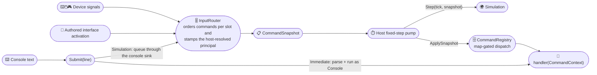
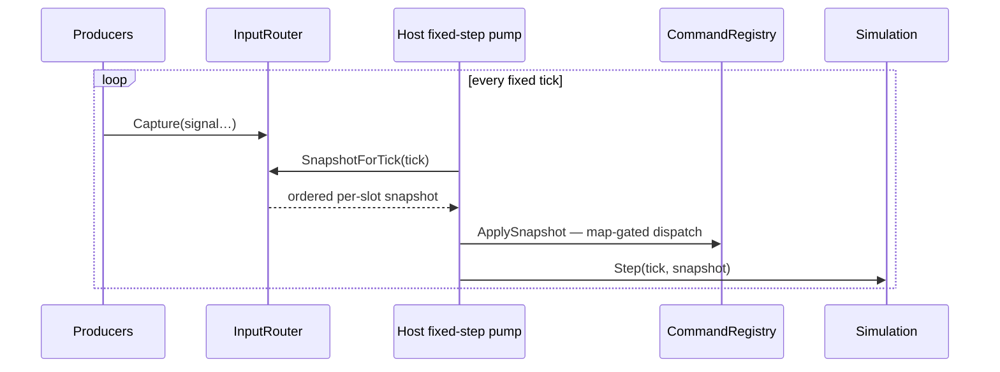

# Puck.Commands

A single command surface for simulations that advance in fixed steps. A
**command** is a named action such as `jump` or `look`, and its **value** says
how strongly or in which direction the action is active. Keyboard, mouse,
gamepad, console text, authored interface controls, and replayed input can
therefore reach the same handler without teaching that handler where the action
came from.

Each simulation step receives one `CommandSnapshot`: an ordered collection of
commands grouped by logical player slot. Given the same ordered captured input,
`InputRouter` produces the same snapshot. The host is still responsible for
running one snapshot per step and for keeping command handlers and simulation
code deterministic.

`dotnet pack` produces `ByteTerrace.Puck.Commands`; the first NuGet.org release
has not been published yet. The project depends on `ByteTerrace.Puck.Maths` and
[`System.CommandLine`](https://www.nuget.org/packages/System.CommandLine).

## ✨ Key features

- *One identity, many drivers:* a `CommandDefinition` is the shared identity
  behind every way an action can be invoked — a bound key, a typed line, a
  replayed input stream, an authored interface control.
- *Deterministic fixed-step input:* `InputRouter` orders captured input into one
  `CommandSnapshot` per logical step. Replaying the same ordered stream rebuilds
  the same snapshot.
- *Host-owned identity:* a `CommandPrincipal` identifies the actor — a local
  seat, the console, an addon, or a network peer. The router or text path stamps
  that identity before dispatch, and handlers read it from `context.Principal`.
- *Maps for application modes:* commands group into named maps such as gameplay
  or menus. A mode switch activates or deactivates a map without rebuilding the
  binding table.
- *Typed, allocation-free values:* digital, 1D/2D/3D axis, and orientation
  values share one `Vector4` backing. Each command declares which one it accepts.
- *Clear composition failures:* duplicate names or aliases, collisions with
  built-ins, and registrations that declare no bindability all fail at registry
  construction instead of silently choosing the last registration.
- *Binding validation:* `BindingVocabularyCheck` can refuse unknown,
  unbindable, or value-kind-mismatched destinations before a host accepts a
  binding document. `Puck.World` routes its documents through this check.

## 📐 How input becomes a command

There are two public routes to a handler: the fixed-step router and submitted
text. Both choose the acting principal before anything dispatches:



For a simulation that owns the final state, the loop is fixed-step: producers
capture whenever input arrives, and the host pulls one snapshot per host-owned
tick:



I found it useful to keep two questions separate: *which simulation slot
changes?* and *who is acting through it?* `CommandContext.Slot` answers the
first, while `CommandContext.Principal` answers the second. `DeviceId` is only a
live, local annotation used for work such as rumble or device assignment; it is
not part of the deterministic identity that recordings reproduce.

## 🚀 Quick start

If you want to see the pieces before reading the type table, this small example
follows one key press into a handler. Define commands in modules — one
definition per action, whatever drives it:

```csharp
using Puck.Commands;

sealed class GameplayModule : ICommandModule {
    public IEnumerable<CommandDefinition> GetCommands() {
        yield return CommandDefinition.Verb(
            name: "jump",
            description: "Makes the avatar jump.",
            valueKind: CommandValueKind.Digital,
            handler: context => {
                // context.Value, context.Phase, context.Slot, context.Principal
                return CommandResult.None;
            },
            bindability: CommandBindability.Bindable,
            map: "Gameplay");
    }
}

// The simplest binding resolver: one flat table shared by every slot.
sealed class FlatBindings : IInputBindings {
    public IReadOnlyList<CommandBinding>? Resolve(int slot, string source) =>
        (source == "Keyboard.Space") ? [new CommandBinding(Command: "jump")] : null;
}

// This simple host says that logical slot N belongs to local seat N.
sealed class LocalRoster : ICommandPrincipalResolver {
    public CommandPrincipal PrincipalOf(int slot) => CommandPrincipal.Seat(slot: slot);
}
```

Wire the registry and router, then produce one snapshot per fixed tick:

```csharp
var registry = new CommandRegistry(modules: [new GameplayModule()]);

registry.ActivateMap(map: "Gameplay");

// Bindings answer what each source drives; the principal resolver answers who acts.
var router = new InputRouter(
    registry: registry,
    bindings: new FlatBindings(),
    principalResolver: new LocalRoster());

// Queue simulation-class console lines with the other fixed-step input.
registry.RouteSimulationTo(sink: router.ConsoleTextSink);

// Per frame: producers capture raw signals ...
router.Capture(signal: new InputSignal(
    Source: "Keyboard.Space",
    DeviceId: default,
    Value: CommandValue.Digital(active: true),
    Phase: CommandPhase.Started));

// ... and the host pulls exactly one snapshot per fixed tick and applies it.
var snapshot = router.SnapshotForTick(tick: 1UL, windowEndTick: 1UL);

registry.ApplySnapshot(snapshot: in snapshot);

// Console entry point (not map-gated), dispatched as CommandPrincipal.Console.
CommandResult help = registry.Submit(line: "help");
```

Inside this repository, `Puck.Launcher` owns that loop end to end. A composition
root first supplies the command registry, capture clock, principal resolver, and
terminal services; this registration then adds the simulation and its router:

```csharp
services.AddFixedStepSimulation<GameSimulation>(bindings);

sealed class GameSimulation : IFixedStepSimulation {
    public void Step(in FixedStepContext context, in CommandSnapshot commands) {
        // Advance authoritative state exactly once. Launcher already applied commands.
    }
}
```

Once those services are composed, `FixedStepPump` owns the accumulator, capture
windows, console-injection wiring, snapshot application, catch-up, interpolation
remainder, and the apply-before-step order. `InputRouter` carries held input
between ticks, while the window host releases it on focus loss. Bound input
always passes through an `InputRouter`; without one, a composition root cannot
dispatch a binding.

## 🔑 Values

`CommandValue` packs every shape into one `Vector4`, so the value is small,
cheap to copy, and does not allocate. Each `CommandDefinition` declares one
`CommandValueKind`, and every binding for that command should send the declared
kind. A producer may change from a keyboard to a gamepad without changing the
command's value shape.

| Kind | Components used | Typical use |
|------|-----------------|-------------|
| `Digital` | `X` (0/1) | press/release actions (`jump`, `exit`) |
| `Axis1D` | `X` | scalar, conventionally −1…1 |
| `Axis2D` | `X, Y` | movement, or a raw look delta |
| `Axis3D` | `X, Y, Z` | motion sensors (gyro, accel) |
| `Orientation` | `X, Y, Z, W` | fused absolute orientation (unit quaternion) |

```csharp
var move = CommandValue.Axis(value: new Vector2(x: 1f, y: 0f)); // Axis2D
bool held = move.IsActive;        // any non-zero component
Vector2 v = move.AsAxis2D;        // read it back in its kind
```

## 🗺️ Maps

A command map is a named group toggled together — how gameplay, menu, and
console modes coexist without consumers caring. Only commands whose map is
active dispatch from a snapshot; `CommandMaps.Global` is always active, is the
default for a definition, and can never be deactivated.

```csharp
registry.ActivateMap(map: "Gameplay");
registry.DeactivateMap(map: "Gameplay");
bool on = registry.IsMapActive(map: "Gameplay");
```

## 🎛️ Bindings

For an ordinary command destination, leave `CommandBinding.Value` `null` to
pass the input's value through, as when a mouse delta drives `look`. Set it to a
constant when a digital key should drive a fixed `move` axis. Channel
destinations use the separate `ChannelScale` path described in the generated
API reference.

One physical input may bind to commands in several maps; only the command in an
active map dispatches, so mode changes do not rewrite the binding table.
`PagedInputBindings` adds named pages, modifier keys, multi-key chords, and
radial selection wheels. A flat `IInputBindings` implementation can ignore all
of those features.

`BindingVocabularyCheck` validates a document against the registered commands.
It refuses an unknown command, a command not declared `Bindable`, or a value
whose kind differs from the command's declaration. The check is a host
responsibility rather than an `InputRouter` runtime check. `Puck.World` routes
its documents through this validator and supplies command metadata when its live
registry is available. Another host can obtain the same guarantee by supplying
its registry before accepting authored bindings. This keeps an authored page
from exposing a protected administrative command that its author was not meant
to reach.

## 🚪 Who can dispatch a command

Two public paths reach a handler:

1. **Fixed-step input.** `InputRouter.Capture` accepts device-style signals,
   while `InputRouter.Activate` accepts a command activation produced by an
   authored interface. `SnapshotForTick` groups both by logical slot. For each
   slot, `ICommandPrincipalResolver.PrincipalOf(slot)` supplies the actor that
   the host currently recognizes there; the router does not guess that a slot
   belongs to a local seat.
2. **Submitted text.** `CommandRegistry.Submit` runs an immediate command as
   `CommandPrincipal.Console`. A command declared `CommandRouting.Simulation`
   instead enters the router through `ConsoleTextSink` and runs when the host
   applies its fixed-step snapshot.

The current `Puck.Scripting.Simulation` addon pump is not a third
`Puck.Commands` path. `Puck.World.Server` reads its typed submissions and turns
them directly into world intents under the addon's mounted identity.

The public API prevents callers from inventing another path. A handler needs a
`CommandContext`, whose constructor is internal, and
`CommandRegistry.Definitions` returns non-invokable `CommandMetadata`.
`ApplySnapshot` remains public because the host loop lives in another assembly,
but `CommandEntry`, `CommandLane`, and `CommandSnapshot` are internal to
construct and public only to read. The only snapshot a caller can create
directly is an empty one, which dispatches nothing.

## 📋 Core types

This table is the conceptual map. The [generated API reference](../../docs/api)
owns the complete member-by-member surface.

| Type | Role |
|------|------|
| `CommandRegistry` | The hub. Aggregates modules, dispatches snapshots and text lines, gates by map. |
| `CommandDefinition` | Named, typed, invokable command — the shared identity behind every way it can be driven. |
| `ICommandModule` | Unit of composition: contributes a set of `CommandDefinition`s. |
| `CommandContext` | Per-invocation state handed to a handler (value, phase, logical slot, stamped principal, local device, parse result, text, registry). Internal to construct. |
| `CommandPrincipal` / `CommandPrincipalKind` | The acting identity a dispatch carries: `Console`, `Seat`, `Addon`, or `Peer`. |
| `ICommandPrincipalResolver` | The host's answer to *who is acting through slot N*, which the router stamps onto that slot's commands. |
| `CommandBindability` | Whether a binding document may name a command. Required at every registration; `Unspecified` is refused by name. |
| `CommandMetadata` | The public read-only face of a registration (name, value kind, routing, bindability) — what `Definitions` returns. |
| `CommandResult` | What a handler returns for the transcript (output text + optional clear). |
| `CommandValue` / `CommandValueKind` | The per-frame value, tagged with its shape, packed into a `Vector4`. |
| `CommandPhase` | Transition the activation represents: `Started`, `Active`, `Completed`, `Canceled`. |
| `CommandMaps` | Well-known map names; `CommandMaps.Global` is always active. |
| `InputSignal` | A raw input keyed by a physical source id, *before* binding. |
| `CommandBinding` | Binds an input source id to a command (constant or pass-through value). |
| `IInputBindings` / `PagedInputBindings` | The slot-aware binding boundary, and the stateful chord/page/wheel implementation of it. |
| `CommandInjectionSink` | The read-only public face of the console sink used to queue simulation-class submitted text under `CommandPrincipal.Console`. |
| `TextCommandSource` | Queue and per-frame pump for command lines through the registry's text path. |
| `InputRouter` | Captures timestamped physical signals and pre-resolved injections, then emits ordered per-tick, per-slot snapshots. |
| `CommandSnapshot` / `CommandLane` / `CommandEntry` | Canonical deterministic input for one fixed tick, built and applied within it — ephemeral, never itself persisted, with local device identities excluded from its deterministic content. |

## 📌 Design notes

- **One identity, many drivers.** A `CommandDefinition` is resolved both when
  a console line is parsed and when a source dispatches a signal for its
  `Name`, so the same action needs only one definition.
- **Names and aliases are claimed, not shared.** The registry's constructor
  throws if two modules register the same command name or alias, or if either
  collides with a built-in (`help`, `wire.ack`, `wire.errors`). A non-`Global`
  map is deliberately shared: it is how several modules participate in one
  application mode, so there is no analogous guard over map names.
- **Snapshot dispatch is gated, `Submit` is not.** Bound activation respects
  command maps; submitted text remains available regardless of the active map.
- **Handlers read their principal, never construct one.** `context.Principal`
  is the identity selected by the router or text path. Constructing a different
  principal inside a handler would discard that attribution.
- **Unknown / inactive is silent.** A signal naming an unknown command, or one
  whose map is inactive, is ignored without error.
- **`help` is built in.** The registry auto-registers a `help` command listing
  every command and description.
- **Thread-safety.** `InputRouter.Capture` accepts signals from device I/O
  threads while the fixed-step thread builds snapshots. `TextCommandSource`'s
  queue likewise permits a background producer while the frame thread
  collects. `CommandRegistry`, `SnapshotForTick`, and the remaining mutable
  router operations are driven from the host's single fixed-step thread.

## 🧪 Testing

```text
dotnet test tests/Puck.Commands.Tests
```

The suite covers registry composition and collision refusals, router capture
ordering and snapshot determinism, paged bindings (chords, modifiers, pages,
wheels), held-input ordering, binding sessions, vocabulary checks, and argument
parsing.

See the [generated API reference](../../docs/api) for full member docs.
