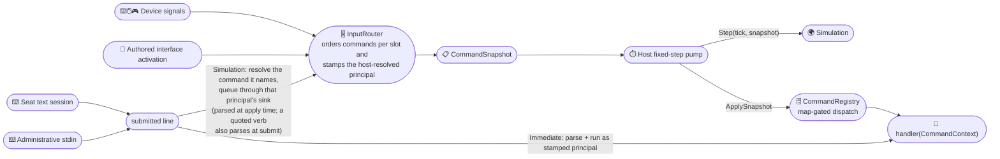
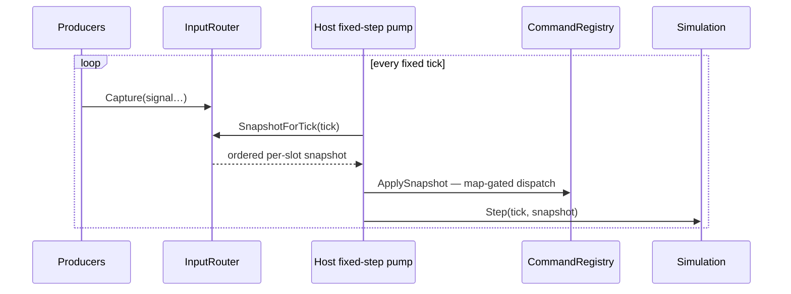

# Puck.Commands

A single command surface for simulations that advance in fixed steps. A
**command** is a named action such as `jump` or `look`, and its **value** says
how strongly or in which direction the action is active. Keyboard, mouse,
gamepad, console text, authored interface controls, and replayed input can
therefore reach the same handler without teaching that handler where the action
came from.

Each simulation step receives one `CommandSnapshot`: an ordered collection of
commands grouped by logical player slot. Given the same ordered captured input,
`InputRouter` produces the same snapshot. The host is still responsible for
running one snapshot per step and for keeping command handlers and simulation
code deterministic.

`dotnet pack` produces `ByteTerrace.Puck.Commands`; the first NuGet.org release
has not been published yet. The project depends on
`ByteTerrace.Puck.Abstractions`, `ByteTerrace.Puck.Assets`,
`ByteTerrace.Puck.Maths`, and
[`System.CommandLine`](https://www.nuget.org/packages/System.CommandLine), each
named directly, so the package's declared dependencies are the whole closure
rather than part of it plus whatever another package happens to carry along.

Native AOT and trimming are worth checking before a publish.
`BindingProfileJsonContext` is a source-generated `System.Text.Json` context
over `BindingProfileDocument` and every row, converted leaf, and enum beneath
it, so saving and reloading a player's controller mapping reaches no reflection
of this project's making, and this assembly builds under the repository's AOT
and trim analyzers. `ByteTerrace.Puck.Assets` still declares itself not
AOT-compatible, for its own reflection-based document path; those warnings are
assembly-scoped, and nothing on the binding graph reaches that path, but the
package cannot promise for what it depends on what it can promise for itself.

## ⚖️ Licensing

ByteTerrace.Puck is source-available and dual-licensed. It is not open source.
The default is the
[PolyForm Noncommercial License 1.0.0](https://polyformproject.org/licenses/noncommercial/1.0.0),
under which noncommercial use is free: study, hobby projects, research,
evaluation, and use by any school, university, public research organization,
charity, or government body. Shipping or operating it commercially requires a
paid commercial license from ByteTerrace, whatever the size of the user.

Both documents ride inside the package.
[`LICENSE.md`](https://github.com/ByteTerrace/Puck/blob/main/LICENSE.md) is the
binding noncommercial license;
[`LICENSING.md`](https://github.com/ByteTerrace/Puck/blob/main/LICENSING.md) is
the plain-language summary of who needs which, and how to ask for commercial
terms. PolyForm Noncommercial is not on NuGet.org's license-expression
allowlist, so the package page shows no license expression at all; read those
two files rather than that blank.

## ✨ Key features

- *One identity, many drivers:* a `CommandDefinition` is the shared identity
  behind every way an action can be invoked — a bound key, a typed line, a
  replayed input stream, an authored interface control.
- *Deterministic fixed-step input:* `InputRouter` orders captured input into one
  `CommandSnapshot` per logical step. Replaying the same ordered stream rebuilds
  the same snapshot.
- *Host-owned identity:* a `CommandPrincipal` identifies the actor — a local
  seat, the administrative console, an addon, or a network peer. The router or
  a host-minted `TextCommandSession` stamps that identity before dispatch, and
  handlers read it from `context.Principal`.
- *Maps for application modes:* commands group into named maps such as gameplay
  or menus. A mode switch activates or deactivates a map without rebuilding the
  binding table.
- *Typed, allocation-free values:* digital, 1D/2D/3D axis, and orientation
  values share one `Vector4` backing. Each command declares which one it accepts.
- *Clear composition failures:* duplicate names or aliases, collisions with
  built-ins, and registrations that declare no bindability all fail at registry
  construction instead of silently choosing the last registration.
- *Binding validation:* `BindingVocabularyCheck` can refuse unknown,
  unbindable, or value-kind-mismatched destinations before a host accepts a
  binding document. `Puck.World` routes its documents through this check.

## 📐 How input becomes a command

There are two public routes to a handler: the fixed-step router and submitted
text. Both choose the acting principal before anything dispatches.

Device signals and authored interface activations enter `InputRouter`, which
orders them per slot, stamps the principal the host resolves for that slot, and
emits one `CommandSnapshot`. The host's fixed-step pump applies that snapshot to
`CommandRegistry` for map-gated dispatch, then hands the same snapshot to the
simulation's `Step`. A submitted line, from administrative stdin or from a
seat's own text session, instead reaches `CommandRegistry.Submit`: an
`Immediate` command parses and runs there as the stamped principal, while a
`Simulation` command is resolved to the command it names and queued through that
principal's sink into the router, so it dispatches on a tick exactly as a bound
press does.

*(The two diagrams below draw that flow. They render on GitHub; NuGet.org's
markdown shows them as their source text.)*



For a simulation that owns the final state, the loop is fixed-step: producers
capture whenever input arrives, and the host pulls one snapshot per host-owned
tick. Each tick the host calls `SnapshotForTick`, receives the ordered per-slot
snapshot, applies it to the registry, and steps the simulation, in that order,
once:



I found it useful to keep two questions separate: *which simulation slot
changes?* and *who is acting through it?* `CommandContext.Slot` answers the
first, while `CommandContext.Principal` answers the second. `DeviceId` is only a
live, local annotation used for work such as rumble or device assignment; it is
not part of the deterministic identity that recordings reproduce.

## 🚀 Quick start

If you want to see the pieces before reading the type table, this small example
follows one key press into a handler. Define commands in modules — one
definition per action, whatever drives it:

```csharp
using Puck.Commands;

sealed class GameplayModule : ICommandModule {
    public IEnumerable<CommandDefinition> GetCommands() {
        yield return CommandDefinition.Verb(
            name: "jump",
            description: "Makes the avatar jump.",
            valueKind: CommandValueKind.Digital,
            handler: context => {
                // context.Value, context.Phase, context.Slot, context.Principal
                return CommandResult.None;
            },
            bindability: CommandBindability.Bindable,
            map: "Gameplay");
    }
}

// The simplest binding resolver: one flat table shared by every slot.
sealed class FlatBindings : IInputBindings {
    public IReadOnlyList<CommandBinding>? Resolve(int slot, string source) =>
        (source == "Keyboard.Space") ? [new CommandBinding(Command: "jump")] : null;
}

// This simple host says that logical slot N belongs to local seat N.
sealed class LocalRoster : ICommandPrincipalResolver {
    public CommandPrincipal PrincipalOf(int slot) => CommandPrincipal.Seat(slot: slot);
}
```

Wire the registry and router, then produce one snapshot per fixed tick:

```csharp
var registry = new CommandRegistry(modules: [new GameplayModule()]);

// Bindings answer what each source drives; the principal resolver answers who acts.
var router = new InputRouter(
    registry: registry,
    bindings: new FlatBindings(),
    principalResolver: new LocalRoster());

// Modality belongs to a logical player slot. Global remains active implicitly.
router.SetActiveMaps(slot: 0, maps: ["Gameplay"]);

// Queue simulation-class console lines with the other fixed-step input.
registry.RouteSimulationTo(sink: router.ConsoleTextSink);

// Per frame: producers capture raw signals ...
router.Capture(signal: new InputSignal(
    Source: "Keyboard.Space",
    DeviceId: default,
    Value: CommandValue.Digital(active: true),
    Phase: CommandPhase.Started));

// ... and the host pulls exactly one snapshot per fixed tick and applies it.
var snapshot = router.SnapshotForTick(tick: 1UL, windowEndTick: 1UL);

registry.ApplySnapshot(snapshot: in snapshot);

// Console entry point (not map-gated), dispatched as CommandPrincipal.Console.
CommandResult help = registry.Submit(line: "help");
```

The pump itself is the host's job. `ByteTerrace.Puck.Hosting` publishes the seam
a simulation implements, so a host that owns its own accumulator can drive the
loop above without taking anything else from this repository:

```csharp
using Puck.Hosting;

sealed class GameSimulation : IFixedStepSimulation {
    // Must divide EngineTicks.PerSecond exactly; the host reads it to size a step.
    public uint RatePerSecond => 60U;

    public void Step(in FixedStepContext context, in CommandSnapshot commands) {
        // Advance authoritative state exactly once. The host already applied commands.
    }
}
```

`InputRouter` carries held input between ticks, and the host releases it on focus
loss. Bound input always passes through an `InputRouter`; without one, a
composition root cannot dispatch a binding.

Two rules the loop depends on are enforced rather than merely documented. A
snapshot is produced once per host-owned tick, in non-decreasing tick order: a
tick behind the one the router last answered is a mis-wired pump, and it is
refused with `ArgumentOutOfRangeException` on the first frame instead of quietly
producing nonsense. And a snapshot's buffers are BORROWED from the router and
retired by its next `SnapshotForTick`; reading a retained snapshot afterward
throws `InvalidOperationException` rather than answering with the newer tick's
contents under the old tick number. Copy what you need to keep.

The reference host lives in this repository rather than in a package.
`Puck.Launcher` owns the accumulator, capture windows, console-injection wiring,
snapshot application, catch-up, the interpolation remainder, and the
apply-before-step order; it is a composition root for Puck's own executables and
is not published, so read it as a worked example of the loop, not as a
dependency to take.

Every edge the router synthesizes rather than captures (a transient impulse's
inactive twin, and every deterministic cancellation from focus loss, a
disconnect, a binding reload, or a map transition) is delivered on the tick
after the one that caused it. That delay comes from drain ORDER rather than from
any clock stamp: `SnapshotForTick` drains the owed edges at its top, before the
tick's own due signals, so anything synthesized during a fold is visible only to
the next call. A catch-up of N steps therefore cannot stretch the gap between an
input's active and inactive edge.

A device whose terminal focus is released captures through
`CaptureFocusExempt`. Only commands declaring `CommandInputScope.FocusExempt`
may dispatch, and only the host-owned always-active plane answers, so a typed
key cannot press a gameplay page's binding. A RELEASE is still forwarded through
the page resolver, because that resolver holds the chord tracker, the press
latches, and the armed command rows; a release those never observe would leave a
page flipped and a row armed until the console closes.

The resolver, not the router, is where that press is refused. The signal arrives
with `pressesWithheld` set on `IInputBindings.Resolve`, which tells a stateful
resolver to arm nothing and start nothing: it delivers what the release owes,
such as an armed row's completion, and leaves every shorter row that the break
happens to satisfy unarmed. A row armed under withheld presses would owe a
completion for a command that never started, and could not fire again until it
produced one. An inactive CONTINUOUS sample is a separate question, answered the
same way: a stick sitting at centre reports every frame and is the device
reporting rather than a release, so it is forwarded only when
`IInputBindings.HoldsSource` says the resolver is holding that source down. A
flat resolver holds nothing, answers `false` by default, and never sees one.

Edge-reported controls may stream digital `Active` reassertions while physically
held. Reassertions rebuild modifier/page state and recover continuous channel
destinations, but never fire ordinary commands, toggles, or activator gestures.
An analog producer marks deltas/impulses `Transient`; a transient channel value
is active for one tick and receives its inactive edge on the next tick instead
of becoming a stranded stick sample.

## 🔑 Values

`CommandValue` packs every shape into one `Vector4`, so the value is small,
cheap to copy, and does not allocate. Each `CommandDefinition` declares one
`CommandValueKind`, and every binding for that command should send the declared
kind. A producer may change from a keyboard to a gamepad without changing the
command's value shape.

| Kind | Components used | Typical use |
|------|-----------------|-------------|
| `Digital` | `X` (0/1) | press/release actions (`jump`, `exit`) |
| `Axis1D` | `X` | scalar, conventionally −1…1 |
| `Axis2D` | `X, Y` | movement, or a raw look delta |
| `Axis3D` | `X, Y, Z` | motion sensors (gyro, accel) |
| `Orientation` | `X, Y, Z, W` | fused absolute orientation (unit quaternion) |

```csharp
var move = CommandValue.Axis(value: new Vector2(x: 1f, y: 0f)); // Axis2D
bool held = move.IsActive;        // any non-zero component
Vector2 v = move.AsAxis2D;        // read it back in its kind
```

## 🗺️ Maps

A command map is a static category on a command definition. The input router
holds an independent active-map set for each logical player slot, so one player
can drive a vehicle while another remains on foot and a third uses a planning
surface. `SetActiveMaps` replaces the slot's complete set atomically. Supplying
both gameplay and menu maps creates an overlay; supplying only menu creates a
modal replacement.

`CommandMaps.Global` is implicit for every slot and is the default map for a
definition. Removing a map deterministically cancels that slot's affected
holds and resets that slot's binding tracker so streamed held controls can
re-establish only continuous state through the newly active maps. Text commands remain outside player modality; their stamped principal
and the handler's authority checks decide what they may do.

A map exists because a command declared it, and `SetActiveMaps` refuses a name no
registration claimed. Two more definitions in the quick start's `GameplayModule`
are what make the maps below nameable:

```csharp
// In GetCommands, alongside "jump": the same Verb call, with a different map.
yield return CommandDefinition.Verb(/* "steer", … */ map: "Vehicle");
yield return CommandDefinition.Verb(/* "menu.confirm", … */ map: "Menu");

// Then, on the host thread:
router.SetActiveMaps(slot: 0, maps: ["Gameplay"]);
router.SetActiveMaps(slot: 1, maps: ["Vehicle"]);
router.SetActiveMaps(slot: 2, maps: ["Gameplay", "Menu"]); // an overlay

bool driving = router.IsMapActive(slot: 1, map: "Vehicle");
```

## 🎛️ Bindings

For an ordinary command destination, leave `CommandBinding.Value` `null` to
pass the input's value through, as when a mouse delta drives `look`. Set it to a
constant when a digital key should drive a fixed `move` axis. Channel
destinations use the separate `ChannelScale` path described in the generated
API reference.

One physical input may bind to commands in several maps; only commands active
for the source's resolved slot enter its snapshot, so mode changes do not
rewrite the binding table or affect another player.
`PagedInputBindings` adds named pages, modifier keys, multi-key chords, and
radial selection wheels.

**The paged-binding layer is optional.** Most of the exported surface is it: the
`Binding*` document model, the `Compiled*` profile shapes it compiles into, and
the `BindingWheel*` view and geometry types a radial presenter reads. A host that
implements `IInputBindings` as a flat table needs none of them, so what
IntelliSense lists is not the API you have to learn. The core types table below
is.

A wheel's sector decision (`BindingWheelGeometry`) reads the same on every
machine: the angle comes from `Puck.Maths`' fixed-point `FixedQ4816.Atan2` and
every other step is an exactly-rounded IEEE operation, because the sector a
commit dispatches enters the deterministic command lane. The sector rule is
half-open and identical in every quadrant: sector `k` is centred `k +
SectorOffset` sectors clockwise of twelve o'clock and sweeps from half a sector
before that centre, so a direction lying exactly on a seam selects the sector
CLOCKWISE of the seam. The reading is quantised, so that promise holds to within
one and a half steps of the Q16 angle grid (2.3e-5 rad); inside that band of a
seam, the clockwise sector is selected too. `BindingWheelGrace` holds the
selection-grace window separately, counted on engine ticks the caller supplies
rather than on a clock of its own.

Modifier ids compare case-insensitively, so a chord member that differs from a
declared modifier only in case resolves to that modifier, and two modifiers
whose ids differ only in case are refused at compile. Physical source ids
compare the same way, in `Puck.Input`'s `InputSourceVocabulary` and in the
compiled page tables alike, so a row authored `"Gamepad.ButtonSouth"` presses
and releases exactly as the canonical spelling does.

A binding document has exactly one JSON spelling.
`BindingProfileJsonContext` is the sanctioned entry point for reading and
writing one from this package, and every bespoke spelling in the graph is
declared at the type rather than on a context: `CommandValue` and `ChannelRef`
carry their own converters, and every enum is written and read by exact declared
member name, with a numeric token refused. That is why a profile written from
this package and the same profile written as a section of a `Puck.World`
document are the same bytes rather than two shapes a reader has to guess
between. Reads are strict in both directions: a member the model does not have
is refused by name, and so is a member the model requires and the document
omits.

`BindingSessionPlan.FromPage` builds a guided rebinding session from one page,
walking that page's EFFECTIVE entries: a page carrying `inherits` presents its
own overrides plus everything it merely keeps, flattened by the rule
`BindingProfile.Compile` applies at runtime. It reserves every source that
drives page selection, declared modifiers and raw chord members alike, because
capturing one would break page selection for the whole profile.

`BindingVocabularyCheck.Validate(document, lookups)` validates a document
against the live vocabularies and returns a `BindingVocabularyReport`: every
refusal line the document earned, in document order, or none at all. The
vocabularies arrive as one `BindingVocabularyLookups`, each lookup
independently optional, so a caller with no registry keeps the physical checks
and a caller with no channel table keeps the command ones. A report is the whole
answer rather than a delta, so the check appends to nothing the caller already
holds.

On the command half it refuses an unknown command, a command not declared
`Bindable`, a value whose kind differs from the command's declaration, and
authored text bound to a command that accepts no wire arguments. On the physical
half it refuses, by name, a source the caller's control catalog cannot resolve
in any of the four places a document can name one: a page entry's `sources`, an
activator step, a declared modifier's own `sources`, and a chord row's
`held`/`chord` member that names no declared modifier. All four compile into a
control that never signals, which is the class of typo this gate exists to turn
loud.

The check is a host responsibility rather than an `InputRouter` runtime check.
`Puck.World` routes its documents through it and supplies command metadata when
its live registry is available; another host obtains the same guarantee by
supplying its registry before accepting authored bindings. This keeps an
authored page from exposing a protected administrative command that its author
was not meant to reach.

## 🚪 Who can dispatch a command

Two public paths reach a handler:

1. **Fixed-step input.** `InputRouter.Capture` accepts device-style signals,
   refusing one that names no source, while `InputRouter.Activate` accepts a
   command activation produced by an authored interface for a non-negative slot.
   `SnapshotForTick` groups both by logical slot. For each slot,
   `ICommandPrincipalResolver.PrincipalOf(slot)` supplies the actor that the
   host currently recognizes there; the router does not guess that a slot
   belongs to a local seat.
2. **Submitted text.** `CommandRegistry.Submit` runs an immediate command as
   `CommandPrincipal.Console`. A command declared `CommandRouting.Simulation`
   instead enters the router through `ConsoleTextSink` and runs when the host
   applies its fixed-step snapshot. For a line whose verb token stands on its
   own, `Submit` resolves it by that leading verb alone and the line's own parse
   happens once, when its tick applies. A line the parser must unquote to name
   its verb (`"sim.record" payload`) is routed after that parse instead, so it
   costs one extra parse; what a line is never allowed to cost is running a
   `Simulation` handler inline, outside the deterministic lane.

Five properties of the submitted line are worth stating outright, because a
scripted driver depends on them:

- **An `@`-prefixed argument is an ordinary token.** System.CommandLine's
  response-file expansion is switched off for both of the registry's parse
  sites, so a submitted line never reads the filesystem and never depends on the
  working directory.
- **Command identity is case-insensitive end to end.** A binding row naming
  `Player.Move`, the interned id it resolves to, and the line built from that
  spelling all reach the same handler. System.CommandLine itself matches
  case-sensitively, so the full parse substitutes the canonical spelling for the
  leading verb rather than the registry narrowing to match the parser.
- **A handler that throws never propagates out of `Submit` or `ApplySnapshot`.**
  The escaped exception becomes an `IsError` result naming it, visible to
  observers and counted by `wire.errors`. The boundary is the ENTRY rather than
  the handler, so it also contains what an observer throws and what the
  registry's own decoding of a submitted line raises; the rest of the tick's
  entries still run, and each entry's read-after-write barrier releases whether
  its body completed or threw. The single exception is an
  `OperationCanceledException`, which a handler raises by observing the HOST's
  cancellation token: that is a signal to the caller rather than a verdict about
  a command, so it propagates unchanged and uncounted, leaving the tick's
  remaining entries unapplied, which is what a requested shutdown asks for.
- **A deferred line's argument errors arrive a tick late.** Because a
  Simulation-class line whose verb stands alone is not parsed at submit, a
  malformed argument SHAPE is counted into `wire.errors` AND published to
  observers as an error when its tick applies, rather than answered by
  `Submit`'s return value. A handler-level refusal, such as an unparsable inline
  JSON row, always ran at apply time and still echoes there.
- **`wire.errors` counts the lines its CALLER submitted**, not the calls the
  registry made. A handler may submit lines of its own (a macro verb), and those
  reach the count only through the verdict that handler returns: a macro that
  propagates a nested refusal as an error contributes exactly one refusal
  however deeply it nested, and a macro that swallows one and answers success
  contributes nothing. That is the question the number answers, so a macro verb
  that must not hide a failure has to propagate it.

Read-after-write ordering across submitted lines is a `TextCommandSession`
guarantee rather than a `Submit` one: `TextCommandSource.Collect` holds that
session's following non-Simulation line until its pending Simulation submission
has applied, and each session's hold is independent of every other session's.

The addon pump (`Puck.World.Addons`' `AddonSimulationPump`) is not a third
`Puck.Commands` path. `Puck.World.Addons` reads its typed submissions and turns
them directly into world intents under the addon's mounted identity.

The public API prevents callers from inventing another path. A handler needs a
`CommandContext`, whose constructor is internal, and
`CommandRegistry.Definitions` returns non-invokable `CommandMetadata` as an
`ImmutableArray<CommandMetadata>`, since an `IReadOnlyList` over the backing
array would be one cast away from being rewritten (`CommandRegistry.Maps`
returns an `ImmutableArray<string>` for the same reason).
`ApplySnapshot` remains public because the host loop lives in another assembly,
but `CommandEntry`, `CommandLane`, and `CommandSnapshot` are internal to
construct and public only to read. The only snapshot a caller can create
directly is an empty one, which dispatches nothing. `ApiSurfaceTests` fails the
suite if a public constructor appears on any of the four, so this is enforced
rather than merely asserted.

## 📋 Core types

This table is the conceptual map. The
[generated API reference](https://byteterrace.com/reference/) owns the complete
member-by-member surface.

| Type | Role |
|------|------|
| `CommandRegistry` | The immutable command catalog and dispatch hub. Aggregates modules, interns command and map metadata, and dispatches snapshots and text lines. |
| `CommandDefinition` | Named, typed, invokable command — the shared identity behind every way it can be driven. Its identity-bearing members (`Name`, `TextCommand`, `Description`, `Map`) are readable but settable only inside the assembly, so a `with` expression cannot split a command's dispatch identity from its text identity. Build one through `Verb` or `WithWireArgs`, which refuse a null handler, name, or description at the registration rather than at the first dispatch. |
| `ICommandModule` | Unit of composition: contributes a set of `CommandDefinition`s. |
| `CommandContext` | Per-invocation state handed to a handler (value, phase, logical slot, stamped principal, local device, parse result, text, registry). Internal to construct. |
| `CommandPrincipal` / `CommandPrincipalKind` | The acting identity a dispatch carries: `Console`, `Seat`, `Addon`, or `Peer`. |
| `ICommandPrincipalResolver` | The host's answer to *who is acting through slot N*, which the router stamps onto that slot's commands. |
| `CommandBindability` | Whether a binding document may name a command. Required at every registration; `Unspecified` is refused by name. |
| `CommandMetadata` | The public read-only face of a registration (name, value kind, routing, bindability, input scope, map) — what `Definitions` returns. |
| `CommandResult` | What a handler returns for the transcript (output text + optional clear). |
| `CommandValue` / `CommandValueKind` | The per-frame value, tagged with its shape, packed into a `Vector4`. |
| `CommandPhase` | Transition the activation represents: `Started`, `Active`, `Completed`, `Canceled`. |
| `CommandMaps` | Well-known static map names; `CommandMaps.Global` is active for every slot. |
| `InputSignal` | A raw input keyed by a physical source id, *before* binding; distinguishes persistent samples, digital held-state reassertions, and transient impulses. |
| `CommandBinding` | Binds an input source id to a command (constant or pass-through value). |
| `IInputBindings` / `PagedInputBindings` | The slot-aware binding boundary, and the stateful chord/page/wheel implementation of it. |
| `CommandInjectionSink` | The read-only public face of the console sink used to queue simulation-class submitted text under `CommandPrincipal.Console`. |
| `TextCommandSource` | Queue and per-frame pump for command lines through the registry's text path. |
| `InputRouter` | Owns each slot's active maps, captures timestamped physical signals and pre-resolved injections, then emits ordered per-tick, per-slot snapshots. Disposable: a host that replaces a router must dispose the old one, or it keeps mutating its held tables on every binding reload and device disconnect. |
| `CommandEcho` | The bracketed `[verb: key=value …]` echo grammar a read-back or mutation verb writes, defined once rather than hand-spelled per verb. `Field` routes its value through `Quote`, and `SpliceTag(text, prefix, value)` quotes only the VALUE, because the tag's declared literal prefix has to stay readable to the readers that test for it. Either way a reserved character inside a value cannot end the token, the segment, the envelope, or the line; `Unquote` is the exact inverse of `Quote`, and `TryReadToken` is what a driver reading a whole echo line wants instead. |
| `CommandSnapshot` / `CommandLane` / `CommandEntry` | Canonical deterministic input for one fixed tick, built and applied within it — ephemeral, never itself persisted, with local device identities excluded from its deterministic content. |

## 📌 Design notes

- **One identity, many drivers.** A `CommandDefinition` is resolved both when
  a console line is parsed and when a source dispatches a signal for its
  `Name`, so the same action needs only one definition.
- **Names and aliases are claimed, not shared.** The registry's constructor
  throws if two modules register the same command name or alias, or if either
  collides with a built-in (`help`, `wire.ack`, `wire.errors`). A non-`Global`
  map is deliberately shared: it is how several modules participate in one
  application mode, so there is no analogous guard over map names.
- **Snapshot dispatch is gated, `Submit` is not.** Bound activation respects
  command maps; submitted text remains available regardless of the active map.
- **Handlers read their principal, never construct one.** `context.Principal`
  is the identity selected by the router or text path. Constructing a different
  principal inside a handler would discard that attribution.
- **Unknown / inactive is silent.** A signal naming an unknown command, or one
  whose map is inactive, is ignored without error.
- **`help` is built in.** The registry auto-registers a `help` command listing
  every command and description.
- **Thread-safety.** `InputRouter.Capture` accepts signals from device I/O
  threads while the fixed-step thread builds snapshots; it refuses a signal that
  names no source, and past `InputRouter.MaxCapturedSignals` (4096) it drops the
  OLDEST queued signal and counts it in `InputRouter.DroppedCaptureCount`, so a
  producer stamping capture ticks the host loop never reaches cannot grow the
  queue forever. The injection door has the same bound and the same counter,
  `InputRouter.MaxCapturedInjections` and `InputRouter.DroppedInjectionCount`,
  for the same reason. Both counters are zero for a well-behaved producer; a
  non-zero one means a diverged clock base or a pump that has stopped advancing.
  `TextCommandSource`'s queue likewise permits a background
  producer while the frame thread collects. `CommandRegistry`,
  `SnapshotForTick`, and the remaining mutable router operations are driven from
  the host's single fixed-step thread.
  `PagedInputBindings` mutates only on that thread as well; `ViewFor` and
  `WheelFor` are its two cross-thread readers, and both are non-mutating reads
  answered from the currently-loaded compiled profile, so a reader can never
  create slot state or observe a page row left over from a profile a `Reload`
  has replaced.
- **Lifetime.** `InputRouter` is `IDisposable`. `Dispose` detaches it from the
  binding-reload and device-slot edges it subscribed to at construction and is
  pump-thread-only, called after the producers have stopped. A router owned for
  the process lifetime needs no explicit call, since the container that resolved
  it disposes it with the host. Afterward every door refuses with
  `ObjectDisposedException` — `Capture`, `CaptureFocusExempt`, `Activate`, the
  `ConsoleTextSink`'s injection path, and `SnapshotForTick` — so a producer
  still holding a replaced router learns it is stale instead of quietly
  re-populating tables nothing will read.

## 🧪 Testing

```text
dotnet test tests/Puck.Commands.Tests
```

Each file pins one area, so a failure names the contract that moved.

- **Dispatch and text.** `CommandRegistryTests` covers the text-dispatch
  surface, the wire-native fast path, and its rejection wording;
  `CommandRegistryBoundaryTests` covers the per-entry exception boundary
  `ApplySnapshot` promises. `TextCommandSourceTests` drives the drain and its
  hold gate, `TextCommandSessionTests` the per-session read-after-write barrier.
  `CommandArgsTests` and `WireArgsTests` pin argument parsing and the zero-copy
  trailing-token view; `CommandEchoTests` pins the echo grammar's quoting.
- **The router.** `InputRouterTests` covers held-command edge logic over
  physical signals, `CommandModalityTests` per-slot maps, `HeldOrderTrackerTests`
  and `HeldCommandReleaseLawTests` press ordering and a held verb's two edges.
  `InputRouterHardeningTests` pins the behaviors an audit found unproven,
  `InputRouterFocusExemptTests` what a focus-exempt signal may and may not do,
  `InputRouterMomentaryReleaseTests` the one-release-per-command rule, and
  `InputRouterReleaseOrderTests` the total order of every synthesized release.
  `InputRouterConcurrencyTests` drives the headline thread-safety claim rather
  than asserting it. `CommandBufferTests` covers the borrowed per-tick view.
- **Bindings.** `PagedInputBindingsTests` covers pages, chords, modifiers, and
  wheels end to end; `BindingProfileCompilationLawTests`,
  `BindingProfileValidationTests`, and `BindingRowMemberLawTests` the compiler's
  laws and structural refusals; `BindingChannelLoweringLawTests` and
  `BindingChannelScaleLawTests` the channel path; `BindingVocabularyCheckTests`
  the vocabulary gate, including its tolerance for documents it exists to
  refuse; `BindingProfileJsonTests` the one wire shape, from a whole document's
  lossless round trip down to an enum refusing a numeric token.
  `BindingSessionTests` and `BindingSessionPlanReservationTests` cover guided
  rebinding and what a plan must reserve. `BindingWheelGeometryTests`,
  `BindingWheelGestureStateTests`, `BindingWheelGraceTests`, and
  `BindingWheelSectorTextTests` cover radial geometry, gesture state, the
  grace window, and a sector's authored text.
- **The published surface itself.** `ApiSurfaceTests` and `PackagingTests` pin
  that the snapshot shapes stay internal to construct, that no public member
  carries `[Obsolete]`, a retired-shape name, or a mutable field, and that the
  package identity and the shipped XML documentation survive a pack.

See the [generated API reference](https://byteterrace.com/reference/) for full
member docs.
