# Forge/Bake — the SDF→brick bake pipeline

`Puck.Demo.Forge.Bake` is the general, constraint-aware bake (the [game-studio-plan](../../../../docs/game-studio-plan.md)'s "faithful bake" pillar): it projects rich,
continuous SDF **down** into assets a real GamingBrick cartridge can use — 2bpp tiles, 4-colour palettes,
tilemaps, anchor-relative metasprites — while **surfacing and controlling the loss instead of hiding it**. One
pipeline serves every consumer: the live easel preview in creator mode, the `--forge-bake*` tool modes,
`AvatarForge` (12 views = 4 facings × 3 poses; a creation document's timeline frames become the walk poses), and
`BrickfallTitleBake` (the SDF emblem title baked as the game's default title art).

> The bake lives under the GREENFIELD demo: verify by running the tool modes and the live preview, never by
> adding a gate. Diagnostics and calibration are REPORTS — findings to read, not failure exits.

> **In-game reflection** (the [experience contract](../../../../docs/overworld-demo-plan.md#experience-contract)):
> the bake is reached in-session today through the live easel preview in creator mode
> (`creator.baketarget`/`creator.bakeoverlay`/`creator.style`) and the `forge` verb's
> author→forge→hot-swap loop. The headless `--forge-bake*` / `--forge-avatar` tool modes
> are the CI/proof twins of that same pipeline — they prove byte-identical output, not
> gate the only path to it.

## Architecture — the Rasterize / RunCpu split

`BakePipeline` is two halves, split on purpose:

- **`Rasterize`** — GPU, ONE view at a time: renders a plan's view at native × supersample resolution and wraps
  the readback.
- **`RunCpu`** — every CPU stage (grade → reduce → palette fit → quantize → tile assembly → diagnostics →
  preview compose), **pure and deterministic** — no GPU, no scene reads — safe on any thread that has time.
- **`Run`** — both, for the headless tools.

The split is what makes the live preview affordable: the render thread rasterizes one view per produced frame
(spreading the GPU cost across frames), then the quantize runs on a worker task while the world keeps rendering.

| File | Role |
|---|---|
| `BakePipeline.cs` | the two halves + the CGB/DMG quantizers and the warning collection |
| `BakeTypes.cs` | `BakeIntent` / `BakeTarget` / `BakeView` / `RasterizedView` / `BakeBudget` / `BakePlan` |
| `BakeStyle.cs` | the style-as-data record, the `classic`/`bold` presets, the forgiving name resolver |
| `StyleGrade.cs` | the pre-fit look stages: contrast/gamma/saturation grade, sprite mask, outlines, the Bayer4 dither offset |
| `BakeColor.cs` | rounded RGB555 packing, distances, palette wire encoding |
| `PaletteFitter.cs` | the CGB palette assignment (the algorithm below) |
| `TileAssembler.cs` | 2bpp encode + dedupe (CGB X/Y-flip matching), the 32×32 tilemap + attribute map, trimmed anchor-relative OAM slicing |
| `PreviewComposer.cs` | composes the quantized views into ONE preview image (+ the overlay modes) |
| `BakeDiagnostics.cs` | the honesty layer: `BakeDiagnostics` + `BakeResult` (the shared one-line `Summarize`) |
| `BakedAssets.cs` | the baked hardware asset records, `BakedAssetBundle` at the top |
| `BakedAssetBlob.cs` | the `PBAK` wire form (the chunk table below) |
| `CreationBakePlanner.cs` | `puck.creation.v1` → `BakePlan`: recenter (feet on y = 0, centroid at origin), poses fold into STATIC programs, intent picks the views |
| `BakeRasterizer.cs` | the live preview's persistent `SdfWorldEngine` (hot-swaps programs, worst-case capacity floors) |
| `BakePreviewService.cs` | the live easel preview (the state machine below) |
| `BakeForge.cs` | the `--forge-bake` / `--forge-bake-stress` tool modes |
| `BakeCalibration.cs` | the `--forge-bake-calibration` hand-art match report |

## The stages

1. **Grade** (supersampled resolution, in place) — contrast stretch about mid-grey, gamma on Rec.709 luma
   (hue-preserving), then the CGB-only saturation boost.
2. **Reduce** — box-reduce by the style's supersample factor back to native.
3. **Mask** (sprites) — foreground/background classification; transparent pixels never influence the fit.
4. **Outline** (style knob) — sprite rim / background Sobel-edge darkening before the fit.
5. **Palette fit** — the CGB assignment below, or the DMG luma ramp.
6. **Quantize** — nearest palette colour per pixel, with the position-based ordered-dither offset added first.
7. **Tile assembly** — 2bpp encode, dedupe, tilemap/attribute map or metasprite frames, OAM accounting.
8. **Diagnostics** — the measurements + report-only warnings.
9. **Preview compose** — the exact hardware pixels laid out in one grid (+ the average colour, the easel's
   room glow).

Intents: a **background** is one head-on 160×144 view (tiles + a 32×32 tilemap, and on CGB the parallel
attribute map); a **sprite** is 4 orbit facings × (1 + the document's timeline frames), each pose a 32×32 native
cell that trims to an anchor-relative metasprite.

## BakeStyle — the per-cart look knob, as data

Styles are DATA: the pipeline never branches on a style name, only on the record's fields. A cart declares its
look in its authored document (`bakeStyle`); unknown or missing names resolve to `classic` with a diagnostic
that surfaces as a bake warning, never a failure.

| Style | Dither | Contrast | Gamma | Saturation | Outline | Supersample |
|---|---|---|---|---|---|---|
| `classic` | none | 1.15 | 1.0 | — | darkened rim/edges | 2× |
| `bold` | Bayer4 ordered (0.6 LSB) | 1.3 | 0.9 | +0.15 (CGB only) | off | 4× |

## The CGB palette assignment (PaletteFitter)

Entirely in **rounded RGB555** space, over per-tile weighted histograms (counted through a dictionary but
**emitted sorted by colour** — no dictionary order ever escapes):

1. Per-tile **median cut** to ≤ 4 colours (4 usable for backgrounds; 3 for sprites, whose slot 0 is transparent).
2. **Dedupe** identical palettes by sorted colour tuple — the survivor count is the pressure gauge
   (`TilePaletteCount`).
3. **Pre-merge guard**: above 48 clusters, the smallest-pixel-count clusters fold into their nearest neighbour
   first, so the O(n²) greedy merge starts from a bounded n.
4. **Greedy pairwise merge** down to the budget (≤ 8), candidates re-derived by median cut over the pooled
   histograms, **lowest-index tie-breaks**.
5. **Exactly two Lloyd rounds** — reassign every tile to its argmin-error palette, re-derive each palette from
   its pool. Two is the settled count: enough to heal the merge's seams, never an open loop.

Sprites fit across **all frames jointly**, so animation never flickers palettes. The DMG path skips the fit
entirely: Rec.709 luma onto the 4-shade ramp with identity registers (`0xE4`); a DMG sprite's colour 0 is
transparent, so it has 3 usable shades — reported as a note, with the luma curve as the knob.

`TileAssembler` then dedupes on the encoded 2bpp bytes, including X/Y-flip matching on CGB (attribute/OAM bits
5/6 carry the flip); DMG backgrounds get NO flip dedupe (there is no attribute map to record it). Tiles enter
the bank in raster order, first-seen wins.

## Determinism rules

The bake honours the engine's soul end to end:

- **No wall clock, no RNG anywhere.** Dither is the position-based Bayer4 matrix; the live preview debounces by
  **produced frames**, never time.
- **Fixed iteration counts** (exactly 2 Lloyd rounds, bounded merges) and **lowest-index tie-breaks** at every
  choice point.
- **No iteration-order leaks** — histograms and palettes always emit in sorted/deterministic order.
- The contract: **`--forge-bake` writes byte-identical PNGs across runs.** Keep every new stage free of
  wall-clock, iteration-order, and float-ambient nondeterminism or that contract breaks.

## Diagnostics are the product

Budget pressure and quantization loss are **reported, never silently fixed** — dropping content to fit a budget
is an authoring decision, not a bake's. `BakeDiagnostics` measures source colours, tile-palette pressure,
emitted palettes vs budget, tiles before/after dedupe vs budget, mean / worst-tile error, OAM entries per frame,
and the per-scanline worst case; warnings fire for palette pressure, over-budget palettes after the merge, tile
budget, OAM total, scanline pressure, and an unknown style. The one-line `Summarize` is shared verbatim between
the tool's stderr line and the live preview's console line. Preview overlay modes: 0 = bare pixels, 1 = palette
strip + warning ticks, 2 = additionally rule the 8×8 tile grid (the in-editor `creator.bakeoverlay` verb sets
it).

## The PBAK blob (BakedAssetBlob)

`BakedAssetBundle.ToBlob()` is the wire form a cartridge assembler (or an external tool) can consume without the
pipeline in memory. **Little-endian throughout**; header = `"PBAK"` (4 ASCII bytes) + u16 version (1) + u16
chunk count; each chunk = fourcc (4 bytes) + u32 byte length + payload. Chunk order is **fixed** — the
background's (TILE, MAPX, ATTR, PALB, DMGP) then each sprite set's (TILE, PALO, DMGP, META, ANIM) — and every
payload derives from the bundle alone, so the same bundle always serializes to the same bytes.

| FourCC | Emitted for | Payload |
|---|---|---|
| `TILE` | background + each sprite set | u16 tile count, then 16 2bpp bytes per tile (first-seen bank order) |
| `MAPX` | background | u16 width (32), u16 height (32), then the 1024 cell bytes row-major |
| `ATTR` | background, CGB only | the raw 32×32 attribute map (palette bits 0-2, flip bits 5/6) |
| `PALB` | background | u8 palette count, then count × 8 bytes little-endian RGB555 (the palette-RAM wire form) |
| `PALO` | each sprite set | the object palettes, same shape as `PALB` |
| `DMGP` | DMG bakes only | 3 bytes: `BGP`, `OBP0`, `OBP1` |
| `META` | each sprite set | u16 frame count; per frame a u8 entry count then entries × 4 bytes in OAM order (dy, dx, tile, attr — anchor-relative) |
| `ANIM` | sprite sets with > 1 frame | u8 animation count (1); the default loop = u8 name length + ASCII `default`, u8 frame count, u8 ticks-per-frame (8), then the frame ids in play order |

`--forge-avatar` (and the in-engine `forge` verb) writes the blob as `<out>.bake.bin` beside the cartridge, with
the chunk list narrated to stderr so a forge log shows what an external assembler would receive — and then PROVES
it consumable: the blob is parsed back through the framework's own reader and linked into a scratch data window
(`avatar bake | PBAK round-trip linked | …`). The framework consumes this wire form natively —
`Framework/PbakBundle.Parse` is the reader and `AssetLinker`/`GameManifest` relocate the sections into a
cartridge (see the [Framework README](../Framework/README.md)'s linker section); Brickfall's baked title installs
through exactly this round trip.

## The live preview (BakePreviewService)

While the player sculpts, the workbench easel shows the **actual baked pixels**. The editor
connects through the `ICreatorBakePreview` seam (`OverworldFrameSource.ConnectBakePreview` swaps the null stub
for the live service); the easel borrows screen-surface slot 3 while creator mode is up.

```mermaid
stateDiagram-v2
    [*] --> Idle
    Idle --> Rasterizing: scene active · revision stable for 12 PRODUCED frames · revision ≠ last baked
    Rasterizing --> Idle: mid-bake edit (revision moved) — abandon; the debounce restarts from the new state
    Rasterizing --> Quantizing: last view done → RunCpu on a worker task
    Quantizing --> Idle: publish via IGpuSurfaceUpload — or narrate the failure once and keep the last image
```

The load-bearing details:

- **The debounce counts produced frames, never wall-clock** — determinism is a feature even for presentation
  plumbing. The scene snapshot (`ToDocument`) is taken once at bake start; a mid-bake edit abandons the pass.
- **One rasterized view per frame** on the render thread; the CPU half is pure (no GPU, no scene reads), so the
  worker task races nothing.
- **The published `IGpuSurfaceUpload` handle is valid only until the NEXT `Upload`** — it is re-stored on every
  publish and the easel's provider re-reads it every frame, exactly the contract `IGpuSurfaceUpload` documents.
  The result's average colour feeds the easel's room glow.
- **Nothing here may ever throw into the render loop.** A failure degrades to the last image, narrates ONCE per
  distinct message (the on-screen dev console when reachable, else stderr), and skips the failing revision so a
  deterministic failure never hot-loops.
- **`BakeRasterizer`** keeps ONE persistent `SdfWorldEngine`, created lazily and reused across bakes by
  hot-swapping programs through `UploadProgram`; it is recreated only when the raster extent changes (a style's
  supersample factor or an intent's native size). Its capacity floors come from a worst-case synthetic
  64-shape creation run through the SAME planner emission the live bakes use, measured once — so any live
  creation's program fits the constructed buffers by construction.

## Tool modes

All run inside the shared one-shot GPU host (`ForgeHost`) and write to a directory you pass.

| Flag | What it proves |
|---|---|
| `--forge-bake <dir>` | the headless proof: 2 subjects (the default avatar as a SPRITE, an authored scene as a BACKGROUND) × classic/bold × dmg/cgb = 8 preview PNGs, one diagnostics line each — **byte-identical across runs** |
| `--forge-bake-stress <dir>` | the rainbow palette-pressure scene: blows past the 8-palette budget on purpose, proving the greedy merge and the report-only warning (written with overlay mode 1) |
| `--forge-bake-calibration <dir>` | DMG-classic bakes of SDF stand-ins for Volley's hand art (paddle / ball / net) vs the hand 2bpp bytes: per-tile shade match % on stderr + a side-by-side PNG (hand \| baked, ×8). A calibration REPORT, never a failing gate — at landing: paddle 100%, ball 67%, net 81%, overall 89.7% |
| `--forge-avatar <path>` | rides the pipeline end to end (sheet preview + the `PBAK` blob beside the ROM) — see `RomForge` |

In-editor knobs (the console-assist verbs): `creator.baketarget dmg|cgb` picks the target the live preview bakes
for, `creator.bakeoverlay 0|1|2` picks the preview overlay, and the document's `bakeStyle` (set via
`creator.style`) picks the style.
