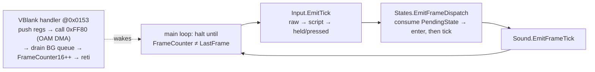

# Forge/Framework — the SM83 game framework

`Puck.Demo.Forge.Framework` is the runtime real forged games are made of, so a game is **logic over a
framework**, not hand-placed bytes. Twenty-two modules share one `Sm83Emitter` behind the `GameFramework` facade:
an interrupt-driven kernel, a battery-backed cartridge assembler, the input / shadow-OAM / background-queue /
PRNG / save / text / state-machine / sound plumbing every cartridge needs, and the **asset linker + game
manifest** layer that turns a game's identity — art, screens, rules, decks, scripts, sound — into declared DATA
the linker lands as addressed ROM tables. A game's job shrinks to: declare a manifest, define states, emit game
subroutines. All three built-in games are consumers — five-star Brickfall (`Forge/Brickfall/`), Volley
(`Forge/Volley/`), and Chroma (`Forge/Chroma/`); the legacy `ArcadeKernel`/`ArcadeCartridge`/`ArcadeArt`
machinery that Volley and Chroma once hand-assembled on was retired with their re-forge (git history has it).

> **Lift posture** ([game-studio-plan](../../../../docs/game-studio-plan.md) binding decisions): this folder depends only on `Sm83Emitter` + the `HgbImage` encoders and owns
> its own hardware constants (`Hw` — deliberately self-contained, ~30 lines), so a later lift to
> `experimental/Puck.HumbleGamingBrickRom` stays mechanical. Greenfield discipline holds: verify
> by running the forge tools, never by adding a gate.

## Module map

| File | Role |
|---|---|
| `GameFramework.cs` | the facade: one constructor wires every module over the shared emitter; `BuildRom` assembles the fixed order — prologue + VBlank handler, boot (hardware → sound boot → save load → interrupt arming), the `halt`-synced main loop (input tick → state dispatch → sound tick), module libraries, the game's library, the state bodies |
| `FrameworkKernel.cs` | the fixed prologue, the VBlank handler, the LCD-off boot bring-up, the halt-wait, and the block copy/fill helpers |
| `FrameworkCartridge.cs` | the 32 KiB MBC1+RAM+BATTERY assembler: vectors, header, checksums, the prologue convention enforced at build |
| `FrameworkMemoryMap.cs` | THE memory convention — the table below mirrors it; on any drift, the code wins |
| `Hw.cs` | the framework's own hardware constants (ports, regions, LCDC bits) + the build-time `MapCell(row, column)` |
| `RomDataBuilder.cs` | the `0x4000..0x7FFF` data window: named blocks (`Add`/`AddText`), duplicate names throw, overrun throws at build time |
| `PbakBundle.cs` | the `PBAK` wire-form READER (the inverse of the bake's writer): `Parse` → `PbakBackground` + `PbakSpriteSet`s — raw bytes only, no bake types, so the lift posture holds |
| `AssetLinker.cs` | the linker: allocates the 256-tile bank and the 8+8 palette slots as sequential segments, relocates parsed `PBAK` sections onto the grants (map cells/OAM tiles rebased, palette bits shifted), lands the blocks, seals the composed bank/palette tables for the boot spec |
| `GameManifest.cs` | the declarative layer: a game declares tiles, font, palettes, screens (literal or art-backed, both with text overlays), rule/record tables, strings, and input scripts; `Link` drives the linker once and returns the `LinkedManifest` lookup |
| `InputModule.cs` | the per-frame joypad tick: raw read → attract-script override → held/pressed/previous (active-high bits: Right `0x01` … Start `0x80`) |
| `OamManager.cs` | build-time sprite-slot reservation + shadow-OAM write helpers — games never touch hardware OAM; a hidden slot is Y = 0 |
| `BgModule.cs` | the VRAM write queue (push any time, drained in VBlank) + LCD-off bulk paints (`EmitFullPaint` clears the queue race-free) |
| `PrngModule.cs` | the 16-bit LCG + the D4 input-entropy seeding (the doctrine below) |
| `SaveModule.cs` | the battery-save block over SRAM: load/store/sum16, the never-trust-SRAM rule |
| `TextModule.cs` | the 39-glyph font (space, 0-9, A-Z, `>`, `-`), build-time string→tile-id encoding, queued/direct printers + packed-BCD number printers |
| `GameStateMachine.cs` | build-time state definitions (enter + tick callbacks), pending-state dispatch as a compare + conditional-call chain in code — no runtime jump table |
| `SoundDriver.cs` | the `ISoundDriver` seam (boot / per-frame tick / effect-by-id / `EmitLibrary`) and the silent `NoOpSoundDriver` |
| `ApuSoundDriver.cs` | the REAL driver: three per-frame sequencer voices (pulse-1 SFX, noise SFX, pulse-2 music loop) pumping raw APU register bytes from manifest-declared ROM streams; `Bind(linked)` resolves them after `Link` — see the sound section below |
| `SoundTables.cs` | the curated sound catalog AS DATA (deal/flip/shuffle/win + cursor/thud/sweep/over effects, the short music loop); `DefineIn(manifest)` declares every stream as an ordinary manifest table |
| `ApuNotePeriod.cs` | common note frequencies in millihertz (equal temperament, A4 = 440 Hz), integers so the period math `SoundTables` builds streams from is exact and byte-identical across runs |
| `LinkModule.cs` | serial-link plumbing: stateless SB/SC helpers (start-internal-send / arm-external-receive with optional SB staging — one transfer is inherently full-duplex / bounded poll with a timeout label / read byte). No game consumes it yet — link-fed multiplayer Poker is the follow-on arc |
| `LinkModuleVerify.cs` | the `SerialLinkSession` loopback proof for `LinkModule` |

## The linker & the manifest (how a game consumes assets)

The framework links the bake's `PBAK` bundles **natively**: `PbakBundle.Parse` reads the wire form (raw bytes —
a blob from disk links identically to one straight out of the pipeline), and `AssetLinker` (on the facade as
`GameFramework.Assets`) allocates the two scarce hardware tables — the **256-tile VRAM bank** and the **8 + 8
background/object palette slots** — as sequential named segments, relocating every reference onto the grants:
map cells and OAM tile ids are rebased, attribute/OAM palette bits shift to the granted slots (flip/priority
bits ride along). Backgrounds land as `<name>-map` / `<name>-attributes` blocks; sprite sets land as
`<name>-frames` (bare `(dy, dx, tile, attr)` rows — `OamManager.EmitDrawMetasprite`'s shape, already relocated)
plus `<name>-frame-table`, a **4-byte-stride runtime index** (address lo, address hi, entry count, 0 — two adds
to index on the SM83), with `FrameAddresses`/`FrameEntryCounts` carrying the same facts at build time for
unrolled draws. The bank and palette tables are **composed** — every segment rides one boot copy — and sealed
once as the reserved `tile-bank` / `bg-palette-table` / `obj-palette-table` blocks the boot spec consumes.

`GameManifest` is the declarative layer over it, and the shape every game shares (rules/layouts/decks as
manifest tables, never copies of another game's plumbing):

```csharp
var manifest = new GameManifest();

manifest.DefineTiles(name: "game-tiles", tiles2bpp: ...);          // bank base 0, in declaration order
manifest.DefineFontTiles();                                        // manifest.FontTileBase is now known
manifest.DefineBackgroundPalettes(name: "bg", paletteData: ...);   // first declaration takes slot 0
manifest.DefineObjectPalettes(name: "obj", paletteData: ...);
manifest.DefineArtScreen(name: "title", art: bakedBackground, overlays: menu);  // or DefineScreen(cells, overlays)
manifest.DefineScreen(name: "play", cells: ..., overlays: hud);
manifest.DefineRecords(name: "deck", stride: 4, records: ...);     // stride-validated; RomRecords carries stride/count
manifest.DefineTable(name: "rules", bytes: ...);
manifest.DefineInputScript(name: "attract", steps: ...);
manifest.DefineText(name: "str-pause", text: "PAUSE");
manifest.DefineSpriteArt(name: "cards", bundle: parsedBundle);     // every sprite set, frames + frame tables

var fw = new GameFramework(fontTileBase: manifest.FontTileBase, saveDefaultPayload: ..., saveVersion: 1);
var linked = manifest.Link(framework: fw);                         // allocate → relocate → land → seal, once

// Emission references everything by table address:
//   linked.TileBank / linked.BackgroundPalettes / linked.ObjectPalettes  → the FrameworkBootSpec
//   linked.Screen("title").Map / .Attributes                            → EmitCopyMap / attribute paints
//   linked.Table("rules") / linked.Records("deck") / linked.Text(...) / linked.InputScript(...)
//   linked.SpriteArt("cards")[0].FrameTable / .FrameAddresses / .TileBase / .PaletteBase
```

Allocation follows **declaration order**, so `FontTileBase` is known the moment the font is declared — before
the framework is constructed — and `Link` guards that the linker lands it exactly there. **The menu-text
contract is the manifest's overlay contract**: a screen's `ScreenText` overlays swap full tile cells into the
framework font AND (on art-backed screens) zero those cells' attributes back to palette 0, so no baked art can
ever ship a screen the player cannot read their way off of. `GameManifest.BuildScoreTable` builds the shared
high-score payload shape (3 initials as font tiles + 3 packed-BCD bytes per entry) for any game's save
defaults. Lookups on `LinkedManifest` throw on unknown names — a typo fails the forge, never the machine.

## The cartridge & the fixed prologue

`FrameworkCartridge.Build(title, routine, data)` emits a 32 KiB **MBC1 + RAM + BATTERY** image. Both 16 KiB ROM
banks are visible without a single bank-switch write (MBC1's primary bank resets to 1), so code lives in
`0x0150..0x3FFF` (16,048 bytes) and data in `0x4000..0x7FFF` (16,384 bytes, laid out by `RomDataBuilder`).

| Offset | Value | Meaning |
|---|---|---|
| `0x0040` | `jp 0x0153` | the VBlank vector — jumps to the handler the prologue pins |
| `0x0048/0x0050/0x0058/0x0060` | `reti` | STAT/timer/serial/joypad — never enabled, a stray request stays harmless |
| `0x0100` | `nop; jp 0x0150` | the header entry trampoline |
| `0x0104` | boot logo | written so the `.gbc` is valid on real hardware; Puck's `--rom` path starts at the seeded post-boot handoff (A = `0x11`) and never checks it |
| `0x0134..` | title | ≤ 15 characters, upper-cased |
| `0x0143` | `0xC0` | colour REQUIRED |
| `0x0147` | `0x03` | MBC1 + RAM + BATTERY |
| `0x0148` | `0x00` | 32 KiB ROM (2 banks) |
| `0x0149` | `0x02` | 8 KiB SRAM at `0xA000` |
| `0x014D`, `0x014E/F` | checksums | header + global, computed by the assembler |

**The prologue convention** (enforced with build-time throws): the routine is emitted at base `0x0150` and its
FIRST instruction must be the 3-byte `jp boot` — so the VBlank handler emitted immediately after it lands at the
fixed `0x0153` the `0x0040` vector targets. `FrameworkKernel.EmitPrologue` must be the first emission;
`GameFramework.BuildRom` handles all of this for you.

## The memory convention

Everything below `GameRam` belongs to the framework; a game owns `0xC200` upward. The stack grows down from
`0xFFFE`. This table mirrors `FrameworkMemoryMap.cs` exactly.

| Address | Symbol | What lives there |
|---|---|---|
| `0xC000/0xC001` | `FrameCounter` / `FrameCounterHigh` | the free-running 16-bit frame counter (the VBlank handler increments it) |
| `0xC002` | `LastFrame` | the main loop's copy of the counter's low byte — the halt-wait spins until they differ |
| `0xC003` | `InputHeld` | the active-high held-button byte the game reads (scripted during an attract override) |
| `0xC004` | `InputPressed` | the newly-pressed edges this frame (`held & ~previous`) |
| `0xC005` | `InputPrevious` | last frame's held byte (the edge detector's memory) |
| `0xC006` | `InputRaw` | the RAW hardware joypad read — real buttons even while a script overrides `InputHeld` |
| `0xC007/0xC008` | `PrngState` / `PrngStateHigh` | the 16-bit LCG state (the high byte is the output byte) |
| `0xC009` | `GameState` | the current state id |
| `0xC00A` | `PendingState` | the requested state id, consumed at the next frame dispatch (`0xFF` = none) |
| `0xC00B` | `VramQueueCount` | queued background-map writes (drained by the VBlank handler) |
| `0xC00C..0xC053` | `VramQueue` | 24 entries × (address-high, address-low, tile); a push beyond capacity is dropped |
| `0xC054` | `ScriptOverride` | non-zero while an input script (attract mode) overrides the held byte |
| `0xC055/0xC056` | `ScriptPointer` / `ScriptPointerHigh` | the script read pointer |
| `0xC057` | `ScriptFramesLeft` | frames left before the script advances to its next (buttons, frames) pair |
| `0xC058` | `ScriptEnded` | set to 1 when the script reaches its `0xFF` terminator |
| `0xC059` | `ScriptButtons` | the buttons byte of the script's current pair |
| `0xC060..0xC0A7` | `SaveMirror` | the battery-save payload's work-RAM mirror (up to 72 bytes) |
| `0xC0A8..0xC0AC` | `SoundMusicPointer` / `SoundMusicStart` / `SoundMusicWait` | the music sequencer: read pointer (high byte zero = silent), the loop's restart address, frames left on the current event |
| `0xC0AD..0xC0AF` | `SoundPulsePointer` / `SoundPulseWait` | the pulse-1 SFX voice's read pointer + wait counter |
| `0xC0B0..0xC0B2` | `SoundNoisePointer` / `SoundNoiseWait` | the noise SFX voice's read pointer + wait counter |
| `0xC0B4..0xC0FF` | `Scratch` | framework scratch, free for module-internal temporaries |
| `0xC100..0xC19F` | `ShadowOam` | the 160-byte shadow OAM page the HRAM trampoline DMA-copies every VBlank |
| `0xC200+` | `GameRam` | **game-owned** — the framework never touches this page or above |
| `0xFF80` | `DmaTrampoline` | the 10-byte OAM-DMA trampoline, copied to HRAM at boot |
| `0xFFFE` | `StackTop` | SP starts here, grows down |

## The kernel — one frame's anatomy

Boot (all with the LCD off, VRAM freely writable): interrupts off → stack → clear `0xC000..0xC3FF` (framework
page, shadow OAM — Y = 0 hides every sprite — and the first game pages) → install the DMA trampoline in HRAM →
palettes via the auto-increment ports → tiles → the initial map → the attribute bank cleared → the sound driver's
boot hook → the save load → request the initial state, LCD on, clear the stale post-boot IF, enable ONLY VBlank,
`ei`.



The handler runs about 560 of the ~1,140 available VBlank machine cycles at worst case (full 24-entry queue), so
game code pushed through `BgModule`'s queue always lands while VRAM is open. The trampoline runs from HRAM
because OAM DMA gates the rest of the bus; its countdown outlasts the 160-machine-cycle transfer.

## The PRNG seed doctrine (D4 — pure input entropy)

The PRNG is a 16-bit LCG (`state = state × 5 + 1`, output = the high byte — two `add hl, hl` and an
`add hl, de` on the SM83). The stock seeding discipline is **D4**: sample the free-running frame counter at the
title screen's START press edge, whitened with `XOR 0xA5C3` so an early press never yields a near-zero state.
**No wall clock and no hardware noise** — two players pressing on the same frame replay the same game,
bit-for-bit (verified across machines in `BrickfallVerify`). This is the engine's determinism doctrine scaled
down into the cartridge: randomness is a deterministic function of input.

## Battery save — the never-trust-SRAM rule

The persisted block at `0xA000` is `magic('P','F') | version(1) | payload(N ≤ 72) | sum16-of-payload LE(2)`. The
game only ever reads and writes the **work-RAM mirror** at `SaveMirror`; `EmitLoad` validates magic + version +
checksum and copies SRAM → mirror, and **any** mismatch silently falls back to the ROM defaults instead — a fresh
cartridge, a corrupt save, and a future version bump all land on defaults, never on partially-trusted bytes.
`EmitStore` writes the block and recomputes the checksum. SRAM is enabled (`0x0A` → `0x0000`) only inside the two
subroutines and disabled again on the way out — the classic anti-corruption discipline. Bump the version byte to
orphan old saves on a layout change.

## Sound — the driver and the catalog

`ISoundDriver` emits the SM83 for its hooks — one-time hardware setup at boot, a once-per-frame tick from the main
loop, fire-and-forget effects the game triggers by id, and `EmitLibrary` for its subroutines beside the module
libraries. The call sites are wired into the kernel and the games from day one; `NoOpSoundDriver` (boot masters
the APU off via NR52 = 0, everything else emits nothing) keeps a cartridge silent.

**`ApuSoundDriver` is the real driver** (the resolved W5 "minimal set" scope: curated SFX + short loops, not a
tracker). Three sequencer voices tick once per frame: a pulse-1 SFX voice, a noise SFX voice, and a pulse-2 music
voice — so effects never steal the music channel and melodic + percussive effects can overlap. All streams share
one grammar: a STEP is `[duration ≥ 1, raw APU register bytes]` (pulse: NR10–NR14, noise: NR41–NR44, music:
NR21–NR24) and a zero duration terminates — an effect voice mutes its channel (envelope 0, DAC off), the music
voice rewinds to the pattern start (the loop). Note periods are resolved at build time by integer millihertz math
in `SoundTables`, so the in-ROM driver is a dumb register pump (~150 bytes of code, ~11 bytes of work RAM).

**The catalog (`SoundTables`) rides the manifest** and is the reusable surface the card games consume:
`SoundTables.DefineIn(manifest: manifest)` declares every effect stream + the loop pattern as ordinary manifest
tables (`sound-effect-<name>`, `sound-music-loop`); after `manifest.Link` the game calls
`soundDriver.Bind(linked: linked)` and the ids resolve. The ids: `EffectDeal`, `EffectFlip`, `EffectShuffle`,
`EffectWin` (the card set), `EffectCursor`/`EffectThud`/`EffectSweep`/`EffectOver`, and the
`MusicLoop`/`MusicStop` control ids. A game triggers one with
`framework.Sound.EmitEffect(emitter: e, effectId: SoundTables.EffectDeal)` — Brickfall's wiring (title chirp +
loop start on the START edge, rotate tick, lock thud, line-clear sweep, game-over run, high-score win jingle) is
the model. Everything the driver plays is deterministic work-RAM state driven by inputs — replay-identical, no
wall clock. The HOST side (real speakers) lives in `src/Puck.Demo/Audio/`: each booted cabinet opens its own OS
output stream fed from the emulator's `IAudioSink`, output-only by contract; `--forge-brickfall` writes an
asserted `<out>.audio.wav` listen-proof beside the cartridge.

## How a new game verifies (the BrickfallVerify pattern)

No gate — a **self-verify battery** that runs inside the game's forge tool (`--forge-brickfall` for the first
consumer) before any bytes hit disk:

1. Boot the freshly-forged ROM on REAL Humble machines (`Puck.HumbleGamingBrick` — the same core the demo's
   cabinets run), pure CPU, one `RunFrames`/`Press` step per displayed frame.
2. Read work RAM through `FrameworkMemoryMap` plus a game-owned protocol constants class (`BrickfallProtocol` —
   the game's `GameRam` addresses and state ids, shared between the emitter and the verifier).
3. Assert **observable behaviour** through the whole state graph — boot→title, attract in/out, seed entropy AND
   same-frame replay determinism, gameplay, pause freezing the simulation, SRAM persistence round-tripped through
   an INDEPENDENT C# checksum, corruption → defaults — and throw on any violation.

A new framework game ships the same quartet: a `GameManifest` declaration (its identity as data), a
`<Game>Protocol`, a `<Game>Verify`, and a forge flag that builds, verifies, and writes the `.gbc`.
