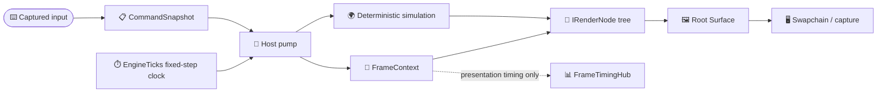
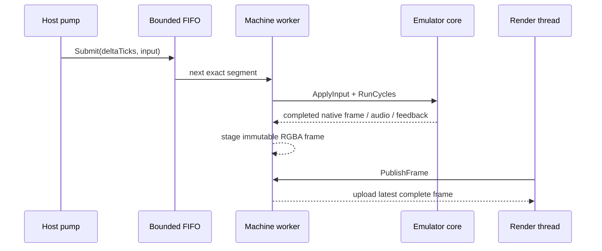

# Puck.Hosting

Puck.Hosting is the shared host substrate between deterministic simulation and
presentation. A **host** owns the outer loop: it measures time, advances the
simulation in fixed steps, routes services and exclusive capabilities through a
tree of render nodes, and publishes completed surfaces without letting GPU or
capture work become simulation state.

The project also contains the machine-neutral worker used by Puck's screen
machine emulators. That worker accepts exact tick-and-input segments, executes
them in order on one machine-owning thread, and publishes only complete frames.
Concrete emulator cores supply the hardware behavior; Hosting supplies the
queue, backpressure, audio handoff, save lifecycle, framebuffer upload, and
rewind/runahead/fast-forward machinery once for every core.

Puck.Hosting targets .NET 10 and is a non-packable production project shared
inside this repository. It depends on `Puck.Abstractions` for presentation,
machine, capture, and GPU contracts, and on
[`Puck.Commands`](../Puck.Commands/README.md) for fixed-step input snapshots.
The [project map](../../docs/project-map.md) shows where it sits in the wider
repository; the [generated API reference](../../docs/api) owns complete member
signatures, parameters, return values, and exceptions.

## ✨ Key features

- *One recursive render contract:* `IRenderNode` produces a `Surface`, may host
  children, and receives device-loss notifications without changing simulation
  state.
- *Deterministic fixed-step context:* `EngineTicks` provides an integer time
  base that divides common update rates exactly. `FrameContext` keeps
  authoritative simulation ticks separate from presentation-only wall time and
  interpolation.
- *Scoped host services:* inherited capabilities flow to descendants, while
  held capabilities such as terminal control and input focus form explicit,
  revocable ownership chains.
- *The terminal's console tape:* `ConsoleTape` records the console exchange
  (submitted lines, result echoes, panel visibility) into a bounded scrollback
  ring and publishes immutable `ConsoleTapeFrame` snapshots through
  `ConsoleTapeStore`; `ConsoleLineEditor` owns the prompt row's caret-addressed
  buffer and command history. Renderers read `IConsoleTapeSource`; the window
  host bridges keystrokes in (`ConsoleInputSink` in `Puck.Launcher`).
- *Safe parallel stepping:* `ISteppableRenderNode` separates serial shared-state
  preparation from parallel private-state execution; GPU work stays on the
  render thread.
- *Machine work off the render pump:* `QueuedMachineWorker` owns one emulator
  thread and a bounded FIFO. A full queue applies backpressure instead of
  dropping or merging authoritative input history.
- *Complete-frame publication:* framebuffer staging uses a fixed three-buffer
  rotation, so a blocked GPU upload holds an immutable frame while emulation
  continues to publish newer ones.
- *Machine-neutral time travel:* `MachineTimeTravel<TInput>` builds bounded
  rewind, persistent-fork runahead, and capped fast-forward over a small
  deterministic core adapter.
- *Presentation observability:* capture taps, latest-value publication, emitted
  light, and frame-timing samples remain outside the simulation trajectory.

## 📐 The host boundary

The fixed-step simulation is authoritative. Rendering, timing diagnostics,
capture, and GPU upload observe or present its state; they do not decide what
the state becomes.



The same separation applies to emulator hosts. Submitted segments contain the
whole authoritative instruction—an exact tick budget and the controller image
held over that budget. The render side only consumes the latest completed
frame:



## 🚀 Quick start: a render node

An `IRenderNode` can return CPU pixels or a GPU image-view handle. This minimal
node produces a one-pixel CPU surface and has no device-owned resources to
release:

```csharp
using Puck.Abstractions.Presentation;
using Puck.Hosting;

sealed class StatusPixelNode : IRenderNode {
    private readonly byte[] pixels = [0x20, 0x80, 0xE0, 0xFF];

    public NodeDescriptor Descriptor { get; } = new(
        Name: "status-pixel",
        SurfaceId: SurfaceId.New());

    public Surface ProduceFrame(in FrameContext context) => Surface.CpuPixels(
        pixels: pixels,
        width: 1,
        height: 1,
        format: SurfaceFormat.R8G8B8A8Unorm);

    public void Dispose() { }
}
```

The outer host constructs one `FrameContext` per rendered frame. Its
`ElapsedTicks` advances only by completed fixed steps; its `AccumulatorTicks`
holds the fractional remainder used for interpolation:

```csharp
var context = new FrameContext(
    Host: HostContext.Empty,
    ElapsedTicks: elapsedTicks,
    DeltaTicks: stepsThisFrame * stepTicks,
    FrameDeltaTicks: wallTicks,
    AccumulatorTicks: accumulatorTicks,
    StepTicks: stepTicks,
    TargetWidth: width,
    TargetHeight: height);

Surface surface = root.ProduceFrame(context: in context);
```

`RenderTicks` is `ElapsedTicks + AccumulatorTicks`, and
`InterpolationAlpha` is the remainder divided by `StepTicks`. They are useful
for smooth presentation, but neither value authorizes another simulation step.

## 🌳 Host contexts and capability ownership

`IHostContext` exposes two deliberately different policies:

| Policy | Lookup | Propagation | Typical use |
|---|---|---|---|
| Inherited capability | `TryResolveCapability<T>` | Flows through descendant contexts | Shared services, registries, factories |
| Held capability | `HoldsCapability<T>` | Belongs to one holder; a child receives it only through a grant | Terminal control, input focus, exclusive authority |

`HostContext` stores both kinds. `ChainedHostContext` tries its primary then its
fallback context for inherited capabilities, but checks only the primary for
held capabilities. That rule prevents an exclusive authority from leaking
through a convenient service fallback.

`HeldCapabilityGrants` creates a delegation chain. Revoking an ancestor grant
invalidates every descendant lease, including a descendant grant described as
irrevocable from that descendant's point of view:

```csharp
var childGrants = new HeldCapabilityGrants();
ICapabilityTakeBack? takeBack = childGrants.Grant<ITerminalControl>(
    grantor: parentContext);

var childContext = new HostContext(
    capabilities: new Dictionary<Type, object>(),
    heldGrants: childGrants);

// Later: remove this delegation and every subgrant rooted in it.
takeBack?.Revoke();
```

Two standard held capabilities keep unrelated authority separate:

- `ITerminalControl` is the baton for requesting application exit.
- `IInputFocus` claims and releases individual input devices, or all devices,
  for the current holder.

Composition code can collect `HostCapabilityContribution` values before it
builds the root context. Each contribution states its runtime type, instance,
and whether the capability is held.

## ⏱️ Clocks and fixed-step timing

`EngineTicks.PerSecond` is 50,400. Common simulation rates—including 24, 25,
30, 48, 50, 60, 72, 90, 120, 144, and 240 updates per second—divide that base
without a fractional tick. `EngineTicks.PerRate(rate)` returns the exact step
size and rejects a rate that does not divide the base.

Hosting uses several clocks because they answer different questions:

| Type | Question answered | Rule |
|---|---|---|
| `TickClock` | How much wall time elapsed since the previous host sample? | Converts `Stopwatch` time to engine ticks and carries conversion remainder |
| `InputClock` | When did an input arrive? | Process-wide monotonic capture clock shared by input backends |
| `OsTimeCorrelator` | Where does a native 32-bit millisecond event stamp belong on the input timeline? | Handles wraparound and clamps the result to the observed engine-time window |
| `FrameContext` | What fixed-step instant is being presented? | Integer ticks are authoritative; seconds and interpolation are derived at the presentation seam |

`IFixedStepSimulation.RatePerSecond` must divide `EngineTicks.PerSecond`
exactly. For each completed step, the launcher constructs a
`FixedStepContext`, builds and applies one `CommandSnapshot`, and then calls
`Step`. A render frame may contain zero, one, or several fixed steps.

The fields most often confused in `FrameContext` have distinct meanings:

| Field | Meaning |
|---|---|
| `ElapsedTicks` | Simulation time after all completed steps |
| `DeltaTicks` | Whole fixed-step advancement performed for this rendered frame |
| `FrameDeltaTicks` | Clamped wall interval for presentation and diagnostics only |
| `AccumulatorTicks` | Unconsumed engine ticks, always less than one normal step |
| `StepTicks` | Fixed update period |
| `RenderTicks` | Interpolated presentation instant: elapsed plus accumulator |

`FrameTimingSample` records CPU wall-clock phase buckets, garbage-collection
overlays, and a remainder that makes the buckets tile the whole observed frame.
`FrameTimingHub` publishes the latest sample with a version number and invokes
its `Published` event synchronously on the render thread. Observers must keep
event handlers small and non-blocking. None of this timing data belongs in
simulation decisions.

## 🖼️ Render lifecycle and publication

Every `IRenderNode` has a stable `NodeDescriptor`, produces one `Surface`, and
is disposable. Hosting nodes that own children forward `OnDeviceLost` through
the tree. Nodes that own device resources release stale handles there and
rebuild them on a later frame; device loss must not advance or reset simulation.

For hosts that parallelize CPU stepping, `ISteppableRenderNode` divides the
work into three phases:

1. `PrepareStep(in FrameContext)` runs serially and may drain shared input or
   timelines. It reports whether the node has work.
2. `ExecuteStep()` may run in parallel, but touches only the node's private
   state.
3. `ProduceFrame(in FrameContext)` remains on the render thread and performs
   GPU work.

`CapturingRenderNode` decorates any render node without changing its returned
surface. It can copy CPU-backed pixels directly or use a supplied GPU readback
callback, and its integer cadence retains fractional schedules such as 24
captures from 60 source frames. Capture callback failures disable the tap and
are reported once; they do not tear down the render loop. Capture timestamps
use authoritative `ElapsedTicks`, not interpolated `RenderTicks`.

`PublishBuffer<T>` is the smaller handoff for immutable latest-state values. A
single writer swaps a holder reference and readers snapshot the newest value.
It is not a FIFO and retains no history, so use it only when skipping obsolete
intermediate publications is correct.

## 🎮 Queued screen-machine hosting

`QueuedMachineHost` is the base class exposed to machine-specific adapters. It
forwards the neutral `IScreenMachine`, `IQueuedScreenMachine`, `IAudioMachine`,
`IFeedbackMachine`, and `ITimeTravelMachine` surfaces to one
`QueuedMachineWorker`. A concrete host has one main job: turn loaded content
into an `IQueuedMachineCore`.

```csharp
sealed class MyMachineHost : QueuedMachineHost {
    public MyMachineHost(string? savePath = null)
        : base(
            width: 160,
            height: 144,
            maximumPendingSteps: 3,
            workerName: "my-machine",
            audioSampleRate: 48_000,
            savePath: savePath) { }

    protected override IQueuedMachineCore CreateCore(
        byte[] data,
        string? savePath) => new MyMachineCore(data, savePath);
}
```

The core adapter deliberately stays narrow. `IQueuedMachineCore` advances an
exact cycle budget, applies one held `MachinePadState`, exposes native-frame
progress and packed `0x00RRGGBB` pixels, drains presentation audio, reports
feedback, flushes its save, and captures/restores complete deterministic state.
Optional default methods expose coherent worker-thread memory access and live
reconfiguration.

The worker owns the cross-thread policy:

- `Submit` enqueues asynchronously. When the finite pending window is full, the
  producer waits until capacity opens and receives
  `AcceptedAfterBackpressure`; work is never dropped or coalesced.
- `Step` is the compatibility path for a generic `IScreenMachine`: it submits
  one segment and drains through a barrier before returning.
- Engine ticks become core cycles through a remainder-carrying integer
  accumulator. A core may change `CyclesPerSecond`; the conversion still
  carries phase rather than accumulating drift.
- Pixels are repacked only when a new native frame completes for queued calls.
  The synchronous path forces a stage to preserve its contract.
- GPU publication serializes uploads but does not hold the frame lock during
  the upload. The leased array stays outside the worker's write rotation until
  the upload returns.
- Audio crosses through a host-owned ring, so a consumer never touches the
  core's execution thread. When full, the ring drops the oldest audio and keeps
  the newest emulated second.
- Dirty save flushing is debounced by native-frame transitions—300 native
  frames, roughly five seconds for the supported handheld cores—not by the
  number of host submissions.
- Load, eject, and disposal stop acceptance, drain already accepted history,
  join the worker, and then dispose the core. Device loss drops only the GPU
  upload object; CPU machine state survives.
- A worker exception stops acceptance, wakes waiters, and appears through
  `QueueFault`. Synchronous operations surface it as an
  `InvalidOperationException` with the worker failure as its inner exception.

These guarantees matter more than queue throughput: an accepted segment is
part of authoritative history and must execute exactly once, in order.

## ⏪ Rewind, runahead, and fast-forward

`MachineTimeTravel<TInput>` is built over `ITimeTravelMachineCore<TInput>`, a
machine-neutral whole-state snapshot and lookahead interface. All operations
stay on the machine's single producer thread.

- *Rewind* stores a full keyframe at a fixed interval and records the input,
  exact cycle budget, and host accumulator phase for intervening frames. A
  rewind restores the nearest keyframe, deterministically replays to the target,
  restores the host conversion phase, and discards the abandoned future. A
  memory budget bounds the ring by evicting the oldest keyframe span.
- *Runahead* keeps one persistent, headless fork a configured number of native
  frames ahead on predicted held input. The fork supplies presentation pixels;
  the authoritative core remains tick-locked and is the only audio source.
- *Fast-forward* repeats the exact input/tick segment up to a capped factor and
  skips intermediate presentation staging. It does not multiply a core clock or
  replace several deterministic segments with one oversized step.

Rewinding also clears host audio from the abandoned future and republishes
feedback and pixels from the landing. Memory pokes or instruction-granular
advances that the frame-oriented replay log cannot reproduce invalidate stale
history rather than pretending it remains safe.

## 🧱 Core types

| Area | Types | Purpose |
|---|---|---|
| Render tree | `IRenderNode`, `ISteppableRenderNode`, `NodeDescriptor`, `SurfaceId` | Recursive surface production and lifecycle |
| Fixed-step time | `EngineTicks`, `TickClock`, `FrameContext`, `FixedStepContext`, `IFixedStepSimulation` | Integer simulation time and presentation context |
| Input time | `InputClock`, `OsTimeCorrelator` | Monotonic capture timestamps and native event correlation |
| Host scope | `IHostContext`, `HostContext`, `ChainedHostContext`, `HostCapabilityContribution` | Inherited services and exclusive held capabilities |
| Delegation | `HeldCapabilityGrants`, `ICapabilityTakeBack`, `IHeldCapabilityLeaseSource` | Revocable held-capability chains |
| Standard authority | `ITerminalControl`, `IInputFocus` | Exit ownership and device focus |
| Observation | `CapturingRenderNode`, `PublishBuffer<T>`, `FrameTimingHub`, `FrameTimingSample` | Capture, latest-value handoff, and timing telemetry |
| Queued machines | `QueuedMachineHost`, `QueuedMachineWorker`, `IQueuedMachineCore` | Ordered off-thread emulation and complete-frame publication |
| Time travel | `MachineTimeTravel<TInput>`, `ITimeTravelMachineCore<TInput>`, `ITimeTravelLookahead<TInput>` | Bounded rewind, persistent runahead, and fast-forward |
| Contract proof | `QueuedHostContractProbe`, `QueuedHostProbeResult` | Shared observable checks for concrete queued hosts |

## ✅ Verification

The focused Hosting tests cover capture cadence and fault containment,
capability-revocation cascades, time-correlation validation, and worker
lifecycle behavior:

```powershell
dotnet test tests/Puck.Hosting.Tests/Puck.Hosting.Tests.csproj
```

`QueuedHostContractProbe` supplies the heavier shared contract checks for real
machine adapters: backpressure, frame publication, audio, coherent memory
access, deterministic rewind, runahead lead, fast-forward bounds, upload leases,
device loss, and disposal serialization. Both `Puck.HumbleGamingBrick.Post` and
`Puck.AdvancedGamingBrick.Post` invoke those probes in their own batteries, so
the same substrate guarantees are exercised against the SM83 and ARM7TDMI
hosts.
