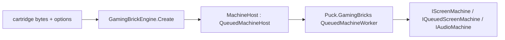

# Puck.HumbleGamingBrick

Puck.HumbleGamingBrick is the shared SM83 machine that plays every DMG, MGB,
SGB, CGB, and AGB-compatibility hardware revision on one core — CPU, PPU, APU,
timers, DMA, cartridge mappers and battery saves, and serial/infrared/printer
link. Hardware differences (Color palette RAM, HDMA, double speed, the boot
handoff, the fetcher's row latch) are expressed as named capability gates read
off `ConsoleModel`, never as a forked implementation per console. Snapshot,
fork, and queued off-thread hosting come from `Puck.GamingBricks`; this project
supplies only the SM83-family hardware itself.

## ✨ Key features

- *One core, every revision:* `ConsoleModel` is revision-valued
  (`Dmg0`…`DmgC`, `Mgb`, `Sgb`, `Sgb2`, `Cgb0`…`CgbE`, `Agb`, `Ags`), and
  components ask `ConsoleModelExtensions` a named question —
  `SupportsColor`, `LatchesFetchRowAtTileStep`, `HasAgbBootHandoff`,
  `SensesOwnInfraredLight`, `SeedsWaveRamOnBoot`, `LeavesBootChimeSounding`,
  `DeselectsJoypadOnBoot` — instead of comparing against a member. Each
  question's documentation states the hardware fact it answers.
- *A live, no-reboot device swap:* `Machine.SwitchModel` re-gates every
  color-path component and applies the per-ROM `ModePoke` recipes
  (`ConsoleModeRecipes`) that flip a cartridge's own cached hardware-detection
  bytes, so a running game re-renders natively on its new hardware with its
  shared-RAM progress untouched.
- *Queued, backpressured hosting:* `MachineHost` (the `IScreenMachineEngine`
  adapter, engine id `gaming-brick`) forwards the neutral
  `IScreenMachine`/`IQueuedScreenMachine`/`IAudioMachine`/`IFeedbackMachine`
  surface to `Puck.GamingBricks`'s `QueuedMachineWorker`, converting engine
  ticks to CPU T-cycles through a remainder-carrying accumulator.
- *Deterministic peripheral link:* `SerialLinkSession`, `IrLinkSession`, and
  `GamePrinterLinkSession` interleave two machines' link edges
  instruction-atomically, so a cable, infrared, or printer session replays
  identically.
- *Exact timing:* `TickResolution` runs the timeline at sub-cycle granularity
  (quarter ticks by default), and `PpuTimingParameters`/`HdmaController`
  reproduce the STAT/memory-lock schedule dot for dot.

## 📐 Hosting



`GamingBrickEngine` (`Id = "gaming-brick"`) is the `IScreenMachineEngine`
implementation a host resolves by id; its options string is an
order-independent, space-separated token set — a model keyword plus an optional
`dmgspeed` fairness pin that holds the tick-to-cycle budget fixed regardless of
the KEY1 double-speed latch. A family token (`dmg`/`cgb`/`agb`, default `dmg`)
selects that family's target revision — `DmgC`, `CgbE`, `Agb` — and a revision
token (`dmg0`, `dmgb`, `dmgc`, `mgb`, `sgb`, `sgb2`, `cgb0`, `cgba`, `cgbb`,
`cgbc`, `cgbd`, `cgbe`, `ags`) names one exactly.

`GamingBrickEngine` also implements `IMachineLinkingEngine`: two running
machines cable-link into one `LinkedMachineGroup`, which takes ownership of both
cores for the link's lifetime. Forming the link quiesces each `MachineHost`'s
worker at a frame boundary and lends its core to the group's single execution
thread, where `SerialLinkGroupCore` wires the two `SerialComponent`s as peers
and advances them through `SerialLinkSession`'s instruction-atomic interleave.
Each member keeps publishing its framebuffer, audio ring, feedback, and step
count through its own host, so nothing above the seam changes; per-seat pads
route by cable order. While linked, a member's own `Step`/`Submit` refuses work
and its peek/poke/reconfigure/flush marshal onto the link thread. Disposing the
link severs the cable at once — an unfinished externally-clocked transfer stays
pending on its port, as an unplugged console's does — and returns both cores to
their own workers. The cable is point to point, so a set of three or more is
refused by name rather than partially linked.

Time travel is coupled over the group: the state image `SerialLinkGroupCore`
captures holds both machines' snapshots plus the pair-stepper's own overshoot
credits (`SerialLinkSession.PacingCredits`), which no machine's snapshot
carries, so a rewind lands both members and the interleave together. That image
is also the whole seam a cross-process transport would have to carry, alongside
each submitted (tick budget, seat inputs) segment; no such transport exists.

## 🚀 Quick start

```csharp
using Puck.Abstractions.Machines;
using Puck.HumbleGamingBrick;

IScreenMachineEngine engine = new GamingBrickEngine();

IScreenMachine machine = engine.Create(
    options: "cgb dmgspeed",       // the target Color revision, fixed-speed fairness pin
    contentBytes: cartridgeRom,     // the cartridge ROM image
    savePath: "save.sav",           // battery-save path, or null for in-memory only
    audioSampleRate: 48_000
);
```

Constructing a `MachineConfiguration` and calling `MachineFactory.Create`
directly is the lower-level path `MachineHost` itself builds on, for a caller
that wants to compose extra DI registrations before the machine resolves.

## 🔌 Peripherals and link

The bus hosts a cartridge (`RomOnlyCartridge`/`Mbc1`–`Mbc7`/`HuC1`/`HuC3`/
`Mmm01`, selected by `Cartridge.Load` from the ROM header) plus the serial
port, infrared port, and OAM/HDMA DMA controllers. `InfraredPort` and
`GamePrinterDevice`/`GamePrinterLinkSession` model the infrared peer and
thermal-printer protocols on the same serial substrate the cable link uses.
`CameraCartridge`/`GradientCameraSensor`/`SensorImage` and
`TiltSensorComponent` model the sensor-cartridge peripherals; `BootDivPrediction`
reproduces the per-revision boot-DIV seed a game can read to detect the console
at power-on. Its tables are also what the forge's authored boot ROMs
(`BootRomBuilder`) time themselves against, so the prediction and the program
that has to satisfy it read the same data.

## 📋 Core types

| Area | Types | Role |
|---|---|---|
| Machine | `Machine`, `ConsoleModel`, `ConsoleModelExtensions`, `MachineConfiguration`, `MachineFactory`, `MachineServiceRegistration` | The composition root and per-machine startup configuration. |
| Live swap | `ModePoke`, `ConsoleModeRecipes` | The boot-shim byte pokes that retarget a running cartridge's cached hardware-detection state. |
| CPU/bus | `Sm83`, `Sm83.Alu`, `Sm83.Decode`, `Sm83Disassembler`, `SystemBus`, `SystemMemory`, `MemoryMap` | The SM83 core and its addressable memory map. |
| Video | `Ppu`, `PpuTimingParameters`, `HdmaController`, `Framebuffer` | The STAT-accurate pixel pipeline and DMA-driven video RAM transfer. |
| Audio | `ApuComponent`, `ApuGeneratorClock`, `AudioOutputComponent` | The four-channel APU and its host-facing output ring. |
| Cartridges | `Cartridge`, `CartridgeHeader`, `CartridgeBase`, `MapperKind`, `RomOnlyCartridge`, `Mbc1Cartridge`…`Mbc7Cartridge`, `HuC1Cartridge`, `HuC3Cartridge`, `Mmm01Cartridge`, `CameraCartridge` | Header-selected mapper implementations and the camera peripheral. |
| Link | `SerialComponent`, `SerialLinkSession`, `InfraredPort`, `IInfraredPeer`, `IInfraredCartridge`, `GamePrinterDevice`, `GamePrinterLinkSession` | The deterministic serial/infrared/printer link sessions. |
| Hosting | `MachineHost`, `GamingBrickEngine`, `HumbleGamingBrickCore`, `BrickPad`, `HumbleGamingBrickLookahead`, `SerialLinkGroupCore` | The `IScreenMachineEngine`/`IMachineLinkingEngine` adapter over `Puck.GamingBricks`'s queued-host and cable-link substrate. |

## 🧪 Verification

`Puck.HumbleGamingBrick.Post` is the gate — there is no separate unit-test
project for this core:

```powershell
dotnet run --project src/Puck.HumbleGamingBrick.Post -c Release
```

Tier A covers determinism, snapshot/battery-save round trips, fork
determinism, Advanced-console behavior, and throughput with no external assets;
Tier B adds the SingleStepTests/sm83 per-instruction corpus and
conformance/acceptance ROM suites (`--roms`/`PUCK_GB_TESTROMS`,
`--sst`/`PUCK_GB_SST`); see the battery's own README for tier C and every
diagnostic switch. `Puck.GamingBricks.Tests` exercises the shared
serialization/fork/queued-host substrate this core builds on.

## 📦 Packaging

`ByteTerrace.Puck.HumbleGamingBrick` depends on `Puck.Abstractions` (the
`IScreenMachineEngine`/`IScreenMachine` contracts it implements),
`Puck.GamingBricks` (snapshot, fork, and queued-host substrate), and
`Puck.Maths` (fixed-point and hashing primitives). `Puck.World.Schema` and
everything layered above it depend on this package for the SM83 machine family.
