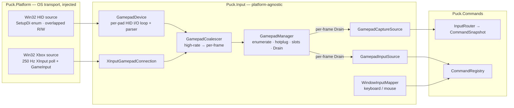
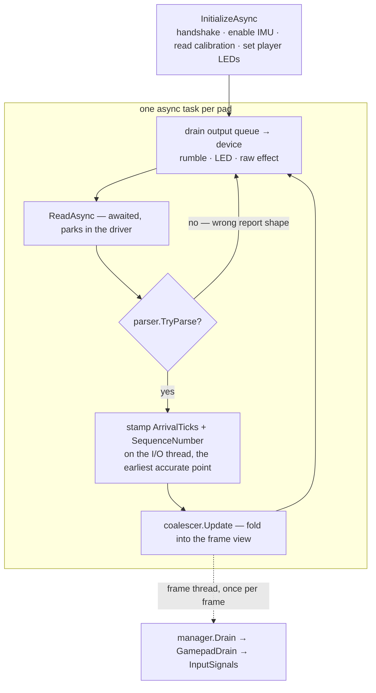
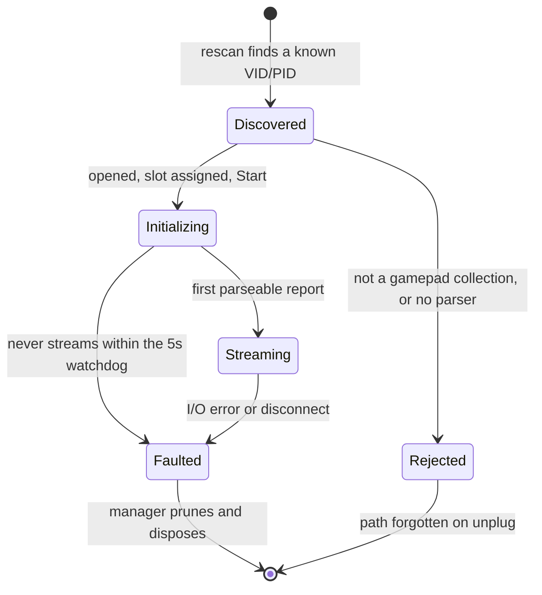
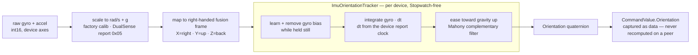

# Puck.Input — device input for Puck

`Puck.Input` is the engine's device-input layer. It turns three different USB game controllers — Nintendo
Switch Pro, Xbox, and Sony DualSense — plus the keyboard and mouse into **one normalized, provider-neutral
stream** that `Puck.Commands` binds to game commands. The hard parts live here: the per-family HID protocols,
hotplug, haptics, IMU sensor fusion, and sub-frame timing. The OS-specific transport does **not** — every
platform detail is injected, so the same core drives a pad on Windows today and on Linux the day a `hidraw`
transport is written.

The whole layer is one pipeline, read left to right:

> raw HID report / OS event → normalized `GamepadState` / `WindowInputEvent` → provider-neutral `InputSignal`
> (keyed by an `InputSources` control name) → `Puck.Commands`

> **Project rule** (see `CLAUDE.md`): build in the split `Puck.*` projects. The old `Puck` and `Puck.Avatars`
> projects are **inspiration only** — never reference them.

## Device support

USB is the only transport today on all three families; Bluetooth is [deferred](#status--done--deferred).

| Family | Transport | Input | Motion (gyro / accel / fused pose) | Rumble | Triggers | LED / indicator |
|---|---|---|---|---|---|---|
| **Switch Pro** | HID (USB) | buttons · sticks · triggers | ✅ gyro + accel + fused orientation | ✅ HD (approx. encoding) | digital ZL/ZR | ✅ player LEDs (at init) |
| **Xbox** | XInput + GameInput | buttons incl. Guide | — | ✅ 4-motor (incl. impulse) | analog | — (no controllable LED) |
| **DualSense** | HID (USB) | buttons · sticks · triggers · touchpad click/mute · 2-finger touch | ✅ calibrated gyro + accel + fused orientation | ✅ dual motor | analog + adaptive | ✅ RGB light bar + player LEDs |

## Architecture

`Puck.Input` is **platform-agnostic**: it owns the gamepad protocol logic and the abstractions, and nothing
else. Two acquisition transports feed one device manager, which exposes a single per-frame drain that two
command seams consume.



- **`GamepadManager`** (platform-neutral) owns the connected set: HID enumeration, the ~1.5 s hotplug rescan
  against an injected `IHidDeviceSource`, player-slot assignment, pruning, lifetime, and the per-frame `Drain`.
  It runs no OS-specific code. A transport it can't run itself — the Xbox backend — is supplied as an optional
  `IGamepadAcquisitionSource` that owns its own thread and publishes connections through the manager's
  `IGamepadConnectionRegistry`.
- **HID path** — each `GamepadDevice` hosts an `IGamepadParser` and runs its own async I/O loop over an
  `IHidDevice` (report → coalescer, output queue → device). The concrete transport is the Windows
  `Win32HumanInterfaceDevice` in `Puck.Platform`; a Linux `hidraw` transport plugs in the same way.
- **Xbox path** — `Win32XboxAcquisitionSource` owns one 250 Hz XInput poll thread; each tick it calls
  `XInputGamepadConnection.Apply(state)` then `ServiceOutput()`. The connection presents the same
  `IGamepadConnection` surface as a HID device, so it flows through the identical coalescer → command pipeline.

### Two command seams

A drained frame reaches `Puck.Commands` through one of two seams. Both pull the manager's **destructive**
per-frame `Drain` (the coalescer hands out its accumulated edges exactly once), so exactly one runs per frame —
wiring both would let the first consume the other's button edges. The composition root picks which is live.

| Seam | Path | Role |
|---|---|---|
| **`GamepadCaptureSource`** | → `InputRouter` → per-tick `CommandSnapshot` | The deterministic, timestamped, recordable path — the engine's input spine, and the direction of travel. Drives the MiniAction prototype today. |
| **`GamepadInputSource`** | → `BindingCommandSource` → `CommandRegistry` | The original focus-gated command path. The default for every mode not on the router (console, cursor UI). |

### The platform seam (so `Puck.Input` has no Windows code)

`Puck.Input` defines the transport abstractions; `Puck.Platform` (which references `Puck.Input`) implements them
and is injected at the composition root.

| Abstraction (`Puck.Input`) | Windows implementation (`Puck.Platform`) |
|---|---|
| `IHidDevice` / `IHidDeviceSource` (`Hid/`) | `Win32HumanInterfaceDevice` / `Win32HidDeviceSource` (`Windows/Hid/`) |
| `IGamepadAcquisitionSource` + `IGamepadConnectionRegistry` (`Devices/`) | `Win32XboxAcquisitionSource` (`Windows/Gamepad/`) |

`[InternalsVisibleTo("Puck.Platform")]` lets the relocated `XInputGamepadConnection` reuse the internal output
plumbing (`GamepadOutput`, `GamepadOutputCommand`). CsWin32 and the `x64` pin live in `Puck.Platform` (its
SetupAPI structs can't be AnyCPU); `Puck.Input` stays AnyCPU.

### Capabilities are derived, not declared

Output capabilities come from the interfaces a parser actually implements (`GamepadDevice.CapabilitiesFor`), so
every advertised feature has a real write path and there is no capability to lie about: `IRumbleParser →
Rumble`, `ILedParser → Led`, `ITriggerEffectParser → TriggerEffect`, every HID parser → `RawEffect`. Input
capabilities (`GamepadInputCapabilities`: `Gyro`, `AnalogTriggers`) are reported per connection and queryable
via `GamepadManager.TryGetInputCapabilities`.

### Key contracts

- **`IGamepadConnection`** — `DeviceId`, `PlayerIndex`, `IsFaulted`, `Coalescer`, `Output`, `Key`, `Type`,
  `InputCapabilities`, `Start()`. The uniform surface both transports implement.
- **`IGamepadParser`** — `Type`, `InputCapabilities`, `InitializeAsync(playerIndex)`, `TryParse(report, out state)`.
- **`IRumbleParser`** — `SetRumbleAsync(low, high)`. **`ILedParser`** — `SetLedAsync(LedColor)`.
  **`ITriggerEffectParser`** — `SetTriggerEffectAsync(left, right)` (DualSense adaptive triggers).
- **`IGamepadOutput`** (queue façade) — `Rumble`, `RumbleTriggers`, `SetLed`, `SetTriggerEffect`, and the raw
  `SendEffect` escape hatch, each gated by `Capabilities`.

## The gamepad pipeline

### Per-device HID loop

Each HID pad gets one async task. It initializes the device, then parks in an awaited read until a report
arrives — lowest latency, zero per-read allocation — parses it, stamps it, and folds it into the coalescer. The
read is bounded only before the first report (so a stuck handshake faults) and while a finite rumble is pending
(so its expiry is serviced even if the report stream pauses).



### Coalescing high-rate input to per-frame

A pad streams far faster than the frame rate, so `GamepadCoalescer` bridges the two without losing anything that
matters. Between drains it keeps the **latest** continuous axes (sticks, triggers, touch), **OR-es together**
every button press/release edge (so a tap that falls entirely between two frames is never lost), and
**averages** the gyro (so the reported angular velocity is frame-rate independent). All access is gated, since
the I/O thread writes while the frame thread drains. `manager.Drain` collects one `GamepadDrain` per device with
pending data into a reusable buffer.

### Capture timing (sub-frame)

Timing is stamped at the **earliest accurate point** — the I/O thread, the instant a report parses — not when
the frame thread happens to drain. Each report carries an `ArrivalTicks` (engine-tick wall clock) and a
per-device `SequenceNumber`; the coalescer additionally records each button's **first** press time within the
frame window (`GamepadButtonEdges`, an inline array). `GamepadCaptureSource` then stamps every press edge at its
own arrival time and continuous signals at the latest report's, falling back to a single frame-clock read only
for a transport that doesn't stamp (the XInput poll path leaves `ArrivalTicks` zero). This is what lets a rhythm
consumer read true sub-frame edge timing instead of one coarse per-frame value, and what attributes an input to
the right fixed-step simulation tick.

## Connection lifecycle & hotplug

The manager rescans HID interfaces about every 1.5 s and reconciles the set. A newly seen, supported device is
opened, assigned the lowest free player slot, and started; a device that faults (disconnect, I/O error, or a
handshake that never streams within a 5 s watchdog) is pruned and disposed — promptly at the next drain, not
just at rescan, so it stops replaying stale state. Disposal happens **outside** the manager's lock (a HID
device's teardown briefly joins its I/O loop, which must not block a concurrent frame drain).



A slot frees on disconnect and the lowest free slot is reclaimed on reconnect; a device id is content-addressed
from the device path, so the same physical port keeps its identity across reconnects and restarts, while two
identical pads on different ports stay distinct.

## IMU fusion — absolute orientation

Both motion pads expose a fused absolute orientation (`GamepadState.Orientation`, a unit quaternion;
`InputSources.Gamepad.Orientation`, a `CommandValue.Orientation`). `ImuFusion` is a complementary filter: it
integrates the gyro for smooth short-term rotation and corrects the accumulated drift against the
accelerometer's gravity vector. `ImuOrientationTracker` holds the per-device state (the orientation and the
learned gyro bias). Crucially, the integration `dt` is **supplied by the caller from the device's own report
clock** — so the fusion holds no wall clock (it is `Stopwatch`-free) and a given report stream fuses identically
on every machine. The fused orientation is then captured as data on the snapshot, so a peer or a replay never
recomputes it.



Per-device sensor handling — the parser maps its own sensor axes into the canonical right-handed frame and
supplies the `dt`:

- **The `dt` comes from the device's report clock, not the OS clock.** The DualSense carries a free-running
  32-bit sensor timestamp (common offset `27..30`) in **1/3-µs units** (the `hid-playstation` driver divides it
  by 3 to reach microseconds), so its inter-report delta is the true `dt`; the raw counter is also kept as
  `GamepadState.SensorTimestamp` for sub-frame rhythm work. The Switch carries three IMU sub-samples per report,
  each spanning a fixed **5 ms**, so `FuseImu` integrates one tracker step per sub-sample at that cadence (the
  averaged gyro/accel still feed the `Gyro`/`Accelerometer` state fields). The tracker clamps `dt` to a sane
  range, so a timestamp wrap or the first sample degrades to a bounded step.
- **Sensor frames differ per device.** The DualSense IMU frame is **left-handed** (X=right, Y=up, Z=forward), so
  the Z axis is negated: the transform `diag(1, 1, -1)` is a handedness **reflection** (det −1). The Switch Pro
  frame is right-handed but rotated → `(x,y,z) → (-y, z, -x)`, a proper rotation (det +1). The same per-device
  transform applies to both that device's gyro and accel.
- **The DualSense gyro needs its factory calibration** (feature report `0x05`, read in `InitializeAsync`). The
  per-device sensitivity is **~64×** the bare `1024 LSB/°/s` resolution figure, so using `1024` directly reads
  ~64× too weak and yaw (which has no gravity reference) goes effectively dead. The uncalibrated fallback
  therefore uses `64 × (π/180) / 1024`, so a pad whose `0x05` read fails still reports usable angular velocity.
  The read is retried (~360 ms) because a device may not answer the feature report immediately after connecting.
  The Switch's nominal `0.070 °/s` scale is adequate without per-device calibration.
- **Gravity-anchored pitch/roll vs. gyro-only yaw.** A wrong gyro scale or a stuck bias estimator shows up
  *only* as a dead yaw, because the accelerometer keeps pitch and roll correct regardless — the first thing to
  check when motion feels off.
- **The Mahony correction term is `cross(measured, estimated)`.** Reversing the operands would make the 180°
  antiparallel pose the filter's stable point instead of the aligned one.

`gamepad.orientation` rides the accelerometer emit gate (a device with an accel is the one running the filter).
The demo draws a per-controller pitch/yaw/roll needle gauge from it.

## Output & haptics

Output is a queued façade (`IGamepadOutput`): rumble, trigger rumble, LED, and a raw-report escape hatch, each
gated by the connection's derived `Capabilities`. The device's own I/O loop drains the queue, so all writes for
a pad are serialized on the thread that owns its handle.

### Xbox rumble via GameInput

`XInputSetState` rumble is a silent no-op for Xbox pads over the Wireless Adapter / Bluetooth and can't reach
the trigger (impulse) motors, so Xbox rumble goes through **GameInput** (`gameinput.dll`, hand-authored
flat-COM interop). The whole Xbox backend lives in `Puck.Platform/Windows/Gamepad/`; `Puck.Input` sees it only
through `IGamepadAcquisitionSource`. The connection writes rumble to **both** GameInput (4 motors, wireless
reach) and the legacy `XInputSetState` motors (which reach a pad whose GameInput output an overlay like Steam
Input has captured).

- `GameInputHaptics` enumerates real per-device handles via a `RegisterDeviceCallback` reverse-callback into a
  dictionary that **owns** the RCWs. **Never `ReleaseComObject` a device handle** — connections borrow them;
  releasing one separates a handle still in use and crashes (`InvalidComObjectException`). Drop the dictionary
  reference and let the GC finalize.
- `Bind(targetButtons)` correlates an XInput slot to its physical GameInput device by matching the buttons it
  currently holds, reserving it so no other slot binds the same device. It returns a device only when **exactly
  one** unbound device matches — ambiguity is deferred rather than risking a stable mis-bind.
- `RumbleDevice` returns `false` (never throws) when the device has disconnected, so the caller drops the stale
  binding and re-correlates instead of tearing down the 250 Hz poll loop.
- The poll thread is the **sole owner** of `GameInputHaptics` (it creates and disposes it in its own `finally`);
  ownership never crosses a thread.

### DualSense adaptive triggers

Adaptive triggers are a **typed, first-class capability** (`ITriggerEffectParser` → `SetTriggerEffect`), not a
raw escape hatch. A caller builds a validated, allocation-free `TriggerEffectSpec` per trigger and the DualSense
composes both into its **normal `0x02` output report**, alongside rumble and the light bar — so resistance,
rumble, and the LED coexist in one write. `Output/DualSenseAdaptiveTrigger.cs` encodes one `TriggerEffectSpec`
into one trigger block; `DualSenseController` writes the right (R2 `[11]`) and left (L2 `[22]`) blocks.

- **One multiplexed report.** `valid_flag0` asserts the vibration bits (`0x01`/`0x02`) **and** the trigger-FFB
  bits (`0x04` right / `0x08` left); these are disjoint from each other and from the light-bar flag
  (`valid_flag1` `0x04`), so the firmware applies every set section and no write clobbers another. The two
  11-byte trigger blocks at `[11]`/`[22]` sit just before the player-LED (`[44]`) and light-bar (`[45..47]`)
  offsets. `DualSenseController` re-emits the persisted per-trigger effects in every report, so a later rumble or
  LED write keeps them alive.
- **`TriggerEffectSpec` factories** (zones index the pull in 10 steps; strength `0..8`): `Feedback(position,
  strength)` — uniform resistance (`0x21`); `Weapon(start 2..7, end >start..8, strength)` — a band that gives way
  (`0x25`); `Vibration(position, amplitude, frequency)` (`0x26`); `ContinuousCurve(zoneStrengths)` — a per-zone
  resistance curve (the general form of `Feedback`, also `0x21`); and `Off`. A zero-strength effect resolves to
  `Off`, so the 3-bit per-zone field only ever holds `strength − 1` for an active zone.

The effect persists in the controller until replaced. USB-only, like rumble and LED — the report is sized for the
`0x02` USB report, not Bluetooth's `0x31`. (Genuinely device-specific effects without a typed shape — Switch
HD-rumble waveforms, say — still ride the raw `SendEffect` channel.)

### Rumble coalescing

A per-tick rumble streamer must not flood the link. The Switch and DualSense HID paths coalesce equal-or-weaker
updates to a ≥30 ms cadence — stops, the first write, and any **increase** in intensity always go through, so
rumble-off and stronger effects stay instant. The Switch low band is clamped to the LRA-safe `0x72` ceiling.
XInput rumble is not separately rate-limited because it is already coalesced to one write per 250 Hz poll tick.

## Keyboard & mouse

Beyond controllers, `Puck.Input` owns the engine's physical-input **vocabulary** (`InputSources` — the
`Keyboard` / `Pointer` / `Gamepad` source names) and the **keyboard/mouse neutral seam**. The native windows
(`Puck.Platform`) decode raw OS keys and pointer motion into a provider-neutral `WindowInputEvent` (a `KeyCode`,
typed text, or a pointer delta/position, each carrying a `CommandPhase`) and name no controls.
`WindowInputMapper.ToInputSignal` then applies the `InputSources` vocabulary — exactly mirroring how
`GamepadInputSource` maps neutral gamepad state. `Puck.Commands` keeps only the modality-agnostic bridge shapes
(`InputSignal`, `InputModifiers`, `InputDeviceId`, `BindingCommandSource`, `CommandBinding`).

- **High-rate mouse (Win32).** Pointer motion comes from **Raw Input** (`WM_INPUT`) — un-accelerated, full-rate
  relative deltas — **summed pump-level per frame**, so a 1000–8000 Hz mouse collapses to one `pointer.move`
  that the command registry's last-wins polled value records exactly. Absolute mode (RDP / VM / tablet) is
  detected via `RI_MOUSE_MOVE_ABSOLUTE` and converted from the previous sample rather than summed as garbage;
  absolute position rides `pointer.position`. If raw registration fails, `WM_MOUSEMOVE` feeds the **same**
  accumulator — never both for one motion.
- **Press + release edges + pollable held state.** Keys and buttons emit both a press (`Started`) and a release
  (`Completed`). `CommandBinding.ActivateOn` (default `Started`/`Active`, ignoring `Completed`) gates which
  edges run a **handler**, but the registry records every activation: a held digital input **persists its polled
  value** across frames (set on press, cleared on release), so a continuous consumer can `GetValue` "is it down"
  without the source re-asserting it, and a held key never re-runs its press handler. This split is why
  `CommandSignal` carries a `Dispatch` flag (update the value vs. run the handler). On focus loss the held set is
  cleared (`CommandRegistry.ReleaseHeld`, wired into the launcher pump) so nothing sticks while undelivered
  releases are missed. X11 auto-repeat (a release+press pair at the same timestamp) is de-duped in
  `XcbNativeWindow`.

## Status — done & deferred

Everything in [Device support](#device-support) works over USB. The notable gaps:

- **Bluetooth (all three).** DualSense BT is input/output report `0x31` (the common block shifted +1, a trailing
  CRC32 over a `0xA2` prefix, ≥78-byte buffers) and needs feature report `0x05` to enter full mode. **BT input
  must validate, and BT output must append, that trailing CRC32 — neither is implemented or checked today** (BT
  is not merely "the same report shifted"). The first BT RGB write must also clear the boot LED animation once
  (`valid_flag2` `BIT(1)` / `lightbar_setup`) or it masks the programmed color (not needed on USB). A BT Switch
  Pro matches PID `0x2009` but would wrongly run the USB `0x80` handshake — it needs transport detection.
  Read/write buffers are already sized from `HIDP_CAPS`, the prerequisite for all of this.
- **Linux / Steam Deck hidraw transport.** The parsers are OS-agnostic; only the HID transport is
  Windows-specific today. Nothing in the parsers has been exercised on a non-Windows backend yet.
- **Per-device factory calibration.** Switch stick (SPI flash) and Switch IMU (SPI) still use nominal scales;
  the DualSense gyro is factory-calibrated (report `0x05`) but its accel and sticks use nominal scales. The
  Switch HD-rumble amplitude/frequency encoding is a perceptible linear approximation, not a full perceptual LUT.

## Build, run, debug

```sh
dotnet build Puck.slnx
dotnet run --project src/Puck.Demo/Puck.Demo.csproj -- --exit-after-seconds 30
```

Diagnostics go to **stderr** as `[gamepad]` / `[gameinput]` lines (device discovery, handshake, streaming,
correlation, errors). The demo's gamepad bindings:

| Source | Command | Effect |
|---|---|---|
| South (A/Cross/B) | `gamepad-a` | logs a press |
| East (B/Circle/A) | `gamepad-rumble` | dual-motor rumble on the pressing pad |
| West (X/Square/Y) | `gamepad-trigger-rumble` | impulse-trigger rumble (Xbox) or dual-motor fallback (others) |
| North (Y/Triangle/X) | `gamepad-led` | sets the DualSense light bar cyan; `[unsupported]` elsewhere |
| D-pad Up | `gamepad-trigger-effect` | arms DualSense adaptive-trigger resistance; pull L2/R2 to feel it |
| D-pad Down | `gamepad-trigger-effect-off` | clears DualSense adaptive-trigger resistance |
| Start | `gamepad-start` | logs a press |
| Touchpad click | `gamepad-touchpad` | logs a press (DualSense) |
| Mute button | `gamepad-mute` | logs a press (DualSense) |
| Touchpad finger 1/2 | `gamepad-touch0` / `gamepad-touch1` | logs each finger's normalized 0..1 position |
| Left stick | `gamepad-move` | logs the stick vector |
| Gyro | `gamepad-gyro` | logs angular velocity (Switch / DualSense) |
| Touchpad finger 1 | `cursor-touch` | absolute per-controller cursor (color matched to the LED) |
| Left stick / accel | `cursor-nudge-stick` / `cursor-tilt` | nudge the cursor (relative) / marble-maze tilt |
| Orientation | `gamepad-orientation` | drives the per-controller pitch/yaw/roll needle gauge |

The cursor overlay (colored per-controller cursors + the orientation gauges) renders on the **Vulkan
same-device producer** — run with `--produce vulkan` to see it. It is a demo-owned overlay pass, so no
cursor/gauge concept leaks into the reusable SDF engine.

## File map

**`Puck.Input` (platform-agnostic):**

| File | Role |
|---|---|
| `GamepadManager.cs` | HID enumeration, hotplug rescan, player slots, per-frame drain, lifetime; drives an injected HID source + optional acquisition source |
| `GamepadCaptureSource.cs` | the snapshot-path drain — stamps per-report arrival + per-button edge times and appends `InputSignal`s to an `InputRouter` |
| `GamepadInputSource.cs` | the legacy `ICommandSource` — drains the manager, emits `InputSignal`s into the command registry (focus-gated) |
| `InputSources.cs` | the physical-control name vocabulary (`Keyboard` / `Pointer` / `Gamepad`) — the single home for source names |
| `KeyCode.cs` / `WindowInputEvent.cs` | the neutral keyboard/mouse seam the native windows emit (pre-vocabulary key/text/pointer events, each with a phase) |
| `WindowInputMapper.cs` | maps a neutral `WindowInputEvent` → `InputSignal` via `InputSources` (the keyboard/mouse mirror of `GamepadInputSource`) |
| `Hid/IHidDevice.cs` / `IHidDeviceSource.cs` / `HidDeviceInfo.cs` | the HID transport abstraction the parsers + manager consume |
| `Devices/IGamepadAcquisitionSource.cs` / `IGamepadConnectionRegistry.cs` | the seam a non-HID backend (the Xbox poll loop) uses to publish connections |
| `Devices/IGamepadConnection.cs` | the uniform connection surface both transports implement |
| `Devices/GamepadDevice.cs` | HID connection: hosts a parser, owns its read/write I/O loop, stamps arrival time, services rumble/LED |
| `Devices/IGamepadParser.cs` / `IRumbleParser.cs` / `ILedParser.cs` / `ITriggerEffectParser.cs` | per-family parse + rumble + LED + adaptive-trigger contracts |
| `Devices/NintendoSwitchController.cs` | Switch Pro: UART handshake, IMU enable, `0x30` parse, `0x10` rumble (throttled + LRA-clamped), player LEDs |
| `Devices/DualSenseController.cs` | DualSense: `0x01` parse (sticks/triggers/buttons/gyro + sensor timestamp), `0x02` rumble + light bar + player LEDs |
| `Devices/GamepadCoalescer.cs` / `GamepadDrain.cs` / `GamepadButtonEdges.cs` | high-rate I/O → per-frame bridge (latest axes / press edges + per-button edge times / mean gyro) |
| `Devices/GamepadState.cs` / `GamepadButtons.cs` / `GamepadTouchPoint.cs` / `GamepadType.cs` / `GamepadInputCapabilities.cs` | the normalized input model (state carries `ArrivalTicks` / `SensorTimestamp` / `SequenceNumber`) |
| `Devices/ImuFusion.cs` / `Devices/ImuOrientationTracker.cs` | complementary gyro+accel orientation filter + shared per-device state (bias learning; `dt` supplied per call) |
| `Output/*` | `IGamepadOutput` queue façade, `GamepadOutputCapabilities`, `RumbleEffect` / `TriggerRumbleEffect` / `LedColor` / `TriggerEffectSpec` |
| `Output/DualSenseAdaptiveTrigger.cs` | encodes a `TriggerEffectSpec` into one DualSense trigger block — `Feedback` / `Weapon` / `Vibration` / per-zone `ContinuousCurve` |

**`Puck.Platform` (Windows implementations of the above):**

| File | Role |
|---|---|
| `Windows/Hid/Win32HumanInterfaceDevice.cs` | Windows HID transport (CsWin32: SetupDi enumerate, CreateFile, HidP caps, overlapped async R/W) implementing `IHidDevice` |
| `Windows/Hid/Win32HidDeviceSource.cs` | `IHidDeviceSource` — enumerates/opens HID interfaces (empty off-Windows) |
| `Windows/Gamepad/Win32XboxAcquisitionSource.cs` | `IGamepadAcquisitionSource` — the 250 Hz XInput poll thread, owns `GameInputHaptics` |
| `Windows/Gamepad/XInputGamepadConnection.cs` | XInput connection: poll-driven, owns GameInput correlation + dual-path rumble |
| `Windows/Gamepad/GameInput.cs` / `GameInputHaptics.cs` | GameInput flat-COM interop + Xbox rumble (device enumeration, correlation) |
| `Windows/Gamepad/XInput.cs` | XInput interop (`xinput1_4.dll`, ordinal `#100` `GetStateEx` for Guide, `timeBeginPeriod`) |
