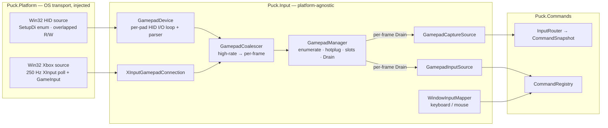
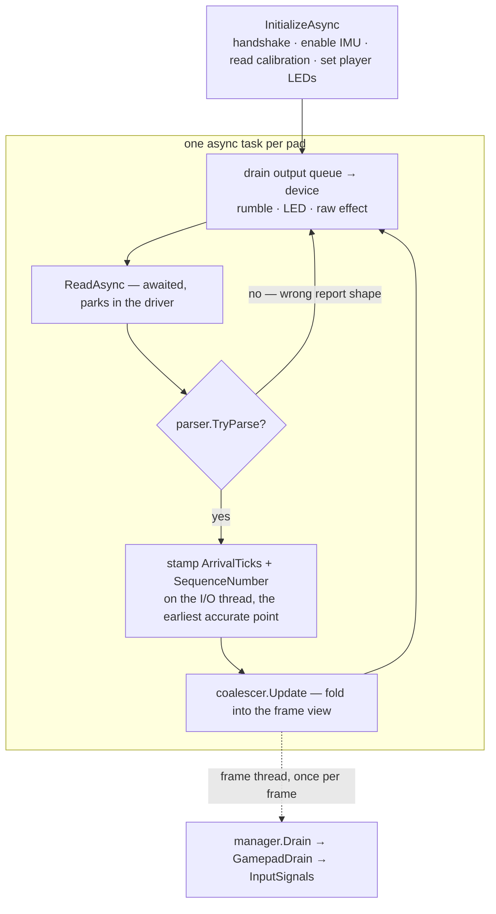
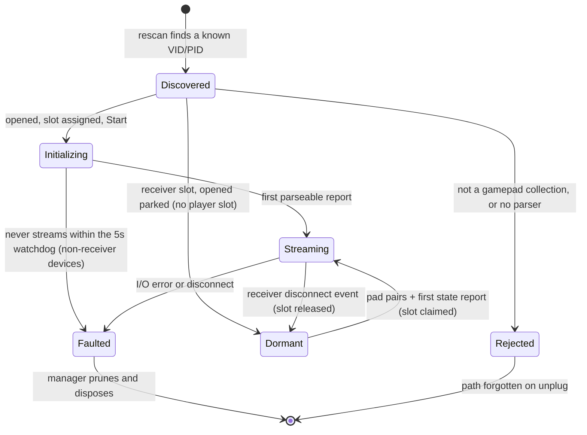
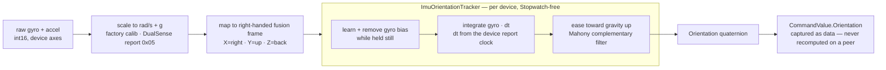

# Puck.Input — device input for Puck

`Puck.Input` is the engine's device-input layer. It turns three different USB game controllers — Nintendo
Switch Pro, Xbox, and Sony DualSense — plus the keyboard and mouse into **one normalized, provider-neutral
stream** that `Puck.Commands` binds to game commands. The hard parts live here: the per-family HID protocols,
hotplug, haptics, IMU sensor fusion, and sub-frame timing. The OS-specific transport does **not** — every
platform detail is injected, so the same core drives a pad on Windows today and on Linux the day a `hidraw`
transport is written.

The whole layer is one pipeline, read left to right:

> raw HID report / OS event → normalized `GamepadState` / `WindowInputEvent` → provider-neutral `InputSignal`
> (keyed by an `InputSources` control name) → `Puck.Commands`

> **Project rule** (see `AGENTS.md`): build only in the split `Puck.*` projects listed in the current source tree.

## Device support

All three families work over USB; the **DualSense also works fully over Bluetooth** (input, motion, rumble,
LED, adaptive triggers — hardware-verified). Bluetooth for the Switch Pro and Xbox is [deferred](#status--done--deferred).

| Family | Transport | Input | Motion (gyro / accel / fused pose) | Rumble | Triggers | LED / indicator |
|---|---|---|---|---|---|---|
| **Switch Pro** | HID (USB) | buttons · sticks · triggers | ✅ gyro + accel + fused orientation | ✅ HD (approx. encoding) | digital ZL/ZR | ✅ player LEDs (at init) |
| **Xbox** | XInput + GameInput | buttons incl. Guide | — | ✅ 4-motor (incl. impulse) | analog | — (no controllable LED) |
| **DualSense** | HID (USB **+ Bluetooth**) | buttons · sticks · triggers · touchpad click/mute · 2-finger touch | ✅ calibrated gyro + accel + fused orientation | ✅ dual motor | analog + adaptive | ✅ RGB light bar + player LEDs |
| **Steam Controller** | HID (USB + wireless receiver) | buttons incl. grips · stick · dual trackpads (touch/click) · analog triggers | ✅ gyro + accel + fused orientation (nominal scales) | ✅ dual-pad haptic pulse (coarse) | analog | — (no controllable LED) |
| **Steam Controller (Triton, 2026)** | HID (wireless puck receiver) | buttons incl. QAM · four rear paddles · dual clickable sticks · dual trackpads (touch/click) · analog triggers | ✅ gyro + accel + fused orientation (nominal scales) | ✅ dual-motor (0x80 output report) | analog | — (no controllable LED) |

## Architecture

`Puck.Input` is **platform-agnostic**: it owns the gamepad protocol logic and the abstractions, and nothing
else. Two acquisition transports feed one device manager, which exposes a single per-frame drain that two
command seams consume.



- **`GamepadManager`** (platform-neutral) owns the connected set: HID enumeration, the ~1.5 s hotplug rescan
  against an injected `IHidDeviceSource`, player-slot assignment, pruning, lifetime, and the per-frame `Drain`.
  It runs no OS-specific code. A transport it can't run itself — the Xbox backend — is supplied as an optional
  `IGamepadAcquisitionSource` that owns its own thread and publishes connections through the manager's
  `IGamepadConnectionRegistry`.
- **HID path** — each `GamepadDevice` hosts an `IGamepadParser` and runs its own async I/O loop over an
  `IHidDevice` (report → coalescer, output queue → device). The concrete transport is the Windows
  `Win32HumanInterfaceDevice` in `Puck.Platform`; a Linux `hidraw` transport plugs in the same way.
- **Xbox path** — `Win32XboxAcquisitionSource` owns one 250 Hz XInput poll thread; each tick it calls
  `XInputGamepadConnection.Apply(state)` then `ServiceOutput()`. The connection presents the same
  `IGamepadConnection` surface as a HID device, so it flows through the identical coalescer → command pipeline.

### Two command seams

A drained frame reaches `Puck.Commands` through one of two seams. Both pull the manager's **destructive**
per-frame `Drain` (the coalescer hands out its accumulated edges exactly once), so exactly one runs per frame —
wiring both would let the first consume the other's button edges. The composition root picks which is live.

| Seam | Path | Role |
|---|---|---|
| **`GamepadCaptureSource`** | → `InputRouter` → per-tick `CommandSnapshot` | The deterministic, timestamped, recordable path — the engine's input spine, and the direction of travel. Drives the overworld demo today. |
| **`GamepadInputSource`** | → `BindingCommandSource` → `CommandRegistry` | The focus-gated command path. The default for every mode not on the router (console, cursor UI). |

### The platform seam (so `Puck.Input` has no Windows code)

`Puck.Input` defines the transport abstractions; `Puck.Platform` (which references `Puck.Input`) implements them
and is injected at the composition root.

| Abstraction (`Puck.Input`) | Windows implementation (`Puck.Platform`) |
|---|---|
| `IHidDevice` / `IHidDeviceSource` (`Hid/`) | `Win32HumanInterfaceDevice` / `Win32HidDeviceSource` (`Windows/Hid/`) |
| `IGamepadAcquisitionSource` + `IGamepadConnectionRegistry` (`Devices/`) | `Win32XboxAcquisitionSource` (`Windows/Gamepad/`) |

`[InternalsVisibleTo("Puck.Platform")]` lets the relocated `XInputGamepadConnection` reuse the internal output
plumbing (`GamepadOutput`, `GamepadOutputCommand`). CsWin32 and the `x64` pin live in `Puck.Platform` (its
SetupAPI structs can't be AnyCPU); `Puck.Input` stays AnyCPU.

### Capabilities are derived, not declared

Output capabilities come from the interfaces a parser actually implements (`GamepadDevice.CapabilitiesFor`), so
every advertised feature has a real write path and there is no capability to lie about: `IRumbleParser →
Rumble`, `ILedParser → Led`, `ITriggerEffectParser → TriggerEffect`, every HID parser → `RawEffect`. Input
capabilities (`GamepadInputCapabilities`: `Gyro`, `AnalogTriggers`) are reported per connection and queryable
via `GamepadManager.TryGetInputCapabilities`.

### Key contracts

- **`IGamepadConnection`** — `DeviceId`, `PlayerIndex`, `IsFaulted`, `Coalescer`, `Output`, `Key`, `Type`,
  `InputCapabilities`, `Start()`. The uniform surface both transports implement.
- **`IGamepadParser`** — `Type`, `InputCapabilities`, `InitializeAsync(playerIndex)`, `TryParse(report, out state)`.
- **`IRumbleParser`** — `SetRumbleAsync(low, high)`. **`ILedParser`** — `SetLedAsync(LedColor)`.
  **`ITriggerEffectParser`** — `SetTriggerEffectAsync(left, right)` (DualSense adaptive triggers).
- **`IGamepadOutput`** (queue façade) — `Rumble`, `RumbleTriggers`, `SetLed`, `SetTriggerEffect`, and the raw
  `SendEffect` escape hatch, each gated by `Capabilities`.

## The gamepad pipeline

### Per-device HID loop

Each HID pad gets one async task. It initializes the device, then parks in an awaited read until a report
arrives — lowest latency, zero per-read allocation — parses it, stamps it, and folds it into the coalescer. The
read is bounded only before the first report (so a stuck handshake faults) and while a finite rumble is pending
(so its expiry is serviced even if the report stream pauses).



### Coalescing high-rate input to per-frame

A pad streams far faster than the frame rate, so `GamepadCoalescer` bridges the two without losing anything that
matters. Between drains it keeps the **latest** continuous axes (sticks, triggers, touch), **OR-es together**
every button press/release edge (so a tap that falls entirely between two frames is never lost), and
**averages** the gyro (so the reported angular velocity is frame-rate independent). All access is gated, since
the I/O thread writes while the frame thread drains. `manager.Drain` collects one `GamepadDrain` per device with
pending data into a reusable buffer.

### Capture timing (sub-frame)

Timing is stamped at the **earliest accurate point** — the I/O thread, the instant a report parses — not when
the frame thread happens to drain. Each report carries an `ArrivalTicks` (engine-tick wall clock) and a
per-device `SequenceNumber`; the coalescer additionally records each button's **first** press time within the
frame window (`GamepadButtonEdges`, an inline array). `GamepadCaptureSource` then stamps every press edge at its
own arrival time and continuous signals at the latest report's, falling back to a single frame-clock read only
for a transport that doesn't stamp (the XInput poll path leaves `ArrivalTicks` zero). This is what lets a rhythm
consumer read true sub-frame edge timing instead of one coarse per-frame value, and what attributes an input to
the right fixed-step simulation tick.

## Connection lifecycle & hotplug

The manager rescans HID interfaces about every 1.5 s and reconciles the set. A newly seen, supported device is
opened, assigned the lowest free player slot, and started; a device that faults (disconnect, I/O error, or a
handshake that never streams within a 5 s watchdog) is pruned and disposed — promptly at the next drain, not
just at rescan, so it stops replaying stale state. Disposal happens **outside** the manager's lock (a HID
device's teardown briefly joins its I/O loop, which must not block a concurrent frame drain).

**Multi-slot wireless receivers defer activation.** A Steam receiver (classic dongle `0x1142`, Triton puck
`0x1304`) exposes one vendor input collection per pairing slot — most of which may sit empty indefinitely.
Those open **dormant**: no player slot, exempt from the 5 s streaming watchdog, invisible to
`ConnectedDevices`/`TryGet*` and never drained. A slot is claimed on the first parsed state report (reconciled
at every drain and rescan, so activation latency is one frame) and released when the receiver announces the
controller left (the classic receiver's type-`0x03` wireless event, via `IWirelessSlotParser`, which also
re-runs parser initialization when a pad pairs in). Without this, every empty slot flaps forever — open →
5 s liveness fault → prune → reopen on the next rescan — while burning real player slots on phantoms (a lone
Triton receiver inflates the player count by three).



A slot frees on disconnect and the lowest free slot is reclaimed on reconnect; a device id is content-addressed
from the device path, so the same physical port keeps its identity across reconnects and restarts, while two
identical pads on different ports stay distinct.

## IMU fusion — absolute orientation

Both motion pads expose a fused absolute orientation (`GamepadState.Orientation`, a unit quaternion;
`InputSources.Gamepad.Orientation`, a `CommandValue.Orientation`). `ImuFusion` is a complementary filter: it
integrates the gyro for smooth short-term rotation and corrects the accumulated drift against the
accelerometer's gravity vector. `ImuOrientationTracker` holds the per-device state (the orientation and the
learned gyro bias). Crucially, the integration `dt` is **supplied by the caller from the device's own report
clock** — so the fusion holds no wall clock (it is `Stopwatch`-free) and a given report stream fuses identically
on every machine. The fused orientation is then captured as data on the snapshot, so a peer or a replay never
recomputes it.



Per-device sensor handling — the parser maps its own sensor axes into the canonical right-handed frame and
supplies the `dt`:

- **The `dt` comes from the device's report clock, not the OS clock.** The DualSense carries a free-running
  32-bit sensor timestamp (common offset `27..30`) whose raw value is in **thirds of a microsecond** (divide by 3
  to reach microseconds), so its inter-report delta is the true `dt`; the raw counter is also kept as
  `GamepadState.SensorTimestamp` for sub-frame rhythm work. The Switch carries three IMU sub-samples per report,
  each spanning a fixed **5 ms**, so `FuseImu` integrates one tracker step per sub-sample at that cadence (the
  averaged gyro/accel still feed the `Gyro`/`Accelerometer` state fields). The tracker clamps `dt` to a sane
  range, so a timestamp wrap or the first sample degrades to a bounded step.
- **Sensor frames differ per device.** The DualSense IMU frame is **left-handed** (X=right, Y=up, Z=forward), so
  the Z axis is negated: the transform `diag(1, 1, -1)` is a handedness **reflection** (det −1). The Switch Pro
  frame is right-handed but rotated → `(x,y,z) → (-y, z, -x)`, a proper rotation (det +1). The same per-device
  transform applies to both that device's gyro and accel.
- **The DualSense gyro needs its factory calibration** (feature report `0x05`, read in `InitializeAsync`). The
  per-device sensitivity is **~64×** the bare `1024 LSB/°/s` resolution figure, so using `1024` directly reads
  ~64× too weak and yaw (which has no gravity reference) goes effectively dead. The uncalibrated fallback
  therefore uses `64 × (π/180) / 1024`, so a pad whose `0x05` read fails still reports usable angular velocity.
  The read is retried (~360 ms) because a device may not answer the feature report immediately after connecting.
  The Switch's nominal `0.070 °/s` scale is adequate without per-device calibration.
- **Gravity-anchored pitch/roll vs. gyro-only yaw.** A wrong gyro scale or a stuck bias estimator shows up
  *only* as a dead yaw, because the accelerometer keeps pitch and roll correct regardless — the first thing to
  check when motion feels off.
- **The Mahony correction term is `cross(measured, estimated)`.** Reversing the operands would make the 180°
  antiparallel pose the filter's stable point instead of the aligned one.

`gamepad.orientation` rides the accelerometer emit gate (a device with an accel is the one running the filter).
The demo draws a per-controller pitch/yaw/roll needle gauge from it.

## Output & haptics

Output is a queued façade (`IGamepadOutput`): rumble, trigger rumble, LED, and a raw-report escape hatch, each
gated by the connection's derived `Capabilities`. The device's own I/O loop drains the queue, so all writes for
a pad are serialized on the thread that owns its handle.

### Xbox rumble via GameInput

`XInputSetState` rumble is a silent no-op for Xbox pads over the Wireless Adapter / Bluetooth and can't reach
the trigger (impulse) motors, so Xbox rumble goes through **GameInput** (`gameinput.dll`, hand-authored
flat-COM interop). The whole Xbox backend lives in `Puck.Platform/Windows/Gamepad/`; `Puck.Input` sees it only
through `IGamepadAcquisitionSource`. The connection writes rumble to **both** GameInput (4 motors, wireless
reach) and the legacy `XInputSetState` motors (which reach a pad whose GameInput output an overlay like Steam
Input has captured).

- `GameInputHaptics` enumerates real per-device handles via a `RegisterDeviceCallback` reverse-callback into a
  dictionary that **owns** the RCWs. **Never `ReleaseComObject` a device handle** — connections borrow them;
  releasing one separates a handle still in use and crashes (`InvalidComObjectException`). Drop the dictionary
  reference and let the GC finalize.
- `Bind(targetButtons)` correlates an XInput slot to its physical GameInput device by matching the buttons it
  currently holds, reserving it so no other slot binds the same device. It returns a device only when **exactly
  one** unbound device matches — ambiguity is deferred rather than risking a stable mis-bind.
- `RumbleDevice` returns `false` (never throws) when the device has disconnected, so the caller drops the stale
  binding and re-correlates instead of tearing down the 250 Hz poll loop.
- The poll thread is the **sole owner** of `GameInputHaptics` (it creates and disposes it in its own `finally`);
  ownership never crosses a thread.

### DualSense adaptive triggers

Adaptive triggers are a **typed, first-class capability** (`ITriggerEffectParser` → `SetTriggerEffect`), not a
raw escape hatch. A caller builds a validated, allocation-free `TriggerEffectSpec` per trigger and the DualSense
composes both into its **normal `0x02` output report**, alongside rumble and the light bar — so resistance,
rumble, and the LED coexist in one write. `Output/DualSenseAdaptiveTrigger.cs` encodes one `TriggerEffectSpec`
into one trigger block; `DualSenseController` writes the right (R2 `[11]`) and left (L2 `[22]`) blocks.

- **One multiplexed report.** `valid_flag0` asserts the vibration bits (`0x01`/`0x02`) **and** the trigger-FFB
  bits (`0x04` right / `0x08` left); these are disjoint from each other and from the light-bar flag
  (`valid_flag1` `0x04`), so the firmware applies every set section and no write clobbers another. The two
  11-byte trigger blocks at `[11]`/`[22]` sit just before the player-LED (`[44]`) and light-bar (`[45..47]`)
  offsets. `DualSenseController` re-emits the persisted per-trigger effects in every report, so a later rumble or
  LED write keeps them alive.
- **`TriggerEffectSpec` factories** (zones index the pull in 10 steps; strength `0..8`): `Feedback(position,
  strength)` — uniform resistance (`0x21`); `Weapon(start 2..7, end >start..8, strength)` — a band that gives way
  (`0x25`); `Vibration(position, amplitude, frequency)` (`0x26`); `ContinuousCurve(zoneStrengths)` — a per-zone
  resistance curve (the general form of `Feedback`, also `0x21`); and `Off`. A zero-strength effect resolves to
  `Off`, so the 3-bit per-zone field only ever holds `strength − 1` for an active zone.

The effect persists in the controller until replaced. USB-only, like rumble and LED — the report is sized for the
`0x02` USB report, not Bluetooth's `0x31`. (Genuinely device-specific effects without a typed shape — Switch
HD-rumble waveforms, say — still ride the raw `SendEffect` channel.)

### Rumble coalescing

A per-tick rumble streamer must not flood the link. The Switch and DualSense HID paths coalesce equal-or-weaker
updates to a ≥30 ms cadence — stops, the first write, and any **increase** in intensity always go through, so
rumble-off and stronger effects stay instant. The Switch low band is clamped to the LRA-safe `0x72` ceiling.
XInput rumble is not separately rate-limited because it is already coalesced to one write per 250 Hz poll tick.

## Keyboard & mouse

Beyond controllers, `Puck.Input` owns the engine's physical-input **vocabulary** (`InputSources` — the
`Keyboard` / `Pointer` / `Gamepad` source names) and the **keyboard/mouse neutral seam**. The native windows
(`Puck.Platform`) decode raw OS keys and pointer motion into a provider-neutral `WindowInputEvent` (a `KeyCode`,
typed text, or a pointer delta/position, each carrying a `CommandPhase`) and name no controls.
`WindowInputMapper.ToInputSignal` then applies the `InputSources` vocabulary — exactly mirroring how
`GamepadInputSource` maps neutral gamepad state. `Puck.Commands` keeps only the modality-agnostic bridge shapes
(`InputSignal`, `InputModifiers`, `InputDeviceId`, `BindingCommandSource`, `CommandBinding`).

- **High-rate mouse (Win32).** Pointer motion comes from **Raw Input** (`WM_INPUT`) — un-accelerated, full-rate
  relative deltas — **summed pump-level per frame**, so a 1000–8000 Hz mouse collapses to one `pointer.move`
  that the command registry's last-wins polled value records exactly. Absolute mode (RDP / VM / tablet) is
  detected via `RI_MOUSE_MOVE_ABSOLUTE` and converted from the previous sample rather than summed as garbage;
  absolute position rides `pointer.position`. If raw registration fails, `WM_MOUSEMOVE` feeds the **same**
  accumulator — never both for one motion.
- **Press + release edges + pollable held state.** Keys and buttons emit both a press (`Started`) and a release
  (`Completed`). `CommandBinding.ActivateOn` (default `Started`/`Active`, ignoring `Completed`) gates which
  edges run a **handler**, but the registry records every activation: a held digital input **persists its polled
  value** across frames (set on press, cleared on release), so a continuous consumer can `GetValue` "is it down"
  without the source re-asserting it, and a held key never re-runs its press handler. This split is why
  `CommandSignal` carries a `Dispatch` flag (update the value vs. run the handler). On focus loss the held set is
  cleared (`CommandRegistry.ReleaseHeld`, wired into the launcher pump) so nothing sticks while undelivered
  releases are missed. X11 auto-repeat (a release+press pair at the same timestamp) is de-duped in
  `XcbNativeWindow`.

## Binding chords (grouped modifier-chord profiles)

The engine-side chord mechanism lives in `Puck.Commands` (not here): a `BindingProfileDocument` (JSON,
`puck.bindings.v1`) declares **modifiers** — any input source, e.g. `gamepad.leftTrigger`, made digital by
press/release hysteresis thresholds — and **chord rows**: `(group, ordered chord) → meaning`, where the meaning
is a **page** (an entry table) or a **command** (a direct chord-fired binding). `["left","right"]` and
`["right","left"]` are distinct rows; the empty chord is a group's resting page. `BindingProfile.Compile`
validates the document into a `CompiledBindingProfile`; `PagedInputBindings` (a stateful `IInputBindings`)
resolves each signal against the ACTIVE GROUP's deepest prefix-held page row **inside `InputRouter`'s
pre-snapshot fold**, so recorded `CommandSnapshot`s are already chord-resolved and replay needs no changes;
`SetActiveGroup` flips a slot's group as a pointer-level runtime mode switch, and command chords fire synthesized
edges (`IChordEdgeSource`) the router folds like bound presses. A press latches its binding list so its release
completes as the same command even if the modifier — or the page, or the group — changed in between (no stuck
held entries). Puck.Post's `BindingPageStage` (Tier A) proves hysteresis, press-order chords, chord remainders,
group-scoped prefix resolution, command-chord edges, the latch across page AND group flips, the loud uniqueness
rules, and bit-for-bit session determinism.

The demo side (`Puck.Demo`): `BindingProfileDocuments.BuildDefault()` is an addon-style layout as data
(triggers → 5 pages; South = jump / West = interact / left shoulder = target on the no-modifier page), persisted
via `Puck.Storage` to `%LocalAppData%\Puck\Demo\<id>\bindings\gamepad.json` (edit + relaunch;
`PagedInputBindings.Reload` supports live editors). The on-screen **binding bar** (`Puck.Demo/BindingBar/`) renders the cluster as
a fullscreen SDF overlay confined to the overworld's room view (`OverworldRenderNode`, the default no-flags run):
`BindingBarLayout` is the addon's modulo math in normalized units,
`BindingGlyphResolver` picks PlayStation 5 shapes / Xbox / Switch letters per connected family
(`GamepadManager.TryGetType`), and per-slot data rides a storage buffer into
`binding-bar-overlay.frag.hlsl` (procedural glyphs now; icon ids ≥ 1024 are the reserved texture-atlas seam).

## Guided binding sessions — rebinding as gameplay

The engine seam for an **interactive binding experience** — a tutorial that binds as it teaches, instead of a
settings menu the player hunts through. The machine lives in `Puck.Commands` (it consumes the same neutral
`InputSignal` stream the router folds); this project contributes the family-aware naming that makes its prompts
read like the player's own hardware.

- **`BindingSession`** (`Puck.Commands`, + `BindingSessionPlan`/`BindingSessionStep`/`BindingSessionEvent`/
  `BindingSessionResult`) walks a plan one step at a time, implementing the hardware-calibration wizard
  protocol: prompt one command with its suggested source, **wait forever** (no timers — a timed window collects
  garbage), lock the capture only after **three presses of the same source**, loudly report a **deviation** (a
  first press off the suggestion) and confirm it the same way, **redo the whole step** when a confirmation press
  wanders, and refuse **reserved** sources (page modifiers) and sources an **earlier step captured**. Presses
  are rising edges only: digital `Started` edges with a required release in between (a platform's key
  auto-repeat can't confirm itself), and analog 1-D sources through the same press/release hysteresis band as
  page modifiers. The whole machine is a pure function of its signal sequence — no wall clock, no randomness —
  so a recorded session replays bit-for-bit (Post gates it as the Tier-A `binding-session` stage).
- **`BindingSessionResult.Apply`** folds the captures back into the `BindingProfileDocument` page: deviations
  rewrite entries, an uncaptured entry whose source a capture claimed is displaced-and-reported (never a silent
  duplicate), a captured command with no entry is appended. The session round-trips the one profile format —
  storage, `BindingProfile.Compile`, and `PagedInputBindings.Reload` need nothing new.
- **`InputSourceLabels`** (here, since it needs `GamepadType`) names a source the way the connected family
  does: `Describe(source, family)` says the south face button is **B** on a Switch Pro, **A** on Xbox/Steam,
  **X** on a DualSense (and L1 vs LB vs ZL, Options vs Menu vs Plus, …); `DescribePosition(source)` is the
  neutral spoken fallback ("the south face button") for prompts with no pad connected. It is the text mirror of
  the demo's `BindingGlyphResolver` shader glyphs.

The machine is slot-agnostic — the host filters whose signals it feeds (one player's slot for a personal
rebind, everything for a shared kiosk). **Host recipe:** build a `BindingSessionPlan.FromPage(document, pageId)`
(modifier sources auto-reserved), feed the session each captured signal, narrate each returned
`BindingSessionEvent` through `InputSourceLabels` (`GamepadManager.TryGetType` picks the family), suppress
gameplay dispatch while the session runs, then `Result.Apply` → persist → `PagedInputBindings.Reload`. No demo
wiring exists yet; a diegetic tutorial or a `bind.session` console verb is the intended first host.

## Dynamic lighting — the bind legend

Per-key RGB output (HID LampArray) that color-codes the user's binds so the keyboard *is* the legend. It is the
output mirror of the keyboard input seam and layers the same way: a neutral contract in `Puck.Abstractions`, a
from-scratch Win32 HID transport in `Puck.Platform`, and the feature itself — the composer — here in
`Puck.Input`. It is **presentation-side only**; nothing about it touches simulation state.

```
lamp array (device) ─┐
palette + legend      ├─► LightLegendComposer ─► LightLegendDriver ─► HID feature reports (≤30 Hz, dirty-only)
live bind/command state ┘
```

**Contracts (`Puck.Abstractions.Lighting`).** `LampColor` (RGB + separate intensity byte), `LampPosition`
(normalized 0..1 within the array bounding box), `LampArrayKind` (Keyboard/Mouse/…), `LampPurposes` (flags),
`LampInfo` (per-lamp id, position, purposes, **input-binding usage page + usage** — how a lamp declares *which
key it lights* — level counts, latency), `ILampArrayDevice` (identity, kind, lamp count, `TryGetLampInfo`, batch
`UpdateLamps`/`UpdateAllLamps`, `TrySetAutonomousMode`, `IDisposable`), `ILampArrayDeviceSource` (enumerate +
`Rescan`). Mirrors how windowing types live in Abstractions — zero OS types.

**Transport (`Puck.Platform/Windows/Lighting`).** `Win32LampArrayDevice` / `Win32LampArrayDeviceSource` speak
the HID LampArray protocol (HID Usage Tables 1.4, "Lighting And Illumination" page `0x59`) over CsWin32:
attributes / request / response / multi-update / range-update / control feature reports. **Report ids are
discovered from the device's own `HidP` value caps, never hardcoded**, so the code drives any conformant
LampArray. Two gotchas that cost real debugging and are load-bearing:
- A LampArray is held by the OS Dynamic Lighting stack / a vendor service, so a plain read/write `CreateFile`
  fails with a sharing violation — it must be opened with **zero desired access** (feature reports still work).
- `HidP_GetUsageValue` requires the `ReportLength` to be the collection's **max** feature report length, not the
  specific report's length. And the multi-update report id can't be keyed off the color-channel usage (the
  range-update report carries those too) — it is the report whose `LampId` value cap has **report count ≥ 2**
  (the 8-lamp id array).

**Composer (`Puck.Input.Lighting`) — the actual feature.**
- `KeyboardUsageMap` — HID keyboard usage (page `0x07`) → `KeyCode` / `InputSources.Keyboard.*` source string
  (letters and digits ride a character), the seam that ties a lamp to the command bound to its key.
- `BindCategory` + `LightLegendPalette` — category → color, data-tunable (`CreateDefault` then `WithCategory`).
  Default: movement cyan, camera violet, interact green, console + meta amber, bench + debug red family, system
  cool blue; plus a faint idle wash, a held-modifier highlight, an activation-flash color, and an unavailable dim.
- `LightLegendState` — one tick's legend the host fills: `Bind(source, category, available)`, `Flash(source)`
  (a command fired this tick), `HoldModifier(source)`. Keyed by the neutral source string, never a lamp layout.
- `LightLegendComposer.Compose` — layers, bottom to top: **base** (category color / idle wash) → **availability**
  (dim) → **chord modifier** (held-modifier keys overpainted; the board recolors because the host feeds the
  active chord page's legend) → **activation flash** (decays over ~0.35 s). Stateful only in the flash decay.
- `LightLegendDriver.Tick(state, dt)` — throttles to ≤30 Hz (never under the device floor), composes, and writes
  only the lamps whose color changed. Takes host control on first tick, restores autonomous mode on `Dispose`.

**Hardware-verified.** On a Logitech G915 (native HID LampArray via the Virtual HID Framework): enumerated as a
Keyboard, 115 lamps, 475×150×22 mm bounding box, 33 ms min update; per-lamp input bindings resolve (lamp 0 =
usage `0x04` = the `a` key); solid red/green/blue, an X-position rainbow, and the real `LightLegendComposer`
legend all painted correctly. The G502 mouse (2 lamps) and POWERPLAY pad (1 lamp) also enumerate. No contention
was observed while G HUB / Logi Options+ ran — a zero-access open coexists with them.

**Demo wiring (handoff).** The composer takes a per-tick `LightLegendState` the host builds from its live state,
so it has no demo dependency. The demo's own binds are gamepad chords (see below); a keyboard bind legend is a
sensible-default classification of keyboard sources into categories, driven each frame from `DemoHost`. The
chord layer is reachable via `HeldOrderTracker`/`BindingChordTracker` (in `Puck.Commands`) — feed the active
chord page's entries into the state and `HoldModifier` the held keys.

**Abnormal-exit note (statement of record).** Host control of a LampArray is released only by `Dispose` (which
restores autonomous mode). Every clean shutdown path disposes the installer, so the keyboard reverts to its
Dynamic-Lighting stack. On an *abnormal* exit (the process is killed, or crashes before disposal) the keyboard
stays **host-controlled, frozen on its last written frame** until something else — a replug, or the OS lighting
service reclaiming it — takes it back; the OS does not auto-restore it on process death.

## Status — done & deferred

Everything in [Device support](#device-support) works over USB, and the DualSense also works over Bluetooth. The
notable gaps:

- **DualSense Bluetooth — DONE (hardware-verified).** Enumeration parses the BT path form (`_vid&…` / `_pid&…`,
  keeping the low 16 bits) and tags `IHidDevice.Transport`; input is report `0x31` (common block at offset 2),
  output is report `0x31` (2-byte header, common block at offset 3, trailing little-endian CRC32 seeded `0xA2`
  via `System.IO.Hashing`). Two gotchas that cost real debugging: Windows reports `OutputReportByteLength` =
  **547** over BT (not 78), so the buffer is that size but the CRC sits at byte **74** — the end of the *logical*
  78-byte report, zero-padded after (placing it at `buffer.Length − 4` makes the pad reject the report and stop
  streaming); and the first BT output write must clear the boot LED animation (`valid_flag2 BIT(1)` +
  `lightbar_setup`) or the RGB is masked. Feature report `0x05` (calibration) doubles as the full-mode trigger and
  is read at init. BT *input* CRC is intentionally **not** validated (the BT link layer guarantees frame
  integrity).
- **Bluetooth for the Switch Pro and Xbox — deferred.** A BT Switch Pro matches PID `0x2009` but must **skip** the
  USB `0x80` handshake and go straight to the subcommands (branch on `Transport` in `InitializeAsync`), plus a
  `0x48`/`0x01` enable-vibration subcommand; the transport flag is already plumbed. Xbox over BT should already
  flow through XInput + GameInput (verification only). Read/write buffers are already sized from `HIDP_CAPS`.
- **Linux / Steam Deck hidraw transport.** The parsers are OS-agnostic; only the HID transport is
  Windows-specific today. Nothing in the parsers has been exercised on a non-Windows backend yet.
- **Per-device factory calibration.** The Switch **stick** calibration is read from SPI flash at init: factory
  left/right at `0x603D`/`0x6046` (9 bytes each, three 12-bit-packed (x,y) triples), with user calibration at
  `0x8010`/`0x801B` (magic `0xB2 0xA1`, data at `0x8012`/`0x801D`) **overriding** the factory values when
  present. The two sticks pack their (center, below-center, above-center) triples in **different orders** (left:
  above→center→below; right: center→below→above — see `ACKNOWLEDGMENTS.md` for the reverse-engineering record this
  was cross-checked against); each axis is normalized `(raw − center) / span` (above-span for a positive push, below-span
  for a negative), so an asymmetric stick reaches ±1 at full deflection. The read is over subcommand `0x10`
  (u32 LE address + u8 length; reply data at offset 20), matched on the echoed address+length; a failed or
  implausible read (out-of-range center/span, unprogrammed flash) transparently keeps the nominal
  `(raw−2048)/1800` scale and logs one diagnostic line, so a pad is never worse off. The Switch **IMU** (SPI)
  still uses nominal scales; the DualSense gyro is factory-calibrated (report `0x05`) but its accel and sticks
  use nominal scales. The Switch HD-rumble amplitude/frequency encoding is a perceptible linear approximation,
  not a full perceptual LUT.
- **Steam Controller — implemented (documented protocol), hardware-unverified.** Wired (`0x1102`) and the
  four-slot wireless receiver (`0x1142`) are wired up. Its input arrives on a **vendor-defined HID collection**
  (usage `0xFF00`/`0x01`), so `GamepadManager` gates it separately from the generic gamepad collection; the
  receiver's management collection (usage `0x02`) and the lizard keyboard/mouse collections are excluded. On open
  it is taken out of **lizard mode** (clear digital mappings + trackpad modes → none) and switched to **raw IMU**
  via feature reports (`IHidDevice.TrySetFeatureReport`, new); lizard mode is restored on release
  (`GamepadDevice` disposes the parser before the handle). The two trackpads surface as `Touch0` (right) /
  `Touch1` (left); the right pad doubles as the right stick, the analog stick as the left stick; grip paddles use
  the new additive `GamepadButtons.LeftGrip`/`RightGrip`. Haptics fire the `ID_TRIGGER_HAPTIC_PULSE` train per pad
  (a coarse buzz, not true amplitude control). **Gaps:** parsing/lizard/IMU/haptics are reference-correct (see
  `ACKNOWLEDGMENTS.md` for the reverse-engineering record) but unverified against classic hardware; IMU axis mapping and
  gyro/accel scales are nominal (gravity anchors pitch/roll). Empty receiver slots park **dormant** (no player
  slot, watchdog-exempt — see the connection-lifecycle section); pairing is event-driven via the receiver's
  type-`0x03` wireless event (`IWirelessSlotParser`: connect re-runs initialization for the fresh pad,
  disconnect releases the player slot and re-parks the slot).
- **Steam Controller "Triton" (2026, PID `0x1304`) — implemented, hardware-verified (feature/rumble/IMU;
  behavioral lizard-suppression pending in-session eyeball).** The 2026 pad is a conventional twin-stick
  controller (two clickable sticks, two clickable trackpads, four rear paddles, analog triggers, 6-axis IMU)
  reached through its wireless "puck" receiver, which exposes up to four vendor input slots (`0xFF00/0x01`);
  only the paired slot streams. All four slots open **dormant** (no player slot, watchdog-exempt) and a slot is
  claimed on first streamed state. Eagerly opening every slot makes empty slots flap open→fault→reopen and can
  inflate the player count. The
  Triton's pairing-event framing is **not yet decoded** (unlike the classic `0x03` event), so activation is
  stream-driven and a powered-off pad's slot is released only when the receiver interface errors; an unparsed
  `id=0x7b` (54-byte) report observed right as streaming begins is the candidate status/pairing report to decode.
  Its control framing differs from the classic pad and that difference is load-bearing:
  **every feature write is under report id 1** (`buffer[0]=1`, then a `[type][length][payload]` message), and
  `SET_SETTINGS_VALUES` (`0x87`) carries 3-byte `{settingNum, u16 value}` entries — the classic pad's id-0
  framing is rejected by the Triton firmware with Win32 error 87. On open it is taken out of lizard mode
  (`SETTING_LIZARD_MODE 9 = 0`) and switched to raw IMU (`SETTING_IMU_MODE 48 = 0x0018`, raw accel + raw gyro);
  a ~3 s lizard-off watchdog re-asserts it while streaming; lizard mode is restored (`= 1`) on release. Input is
  the 54-byte `0x42` report (u32 buttons; i16 triggers 0..32768; i16 sticks ±32768; i16 trackpad position
  `raw/65536 + 0.5`; a free-running µs IMU timestamp that drives the fusion `dt`; accel ±2 g at 16384 LSB/g;
  gyro 2000 °/s full-scale). Rumble is the `0x80` **output** report (10 bytes; `intensity` is 16-bit) mapping
  the low/high bands onto the left/right motor speeds. The two trackpads surface as `Touch0` (right) / `Touch1`
  (left); the four paddles use `LeftGrip`/`RightGrip` + the additive `LeftUpperGrip`/`RightUpperGrip`; QAM is
  `QuickAccess`; the trackpad clicks are `Touchpad` (right) / `TouchpadLeft` (left). **Gaps:** the IMU axis
  mapping and gyro/accel scales are nominal (gravity anchors pitch/roll; only gyro-only yaw depends on the exact
  mapping) — verified at rest (accelZ ≈ +1 g, near-identity pose, seq unbroken ~265 Hz); the firmware
  orientation quaternion (`SEND_ORIENTATION`, report offset 46) is available but unused (we fuse raw, like the
  other pads); trackpad **pressure** (`unPressureLeft/Right`) and the capacitive stick/pad/grip **touch** bits
  are decoded but not surfaced (no honest `GamepadState` carrier). **Abnormal-exit note:** as with the classic
  pad, lizard mode is restored only on clean release; if the process is killed first the pad stays
  lizard-disabled (streaming raw, keyboard/mouse emulation off) until it is replugged or Steam re-establishes it. **Abnormal-exit note (statement of record):** lizard mode is restored only on clean release (the
  parser is disposed before the handle on every normal shutdown path). If the process is killed before that, the
  pad stays **lizard-disabled** — streaming raw reports, its keyboard/mouse emulation off — until it is replugged
  or Steam (or another driver) touches it and re-establishes lizard mode.

## Build, run, debug

```sh
dotnet build Puck.slnx
dotnet run --project src/Puck.Demo/Puck.Demo.csproj -- --exit-after-seconds 30
```

Diagnostics go to **stderr** as `[gamepad]` / `[gameinput]` lines (device discovery, handshake, streaming,
correlation, errors). The demo's gamepad bindings:

| Source | Command | Effect |
|---|---|---|
| South (A/Cross/B) | `gamepad.a` | logs a press |
| East (B/Circle/A) | `gamepad.rumble` | dual-motor rumble on the pressing pad |
| West (X/Square/Y) | `gamepad.trigger-rumble` | impulse-trigger rumble (Xbox) or dual-motor fallback (others) |
| North (Y/Triangle/X) | `gamepad.led` | sets the DualSense light bar cyan; `[unsupported]` elsewhere |
| D-pad Up | `gamepad.trigger-effect` | arms DualSense adaptive-trigger resistance; pull L2/R2 to feel it |
| D-pad Down | `gamepad.trigger-effect-off` | clears DualSense adaptive-trigger resistance |
| Start | `gamepad.start` | logs a press |
| Touchpad click | `gamepad.touchpad` | logs a press (DualSense) |
| Mute button | `gamepad.mute` | logs a press (DualSense) |
| Touchpad finger 1/2 | `gamepad.touch0` / `gamepad.touch1` | logs each finger's normalized 0..1 position |
| Left stick | `gamepad.move` | logs the stick vector |
| Gyro | `gamepad.gyro` | logs angular velocity (Switch / DualSense) |
| Touchpad finger 1 | `cursor-touch` | absolute per-controller cursor (color matched to the LED) |
| Left stick / accel | `cursor-nudge-stick` / `cursor-tilt` | nudge the cursor (relative) / marble-maze tilt |
| Orientation | `gamepad.orientation` | drives the per-controller pitch/yaw/roll needle gauge |

The cursor overlay (colored per-controller cursors + the orientation gauges) renders on the **Vulkan
same-device producer**. It is a demo-owned overlay pass, so no cursor/gauge concept leaks into the
reusable SDF engine.

**Steam Controller lives on a vendor collection, and there are several of them.** The receiver exposes, per
slot, a keyboard (`0x01/0x06`), a mouse (`0x01/0x02`), and the controller (`0xFF00/0x01`) — plus a management
collection (`0xFF00/0x02`). Match VID `0x28DE` + supported PID + `0xFF00/0x01` only. Control commands are
**feature reports** (`HidD_SetFeature`), sized to the device's `FeatureReportByteLength`; err 87 = wrong
report-id/length for the collection (the signature of a non-classic variant). If keyboard/mouse emulation
persists while the pad streams, the `0x81`/`0x87` lizard-disable writes were rejected.

**The Triton receiver has several slots and a different feature framing.** The puck receiver exposes up to four
vendor input collections (`0xFF00/0x01`, one per slot) plus a management collection (`0xFF00/0x02`) and, per
slot, lizard keyboard (`0x01/0x06`) and mouse (`0x01/0x02`) collections. Match VID `0x28DE` + PID `0x1304` +
`0xFF00/0x01`; only the paired slot streams. Unlike the classic pad, control writes are feature reports **under
report id 1** — a write under id 0 returns err 87 and identifies the unsupported framing. If
keyboard/mouse emulation persists while the pad streams, the `SETTING_LIZARD_MODE = 0` write (report id 1) was
rejected.

## File map

**`Puck.Input` (platform-agnostic):**

| File | Role |
|---|---|
| `GamepadManager.cs` | HID enumeration, hotplug rescan, player slots, per-frame drain, lifetime; drives an injected HID source + optional acquisition source |
| `GamepadCaptureSource.cs` | the snapshot-path drain — stamps per-report arrival + per-button edge times and appends `InputSignal`s to an `InputRouter` |
| `GamepadInputSource.cs` | the focus-gated `ICommandSource` — drains the manager and emits `InputSignal`s into the command registry |
| `InputSources.cs` | the physical-control name vocabulary (`Keyboard` / `Pointer` / `Gamepad`) — the single home for source names |
| `KeyCode.cs` / `WindowInputEvent.cs` | the neutral keyboard/mouse seam the native windows emit (pre-vocabulary key/text/pointer events, each with a phase) |
| `WindowInputMapper.cs` | maps a neutral `WindowInputEvent` → `InputSignal` via `InputSources` (the keyboard/mouse mirror of `GamepadInputSource`) |
| `Hid/IHidDevice.cs` / `IHidDeviceSource.cs` / `HidDeviceInfo.cs` | the HID transport abstraction the parsers + manager consume |
| `Devices/IGamepadAcquisitionSource.cs` / `IGamepadConnectionRegistry.cs` | the seam a non-HID backend (the Xbox poll loop) uses to publish connections |
| `Devices/IGamepadConnection.cs` | the uniform connection surface both transports implement |
| `Devices/GamepadDevice.cs` | HID connection: hosts a parser, owns its read/write I/O loop, stamps arrival time, services rumble/LED |
| `Devices/IGamepadParser.cs` / `IRumbleParser.cs` / `ILedParser.cs` / `ITriggerEffectParser.cs` | per-family parse + rumble + LED + adaptive-trigger contracts |
| `Devices/NintendoSwitchController.cs` | Switch Pro: UART handshake, IMU enable, `0x30` parse, `0x10` rumble (throttled + LRA-clamped), player LEDs · reads factory/user stick calibration from SPI flash (subcommand `0x10`) |
| `Devices/DualSenseController.cs` | DualSense: `0x01` parse (sticks/triggers/buttons/gyro + sensor timestamp), `0x02` rumble + light bar + player LEDs |
| `Devices/SteamController.cs` | Steam Controller: vendor-collection lizard-disable + IMU-enable (feature reports), state-report parse (buttons/grips, stick, dual trackpads, analog triggers, gyro/accel), dual-pad haptic pulse, lizard-restore on close |
| `Devices/SteamControllerTriton.cs` | Steam Controller Triton (2026): report-id-1 feature framing (lizard/IMU), 54-byte `0x42` state parse (dual sticks/pads, four paddles, analog triggers, gyro/accel), `0x80` output-report dual-motor rumble, lizard watchdog + restore on close |
| `Devices/GamepadCoalescer.cs` / `GamepadDrain.cs` / `GamepadButtonEdges.cs` | high-rate I/O → per-frame bridge (latest axes / press edges + per-button edge times / mean gyro) |
| `Devices/GamepadState.cs` / `GamepadButtons.cs` / `GamepadTouchPoint.cs` / `GamepadType.cs` / `GamepadInputCapabilities.cs` | the normalized input model (state carries `ArrivalTicks` / `SensorTimestamp` / `SequenceNumber`) |
| `Devices/ImuFusion.cs` / `Devices/ImuOrientationTracker.cs` | complementary gyro+accel orientation filter + shared per-device state (bias learning; `dt` supplied per call) |
| `Output/*` | `IGamepadOutput` queue façade, `GamepadOutputCapabilities`, `RumbleEffect` / `TriggerRumbleEffect` / `LedColor` / `TriggerEffectSpec` |
| `Output/DualSenseAdaptiveTrigger.cs` | encodes a `TriggerEffectSpec` into one DualSense trigger block — `Feedback` / `Weapon` / `Vibration` / per-zone `ContinuousCurve` |

**`Puck.Platform` (Windows implementations of the above):**

| File | Role |
|---|---|
| `Windows/Hid/Win32HumanInterfaceDevice.cs` | Windows HID transport (CsWin32: SetupDi enumerate, CreateFile, HidP caps, overlapped async R/W) implementing `IHidDevice` |
| `Windows/Hid/Win32HidDeviceSource.cs` | `IHidDeviceSource` — enumerates/opens HID interfaces (empty off-Windows) |
| `Windows/Gamepad/Win32XboxAcquisitionSource.cs` | `IGamepadAcquisitionSource` — the 250 Hz XInput poll thread, owns `GameInputHaptics` |
| `Windows/Gamepad/XInputGamepadConnection.cs` | XInput connection: poll-driven, owns GameInput correlation + dual-path rumble |
| `Windows/Gamepad/GameInput.cs` / `GameInputHaptics.cs` | GameInput flat-COM interop + Xbox rumble (device enumeration, correlation) |
| `Windows/Gamepad/XInput.cs` | XInput interop (`xinput1_4.dll`, ordinal `#100` `GetStateEx` for Guide, `timeBeginPeriod`) |
