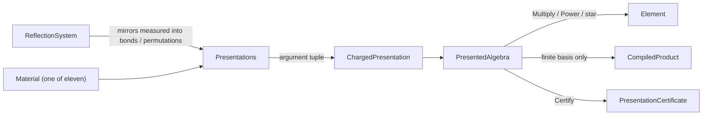
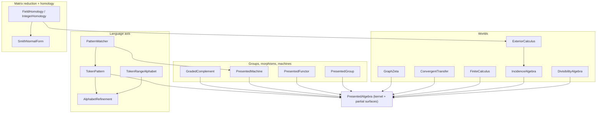

# Puck.Maths/Oracle

Everything in this folder is one multiplication, configured differently. That is
worth saying plainly at the top, because the surface looks far bigger than it
is: shortest paths, pattern matching, Mobius inversion, homology, knot
invariants and reflection groups all come out of the same product, and none of
them adds a second one.

Four words carry the whole design, so here they are before the rest of the file
leans on them.

An algebra is **presented** when you describe it by listing its building blocks
and the relations they obey, instead of writing out its multiplication table by
hand. The building blocks are **generators** — treat them as letters — and a
product of generators is a **word**.

The presentation here is **charged**: every relation carries a scalar beside it,
its charge, which the rewriting multiplies in whenever that relation fires. A
rule like "swapping these two letters costs a factor of −1" is then a piece of
data rather than a line of code.

The product is **graft-and-normalize**. To multiply two words you graft them —
write the second immediately after the first — and then normalize: apply the
relations, collecting charges as you go, until no relation applies any more.
What is left is the **normal form**, the single agreed-upon spelling of the
answer.

The scalars themselves come from a **material**, which is the number system you
evaluate in. Swapping the material makes the same presentation answer a
different question: count the walks in a graph over `CountingMaterial`, find the
cheapest walk over `TropicalMaterial` (where "add" means "take the minimum"), or
just ask whether any walk exists at all over `BooleanMaterial`. Eleven materials
ship, and the Materials table below lists them.

Configuration goes no further than that. Every algebra here differs from every
other by exactly two things, a `ChargedPresentation` value and a material type
argument; there is no dispatch table, no per-instance kernel, and no
instance-discriminating branch in the product path. A new world is a new
argument tuple, never new kernel code.

A **world**, in this folder's vocabulary, is a ready-made algebra wrapped in a
small surface that speaks its subject's language — divisors, intervals in an
ordering, walks in a graph, sets of words. Each one is a thin reading of the
same kernel, and the files that do that reading are most of what follows.

The folder is an organizational unit only: every public type lives flat in
`namespace Puck.Maths`. Verification lives in `tests/Puck.Maths.Tests` (the law
registry and the coverage ratchet — the `presented.*` law families carry the
acceptance checks), and each one's declaration states what it reaches and what
it does not.

## Architecture

The first diagram shows how an algebra is built and what it emits. Arrows follow
the data, from producer to product. The material is an argument to every
catalogue entry and rides along inside the presentation from there.



The second diagram shows what rides the kernel. Here an arrow points at what a
component is built on, and nothing below the kernel adds a second product. Two
components are the exception: they own *elimination* rather than a product,
elimination being the systematic clearing of matrix entries you may know as
Gaussian elimination. `SmithNormalForm` eliminates over the integers, and the
duality layer keeps an internal field echelon (elimination over a field), which
is also what `TrySolve` and `FieldHomology` run through:



## The kernel

| File | Declares | Role |
|---|---|---|
| `PresentedAlgebra.cs` | `Term`, `CompiledProduct<TValue>`, `PresentedAlgebra<TValue, TOps>`, `PresentedAlgebra.Element` | The product. It grafts two normal forms into one word, rewrites that word under the presentation's charged rules, and rounds exactly once per distinct result key. When the dense basis is available, the cells of the product table are generated once by the interpreted normalizer inside `ChargedPresentation`'s constructor, and never authored by hand beside it. `TryNormalize` runs that same normalizer directly, and the compiled cells are pinned equal to it. Be clear about what that agreement proves: it pins the flatten, indexing, and dense-fold paths around the shared rewriter, not the rewriting itself. |
| `ChargedPresentation.cs` | `Generator`, `RuleKind`, `RewriteRule<TValue>`, `ChargedPresentation<TValue, TOps>`, `NormalFormBasisStatus` | The instance datum — everything that makes one algebra differ from another. It holds the generators together with their input and output boundaries (which decide whether two generators may sit next to each other), charged rewrite rules in four kinds (re-associate, swap, reduce, annihilate), a grading (the degree each term counts as), and the material. Normal-form construction reports mathematical boundedness separately from `HasCompiledNormalFormBasis`; capacity obstruction and normalization exhaustion are distinct typed outcomes carrying their stage, configured bound, and amount reached. Thus the two-letter degree-nine window is known to contain 1,023 words even though the 512-form dense table is unavailable. Laws are computed into certificates, never assumed. |
| `MaterialOps.cs` | `IMaterialOps<TValue, TSelf>`, capability interfaces (`IExactSemiringMaterial`, `ISignedMaterial`, `IIdempotentMaterial`, `IComplementedMaterial`, `IFieldMaterial`), eleven materials, `ChargeLane` | The scalar dial. The base interface is an execution contract: identities, canonicalization, scheduled addition/multiplication, and the fused sums the kernel accumulates through. It deliberately assumes no algebraic laws, so rounded materials fit without being called semirings. `IExactSemiringMaterial` is the separate law marker used by algorithms that need associativity and distributivity. Other capabilities are likewise expressed by interface; unavailable operations refuse instead of guessing. |
| `PresentationCertificate.cs` | `PresentationCertificate<TValue>`, `ClosureOutcome`, `ClosureCertificate`, witness records (`AssociatorCharge`, `BraidingWitness`, `CoherenceWitness`, `ZeroDivisorWitness`, obstruction records) | Computed law certificates for the deterministic compiled product. Inside a fixed verification budget, the kernel checks ordered basis pairs, triples, and quadruples for the laws each flag names: associative, commutative, alternative, unital, coherent, braided, and symmetric. `BasisAssociativityVerified` means that compiled product associated on every basis triple and that all certificate passes completed; it does **not** claim that competing routes in the declared rewrite relation join. Nonassociative triples and applicable witness lists are returned as data, while `SearchLimitReached` stays distinct from either proof or counterexample. The `Certify` parameter keeps its historical name `overlapLimit` for named-argument source compatibility, but it budgets those basis-law checks and does not enumerate rewrite overlaps. |

`PresentedAlgebra` is one class split across five files. The core surface —
construction, arithmetic, powers, normalization, certification, and the guarded
and truncated sums — lives in `PresentedAlgebra.cs`. That last pair is worth
unpacking. The *star* of an element is the sum of all its powers,
1 + x + x² + …; the algebra will either compute it *guarded* by a certificate
that the sum settles, or hand you a *truncated* partial sum stopped at a finite
length. Four partial-class files then add derived operators. Three of
them add no arithmetic; the fourth, `FieldResolvent`, adds the one dense solve
the algebra deliberately has no `Divide` for:

| Kernel members | Declared in |
|---|---|
| `Residual` | `ResidualOperator.cs` |
| `TryCompileClosure` | `ResidualClosure.cs` |
| `Pair`, `Trace`, `Behavior`, `PairUp` | `PresentedDuality.cs` |
| `TrySolve`, `TryResolvent` | `FieldResolvent.cs` |

## Materials

A material advertises what it can do through capability interfaces. The base
`IMaterialOps` interface fixes operations and their schedule but promises no
semiring laws. `IExactSemiringMaterial` adds those laws over the material's
canonical carrier. `IIdempotentMaterial` extends that exact-semiring marker,
`IComplementedMaterial` extends `IIdempotentMaterial`, and `IFieldMaterial`
extends both `ISignedMaterial` and the exact-semiring marker. The names mean:

- **exact semiring** — addition and multiplication satisfy the commutative-semiring laws on every admitted value.
- **signed** — negation exists, so you can subtract.
- **idempotent** — adding a value to itself gives that value back, `a + a = a`.
- **complemented** — idempotent, and additionally every value has a complement,
  a "not".
- **field** — signed, and additionally every non-zero value has a multiplicative
  inverse, so you can divide.

A material's **carrier** is the type its values are actually stored in, listed
in the Carrier column. Four carriers deserve a word of their own. `FixedQ4816`
is the library's signed fixed-point scalar: 48 integer bits and 16 fraction
bits, which is what the name Q48.16 records, so it represents fractions exactly
on a grid of 2⁻¹⁶ rather than using floating point. `UnitInterval32` is the
closed interval [0, 1] on a 2⁻³² grid. `QuadraticSurd` is an exact value of the
form (a + b·√d)/c, carried without floating point. `BigInteger` is .NET's
arbitrary-width integer, which never overflows.

Two more words appear in the columns. An operation **wraps** when a result too
big for its carrier comes back around from the other end instead of stopping at
the maximum. Rounding **ties to even** when a result landing exactly halfway
between the two nearest representable values — a tie — is sent to whichever of
them has a zero in its last bit, so that ties do not all drift the same
direction.

`ChargeLane` is a construction-time classification of the presentation, not of
the material: `Exact` for every carrier but `FixedQ4816`, and for `FixedQ4816`
exactly when every declared charge is an integer. The rounding contract below is
qualified by it.

| Material | Carrier | Add | Multiply | Capability | Rounding |
|---|---|---|---|---|---|
| `BooleanMaterial` | `bool` | or | and | complemented exact semiring | exact |
| `ParityMaterial` | `ulong` (GF(2), canonical low bit) | xor | and | signed exact semiring | exact |
| `CountingMaterial` | `BigInteger` | `+` | `*` | exact semiring | exact |
| `TropicalMaterial` | nonnegative `FixedQ4816` plus the infinity sentinel | min | saturating `+` | idempotent exact semiring | exact |
| `FixedMaterial` | `FixedQ4816` | wrapping `+` | wrapping one-rounding product | signed scheduled material | per-operation schedule; not globally associative |
| `IntegerMaterial` | `BigInteger` | `+` | `*` | signed exact semiring | exact |
| `RationalMaterial` | `QuadraticSurd` | `+` | `*` | field | exact |
| `PrimeFieldMaterial` | canonical `ulong` residues mod the instance modulus | `+` | `*` | field | exact |
| `MostLikelyPathMaterial` | `UnitInterval32` | max | one-rounding product | scheduled material | one rounding; product is not globally associative |
| `FuzzyMaterial` | `UnitInterval32` | max | min | complemented exact semiring | exact |
| `BoundedSumMaterial` | `UnitInterval32` | max | `max(0, a + b - 1)` | idempotent exact semiring | exact |

Two traps are much nicer to meet here than at runtime.

The first is that `TropicalMaterial.Zero` is the tropical plus-infinity, spelled
`FixedQ4816.MaxValue`. In the tropical world "add" means "take the minimum", so
the additive identity has to be the largest value there is. The practical
consequence is that this particular raw value — the raw being the underlying
integer a fixed-point value is stored as — is not a usable finite weight, and it
is exactly what a quiver's missing arrow carries. Finite tropical weights must
be nonnegative. Their product saturates to this infinity when their exact sum
would exceed the last finite raw; it never wraps into a negative "cheap" cost.

The second is that `PrimeFieldMaterial` is the one material carrying data, so
obtain it from `PrimeFieldMaterial.Create(modulus)`; a `default` value is a
member of no field. Direct material operations reduce arbitrary carrier values.
Element admission canonicalizes coefficients, while presentation admission
requires generator and rule charges already to be canonical residues.

## The catalogue

`Presentations.cs` is instance data and only data. Each entry is an argument
tuple that configures the one kernel, never a code path of its own.

| Entry | Presents | Cap | Worth knowing |
|---|---|---|---|
| `Clifford(p, q, r)` | Signed graded geometric worlds | 9 generators | The swap charge is minus one, so exchanging two generators flips the sign. A generator squares to its signature, which is what `p`, `q` and `r` count, and a degenerate generator — one whose square is zero — annihilates. `Clifford(4, 1, 0)` reaches the 32-blade conformal world that `GeometricAlgebra.Create` (16 blades) cannot construct; a blade is a product of distinct generators, so five generators give 2⁵ = 32 of them. |
| `CayleyDickson(floors, basisRelabelling, liveAssociator)` | The doubling ladder | floors 0 to 5 | The twist is computed by the doubling recursion, not tabulated. Pass an empty relabelling to get the identity. `liveAssociator` declares the tower's associator 3-cochain — one charge for each ordered triple of generators, recording what re-bracketing a product costs — as live re-association data, so a bracketed `Term` is charged instead of silently flattened; the certificate's `AssociatorWitness` is the separate, computed reading. Floor 3 is the octonions, floor 4 the sedenions. |
| `Monogenic(modulus)` | One monic reduction | tail length 512 | *Monic* means the polynomial's leading coefficient is one, and the *tail* is everything below that leading term, which is the length the cap bounds. Degree 2 is `QuadraticAlgebra`; over `ParityMaterial` a degree-`k` tail is the binary field of that degree, the `BinaryField<T>` tower. |
| `Quiver(objectCount, arrows)` | Path composition | 16 objects | A quiver is a directed graph: objects with arrows between them. Two arrows compose into a path only when the first ends where the second begins, so an endpoint mismatch annihilates — the product is zero. The codiscrete case, where every ordered pair of objects has exactly one arrow, is the matrix algebra, and a machine is one of its modules (a module being a space the algebra acts on, the way a matrix acts on a column vector). |
| `FreeMonoid(letterCount, windowDegree)` | Associative words | 64 letters | *Free* means no relations at all: a word is just its letters in order. A positive window bounds word length and makes the basis finite, which is what licenses iteration and complementation; window zero leaves the monoid free, where both are unavailable and derivatives are exact left quotients — strip the given letter off the front and keep the rest. Re-association charge one. |
| `DivisibilityWindow(primes, window)` | Smooth integers under Dirichlet convolution | 128 primes, window 512 | *Smooth* means every prime factor comes from the list you supply, and Dirichlet convolution is the product that sums over every way of splitting a number as d × (n/d). Annihilation rules cut the free commutative monoid to `[1, window]`; generators are refused unless actually prime. |
| `Shift(degreeBound)` | Bounded-degree sequences | degree 511 | The polynomial quotient ring read as sequences — a quotient being what you get by declaring things equal to zero, here every degree above the bound. |
| `Tensor(left, right)` | The pair of two finite presentations | 64 generators, one shared material | Cells read out of the factors' compiled cells; carries the pair of the factors' re-association cochains. |
| `Coxeter(rank, bonds)` | Involutions plus braid relations | complete only per piece | An involution undoes itself: apply it twice and you are back where you started, a mirror being the standard example. The entry is complete exactly when every connected piece of the bond diagram has rank at most two — rank counting the generators in a piece — giving one dihedral factor (the symmetry group of a regular polygon) per piece, and their product together. A piece of rank three or more has an infinite irreducible language, meaning infinitely many words that no rule can shorten, so the presentation reports no finite basis and everything needing one refuses, including `PresentedGroup`; the independent `ReflectionSystem` action still works there. A bond of zero declares no relation at all. |
| `PermutationGroup(pointCount, permutations)` | A group algebra | 256 elements, 512 points | Self-proving, because permutation composition — rearranging a fixed set of points, then rearranging again — associates by construction. |
| `IntervalPoset(elementCount, relations)` | A poset read as a category | 256 elements, 256 intervals | A poset is a partially ordered set: some pairs compare, others simply do not. Relations are transitively closed at construction, so declaring a ≤ b and b ≤ c adds a ≤ c for you. A cycle is the one refusal. |
| `PlanarTangle(maximumWidth, loopCharge)` | Planar diagrams with co-arity above one (co-arity counting outputs, as arity counts inputs) | width 6 (width 7 = 1182 diagrams, past the 512 normal-form cap) | Composition is arc tracing — you follow each strand through from one diagram into the next — and it is self-proving. A loop left stranded in the middle, joined to nothing outside, pays the loop charge. |
| `Shuffle(letterCount, windowDegree, letterProduct)` | The shuffle and quasi-shuffle products | 512 words | A shuffle interleaves two words in every order that keeps each word's own letters in sequence, exactly as riffling two halves of a deck does. Truncation is by result length, which is an ideal quotient — a cut that survives multiplication, so what is left is still an algebra. A non-empty letter product adds the merged-head term. |

## Worlds

| File | Declares | What it answers |
|---|---|---|
| `DivisibilityAlgebra.cs` | `DivisibilityAlgebra<TValue, TOps>` | Arithmetic itself becomes an element. The keys are the window's smooth integers, the product is Dirichlet convolution, and `TryMobius` is the guarded star of the negated strict zeta. `ConsecutiveBound` is the computed precondition of the classical identities, and violating it is silent: the readout returns the smooth-only sum, with no exception and no obstruction — so check the bound yourself. |
| `IncidenceAlgebra.cs` | `IncidenceAlgebra<TValue, TOps>` | A finite order becomes its own algebra. Keys are intervals — "from here up to there" — rather than elements, indexed in ascending `(lower, upper)` order. `Zeta` is ones everywhere. `TryMobius` runs under a `Nilpotent` certificate, nilpotent meaning some power of the element is exactly zero, which holds because a finite order runs out of chains. |
| `ExteriorCalculus.cs` | `ExteriorCalculus<TValue, TOps>` | The discrete exterior calculus riding one incidence element: `Coboundary` is that element multiplied on the right, `Boundary` on the left, and the Stokes identity — the discrete relative of the fundamental theorem of calculus — is the associativity of one product. The 84-cell cap is derived from the interval poset's capacity. |
| `FiniteCalculus.cs` | `FiniteCalculus<TValue, TOps>` | Difference calculus in the shift world, which is calculus on sequences: subtracting neighbours stands in for the derivative. Identity minus shift is the backward difference, and the antidifference — the discrete integral — is the shift's guarded star, the prefix-sum operator. |
| `ConvergentTransfer.cs` | `ConvergentTransfer<TValue, TOps>` | Continued-fraction convergents, the successive best rational approximations a continued fraction produces, expressed as module runs: each partial quotient is a transfer cell at the codiscrete two-object quiver. It reproduces three of the tree's four open-coded transfer products entry for entry, and the right-to-left one as its transpose, which is the same value since every digit element is symmetric. |
| `GraphZeta.cs` | `GraphZeta<TValue, TOps>`, `ZetaObstruction` | The characteristic polynomial and its reciprocal, read off the algebra's own trace (the sum of an element's diagonal entries) and powers. The licence to divide is derived per index: a material without inverses blocks at one, and a prime field blocks at its characteristic — the prime it counts modulo — but only when that characteristic is at or below the order. The order is pinned by the trace of the identity. |

## Groups, morphisms, machines, complements

| File | Declares | What it answers |
|---|---|---|
| `ReflectionSystem.cs` | `ReflectionSystem` | Reflection worlds as measured data rather than hand-entered data. Give it a set of mirrors and it closes that set under its own reflections — reflecting each mirror in the others until nothing new appears — computes the bond matrix, and emits exactly the argument tuples `Presentations.Coxeter` and `Presentations.PermutationGroup` take. |
| `PresentedGroup.cs` | `PresentedGroup<TValue, TOps>`, `UnitWitness<TValue>`, `GroupObstruction` | Certified group structure over a compiled-basis algebra and an `IExactSemiringMaterial`. `TryCertify` refuses a scheduled material with `AmbiguityWitness`, then compares both bracketings of every ordered basis triple, refusing an unavailable compiled basis with `SearchLimitReached` and a concrete failure with `BasisNonAssociativityDetected` plus the three basis keys. Only then does it find and multiply out a two-sided unit witness per generator. `TryInvert` rechecks the candidate on both sides, and `TryEnumerateOrbit` closes under the generators inside a caller budget. |
| `PresentedFunctor.cs` | `PresentedFunctor<TValue, TOps>`, `FunctorObstruction<TValue>` | Morphisms of presented algebras — structure-preserving maps from one to another. You supply one image per source generator, and the map is admitted only after source and target materials compare equal by value, the source's relations hold on those images, and every compiled cell over a finite basis is preserved. There is no implicit change of scalars: a GF(3) source cannot map into GF(5) through this overload. The resulting linear extension preserves zero, one, addition, scalar multiplication and product in the shared material. Substitution systems and knot state sums are this one type; a genuine coefficient change needs a separately certified scalar morphism rather than reinterpretation. `MapWord` fills a caller buffer and returns the full length, because a substitution fixed point grows exponentially and the caller has to be told how much room the answer really needs. |
| `PresentedDuality.cs` | `PresentedMachine<TValue, TOps>`, `EquivalenceWitness<TValue>` | Modules read as machines: an initial vector, one step element per symbol, and a readout covector, the covector being the row that turns a vector into a single number. `Run` is `Multiply` then `Pair` and nothing else. `MinimizeByPairingRadical` gives a minimal same-behavior machine, canonical in behavior and dimension but not in coordinates, so compare two of them with `AreEquivalent`, never coordinatewise. `AreEquivalent` decides equality by a joint rank walk and returns the shortest distinguishing word; it needs a field material on both sides, equal by value, and finite bases on both algebras. |
| `GradedComplement.cs` | `GradedComplement<TValue, TOps>` | Non-metric complements and the regressive product — non-metric meaning no notion of length or angle is needed — with every complement charge read out of the presentation's own compiled cells. It requires an `IExactSemiringMaterial`, because associativity and distributivity are what extend the basis-key proof to every element, and accepts only ascending-subset bases whose left-after-right and right-after-left compositions are the identity on every basis key. A scheduled rounded material is refused even when its basis charges are signs; an invertible general-field charge alone is also not enough. Every exact-material `Clifford` signature passes that admission, while non-sign charges such as the GF(5) rule `e1 e0 -> 2 e0 e1` are refused with a basis witness. The wedge of `n` vectors in an `n`-generator world has the determinant of their coordinates as its top-grade coefficient. |

## Integer matrix reduction and homology

| File | Declares | What it answers |
|---|---|---|
| `SmithNormalForm.cs` | `SmithNormalForm`, `SmithObstruction` | Elementary-divisor reduction over the integers — the elementary divisors being the diagonal entries the reduction leaves behind — and the one algorithm in this folder not built on the product. It proves itself: `Verify` re-multiplies the transforms and their accumulated inverses before a caller sees the answer. The pivot rule is contractual. The one refusal is a memory bound, and the obstruction names the stage and the first breaching write. |
| `CellularHomology.cs` | `FieldHomology<TValue, TOps>`, `IntegerHomology`, `ChainComplexException<TValue>`, `ChainComplexObstruction<TValue>` | The homology readouts over `ExteriorCalculus.Boundary`; homology counts the holes in a shape — pieces, loops, cavities. Before either path computes ranks, every adjacent boundary composition is checked. A nonzero composite raises the typed exception carrying the middle degree, row cell, column cell, and coefficient, so malformed incidence data can never publish a negative Betti number. `IntegerHomology` reads divisors above one as torsion and carries the certified reduction; `FieldHomology` computes ranks through the duality layer's echelon. |

## The language axis

| File | Declares | What it answers |
|---|---|---|
| `TokenPattern.cs` | `TokenPattern<TValue, TOps>`, `PatternComplement`, `MintermAlphabet<TPredicate, TRefinement>` | A language — a set of words — is an element of the free monoid, windowed or not: union is `Add`, concatenation is `Multiply`, iteration is the guarded star, weighing is `Pair`, and the derivative is `Residual` at the counit twist, the counit killing every non-empty word so that what survives is the left quotient. A positive window makes the basis finite and licenses iteration and complementation; window zero keeps words exact at every length and refuses both. `Complement` is a constrained extension method on complemented materials, so misuse fails to compile instead of failing at run time. |
| `PatternMatcher.cs` | `PatternMatcher<TValue, TOps>`, `MatchObstruction`, `TokenMatching` | The compiled form: a run is one indexed read per token and allocates nothing. Raw-token runs use the alphabet-bound `TryCompile` overload and accept only the exact `MintermAlphabet` instance that assigned the machine's letter numbers; a same-sized swapped or reordered partition is refused rather than reinterpreted positionally. The returned weight depends on the material — at a Boolean material it is the yes-or-no, at a counting one the ambiguity degree, at a tropical one the best cost. Walking off the machine is an answer rather than a failure; a span longer than the window is a `MatchObstruction`. |
| `AlphabetRefinement.cs` | `IAlphabetRefinement<TPredicate>`, `AlphabetRefinement`, `FiniteTokenAlphabet` | Predicate alphabets reduced to letters, kept deliberately outside the kernel. One shared `Refine` loop cuts the minterm partition of any predicate algebra — the coarsest way of chopping the input space into blocks such that every declared predicate is a union of whole blocks — and the kernel receives a letter count and a bit mask, never a predicate. At most 64 letters: disjoint predicates cost one block each plus the leftover, and overlapping ones can double the partition per predicate, so the cap arrives well before 64 named predicates. |
| `TokenRangeAlphabet.cs` | `TokenRange`, `TokenRangeSet`, `TokenRangeAlphabet` | The range-set predicate algebra over the full 64-bit label space. Keeping every set as canonical ascending disjoint non-adjacent runs makes complement an exact involution — do it twice and the original set comes back, bit for bit — and the De Morgan laws (not (a or b) equals (not a) and (not b), and its mirror) pointwise exact. The block no named predicate claims survives as its own letter. |

## Choosing an entry point

Construction follows one idiom everywhere. The two type arguments repeat across
the catalogue entry and the algebra, and every stateless material is passed as
`material: default`. `PrimeFieldMaterial` is the one exception, because it
carries a modulus, so build it with `PrimeFieldMaterial.Create(modulus)`.

```csharp
// Three generators squaring to +1, none squaring to −1, none degenerate. The
// carrier and material type arguments repeat verbatim across both calls.
var algebra = PresentedAlgebra<BigInteger, IntegerMaterial>.Create(
    presentation: Presentations.Clifford<BigInteger, IntegerMaterial>(
        positiveCount: 3, negativeCount: 0, degenerateCount: 0, material: default));

// Generators are named by symbol, counting from zero.
var product = algebra.Multiply(algebra.Generator(symbol: 0), algebra.Generator(symbol: 1));
```

| You want | Reach for |
|---|---|
| Reachability, shortest path, walk counts | `Presentations.Quiver`, with the material chosen to match the question: Boolean for "is there a path", tropical for "what does the cheapest one cost", counting for "how many are there". Then `Power` for a fixed number of steps, or `TrySumOverAllLengths` for every length at once, which needs an idempotent material (Boolean, tropical). A counting star needs an acyclic quiver, since a cycle would leave infinitely many walks to count. |
| Best-probability route, bottleneck width, bounded-sum route | The same quiver with the material swapped: `MostLikelyPathMaterial`, `FuzzyMaterial`, or `BoundedSumMaterial`, respectively. Most-likely multiplication is rounded and schedule-dependent: use `Power`, `PowerSequential`, or `TruncatedSum` with the route-length bound you mean. The guarded all-length star is reserved for exact semiring materials. |
| Dirichlet convolution, Mobius inversion, divisor counts, Mertens | `DivisibilityAlgebra` |
| Weighted or Boolean pattern matching | Build the pattern as a `TokenPattern`. For letter spans, use the ordinary `PatternMatcher.TryCompile`; for raw tokens, pass the exact `MintermAlphabet` to the alphabet-bound overload and reuse that instance in `TokenMatching.TryMatch`. |
| Language derivatives and quotients | `TokenPattern.Derivative`, which is `Residual` at `Counit`. |
| Deciding two machines equal, with a witness word | `PresentedMachine.AreEquivalent`. It needs a field material on both sides and a finite basis on both algebras. |
| Homology of a finite complex, torsion included | `ExteriorCalculus`, then `IntegerHomology.TryCompute` |
| Elementary divisors of an integer matrix, with proof | `SmithNormalForm.TryReduce`, then `Verify` |
| Word inverses and orbits in a reflection group | `ReflectionSystem.Create`, then either `Presentations.Coxeter` or `PermutationGroup`, then `PresentedGroup`. Inverses work through either entry. Orbits need `PermutationGroup`, since a `Coxeter` diagram with a piece above rank two has no basis to enumerate. |
| Characteristic polynomial, closed-walk counts, dynamical zeta | `GraphZeta` |
| Meets, joins, and determinants without a metric | `GradedComplement`, which takes Clifford-shaped presentations only. |
| Expected absorption counts of a substochastic chain (one that may leak probability out of the system) | `TryResolvent`. The iterative star refuses such chains forever, which is what the dense solve is here for. |
| A knot bracket state sum | `PresentedFunctor` out of `FreeMonoid` into `PlanarTangle`, read by `Pair` |

## Contracts every consumer inherits

These hold for every algebra in the folder, whichever presentation and material
you chose.

| Contract | Rule |
|---|---|
| Concurrency | An algebra instance is not safe for concurrent use, and neither is anything that multiplies through one (`GradedComplement`, `PresentedFunctor`, a `PresentedMachine.Run`). Three things are immutable and shareable across threads: `ChargedPresentation`, a compiled `PatternMatcher` (`TryMatch` / `Step` / `Accept`), and a finished `SmithNormalForm`. Presentation admission deep-copies both generator boundary lists and every rule pattern, packed replacement and charge sequence, so later mutation of caller arrays cannot split interpreted and compiled readers. |
| Allocation | Over a compiled normal-form basis every buffer is allocated at construction, so `Multiply` allocates only its result support — the keys whose coefficients are not zero — and `MultiplyInto` allocates nothing (gated at 0 B/op) while staying bit-identical to `Multiply` at every operand. Without that compiled basis there is no bounded working set: the product allocates per call, and `MultiplyInto` is unavailable even when a positive window proves the mathematical language finite but larger than the dense-table capacity. |
| Ownership | Elements belong to the algebra that built them, and every public element consumer rejects a nondefault foreign element before reading its support. The default element has no owner and is the universal zero, so every algebra accepts it. `PairUp` is the deliberate cross-algebra exception: its operands belong to the two factors rather than to the tensor algebra, so it validates each owner by finite coordinate width and material value; the factor presentations may differ because pair-up reads coordinates, not their products. |
| Outcomes | `ChargedPresentation.BasisStatus` separates known mathematical finiteness, compiled-basis availability, capacity obstruction, and normalization exhaustion, with stage/bound/amount data. Other mathematical failures are returned witnesses or obstructions on `Try` paths. Exceptions cover caller misuse, resource exhaustion on paths with no obstruction to carry it, and failed internal certificates. |
| Rounding | Over a rounding carrier you get one rounding per distinct result key when the presentation is `ChargeLane.Exact` or its reductions are single-step; a General-lane derivation applying several charged rules rounds once per rule. `Power` (pinned ascending-bit schedule) and `PowerSequential` are deliberately distinct, because they round a different number of times. Neither schedule is promoted to an associative law. |
| Cost | Building a presentation costs keys-squared interpreted normalizations and `Certify` costs keys-cubed, so practical sizes sit well below the caps. `PlanarTangle(4)` at 43 diagrams and `Shuffle(2, 4)` at 31 words are fast-suite sizes. `PresentedAlgebra.Create` over an already-built presentation is cheap. |
| The star | `TrySumOverAllLengths` first requires `IExactSemiringMaterial`, then runs only against a computed `ClosureCertificate`; scheduled rounded materials refuse with `ClosureCertificate.None` before taking a step. `TruncatedSum` is the explicit finite schedule and is always available. |
| Certificates | Laws are computed, never assumed: certificates report witnesses, and `SearchLimitReached` — the search ran out of budget — is never conflated with "no counterexample found". |

## Where to start reading

Start with `Presentations`' class documentation, for what a catalogue entry is.
Then read `PresentedAlgebra.Multiply`, the one step everything rides. Then open
the world file matching your problem's shape. `ChargedPresentation`'s class
documentation is the deep end, for when you want to author an entry of your own.
And `tests/Puck.Maths.Tests/LawRegistry.cs` is the executable index of what is
proved about each component.
