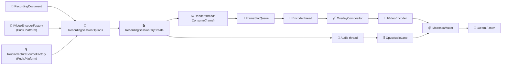

# Puck.Recording

Puck.Recording is the platform-neutral half of Puck's recording graph. A
versioned `RecordingDocument` describes one capture — its output path, clock
model, video lane, audio rows, and capture-only overlays — and
`RecordingSession` drives that document against caller-supplied video-encoder
and audio-source factories, muxing what lands into a hand-rolled deterministic
Matroska/WebM container. The document is the primitive that lives above any
one game: World, the demo, or a headless render all drive the same shape.

Everything that talks to real hardware — Media Foundation's encoder ladder,
WASAPI loopback and microphone capture — lives outside this project, behind
`Puck.Abstractions.Recording`'s `IVideoEncoderFactory` and
`IAudioCaptureSourceFactory`. The Windows backend that implements them is
`Puck.Platform`, registered through its `AddRecordingPlatform` extension; this
project never references it and knows nothing about Media Foundation or COM.

## ✨ Key features

- *One document, several drivers:* `RecordingDocument` (`puck.recording.v1`)
  is schema-versioned, extension-preserving JSON; any host that can supply the
  two platform factories can drive it.
- *A factory ladder that declines loudly:* a video or audio factory returns
  `null` with a reason instead of throwing, so a missing microphone or an
  unencodable codec becomes a status line, never a crash.
- *Deterministic container bytes:* `MatroskaMuxer` writes EBML directly — the
  same declared tracks and the same sequence of timestamped blocks always
  produce the same file, with no hidden library-version dependency.
- *Crash-safe while live:* the segment is written unknown-size with a `Void`
  reservation at its head; a crash leaves everything up to the last flushed
  cluster playable, and a clean `Stop` replaces the reservation with a
  `SeekHead` and appends `Cues`.
- *A phase-locked audio lane:* `OpusAudioLane` resamples every bound source to
  48 kHz stereo, mixes the default rows with a soft-clip guard, and encodes
  isolated rows to their own tracks, using the managed (non-native) Opus path
  so encoded bytes are reproducible for a given build.
- *Allocation-free steady state:* the frame handoff ring, Opus frame
  accumulators, and audio jitter buffers are sized once at start-up; capture
  does not allocate once warmed up.
- *A capture-only overlay layer:* `OverlayCompositor` burns text, rectangles,
  and timecodes into the recorded frame after capture, so overlays exist in
  the recording and never in the game window.

## 📐 How a session is assembled



`RecordingSession.TryCreate` resolves the document's codec ladder and audio
rows against the supplied factories, opening only what the machine can
actually encode and capture, and reports a loud reason for whatever declined.
It never half-starts silently: if neither a video encoder nor an audio lane
resolves, creation fails outright. Once armed as the host's `ICaptureSink`,
the render thread only ever copies a frame into a free slot and publishes it —
a full queue drops the newest frame and counts it, so capture never blocks
rendering. One encode thread composites overlays, encodes, and writes to the
muxer; one audio thread drains, mixes, encodes to Opus, and writes to the
muxer; both serialize through one lock around the muxer.

`RecordingSessionOptions.Document.Clock` chooses what a playback position
means: `Wall` (the shipped default) stamps frames and audio from the wall
clock at consume time, while `Sim` stamps frames from the engine tick clock
for a deterministic offline re-render and forbids audio rows. Either way the
container timeline is rebased so the first written block sits at zero — an
`OverlayKind.Timecode` row reads its own unrebased clock, so a burnt-in
timecode and the player's position differ by the constant startup latency for
the whole take.

## 🚀 Quick start

A minimal session needs a document, the platform factories, and the source
frame extent; `Puck.Platform.AddRecordingPlatform` is what supplies real
factories in a Windows host:

```csharp
using Puck.Recording.Document;
using Puck.Recording.Session;

var document = RecordingDocument.CreateDefault() with {
    Output = "recordings/session.webm",
};

if (!RecordingSession.TryCreate(
    options: new RecordingSessionOptions {
        AudioSourceFactory = audioSourceFactory,   // from Puck.Platform.AddRecordingPlatform
        Document = document,
        SourceHeight = 1080,
        SourceWidth = 1920,
        VideoEncoderFactory = videoEncoderFactory,  // from Puck.Platform.AddRecordingPlatform
    },
    session: out var session,
    reason: out var reason
)) {
    Console.Error.WriteLine($"recording did not start: {reason}");
} else {
    // Arm the host's frame-capture controller with `session` (it implements ICaptureSink).
    // ...
    RecordingStatus status = session!.Snapshot();
    session.Stop();
}
```

Loading and saving a document keeps the file diffable: `RecordingDocumentSerialization.Save`
writes the canonical form (declaration member order, LF newlines, one trailing
newline), and `TryLoad` runs the one thick `RecordingDocumentValidator` and
never half-accepts a malformed document.

## 📦 Muxing and codecs

`MatroskaMuxer` is a single-writer: declare every track, call `Start`, feed
`WriteBlock` in roughly timestamp order, then `Stop`. It performs no locking
of its own — `RecordingSession` serializes its encode and audio threads onto
it. The timestamp scale is one millisecond; a new cluster opens on a video
keyframe or after roughly two seconds, which keeps every block's
cluster-relative timestamp inside the signed 16-bit range Matroska blocks
carry. `EbmlWriter` and `MatroskaIds` are the byte-level half: every element
the muxer emits crosses one of `EbmlWriter`'s typed helpers, so the container
layout is defined in exactly one place.

The document type is chosen by what actually landed: `webm` for an AV1 +
Opus program, `matroska` for the H.264 fallback — WebM is a Matroska subset,
so one writer serves both with a data-chosen doc-type string and file
extension. `Av1TemporalDelimiterFilter` strips the leading
`OBU_TEMPORAL_DELIMITER` a Media Foundation AV1 encoder emits per frame before
the payload becomes a block, since each Matroska `SimpleBlock` already *is*
one temporal unit; H.264 payloads pass through untouched.

The audio lane always encodes Opus through `OpusStreamEncoder`, one instance
per track, in fixed 20 ms (960-sample) frames at 48 kHz stereo. `OpusHead`
builds the RFC 7845 identification header carried as `CodecPrivate`.
`LinearResampler` is a v1 per-channel linear-interpolation resampler (not
polyphase/anti-aliased) that maps an arbitrary input rate and channel count to
48 kHz stereo, and `FloatRing` is the per-source jitter buffer
`OpusAudioLane` reads a common available-sample count from before mixing, so
a lagging source simply waits rather than skewing the mix.

## 🖼️ Frame capture and overlays

`CaptureSink` is the default `ICaptureSink` for still capture: it hands each
CPU-pixel frame to any registered `ICaptureFrameObserver`s and then encodes it
to PNG through `Puck.Assets`'s `PngEncoder`, either to one fixed path or to
numbered files under a directory. `FrameHashObserver` is the standard
observer — it writes a 64-bit FNV-1a hash line per frame, the core signal for
proving that deterministic frames render bit-identically across runs or
backends.

`OverlayCompositor` alpha-blends the document's overlay rows onto the copied
CPU frame after capture, at zero cost when a document has no overlay rows.
Text overlays render through `BitmapFont`, a compact embedded 8×8 monospace
ASCII glyph set rendered at integer scale so overlay text stays crisp with no
filtering blur — a self-contained path with no cross-project font
dependency. `Rgba32` parses and carries the document's `#RRGGBBAA` /
`#RRGGBB` colors, shared by the validator (to reject malformed colors at the
boundary) and the compositor (to blend them).

## 📋 Core types

| Area | Types | Role |
|---|---|---|
| Document | `RecordingDocument`, `RecordingVideo`, `RecordingAudioRow`, `OverlayRow`, `RecordingEnums` (`RecordingClock`, `RecordingAudioKind`, `RecordingAudioTrackMode`, `OverlayKind`, `OverlayAnchor`, `OverlayClock`) | The versioned, data-defined capture description. |
| Document plumbing | `RecordingDocumentValidator`, `RecordingDocumentSerialization`, `RecordingJsonContext` | The one thick validation gate and the canonical (de)serializer. |
| Session | `RecordingSession`, `RecordingSessionOptions`, `RecordingStatus` | Drives a document against platform factories and reports honest progress. |
| Muxing | `MatroskaMuxer`, `EbmlWriter`, `MatroskaIds` | The hand-rolled deterministic Matroska/WebM writer. |
| Audio | `OpusAudioLane`, `AudioLaneSource`, `OpusStreamEncoder`, `OpusHead`, `LinearResampler`, `FloatRing`, `IAudioPacketSink` | Resampling, mixing, and Opus encoding for the audio lane. |
| Capture | `CaptureSink`, `ICaptureFrameObserver`, `FrameHashObserver`, `FrameSlotQueue`, `Av1TemporalDelimiterFilter` | The default sink, frame observation, and the render/encode handoff. |
| Overlay | `OverlayCompositor`, `BitmapFont`, `Rgba32` | Capture-only compositing of text, rectangles, and timecodes. |

## 🧪 Verification

```powershell
dotnet test tests/Puck.Recording.Tests/Puck.Recording.Tests.csproj
```

`MatroskaSeekHeadRecoveryLawTests` pins the crash-safety contract: a live file
reserves `Void` at the `SeekHead` offset and a clean `Stop` replaces it with a
real `SeekHead` at the identical offset.

## 📦 Packaging

`ByteTerrace.Puck.Recording` depends on `Puck.Abstractions` (the capture and
recording interfaces this project implements against), `Puck.Assets` (the PNG
codec `CaptureSink` writes still frames through), and `Puck.Maths`
(`Fnv1aHash` for `FrameHashObserver`), plus the third-party `Concentus`
(the managed Opus encoder) package. It carries no platform, GPU, or windowing
dependency — a consumer supplies `IVideoEncoderFactory` and
`IAudioCaptureSourceFactory` from wherever real hardware access lives, which
inside this repository is `Puck.Platform`'s `AddRecordingPlatform`.
