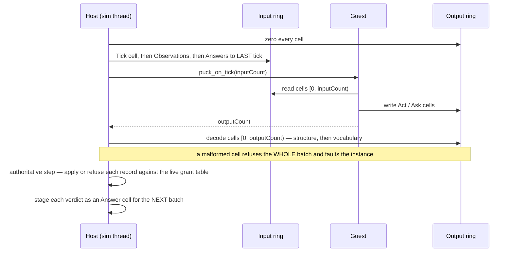

# Puck.Scripting

**Deterministic WASM addon host.** Puck.Scripting loads sandboxed WebAssembly modules and drives
each one once per sim tick, on the sim thread. An addon holds **no ambient authority**: it cannot
enumerate the world, it cannot name a subject it was not told about, and it acts only through
**handles the host mints for it**. Everything it hears and everything it says crosses as fixed-size
32-byte cells in two rings inside its own linear memory — a host→guest **input ring** and a
guest→host **output ring**. A module is fully self-contained: it declares zero imports, so it runs
and can be tested in any wasm runtime, not just this host.

Everything is built for **bit-identical replay**: the Wasmtime engine is pinned and configured with
every determinism knob explicit (fuel on, threads/SIMD off, NaN canonicalization on, Cranelift at a
fixed optimization level), no floating point ever crosses the boundary, and a runaway module halts
at a fuel-deterministic point rather than a wall-clock one.

```text
namespace Puck.Scripting
target     net10.0
deps       Puck.Assets, Puck.Maths + Wasmtime [44.0.0] (exact pin)
```

Deliberately **no** `Puck.Commands` or `Puck.Input` reference — this is the neutral core of
[capability channels](../../docs/campaign.md)' assembly split. The ABI owns its own
verdict, subject-kind, channel-kind, cell-kind, and channel-value-shape sets, and its own
capability-mask bits, all frozen independently of any consumer enum. There is no phase any more: a
channel act is per-tick and declarative, so the two low verb bits that used to carry one are now
required-zero. The World-lane vocabulary seam (`WorldAddonChannelResolver`'s world-document channel
table) lives in `Puck.World`, which is also where authority decisions live; `Puck.World.Addons`'
`AddonSimulationPump` still owns the vocabulary layer between the core's structural decode and the
World's authority checks.

The `Wasmtime` package version **is** the native engine version, and fuel accounting is
Cranelift-codegen-dependent (basic-block granularity, upstream #4109). The pin is exact on purpose:
a silent bump can shift the fuel-exhaustion tick and break stored replays. Bumping it is a
deliberate, re-gated change — never an incidental restore. This is the repo's first
native-runtime-bearing NuGet dependency; the verified path is framework-dependent
`dotnet run -c Release`, and there is no self-contained/AOT story today.

**This file is the single home of the addon ABI contract.** The guest-side workspace
([`wasm/README.md`](../../wasm/README.md)) covers authoring a module in Rust and links here for the
wire; it does not restate any of the tables below.

## ✨ Key features

- *No ambient authority:* an addon cannot enumerate the world or name a subject it was not told
  about; every action crosses through a handle the host mints for it.
- *A fixed-size two-ring cell ABI:* every host↔guest exchange is 32-byte cells in the guest's own
  linear memory — no framing, no variable-length messages, one structural decoder for every module.
- *Bit-identical replay:* every Wasmtime determinism knob is pinned explicit; no floating point
  crosses the boundary; a runaway module halts at a fuel-deterministic point, never a wall-clock one.
- *Runnable outside this host:* a module declares zero imports, so the same `.wasm` bytes compile,
  run, and can be tested in any wasm runtime.
- *Resolution failure is data, not a fault:* an unrecognized declared channel name decodes to a
  sentinel and crosses as a reported, inert entry — never a mount refusal.

## 🚀 Quick start

```csharp
using Puck.Assets;
using Puck.Scripting;

using var engine = new ScriptingEngine(options: ScriptingEngineOptions.Deterministic);
var loader = new WasmModuleLoader(engine: engine, assetSource: new FileSystemAssetSource());

using var host = new AddonHost(engine: engine, loader: loader, channelResolver: channelResolver);

host.Add(descriptor: new AddonDescriptor(
    Name: "ghost",
    ModulePath: "addons/ghost.wasm",
    ModuleHash: null,      // or a pinned content hash to refuse a silent module change
    FuelPerTick: null,     // or an override; null uses the engine's DefaultFuelPerTick
    Enabled: true
));

// Each sim tick, the consumer's pump writes the input ring (Tick, then Observations, then
// Answers), calls the addon forward, and decodes the returned output-cell count. See "One tick"
// below for the exact ordering.
```

`channelResolver` is the caller's `IAddonChannelResolver` — in this repository, `Puck.World`'s
`WorldAddonChannelResolver` constructed over the boot world document's compiled channel table.

---

## 📋 Core types

| Type | Kind | Role |
|------|------|------|
| `AddonAbi` | `static class` | The contract: cell layouts, export names, pinned budgets, the request/observation verb vocabularies, the input-verb packing. |
| `AddonAbiRustPort` | `static class` | Emits the generated Rust mirror of every closed set and layout constant below, read from the live types by reflection (the `puck wasm-stdlib` verb). |
| `ScriptingEngineOptions` | `readonly record struct` | The pinned deterministic config values (`Deterministic` preset). |
| `ScriptingEngine` | `sealed class` | Owns the one configured `Wasmtime.Engine`; asserts the pinned version. |
| `WasmModuleLoader` | `sealed class` | Path → bytes (`IAssetSource`) → `\0asm`/WAT → hash → LRU of compiled `Module`. |
| `ScriptingModuleInfo` | `sealed record` | The immutable load result: path, content hash, byte length, compiled module. |
| `AddonModuleValidator` | `static class` | Static export-shape and zero-import check against the ABI before instantiation. |
| `AddonDescriptor` | `readonly record struct` | A neutral mount request (keeps the consumer's document model out of the deps). |
| `AddonChannelKind` | `enum : byte` | The channel kind wire values: `Input`/`Request`/`Response`. Ordinals 4/5 (formerly `Geometry`/`Overlay`, a Presentation-lane pair that never shipped a host) are RETIRED PERMANENTLY. |
| `AddonChannelDescriptor` / `AddonChannelTableReader` | `readonly record struct` / `static` | One decoded 16-byte descriptor; the structural table decoder. |
| `AddonOutCellKind` / `AddonOutCell` / `AddonOutCellReader` | `enum : byte` / `readonly record struct` / `static` | The guest→host cell: `Act` or `Ask`, decoded structurally, whole-batch-or-nothing. |
| `AddonInCellKind` / `AddonInCell` / `AddonInCellWriter` | `enum : byte` / `readonly record struct` / `static` | The host→guest cell: `Tick`, `Answer`, or `Observation`, and its single serializer. |
| `AddonVerdict` / `AddonVerdicts` | `enum : byte` / `static` | The authorization outcome carried on an `Answer`, and the pinned allowed/denied predicate. |
| `AddonSubjectKind` | `enum : byte` | What an `Ask` may name. `Body` and `Section` are admitted today. |
| `AddonCapabilityMask` | `static class` | The capability bits an `Ask` requests, frozen independently of `WorldCapability` ordinals. |
| `IAddonChannelResolver` | `interface` | The injected channel-name resolution seam: `TryResolve` for (ordinal, shape). Resolution failure is never a mount fault. |
| `AddonChannelBinding` / `AddonChannelValueShape` | `readonly record struct` / `enum` | One resolved declared-channel entry (or an unresolved sentinel); the three scalar shapes (`Bipolar`/`Binary`/`Unipolar`). |
| `AddonChannelNameTableReader` | `static class` | The desync-proof, VARIABLE-stride reader for the packed length-prefixed channel-name table. |
| `AddonInstance` | `sealed class` | One `Store`+`Instance` per addon; sticky fault; single-threaded; owns the decode buffers. |
| `AddonHost` | `sealed class` | Composes engine+loader; owns the instance set keyed by name; the object consumers pump. |
| `AddonTickResult` / `AddonTickStatus` / `AddonFault` / `AddonFaultKind` / `AddonState` | records/enums | The per-tick outcome and lifecycle/fault vocabulary. |

---

## The addon ABI

A module agrees on a **byte contract**, not a function-call ABI. Every multi-byte value is
little-endian; every fixed-point value is `FixedQ4816` raw `i64` bits (`One = 0x1_0000`). No
`f32`/`f64` appears anywhere, in either direction.

`AddonAbi.AbiVersion` is `1`, permanently — a **shape-identity token, not a sequence**. There is
one addon ABI; this host speaks exactly that shape, and a guest reporting any other value faults
`AbiMismatch` loudly at mount and never ticks. A breaking change re-keys the artifacts (the module
regenerates, the hash pins move) while the token stays `1` — staleness is caught by the export
pre-flight and the content-hash pin, not by counting.

### Guest exports

Memory plus eight functions — seven required, `puck_init` optional. Region pointers and capacities
are nullary getters called once at mount and cached. **Batch lengths are call values, never
framing in guest memory**: the host tells the guest how many cells it wrote, and the guest tells the
host how many it wrote back.

| Export | Signature | Required | Meaning |
|--------|-----------|----------|---------|
| `memory` | memory | yes | The guest linear memory the host reads and writes. |
| `puck_abi_version` | `() -> i32` | yes | Returns `AddonAbi.AbiVersion`. Exact match or `AbiMismatch`. |
| `puck_out_ptr` | `() -> i32` | yes | Byte offset of the guest→host output ring. |
| `puck_out_cap` | `() -> i32` | yes | Output ring capacity in cells, `0..=MaxOutCells`. |
| `puck_in_ptr` | `() -> i32` | yes | Byte offset of the host→guest input ring. |
| `puck_in_cap` | `() -> i32` | yes | Input ring capacity in cells, `1..=MaxInCells`. Also the host's per-batch budget. |
| `puck_channels_ptr` | `() -> i32` | yes | Byte offset of the channel descriptor table. May populate the table on call — the host always calls it before reading. |
| `puck_channels_count` | `() -> i32` | yes | Declared channel count, `1..=MaxChannels`. |
| `puck_on_tick` | `(i32) -> i32` | yes | Argument: input cells the host wrote this tick. Return: output cells the guest wrote. |
| `puck_init` | `() -> ()` | optional | Called once at the end of mount, before the first tick. |

`AddonModuleValidator` checks each signature statically, before instantiation, and refuses any
module declaring an import of any shape. That refusal is what keeps a module runnable in any wasm
runtime rather than only inside this host.

### Mount, in contract terms

Mount is ordered, and a failure at any step refuses the **whole** mount — the guest does not tick,
and it does not half-exist. What a guest may rely on, stated as the guarantees rather than the
implementation:

| Step | Guarantee a guest can rely on |
|---|---|
| 1 | The manifest row is read. |
| 2 | Module bytes are loaded and the declared content hash verified. Hash verification precedes descriptor decode, so the pin covers everything the mount consumes — including the descriptor table, which is read out of guest memory. |
| 3 | The module is validated: zero imports, every required export present with its exact signature. |
| 4 | The module is instantiated. `puck_init` is **not** called yet. |
| 5 | `puck_channels_ptr`/`puck_channels_count` are called and the **descriptor table is decoded** — before `puck_init`, so a guest may populate the table inside the getter. A kind byte outside `{1, 2, 3}` refuses the mount as an undefined channel kind. |
| 6 | The capability mask is **attenuated**: effective = requested ∧ granted. |
| 7 | **Quota is reserved in full** — both rings and the descriptor/verb tables — never allocated on demand. A mount that cannot reserve fails deterministically. |
| 8 | The disclosure report is emitted host-side: granted, withheld, and held-but-unrequested. |
| 9 | `puck_init` is called. Mask attenuated, quota reserved — both already true. |
| 10 | The addon is admitted to the tick set. |

**`puck_init` never emits.** The host zeroes the output ring before *every* tick, the first one
included, so cells written during `puck_init` are erased before anything could read them. Guest
output crosses only as a `puck_on_tick` return value. Emitting from init is a silent no-op by
design; init is for setting up guest state.

### One tick



Nothing is circular. Each tick the output batch is cells `[0, returned count)` and the input batch
is cells `[0, passed count)`; **cell order within a batch is a fact**, not an implementation detail.

---

## Cell layouts

### Output cell — guest → host, 32 bytes

| Offset | Width | Field |
|---|---|---|
| 0 | `u8` | `Kind` — `1 = Act`, `2 = Ask`; `0` invalid |
| 1 | `u8` | `Channel` — descriptor index into the guest's declared table |
| 2 | `u16` | `HandleIndex` |
| 4 | `u16` | `HandleGeneration` |
| 6 | `u16` | `Verb` |
| 8 | `i64` | `A` |
| 16 | `i64` | `B` |
| 24 | `i64` | `C` |

No reserved padding — every byte is load-bearing. A guest never names a capability on an `Act`: the
capability an act requires is derived host-side from its `(channel, verb)`. On an `Ask`, the handle
fields are unused and must be zero.

### Input cell — host → guest, 32 bytes

| Offset | Width | Field |
|---|---|---|
| 0 | `u8` | `Kind` — `1 = Tick`, `2 = Answer`, `3 = Observation`; `0` invalid |
| 1 | `u8` | `Channel` |
| 2 | `u16` | `Ordinal` — on an `Answer`, which output cell of the guest's previous batch it answers |
| 4 | `u16` | `HandleIndex` |
| 6 | `u16` | `HandleGeneration` |
| 8 | `u8` | `Verdict` — an `AddonVerdict` wire value; zero on kinds carrying none |
| 9 | `u8` | `Verb` |
| 10 | `u16` | reserved, must be zero |
| 12 | `u32` | reserved, must be zero |
| 16 | `i64` | `A` |
| 24 | `i64` | `B` |

### Channel descriptor — 16 bytes, decoded once at mount

| Offset | Width | Field | Rule |
|---|---|---|---|
| 0 | `u8` | `Kind` | An `AddonChannelKind` wire value. `0` invalid. Duplicate kinds refuse the mount. |
| 1 | `u8` | reserved | Must be zero. |
| 2 | `u16` | `VerbCount` | Per-kind rules below. |
| 4 | `u32` | `VerbTablePtr` | Byte offset of the channel's verb table; `0` when the kind carries none. |
| 8 | `u64` | reserved | Must be zero. |

---

## Channels

| Kind | Value | Served today |
|---|---|---|
| `Input` | 1 | yes |
| `Request` | 2 | yes |
| `Response` | 3 | yes |

Ordinals 4 and 5 (formerly `Geometry`/`Overlay`, a Presentation-lane pair pinned but never served by
any host) are RETIRED PERMANENTLY as of the lane-axis deletion (owner ruling, 2026-08-02) — never
reused. A descriptor naming either byte refuses the mount as an undefined channel kind, through the
ordinary decode check every unrecognized kind already goes through.

A guest declares any subset of these kinds, at least one descriptor, with two structural
pairing rules:

- **`Request` without `Response`, or `Response` without `Request`, refuses the mount** — the pair is
  one facility.
- **Declaring an `Input` channel requires declaring the `Request`+`Response` pair.** Disclosures
  ride the response channel, so an `Input`-only addon could never learn a handle to drive through:
  it would be provably inert. The mount refuses it, naming the rule.

### Per-kind rules

| Kind | `VerbTablePtr` | `VerbCount` | Notes |
|---|---|---|---|
| `Input` | the guest's declared **channel-name table** | rows in that table, `≤ MaxChannelNames` (64) | Each row is a `u8` length (`1..=MaxChannelNameBytes`) followed by that many UTF-8 bytes, packed with NO padding — entries are variable-length, unlike every other fixed-stride region in this ABI. |
| `Request` | must be `0` | `1` today | The vocabulary is a closed numeric set owned by the ABI; decode-valid `Act` verbs are `[0, VerbCount)`. |
| `Response` | must be `0` | must be `0` | Host-written only; the guest never emits on it. |

The `Input` channel's verb table is decoded by `AddonChannelNameTableReader` against the injected
`IAddonChannelResolver`. It rejects an entry, in order, for: a length outside
`[1, MaxChannelNameBytes]`; a table truncated before the declared length; invalid UTF-8; or a name
duplicating an earlier entry. **Resolution failure — a well-formed name the host's table does not
recognize — is deliberately NOT one of those rejections.** It is report-and-inert: the entry still
decodes, carrying a sentinel (see `AddonChannelBinding`), the host names it once at mount, and any
act naming it later answers `AddonVerdict.AttenuatedToEmpty` rather than faulting the instance. This
is the opposite posture from the source-id vocabulary this table replaced, which refused the whole
mount on an unrecognized declaration.

---

## The two-ring batch protocol

### Order pins

The host writes each batch in exactly this order:

1. **Exactly one `Tick` cell, always first.** `A` carries the engine tick as a `u64` bit pattern;
   every other field except `Kind` is reserved-must-be-zero.
2. **`Observation` cells** — host-pushed disclosures, in handle-table projection order.
3. **`Answer` cells** — ascending by `(Ordinal, part)`.

A multi-part answer arrives **whole, inside one batch, its parts contiguous and ascending**, so a
guest's part-assembly state is per-batch by construction. Carrying a half-assembled answer across
ticks is a bug, not resilience.

### Budget, and starvation

The host writes at most `puck_in_cap` cells per batch. When the next answer's part count would
overflow that budget, **that answer group and every later one drop with no cell at all**, reported
host-side once per addon. The ring quota counts **cells**, not requests.

**Starvation is not denial.** A request whose ordinal never comes back in the next batch was starved
by the budget: it is retryable, and retrying is the correct response. A refusal is a cell that says
so. A guest that treats silence as a denial will stop asking for something it was never refused.

### Malformation faults; authority denials answer

These two postures are deliberately opposite, and confusing them is the mistake worth naming:

| Situation | Posture |
|---|---|
| A malformed cell — structural (bad `Kind`, out-of-range `Channel`, nonzero reserved field) **or** vocabulary (undeclared channel ordinal, out-of-domain payload, an `Ask` with a nonzero handle) | The **whole batch is refused** and the instance enters the sticky fault state. Reported host-side once per episode. No answers are produced for a malformed batch. |
| An authority denial — no grant, a stale handle, an attenuated-to-empty mask, a beaten reservation, an exhausted quota | **One `Answer` cell** carrying the verdict, zero payload, `Verb = 0`. Refusal is data the guest reads, never a fault. |

A guest's emissions must be exactly right. Refusal, by contrast, is a normal outcome — the whole
point of a verdict set richer than a boolean is that a guest can tell *why* it was refused and react
differently to "you never had this" than to "this was withdrawn".

**An allowed `Act` produces nothing.** Silence is the positive signal.

**Delivery is uniform.** Refusal answers for input-channel acts are generated at the application
point, after the drain, and arrive in the **next** tick's batch — exactly like query answers. There
is no same-tick refusal to wait for: emit, remember the ordinal, read the verdict next tick.

Handle pairs are validated at **application** against the live table, never at decode. A revoked
handle therefore fails on its very next use with `StaleHandle` rather than quietly addressing
whoever now occupies the slot.

---

## Wire value sets

Each set is pinned independently of any consumer enum, and each is mirrored into the guest-side Rust
by `AddonAbiRustPort` so the two languages cannot drift.

### Cell kinds

| Set | Values |
|---|---|
| `AddonOutCellKind` | `Act = 1`, `Ask = 2` |
| `AddonInCellKind` | `Tick = 1`, `Answer = 2`, `Observation = 3` |

**Discriminants are 1-based with `0` invalid; ordinals are 0-based.** A discriminant is an
enumerated wire-value set where a zeroed cell must read as malformed — cell `Kind`, `ChannelKind`,
`SubjectKind`. An ordinal is a dense index — verbs, answer parts, channel indices, batch ordinals.
The malformed-zero guard lives at `Kind` and only at `Kind`, because verb `0` is already legal on
the input channel: `(ordinal 0 << 2) | Started` is zero.

### `AddonVerdict : byte`

| Value | Name | Meaning |
|---|---|---|
| 0 | `None` | The kind carries no verdict (`Tick`, `Observation`). |
| 1 | `HeldConcrete` | Allowed — a grant row names the subject itself. |
| 2 | `HeldWildcard` | Allowed — the wildcard row covers it. |
| 3 | `HeldAsReserver` | Allowed — the caller is the exclusive reserver. |
| 4 | `NoHold` | Denied — no row, no wildcard. |
| 5 | `BeatenByReserver` | Denied — another principal exclusively reserves it. |
| 6 | `AttenuatedToEmpty` | Denied — requested ∧ granted is empty. |
| 7 | `NoSuchSubject` | Denied — the named subject does not exist. |
| 8 | `QuotaExhausted` | Denied — a host-enforced budget refused this record. The dimension is deliberately unspecified: one value, one guest reaction — back off. |
| 9 | `StaleHandle` | Denied — the handle's generation no longer matches. Distinct from `NoHold` on purpose: withdrawn and never-granted are different states. |

The allowed predicate is pinned: **`1..=3` allowed, everything else not** (`AddonVerdicts.IsAllowed`,
generated beside the values in both languages). The set grows as data — a new denial reason is not a
break — so a guest that meets an unrecognized verdict byte must skip the cell, never read it
optimistically as allowed.

### `AddonSubjectKind : byte` — an `Ask`'s `Verb`

The decode-valid set is `{1, 3}`: `Body = 1` (pairs with the `Drive`/`Observe` mask bits) and
`Section = 3` (pairs with `Mutate` alone — the addon mutation seam's own handle shape). `Screen = 2`
and `Profile = 4` are number-pinned reservations, not admitted, so growth is a range change rather
than a break. **No wildcard ordinal exists** — the wire has no spelling for asking for one.

### `AddonCapabilityMask` — an `Ask`'s `B` lane, `u64`

| Bit | Name | Guest-maskable today |
|---|---|---|
| `1` | `Drive` | yes |
| `2` | `Observe` | yes |
| `4` | `Reserved` | no — PERMANENTLY reserved hole; formerly `Present`, deleted with the rest of the lane axis (owner ruling, 2026-08-02); never compacted, never reused |
| `8` | `Control` | no |
| `16` | `Mutate` | no |
| `32` | `Edit` | no |
| `0x3F` | `All` | host-side attenuation arithmetic only — never valid **on** an `Ask` |

Frozen independently of `WorldCapability` ordinals. **An `Ask`'s mask must have exactly one bit
set** — one capability, one handle, one answer. The `u64` width stays so multi-capability asks can
be admitted later under multi-part framing without a break; it is not permission to set two bits
today.

---

## Verb vocabularies

### `Input` channel — `Act` cells

An input-channel act's verb packs the declared channel ordinal with two REQUIRED-ZERO low bits —
there is no phase any more:

```text
Verb = (declaredOrdinal << AddonAbi.InputVerbReservedBits)
```

A nonzero low bit is a protocol fault, not a discriminant to decode: contribution semantics are
per-tick declarative, so there is nothing left for those bits to carry. Decode checks the declared
ordinal against the guest's own declared table count.

`HandleIndex`/`HandleGeneration` carry the **Drive handle** the act drives through. There is no
ambient slot routing: the handle *is* the lane.

Payload domain, enforced by the sealed writer against the HOST table's shape (never anything the
guest declared) — `B` and `C` are always required-zero on every channel act:

| Shape | `A` | `B` | `C` |
|---|---|---|---|
| `Bipolar` | `\|A\| ≤ One` | `0` | `0` |
| `Binary` | exactly `0` or `One` — a **fixed-point literal**, never the old `{0, 1}` boolean convention | `0` | `0` |
| `Unipolar` | `0 ≤ A ≤ One` | `0` | `0` |

**Unresolvable declared names are report-and-inert, never a mount fault.** A guest may declare any
name; the host resolves it once at handshake against the boot world document's compiled channel
table (`WorldAddonChannelResolver`, constructed over `WorldChannelTable`) and caches the outcome. A
name the host table lacks decodes to a sentinel: the mount still succeeds, one host console line at
mount names every such declaration, and an act naming that ordinal answers
`AddonVerdict.AttenuatedToEmpty` — the same verdict an unrequested subject gets — rather than
faulting the instance.

A resolved name lands on one of two ordinal spans: a fixed `ChannelRole` slot (`0..5` — the motion
model reads these directly) when the world document's row claims a role, or the next free
composition ordinal (`6` up, in declaration order) when it does not — a kit's own `Actions` binding
decides what a composition channel does. The shipped default world (`Assets/worlds/play.world.json`)
declares:

| Channel | Shape | Intent effect, host-side (play world) |
|---|---|---|
| `forward` | `Bipolar` | `PlayerIntent.MoveAdvance = A` (role `MoveAdvance`) |
| `strafe` | `Bipolar` | `PlayerIntent.MoveStrafe = A` (role `MoveStrafe`) |
| `turn` | `Bipolar` | `PlayerIntent.Turn = A` (role `Turn`) — no host-side sign flip; the channel's documented convention IS the wire convention |
| `up` | `Bipolar` | `PlayerIntent.MoveUp = A` (role `MoveUp`, free model only) |
| `pitch` | `Bipolar` | `PlayerIntent.Pitch = A` (role `Pitch`, free model only) |
| `roll` | `Bipolar` | `PlayerIntent.Roll = A` (role `Roll`, free model only) |
| `jump` | `Binary` | composition ordinal `6`; play's grounded kit binds it to the vertical impulse, pressed iff `A == One` THIS tick |
| `dash` | `Binary` | composition ordinal `7`; per-kit binding (declared, unbound by play's own kit), pressed iff `A == One` THIS tick |
| `run` | `Binary` | composition ordinal `8`; the `promenader` kit's `sprintChannel` — scales commanded planar speed by `sprintMultiplier` (`1.3`) while held (a HELD, not edge-triggered, read) |

A different world document declares a different table — same resolver class, a different
`WorldChannelTable` constructor argument.

**Every channel is per-tick and declarative, uniformly — analog and digital alike.** The host holds
NO lane state between ticks on any channel: an addon that stops emitting an act on a channel simply
stops contributing on it, the same tick, exactly like a seat's own analog-clear behavior. There is
no sticky press/release pair any more — a "held" digital control is re-emitted every tick it should
read held.

**Two acts naming the same DECLARED ordinal in one batch is a protocol fault, not a "later wins"
overwrite.** Under the old phase-based model a later act silently overwrote an earlier one on the
same axis; under the per-tick declarative model that would be ambiguous (which one "declares" the
channel this tick?), so `AddonSimulationPump` refuses the whole batch — the same posture as any
other malformed record — the moment a declared ordinal repeats.

### `Request` channel — query `Act`s through a handle

| Verb | Name | Args | Answer |
|---|---|---|---|
| 0 | `BodyPose` | none (`A = B = C = 0`) | **4 parts**: `(posX, posY)`, `(posZ, 0)`, `(quatX, quatY)`, `(quatZ, quatW)` — all `FixedQ4816` raw bits |
| 1 | `SubmitMutation` | through a **Mutate** handle over a document SECTION (never Observe/Body): `A` = the declared `WorldMutation` kind ordinal (`0..63`, `MutationKindAttribute.Ordinal`), `B` = an UNSIGNED guest-memory pointer, `C` = an UNSIGNED byte length (both cross the ABI as signed `i64` lanes reinterpreted) | **1 cell**: `AddonVerdict.Applied` or a refusal (`AttenuatedToEmpty`/`QuotaExhausted`/`StaleHandle`/`NoHold`/`BeatenByReserver`/`MalformedPayload`/`PayloadTooLarge`/`Rejected`) |
| 2 | `Designate` | through a **Drive** handle over the source BODY: `A` = target body index, `B` = authored target-register index, `C = 0`; the target must also be requested and held through **Observe** | **1 cell**: `AddonVerdict.Applied` or a refusal |

Orientation is the body's canonical `FixedQuaternion`, never a yaw scalar; any derived heading
projection is the guest's own work. Every `BodyPose` part cell carries the response channel in
`Channel`, the **same** allowed verdict repeated on all four parts, and `HandleIndex =
HandleGeneration = 0` — a pose grants no handle. Multi-cell *requests* do not exist beyond
`BodyPose`'s own four; verbs grow later as data behind the declared range — prefix growth only, so
a module declaring fewer verbs (built against an older ABI) mounts unchanged.

`SubmitMutation` is decoded and dispatch-gated at DECODE time (the same `TickAddons` call the pump
just validated the batch in — never at the drain point `BodyPose`/`Ask` use), through the
six-stage addon mutation dispatch door (`Addons.WorldAddonRuntime.ResolveMutations`): manifest,
grant ∧ the deciding row's verb mask (`Puck.World.Protocol.WorldGrant.KindMask`), the per-`(addon,
section)` dispatch budget (spent BEFORE decode — a malformed payload still costs it), the reserved
answer cell (bookkeeping only — the handshake's `outCap <= inCap-1` relation proves it cannot
fail), pointer safety (an immediate host-side copy, bounded by `AddonAbi.MaxMutationPayloadBytes`/
`MaxMutationBytesPerTickPerAddon`/`MaxMutationBytesPerTickAllAddons`), then a per-kind hand-walked
`JsonDocument` decode (never source-gen POCO). A cleared act enqueues the mutation; it applies the
SAME Step, before intents, through the identical path a console-submitted mutation runs. The
verdict is staged into the guest's NEXT batch regardless of when it was decided.

### `Ask` — rides the `Request` channel

`Verb` = the subject kind (`Body` pairs with the `Drive`/`Observe` mask bits; `Section` — the
addon mutation seam's own shape — pairs with `Mutate` ALONE), `B` = the capability mask, handle
fields zero. `A`/`C` are shaped PER SUBJECT KIND, never uniformly:

| Subject | `A` | `C` |
|---|---|---|
| `Body` | the body's 0-based entity index | `0` (required) |
| `Section` | an UNSIGNED guest-memory pointer to the section's declared NAME's UTF-8 bytes (reinterpreted from the signed `i64` lane, the same convention `SubmitMutation`'s `B` lane uses for a payload) | the name's UNSIGNED UTF-8 byte length (reinterpreted; bounded by `AddonAbi.MaxSectionNameBytes`) |

**`Section` is NAME-KEYED, never ordinal-keyed.** A guest names its section by TEXT (a
`Puck.World.Protocol.WorldSection` member, matched case-insensitively — `Outputs::ask_section` in
`puck-stdlib`, never a sibling ordinal-taking method), and the host resolves the name against the
live `WorldSection` vocabulary at `Addons.WorldAddonRuntime.ResolveAsks` — the pointer/length copy
mirrors `SubmitMutation`'s own pointer-safety stage (a length ceiling before any byte is read, then
an immediate `AddonInstance.TryCopyMemory` copy). This closes a drift class a prior generation of
addons hit: a guest that baked `WorldSection`'s declaration-order ORDINAL as a literal constant kept
compiling and mounting after a host-side renumbering moved that ordinal onto a DIFFERENT, still
-defined member — the guest silently asked over the wrong section with no fault, no refusal. Naming
the section by text leaves no ordinal for a future renumbering to strand, and an unresolvable name
refuses `AddonVerdict.NoSuchSubject` BY NAME (quoted in the host's console line) rather than minting
authority over an unintended member. Unlike `Body`'s liveness check below, an unresolvable `Section`
name refuses BEFORE the manifest gate — the `WorldSection` vocabulary is a fixed, public set, so
there is no body-enumeration-style oracle to protect by deferring the refusal. `Body` keeps the
plain-ordinal shape: a population index is a live table position, not a renumberable enum.

The answer is **one** cell: the verdict, and — when allowed — the minted handle in
`HandleIndex`/`HandleGeneration`, with `Verb = 0` and `A = B = 0`. The host mints by requested
subject; the guest never names a table position. A document section has no liveness state to check
(unlike a body) — only the manifest/grant gates apply.

Asks and `BodyPose` queries drain at the pinned drain point, after the authoritative step of the
tick they were written in, so a verdict reflects the grant table as of that point.
`SubmitMutation` is the one exception — see above.

### `Observation` — disclosure push

| Verb | Name | Fields |
|---|---|---|
| 0 | `GrantedBody` | `HandleIndex`/`HandleGeneration` = a minted handle; `A` = the capability mask (exactly one bit); `B` = the body index |

The host writes one `GrantedBody` cell per `(capability, body)` the addon's principal holds, in
projection order, in the first batch after mount and in the first batch after any grant change that
moved the addon's projection. It is always a **full re-push**; the newest set is authoritative.

**A batch containing any `GrantedBody` cell carries the COMPLETE authoritative set.** Replace every
previously held handle with exactly this set; a handle absent from it is gone. Sets never split
across batches, so no epoch marker exists. Folding a push into what was already held — rather than
replacing — is how a guest ends up acting through authority the host withdrew.

This is also the guest-side bootstrap. Enumeration is itself a capability, so a guest cannot know a
body index to `Ask` for; the disclosure is the host handing the guest what it was given. `Ask`
remains for re-requests by name.

---

## Budgets and ceilings

| Constant | Value | Note |
|---|---|---|
| `MaxOutCells` | 63 | A guest's declared `puck_out_cap` may not exceed this — one less than `MaxInCells`, see the handshake relation below. |
| `MaxInCells` | 64 | Bounds `Tick` + disclosures + answers per batch. |
| `MaxChannels` | 8 | Three kinds exist; headroom without sprawl. |
| `MaxChannelNames` | 64 | The `Input` channel's `VerbCount` ceiling, and the width of the host's per-channel masks — must never exceed 64. |
| `MaxChannelNameBytes` | 64 | The maximum UTF-8 byte length of one declared channel name. |
| `OutCellBytes` / `InCellBytes` | 32 / 32 | |
| `ChannelDescriptorBytes` | 16 | |
| `DefaultFuelPerTick` | 1 000 000 | |
| `MaxStackBytes` | 512 KiB | |
| `One` | `0x1_0000` | The `FixedQ4816` raw value of `1.0`. |

**New handshake relation:** `puck_in_cap - 1 >= puck_out_cap`, or the mount refuses `BadExport`,
naming the relation. Every refusable act needs a same-tick verdict slot in the guest's OWN declared
input capacity, and the old 64/64 ring geometry gave only 63 answer slots against up to 64 acts —
`MaxOutCells` moved to 63 so the ceiling itself proves the relation is satisfiable.

Simulation quota is the fixed-and-variable regions — both rings, the descriptor table, the
channel-name table — reserved (or, for the variable-length name table, bounds-checked as decoded) in
full at mount. A mount that cannot reserve fails deterministically rather than growing an arena
mid-tick.

---

## Ownership seams

Three layers validate three different things, and keeping them separate is what lets the core stay
consumer-agnostic:

| Layer | Validates | Where |
|---|---|---|
| Core | **Structure** — cell kinds, channel bounds, reserved-must-be-zero, descriptor shape, table pairing, channel-name table shape | `Puck.Scripting` (`AddonOutCellReader`, `AddonChannelTableReader`, `AddonChannelNameTableReader`) |
| Adapter | **Vocabulary** — verb ranges, payload domains, `Ask` rules — through one sealed writer | `Puck.World.Addons` (`AddonSimulationPump`) |
| World | **Authority and the channel table** — grants, wildcards, reservations, attenuation, quota, and what a channel name resolves to | `Puck.World` |

The wire enums live in the core. The `GrantVerdict`/`GrantSubjectKind`/`WorldCapability` mappings,
and the channel-name table itself (`WorldAddonChannelResolver`, the ONE `IAddonChannelResolver`
implementation), can only live where those types are visible, which is `Puck.World` — the adapter
cannot name them. Unlike the source vocabulary this replaced, resolution failure here is never a
refusal the adapter or core has to enforce — it is host-reported data, decided entirely by which
table `WorldAddonChannelResolver` is constructed over.

---

## Loading, ticking, faulting

`WasmModuleLoader.Load` mirrors `ShaderModuleLoader`: read bytes through the `IAssetSource`, treat a
leading `\0asm` as binary wasm else compile the WAT text via `Module.FromText`, compute the
`AssetContentHash`, and cache the compiled `Module` in a content-addressed LRU so two documents
naming the same bytes compile once.

`AddonInstance` never allocates per tick and never desyncs. It zeroes the output ring, writes the
input batch, sets the per-tick fuel budget, calls `puck_on_tick` once with the batch length, derives
`FuelConsumed` as `budget − remaining`, and decodes exactly the returned count of cells into a
**reusable buffer** the consumer reads back synchronously, before the next tick. `AddonTickResult`
deliberately carries no span.

### Fuel and fault contract

- **Fuel, not epochs.** The halt point is a pure function of the instruction stream. Each tick runs
  under `FuelPerTick` (default `1_000_000`); exhaustion traps `OutOfFuel` at a codegen-deterministic
  point.
- **Faults are sticky, terminal, deterministic state.** A trap or a protocol violation drives the
  addon into `Faulted` and it is **skipped every subsequent tick** — no mid-tick retry — until an
  explicit `Enable()` **disposes and re-instantiates a fresh `Store`** from the cached module, a
  clean reset to the module's defined initial state.
- **One `Store`/`Instance` per addon, single sim-tick thread only** (Wasmtime store thread affinity,
  issue #331). `GC.KeepAlive(store)` follows every guest invoke (wasmtime-dotnet finalizer-hazard
  discipline).
- **Memory cap:** each store gets a hard `SetLimits(memorySize: …)` ceiling (256 pages) plus a
  load-time region-bounds pre-flight; `memory.grow` is fuel-charged.

| `AddonFaultKind` | Raised by |
|---|---|
| `AbiMismatch` | `puck_abi_version` returned anything but `AddonAbi.AbiVersion` — a stale committed artifact. |
| `BadExport` | A missing or wrong-shaped export, a declared import, an out-of-range region, or a refused descriptor/source table. |
| `DecodeError` | A malformed output batch — structural or vocabulary. |
| `HashMismatch` | Module content does not match the descriptor's declared `moduleHash` pin. |
| `OutOfFuel` | The tick exhausted its fuel budget and trapped deterministically. |
| `StackOverflow` / `MemoryOutOfBounds` / `Unreachable` / `Trap` | Guest traps, classified in that order of specificity. |

Every fault is loud and attributed. Detail lines are formatted for the console and keyed by the
addon's **name**, so an operator reading a run log sees which addon failed, why, and what to do:

```text
addon ghost: OutOfFuel at tick 3140 — disabled; 'addon enable ghost' to retry
```

`AddonHost.Describe()` narrates each addon with a `ContentPetname`
(`Willow-Lantern-Nine  sha256-64/…  fuel 1000000  ENABLED`).

**Hot reload** (`AddonHost.Reload(name)`) re-reads the declared module path, recompiles (a changed
content hash misses the module cache; an unchanged one reuses it), and swaps in a fresh store — the
in-session edit loop the `addon reload <name>` console verb drives. The status line names the change
by petname (`Moss-Pouch-Two became Cinder-Locket-Five`) because the petname **is** the content hash;
an unchanged module reports `unchanged (fresh store)`. A declared `moduleHash` pin **refuses** a
content change on `Reload`, leaving the running instance untouched (remove the pin to hot-reload),
and a broken edit swaps in a sticky faulted instance naming the reason. The reloaded addon runs
regardless of its prior enabled/disabled state. The same pin is enforced on the initial mount too:
there is no running instance to leave untouched at boot, so a mismatch there loads the addon
straight into a sticky `HashMismatch` fault instead of refusing in place.

---

## Constraints and invariants

- **No floats cross the boundary, ever.** The host pre-quantizes analog values through the exact
  `FixedQ4816.FromDouble` path the sim already uses and ships raw `i64` bits; the guest returns raw
  `i64` bits. Do not hand an `f32` across and re-derive fixed-point guest-side — that reintroduces
  the one non-determinism this ABI exists to remove.
- **Puck.Scripting stays consumer-agnostic.** It stops at a structurally decoded cell. The adapter
  owns vocabulary and `Puck.World` owns authority; this project never references `Puck.World` and
  never maps a channel name to gameplay itself.
- **The channel table is host-owned, and it enters through a seam.** The core validates and resolves
  declared names through the injected `IAddonChannelResolver`, but — unlike the retired source-id
  vocabulary — a resolution MISS is never something the core (or the adapter) refuses; it decodes to
  a sentinel and crosses as data. `Puck.World`'s one implementation, `WorldAddonChannelResolver`, is
  constructed over the boot world document's compiled `WorldChannelTable`; a different world's
  channels section produces a different table through the SAME class, never a second
  `IAddonChannelResolver`.
- **A module imports nothing, ever.** A capability a guest needs arrives through a channel — a
  disclosure, an answer, a declared channel act — never through a host import. A declared import of
  any shape is a load-time refusal, not a negotiation.
- **The readers cannot desync.** Batch lengths are call values, and every region but the channel-name
  table is fixed-stride, so a decode is an indexed loop that cannot slip; the channel-name table is
  the one variable-stride exception (`AddonChannelNameTableReader`), which reports its own consumed
  byte length back rather than assuming `count * stride`. Every reserved-must-be-zero and shape guard
  is checked in order, and any failure is a deterministic refusal naming the cell index (or entry
  index, for the name table) — a stale guest can smuggle no meaning into a reserved field.
- **Never float the Wasmtime version.** Fuel timing is codegen-locked to `[44.0.0]`. The battery
  stage that used to assert the loaded assembly's major version left the build with `Puck.Post`;
  the pin is now held by review, not by a gate.
- **Single-threaded, one store per addon.** Do not share a `Store` across threads or reuse one
  across addons; hot-swap a script by `Enable()` (dispose + re-instantiate), not by mutation.

## 🧪 Verification

There is no dedicated `Puck.Scripting.Tests` project: the ABI is exercised through its consumers,
`tests/Puck.World.Tests` in particular (addon attach/replay/admission law tests). The guest-side
Rust workspace ([`wasm/README.md`](../../wasm/README.md)) carries its own build and test story for
authored modules.

```powershell
dotnet test tests/Puck.World.Tests/Puck.World.Tests.csproj
```

## 📦 Packaging

`ByteTerrace.Puck.Scripting` depends on `Puck.Assets` (module bytes through `IAssetSource`),
`Puck.Maths` (`FixedQ4816` for every quantized payload lane), and the third-party `Wasmtime`
`[44.0.0]` exact pin (a real, flowing runtime dependency — not a build-only generator). It carries
no `Puck.Commands`, `Puck.Input`, or `Puck.World` dependency; `Puck.World.Addons` and `Puck.World`
depend on it for the addon host and reference the wire vocabulary this file defines.
