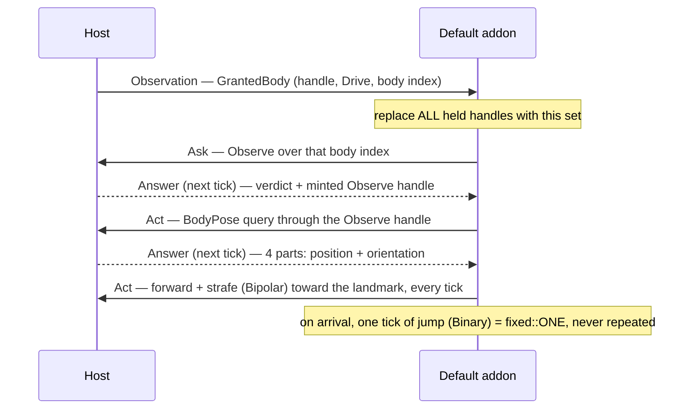

# wasm

Puck's WASM standard library and the default addon built on it — a two-crate Cargo workspace, and
the place to start if you are **writing a guest module**.

An addon is a sandboxed guest the engine drives once per sim tick. It holds no ambient authority: it
cannot enumerate the world, and it acts only through handles the host mints for it. Everything it
hears and everything it says crosses as fixed-size cells in two rings inside its own linear memory.

> **The ABI contract lives in [`../src/Puck.Scripting/README.md`](../src/Puck.Scripting/README.md)**,
> beside the C# constants that define it — cell layouts, the export set, the batch protocol, the
> channel kinds, the wire value sets, the verb vocabularies, the mount sequence. This file used to
> hand-mirror those tables with nothing enforcing agreement. It no longer does: read the contract in
> one place, and read this file for how to build a guest against it.

```text
wasm/
  Cargo.toml                  [workspace] over both members; the shared release profile
  .cargo/config.toml          pins the default build target to wasm32-unknown-unknown
  build.cs                    build + refresh the copy Puck.World ships + print its content hash
  puck-stdlib/                crate-type rlib — THE standard library every addon depends on
    src/{lib,abi,abi_generated,fixed,fixed_generated,fixed_vectors,fixed_tests,channels}.rs
  puck-addon-default/         crate-type cdylib — the default addon; ships with the engine
    src/lib.rs
```

## Why two crates

A `cdylib` is a leaf artifact — nothing can `path = "..."` depend on one, because `cdylib` output
has no exported Rust interface for another crate to link against. A single `cdylib`-only crate is
therefore a dead end for a standard library: every new addon would have to copy-paste its plumbing
rather than depend on it. Splitting the plumbing into its own `rlib` fixes that; any addon crate,
including one outside this workspace, can add `puck-stdlib = { path = "..." }` and get the ABI
machinery, the typed cell views, and the fixed-point surface for free.

| Crate | Crate type | Carries |
|---|---|---|
| `puck-stdlib` | `rlib` | The static ring and channel-descriptor regions (`abi.rs`), the raw pointer/capacity accessors, the channel-table layout, and `dispatch_tick`; the typed `Inputs` reader and `Outputs` writer (`lib.rs`); the channel-name declaration API (`channels.rs` — the `channels!` macro, `ChannelHandle`, and the `Bipolar`/`Binary`/`Unipolar` kind markers); the fixed-point surface (`fixed.rs` plus the generated `fixed_generated.rs`/`fixed_vectors.rs`); and the generated mirror of the host's closed wire sets and layout constants (`abi_generated.rs`). |
| `puck-addon-default` | `cdylib` | Only the `#[no_mangle]` ABI export shims (each a one-line delegate into `puck_stdlib::abi` or its own `channels!` table) and the addon's tick behaviour. |

An addon author depends on `puck-stdlib` and writes only three things: their own crate's export
shims, a `puck_stdlib::channels!` table declaring the channel names they emit acts against, and the
body of their `on_tick` (plus, optionally, `on_init`) — written against the typed `Inputs`/`Outputs`
views, never a raw byte offset. `puck-addon-default` is that worked example: read
`wasm/puck-addon-default/src/lib.rs` top to bottom before writing your own.

### The `#[no_mangle]`/rlib linkage detail

The frozen `puck_*` exports do **not** live in `puck-stdlib`, even though the buffers and logic
behind them do. A linker is free to drop a symbol from a statically-linked `rlib` if nothing in the
final crate graph references it — there is no compile error, just a missing export the host's
load-time pre-flight then rejects. So `puck-stdlib::abi` exposes plain functions instead
(`abi::out_ptr()`, `abi::out_cap()`, `abi::in_ptr()`, `abi::in_cap()`, `abi::channels_ptr(…)`,
`abi::channels_count()`, `abi::ABI_VERSION`, and `abi::dispatch_tick(on_tick)`, the entry helper
that builds the typed views, calls your tick function, and returns the output-cell count), and
`puck-addon-default/src/lib.rs` declares the actual `#[no_mangle] pub extern "C" fn puck_*` shims,
each one line, delegating straight into `abi`.

`abi::channels_ptr` takes your channel-name table's offset and row count as arguments, because the
declared table lives in the *consuming* crate's `channels!` expansion — a static the library cannot
name. That table is the `Input` channel's verb table; there are no `puck_channels_*` exports beyond
the ABI's own, and the channel descriptor table is the one door to it.

Don't assume an `rlib`'s exports "come along for the ride" into a consuming `cdylib` — verify the
*built* artifact's export section instead (see "Verify the ABI surface" below).

## Generated, never hand-edited

Three files under `puck-stdlib/src` are machine-written from the live C# types and must never be
hand-edited:

| File | Mirrors |
|---|---|
| `abi_generated.rs` | The host's closed wire sets (`OutCellKind`, `InCellKind`, `ChannelKind`, `SubjectKind`, `Verdict` — plus a generated `Verdict::is_allowed`), the capability mask constants, the request/observation verb ordinals and pinned answer part counts, and every `AddonAbi` layout constant: cell and descriptor sizes, budgets, and each cell's per-field byte offsets. |
| `fixed_generated.rs` | The Rust port of `atan2`/`sin`/`cos`/`exp2`/`log2`/`pow` plus their tables and polynomial coefficients, read from the live `FixedQ4816` type. |
| `fixed_vectors.rs` | 12,000 known-answer `cargo test` vectors for those six functions, computed by calling the real `FixedQ4816` at generation time. |

Regenerate all three with:

```sh
dotnet run --project src/Puck.Cli -c Release -- wasm-stdlib
```

run from the repository root. Do that after any change to the host-side `AddonAbi`, the wire enums,
or `FixedQ4816` itself. Don't hand-edit these files, and don't hand-edit their "regenerate with"
header lines either — those belong to the emitter. Everything else in `puck-stdlib` reads its
offsets, sizes, and discriminants through `abi_generated`, so nothing hand-written in this workspace
can silently drift from the host.

### Spec-pinned vs algorithm-pinned: why only six functions are generated

`puck-stdlib::fixed`'s surface is split by **what pins the correct answer**, and that split is the
thing to understand before you touch anything under `puck-stdlib/src`:

- **`add`, `sub`, `neg`, `cmp`, `clamp`, `mul`, `div`, `sqrt`** are uniquely specified by a spec:
  exact full-width arithmetic, rounded to nearest with ties to even (`sqrt` has no rounding at all
  — it is the exact integer floor of a widened square root). Any correct implementation of that
  spec, in any language, produces the same bits as the host's `FixedQ4816`, so these are ordinary,
  hand-written guest code in `fixed.rs`. **Your `mul` and `div` must match the host's operators
  bit-for-bit, tie for tie, sign for sign** — full-width product/quotient, round to nearest with
  ties to even inspecting the *truncated* result's (or quotient's) low bit, never `+ 0.5`.
  `fixed_tests.rs` pins this down with known-answer vectors, including tie cases with both parities
  and both signs, and `sqrt`'s floor-boundary cases. If you rewrite one of these, re-run
  `cargo test --target <host-triple>` before shipping: a bit-level disagreement between your
  addon's arithmetic and the host's makes the *host's* replay guarantees, not just your addon's,
  unreliable for anyone reasoning about what your addon will do next.
- **`atan2`, `sin`, `cos`, `exp2`, `log2`, `pow`** are specified only by a particular algorithm — a
  specific table-plus-polynomial recipe accurate to about half a ULP, not a closed-form answer with
  one correct bit pattern. Two independently *correct* implementations of, say, `atan2` will
  disagree by roughly a ULP, so there is no way to hand-port one and validate it by reasoning the
  way you can for `div`/`sqrt`; you would need the host's exact tables and coefficients, copied
  perfectly, forever in sync. That is exactly what `fixed_generated.rs` carries, and why these six
  are generated. `fixed.rs` re-exports them under the same names, so call sites read no differently
  than `add`/`mul`/`div`. `atan2` takes `(y, x)`, matching the host method and C's `atan2` — not
  `(x, y)`.

**No host imports.** Every `FixedQ4816` operation your addon can call — the six transcendentals
included — is guest code compiled straight into your `.wasm`, with no import section and no host
round-trip. That self-containment is what lets a module run in any wasm runtime, not just the one
Puck's host embeds.

## Build it

One-time toolchain setup:

```sh
rustup target add wasm32-unknown-unknown
```

Then, from anywhere in the repository:

```sh
dotnet run -c Release wasm/build.cs
```

The script wraps `cargo build --release`, run from `wasm/`. `.cargo/config.toml` already pins the
default target, so no `--target` flag is needed. This builds every workspace member; `puck-stdlib`
has no standalone artifact (it is an `rlib`), so the interesting output is:

```text
target/wasm32-unknown-unknown/release/puck_addon_default.wasm
```

Point a world document's `addons` entry at that file, or at your own crate's build output, the same
way — see "Drop it into a world document" below.

### Refreshing the copy Puck.World ships

`src/Puck.World/Assets/addons/puck-addon-default.wasm` is a **committed binary**, not something
Puck.World builds from this workspace at its own build time. An `addons` row points at that
committed copy and pins its content hash in the row's own `hash` field. After the `cargo build`,
`build.cs` copies the freshly built `puck_addon_default.wasm` over that path and prints its new
`sha256-64/{16 hex}` hash to paste into every such row.

**None of the four shipped worlds declares an `addons` row today** — the `default` world that once
mounted this module was retired under the four-world charter, so the rows that pin this hash live
only in hand-authored documents: the fixtures under `docs/verification/`, and
`puck-addon-hudbuilder/worlds/`. There is no built-in `WorldAddonRow` to update.

**The committed bytes' provenance is not gate-enforced.** No build step proves the `.wasm` sitting
in `src/Puck.World/Assets/addons/` was actually built from the Rust sitting beside it here — they
can drift silently if someone edits one without the other. Refreshing the artifact is therefore a
**deliberate step**: run `build.cs` whenever `puck-addon-default`'s (or a `puck-stdlib`
dependency's) source changes, then update every pinning row's `hash` to match the printed value **in
the same change**. An unrefreshed hash after a real source change means the host is running stale
bytes under a pin that no longer describes them; a refreshed artifact with a stale hash means the
host refuses to load it at all. Neither is silent, but only the first is wrong.

Cargo embeds absolute paths, so a rebuild from a different checkout produces different bytes — and
therefore a different hash — even when the sources are identical. Read a changed hash as "these are
new bytes", never as "the source changed", and do not refresh the committed copy incidentally.

### Running the unit tests

```sh
cargo test --target <your-host-triple>
```

run from `wasm/`, exercises `puck-stdlib`'s test suite: `fixed_tests.rs`'s hand-written
known-answer vectors for `add`/`sub`/`neg`/`cmp`/`clamp`/`mul`/`div`/`sqrt`, and
`fixed_vectors.rs`'s 12,000 generated known-answer vectors for the six transcendentals.

Plain `cargo test` (no `--target`) tries to run the test binary *as wasm* — because of the pinned
default target — and fails with something like `%1 is not a valid Win32 application` /
`cannot execute binary file`; there is no default runner for `wasm32-unknown-unknown`. Find your
host triple with `rustc -vV` (look for the `host:` line — e.g. `x86_64-pc-windows-msvc`,
`x86_64-unknown-linux-gnu`, `aarch64-apple-darwin`).

`cargo test` also runs `puck-stdlib`'s doctests, including
[`channels!`](puck-stdlib/src/channels.rs)'s worked usage example — a real compile check that the
macro's public surface still works the way its docs claim. The generated files carry a
"regenerate with: `dotnet run ...`" snippet in their module docs, fenced ` ```text ` rather than
left as plain Rust so rustdoc's doctest runner skips it instead of trying to compile a shell
command. Keep any new "regenerate with" snippet fenced the same way, rather than reaching for a
`Cargo.toml` `doctest = false` escape hatch that would also silence real doctests like `channels!`'s.

## Verify the ABI surface

A built addon's self-containment is the property the whole design rests on: **zero imports**, which
is what lets it run in any wasm runtime with no host-supplied functions at all. Confirm it against
the built artifact, never by assumption:

```sh
wasm-tools print target/wasm32-unknown-unknown/release/puck_addon_default.wasm | grep -E "\(import|\(export"
```

The import list must be empty. The export list must cover the full required surface — `memory`,
`puck_abi_version`, `puck_out_ptr`, `puck_out_cap`, `puck_in_ptr`, `puck_in_cap`,
`puck_channels_ptr`, `puck_channels_count`, `puck_on_tick`, and optionally `puck_init`. Signatures
and semantics are in
[the ABI contract](../src/Puck.Scripting/README.md#guest-exports).

## Drop it into a world document

Point a `puck.world.def.v1` document's `addons` entry at the built `.wasm` file:

```json
{
  "addons": [
    {
      "name": "ghost",
      "modulePath": "Assets/addons/my-addon.wasm",
      "hash": "sha256-64/5675e893a0057f18",
      "fuel": 100000,
      "enabled": true,
      "lane": "Simulation",
      "requests": [
        { "capability": "Drive", "subject": { "kind": "Body", "index": 1 } }
      ]
    }
  ]
}
```

`WorldAddonRuntime` mounts every declared row at server construction (see
`src/Puck.World.Data/WorldDefinition.cs`'s `WorldAddonRow`). `modulePath` is resolved the same way a cartridge's `romPath` is — a plain path
read through the host's asset source. `hash` pins the module's content hash; a Simulation-lane row
without a pin is refused, because the pin has to cover everything the mount consumes. `lane` decides
where untrusted code runs and has no default: an omitted lane is a document error, never a guess.

`requests` is what the addon **asks** its principal to be granted. The host settles it against the
world's grant table and prints, at mount, exactly which pairs it honors and which it withholds —
deny by default, regardless of what a row declares. What survives that settlement is what reaches
the guest as a `GrantedBody` disclosure on its first tick.

A malformed or missing module never crashes the run: the host logs a loud, attributed message and
the addon loads in a **faulted** state (skipped every tick) until an operator runs the
`addon enable <name>` console verb, which re-instantiates the module fresh.

---

## A tour of the default addon

`puck-addon-default/src/lib.rs` is short on purpose, and the order of what it does is the lesson:
an addon starts with **no authority at all** and has to be handed some before it can act.



1. **Wait for a disclosure.** Enumeration is itself a capability, so the addon cannot know a body
   index to ask about. It waits for a `GrantedBody` observation, and treats the batch carrying it as
   the *complete* new authoritative set — dropping everything it previously held rather than merging.
   In-flight questions are dropped with it: they were asked against a projection that no longer
   exists.
2. **Ask for Observe.** It folds in only the `Drive` disclosure and then **asks** for `Observe` over
   the body index it just learned — deliberately, rather than consuming an `Observe` disclosure that
   may well arrive beside it. The shipped example is where the ask path, the attenuation, and both
   answer outcomes have to be exercised. It re-asks on every disclosure push and never otherwise,
   which keeps the ask rate a function of host events rather than of elapsed time.
3. **Query the pose.** With an `Observe` handle in hand it emits a `BodyPose` query every tick and
   assembles the four answer parts that arrive in the next batch. Parts arrive whole inside one
   batch, so the assembly mask is cleared at the start of every drain and never carried across
   ticks.
4. **Dead-reckon.** With a pose and a `Drive` handle it clamps the per-axis error toward a fixed
   landmark and emits TWO acts, `forward` and `strafe`, every tick. A per-axis clamp already keeps
   each component within the host's pinned domain, so no `mul`/`div`/`sqrt`/normalize is needed —
   `sub` and `clamp` are enough. Every channel act is per-tick and declarative: stop emitting one and
   the body stops moving on that axis, the same tick.
5. **One jump.** On arrival it emits `jump` with `A = fixed::ONE` for exactly one tick, then never
   emits it again. There is no phase and no host-side lane memory any more — the host holds no state
   across ticks on any channel — so "pressed once" is just "the act appeared on one tick and not the
   next", tracked by the addon's own one-`bool` latch, not a press/release pair.

Every one of those steps can be refused, and a refusal is a cell carrying a verdict. With no pose —
because `Observe` was refused — the ghost simply emits no movement. That is the honest behavior, not
a fallback path.

Two shapes in that file are worth copying into your own addon: **drain everything the host said
before deciding what to say** (deciding mid-drain means deciding on a partial batch), and keep
cross-tick state in **one `Copy` struct** read by value at the top of the tick and written back at
the bottom, so no reference into the static ever exists.

---

## Notes for agents

- **Never hand-index a cell's byte offsets.** Use `Inputs`'s decoded `InCell` fields and `Outputs`'s
  `act_bipolar`/`act_binary`/`act_unipolar`/`ask`/`query_pose` methods. They are the single
  guest-side home for the layout, and every offset they use is generated from the host.
- **Never hand-count a channel-name table entry.** Declare every channel through
  `puck_stdlib::channels!`; the macro assigns each handle's declared index and packs the variable-
  length name entries, so there is no numeric index or byte offset for an author to get wrong. The
  row order is wire-visible — reordering a `channels!` table changes what the addon emits.
- **A declared name the host doesn't recognize is inert, not a mount fault.** Unlike the old
  source-id vocabulary, the host never refuses the mount for an unrecognized declared name — it
  reports the name once at mount, and any act naming it answers `Verdict::AttenuatedToEmpty` forever.
  A misspelled channel name therefore compiles, mounts, and silently does nothing; check the mount
  line for "channel name(s) the host table does not recognize" if a channel act never seems to land.
- **Every channel act is per-tick and declarative — there is no phase.** The host holds no lane
  state across ticks, analog or digital: an act with no value this tick contributes nothing this
  tick, on every channel alike. A `Binary` channel's "pressed" is `A == fixed::ONE` THIS tick, full
  stop — re-emit it every tick you want it to read held, and simply stop emitting it to release it.
- **Never emit two acts against the same declared channel in one tick.** That used to be a silent
  "later act wins" overwrite; it is now a whole-batch protocol fault, because there is no phase left
  to disambiguate which of the two acts is the tick's actual declaration.
- **Correlate by ordinal, never by handle.** Every emit method returns the ordinal of the cell it
  wrote, and next tick's answer carries that ordinal back. A pose answer's handle fields are zero.
- **No answer at all is starvation, not denial.** If an ordinal never comes back, the host's
  per-batch budget dropped it; retrying is correct. A denial is a cell that says so.
- **A malformed or out-of-domain cell faults the whole instance, stickily.** There is no warning
  tier and no clamp. Clamp before emitting, as the default addon does — a writer that clamped
  silently would change your addon's meaning behind its back.
- **Writing from `puck_init` is a silent no-op.** The host zeroes the output ring before every tick,
  the first included. Init sets up state; the first tick speaks.
- **No floats, ever.** Every value that crosses is an integer (`FixedQ4816` raw bits, or a plain
  `u16`/`u8`). If you find yourself reaching for `f32`/`f64` anywhere near `puck-stdlib::abi`, stop
  — that is exactly the boundary Puck's determinism tenet forbids floats from crossing.
- **`cargo test` needs an explicit `--target`** because of the pinned build target — see "Running
  the unit tests" above. Don't add a workaround that changes the default build target back to the
  host; that would silently switch `cargo build --release` (no flags) away from producing a `.wasm`
  file, breaking the one-line build story.
- **Static mutable buffers in `puck-stdlib::abi` are plumbing, not a pattern to imitate elsewhere.**
  They exist because the ABI requires stable, guest-exported memory offsets the host can cache once
  at mount; every access is guarded by a `SAFETY` comment establishing the single-sim-tick-thread,
  no-reentrancy invariant the host's call contract guarantees. Don't add more `static mut` state
  beyond what a genuinely stateful addon needs.
- **Never declare a `#[no_mangle]` export inside `puck-stdlib`.** See "The `#[no_mangle]`/rlib
  linkage detail" above — put new machinery behind a plain function in `puck-stdlib::abi` and add
  the one-line shim to whichever `cdylib` crate needs it.
